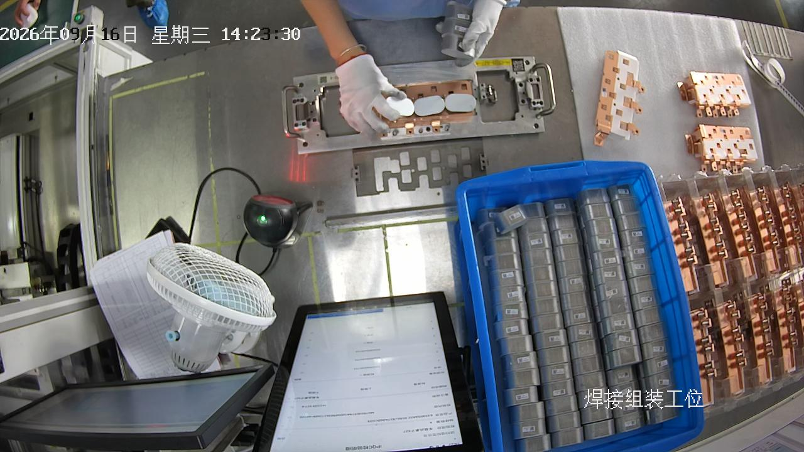
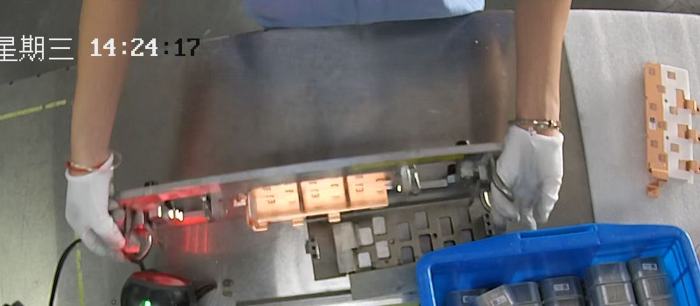
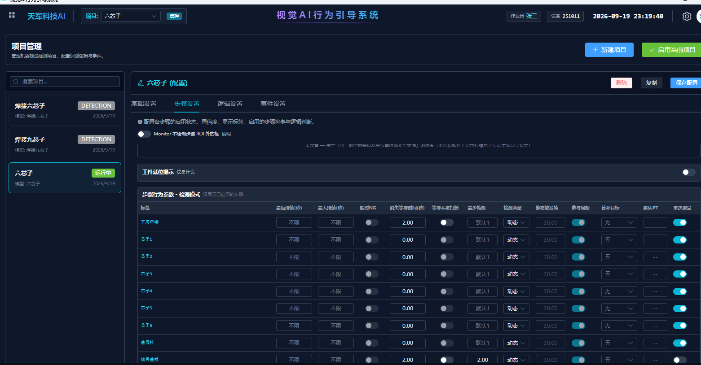
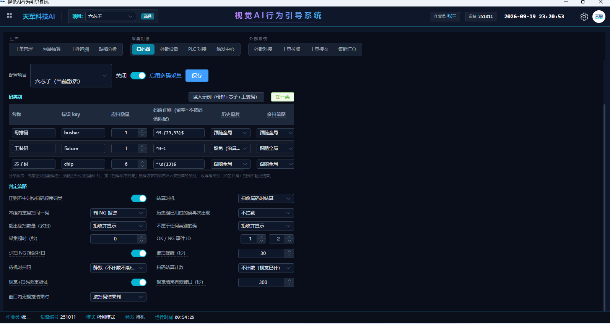

# 六和芯子装配工位（焊接组装工位一）现场整改指引

> **给谁看**：负责这台工控机的现场工程师 / 线长。照本文把软件升到 v3.60.1，改两处参数，当场验收。
> **对应工位**：焊接组装工位一——工人把 1 根母排 + 6 颗芯子装进工装，中途拿起工件对着扫码枪扫码，装满后拿去焊接。
> **解决的两个现场问题**：① 一次装配被软件拆成两次、重复报警；② 每次结算合格都弹「未绑定工件码」。
> **预计耗时**：15 分钟（升级 10 分钟 + 改参数 3 分钟 + 验收 2 分钟）。
> **适用版本**：本机需升级到 **v3.60.1 及以后**。老版本改参数也压不住，必须先升级。

---

## 0. 先对症状——是不是你遇到的问题

现场表现（两条都对上才是本文要治的问题）：

1. **重复检测 / 一次装配报两次**：工人把下层母排放进工装后，**拿起整个工件对着扫码枪扫母排码，再放回**。就这么一抬一放，软件把「下层母排」这一步算了两遍，还弹「重复步骤」不合格。**已经把消失等待时间调到 2 秒、甚至 5 秒都没用。**

   

   > 相机是俯视，工件一竖起来对扫码枪，母排就离开画面 3~4 秒。软件以为「这一步做完了」，放回来又当成新的一件——一次操作被切成两半。

2. **结算合格弹「未绑定工件码」**：明明扫码枪一直在扫（多码采集：母排 + 6 个芯子 + 工装码），可每次判定合格还是弹「未绑定工件码」的提示。

如果只有其中一条，或现象不一样，先别改，联系我们确认。

---

## 1. 升级到 v3.60.1

1. 关闭当前正在运行的检测软件（主界面右上角关闭 → 等待 8 步关机走完，别强杀）。
2. 运行我们发的 **v3.60.1 安装包**，一路默认，安装目录保持和原来一致（升级会自动保留项目配置、历史数据、License，不会清空）。
3. 装完启动，确认右上角标题栏 / 关于页版本号是 **v3.60.1**。
4. 打开原来的「六芯子」项目，画面能正常出流、检测框正常，再往下走。

> 升级是**无损**的：项目、扫码配置、数据、授权全部保留。只是把软件本体换新。

---

## 2. 改两处参数（核心）

### 2.1 下层母排：消失等待 5 秒 + 打开「等待不被打断」

进入 **项目配置 →「六芯子」→ 步骤设置**，找到 **下层母排** 那一行：

| 参数 | 原来（错） | 改成 |
|---|---|---|
| **消失等待(秒)** | 2.00 | **5.00** |
| **等待不被打断** | 关（灰） | **开（蓝）** |

两个都要改，缺一个都压不住：

- 只把秒数调大、不开「等待不被打断」→ 画面里只要有别的东西（竖起来的工件侧面、旁边料盒里的芯子和母排），5 秒会被瞬间清零，等于没改（这就是之前调到 5 秒仍失败的原因）。
- 只开「等待不被打断」、秒数还是 2 秒 → 扫码离场要 3~4 秒，2 秒接不住，还是会断。

**其他步骤不用动**：芯子1~6 是「先扫码再放进去」，芯子本身不会离开画面，消失等待保持 0 即可。

> **为什么是 5 秒**：现场实测工人拿起扫码再放回大约 2~4 秒，5 秒能把这段"抬起-放回"当成一次连续的放置；而两件工件之间的真实间隔在 7 秒以上，5 秒不会把真正的两件粘成一件。**不要往上加到 8 秒、10 秒**，会把真的工件边界吞掉。

改完点右上角 **保存配置**。

### 2.2 确认多码采集已启用（一般已配好，只需核对）

进入 **MES → 扫码器 → 多码采集**，确认开关是开的、三类码在列：

| 码类别 | 数量 | 说明 |
|---|---|---|
| 母排码 | 1 | 一件一根 |
| 芯子码 | 6 | 一件六颗 |
| 工装码 | 1 | 收尾结算用，循环工装勾「历史重复：跟随全局」不拦 |

只要这里是**启用**状态，v3.60.1 就会自动不再弹「未绑定工件码」——**不需要任何额外设置**。（原因：多码采集已经用扫码枪按母排/芯子/工装分类采集了，不再需要单独的"绑工件码"，旧版本没识别到这层才误弹。）

---

## 3. 当场验收

改完保存后，让工人正常做 3~5 件，盯这三点：

| 检查项 | 期望 |
|---|---|
| 扫母排码那一下 | 拿起工件扫母排、放回——**不再报"重复步骤 / 不合格"**，这一件继续正常往下走 |
| 一次装配 = 一个周期 | 数据页里一件工件对应**一条周期记录**，不再被拆成两条 |
| 结算合格时 | **不再弹"未绑定工件码"** |

三条都对 = 整改成功。若还有异常，把**数据页当天的周期记录截图** + **监控页录像**发我们。

---

## 4. 这次到底改了什么（给想弄明白的人）

- 软件用"某一步的目标从画面里消失再出现"来判断"这一步做完了 / 下一件开始了"。母排扫码时被拿离画面，就被误判成"做完+新一件"。
- 「消失等待」是给这步一个宽限：消失后等几秒，没回来才算真的做完。但老规则里，**等待期间只要画面出现别的检测目标，就立刻当作已消失**——你们画面里旁边料盒的芯子、母排一直在，宽限被瞬间取消，所以调多大都没用。
- v3.60.1 把「等待不被打断」这个开关补进了检测模式（原来只有顺序模式生效）：打开后，这步的宽限时间**雷打不动**走满，不受别的目标干扰。配合 5 秒，就能把"抬起扫码-放回"稳稳当成一次连续操作。
- 「未绑定工件码」是另一处：多码采集接管扫码后，旧版本的合格提示不知道这层，误以为"没绑码"。v3.60.1 让它识别到多码采集已在工作，就不再弹。

两处改动**默认都不影响其他项目 / 其他工位**，只有按 2.1 打开开关、按 2.2 启用多码采集的工位才生效。

---

**版本**：v3.60.1（2026-09-20）
**验证**：本工位真实录像 + 真实模型双阶段对照测试通过——旧参数复现"一件拆两次 + 重复报警 + 误弹未绑码"，新参数 + 新版本后全部消除。
