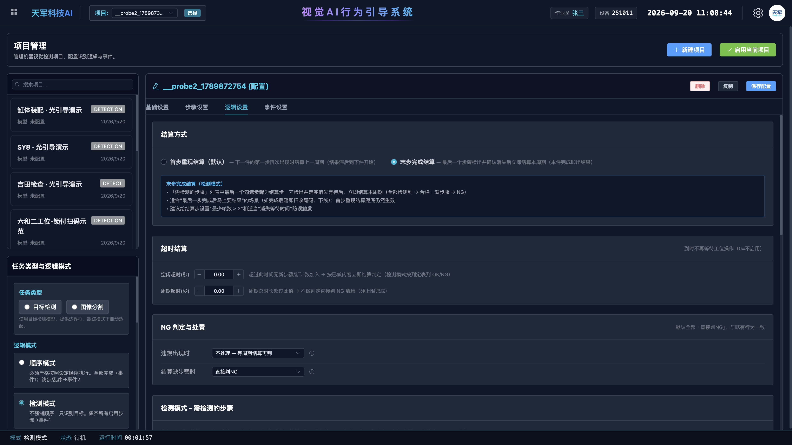
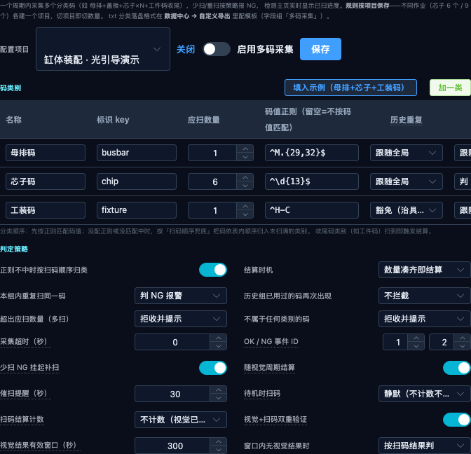
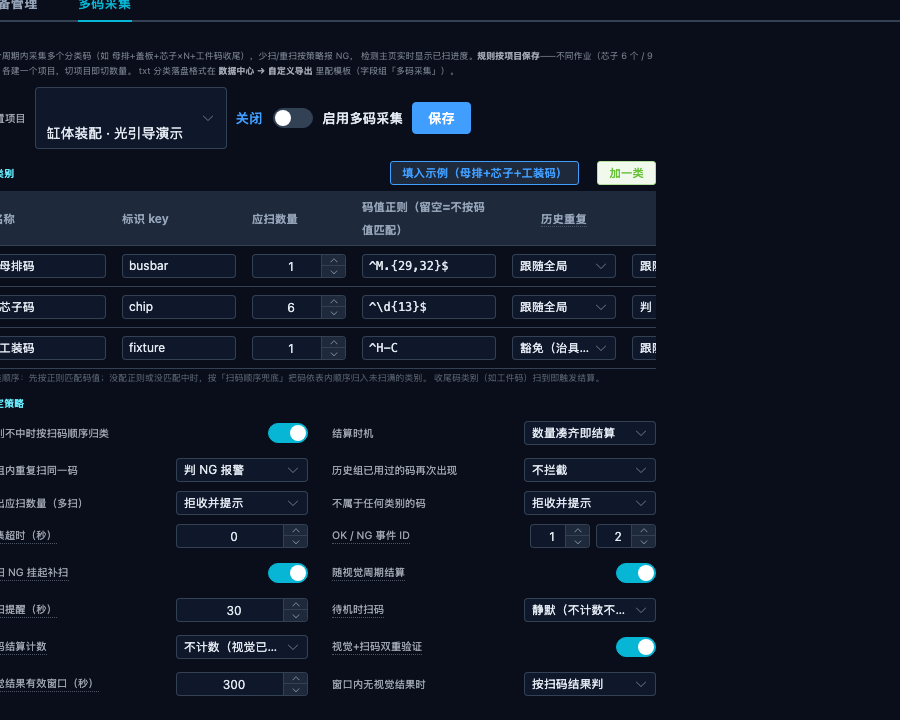

# 六和工位一 · v3.60.1c 补丁说明

> **给谁看**：现场工程师。本机必须已经是 **v3.60.1**。这是对昨天 a 包的修订，**覆盖安装**，不要和 a/b 叠打。
> **新版本还没发**：本补丁把 a、b、c 三次修订的全部内容打进现场包，升完整安装包之前以本包为准。
> **预计耗时**：打补丁 5 分钟 + 核参数 8 分钟 + 三件验收 5 分钟。

---

## 0. 为什么要打 c，不能继续用 a

昨天 a 包打上去之后，工程师看到「重复结算又来了」。这不是记忆错乱，是 a 包有三处设计漏洞，叠在一起看起来就像老毛病复发。对照现场 `backend.log`（2026-09-21 00:46）三条链：

| 现场日志原文 | a 包做了什么 | 实际后果 |
|---|---|---|
| `不良(NG) - 检测完成；少扫码 工装码缺1、芯子码缺N` | 视觉 OK→NG 翻转生效 | 这一步是对的 |
| `NG挂起 … 请补扫缺码或按 NG 放行` 然后 `超出应扫数量：母排码已扫满（当前工件挂起处理中）` 然后 `补扫齐全转 OK` | 扫码侧仍按「收尾码 / 挂起」自己结算 | **一件出两账**：视觉 NG 一次，补扫又 OK 一次。下一件母排码被旧组拒收，码从此对不上工件 |
| `requires scan first, no pending workpiece, skip cycle start` 之后催扫还在响 | 收口写在周期结束钩子上 | 现场开了「须先扫码才开始周期」，多码采集独占扫码、周期行建不出来，钩子从不跑，**组挂着不翻篇** |
| 本件盖板消失确认的空档里已经在扫下一件母排 | 探针/收口没有「这组码属于哪一件」的锚 | 拿下一件的缺码把本件视觉 OK 翻成 NG，再把下一件刚开的组误关 |

c 包三条一起修：**盖模具盖板结算的那一瞬间，码够就 OK、不够就 NG，组无条件翻篇**。不再挂起、不再拒收下一件、不再靠周期钩子、不再误伤下一件的码。

> a/b 包请视为作废。本包会覆盖 `hotfix.py` 和两个 `scan_collect.py`。

---

## 1. 打补丁

1. **先手动关掉**检测软件（主界面右上角关闭，等它自己退完）。不要用任务管理器强杀，脚本也**不会**帮你杀进程（安全软件会把整个补丁窗口掐死）。
2. 解压 `TianJun-v3.60.1c-补丁.zip`，里面应有：
   - `patch_v3.60.1c.bat`
   - `hotfix.py`
   - `scan_collect.py`
   - `scan_collect_api.py`
   - 本说明 PDF
3. 双击 `patch_v3.60.1c.bat`。路径一般会自动识别 `D:\tianjun-ai-vision`；不对就手动粘贴安装目录。
4. 按提示确认软件已关闭 → 回车。成功时窗口写 `[OK] v3.60.1c deployed.`
5. 重新打开软件。后端日志应出现：
   - `[v3.60.1c] settle_on_vision_cycle 强制开启`
   - `[v3.60.1c] _settle_detection_cycle 已包装(锚+收口)`
   - `[v3.60.1c] 少扫随视觉周期结算 已应用`
6. **不应再出现** `[v3.60.1a]` 或 `[v3.60.1b]`。若还在，说明旧 `hotfix.py` 没被换上，把 `patch_log.txt` 发回来。

> 装了 360 / 火绒：把补丁文件夹加信任区。脚本全程只有 copy，没有杀进程。

---

## 2. 参数必须再核对一遍（a 包不会改这些，但日志显示现场仍是旧值）

a 包**不会**改步骤时间和结算方式。00:45 那份日志里「下层母排」仍是 `disappear_delay=2`、`disappear_uninterruptible=False`——这正是「拿起扫码再放下被切成两件」的原配。**只打补丁、不改这几项，首步抬离照样会拆周期。**

请打开项目「六芯子」，按下面逐项核对。没提到的保持不动。

### 2.1 步骤设置

| 步骤 | 消失等待(秒) | 等待不被打断 | 最少帧数 | 单次接受 |
|---|---|---|---|---|
| **下层母排** | **5.00** | **开（蓝）** | 1 | 开 |
| 芯子1 ~ 芯子6 | 0.00 | 关 | 1 | 开 |
| 盖母排 | 0.00 | 关 | 1 | 开 |
| **模具盖板** | **2.00** | 关 | **2** | 开 |

下层母排两项必须一起改：只加秒数不开「不被打断」，画面里其他标签会把 5 秒清零；只开开关还是 2 秒，扫码离场 3~4 秒接不住。不要加到 8 秒以上，会把两件粘成一件。

### 2.2 逻辑设置 · 结算方式 = 末步完成结算

| 参数 | 设成 |
|---|---|
| 结算方式 | **末步完成结算**（不要用默认的「首步重现结算」） |
| 空闲超时 / 周期超时 | 0 |

模具盖板一确认，本件当场出结果，不必等下一件放母排。

### 2.3 多码采集（本补丁强制「随视觉周期结算」，界面上可能看不到这个开关）

c 包启动后会强制打开「随视觉周期结算」，**不必**在界面里找这个开关，也**不必**为了本补丁去改多码采集的槽位正则。

现场请同时确认：

| 项 | 要求 | 为什么 |
|---|---|---|
| 工装码槽 `dedup_cross_group` | **关 / 豁免** | 循环治具跨件必然重复，开着会把工装码当历史重复拒收 |
| 视觉+扫码双重验证 | **建议关** | 扫码收口早于视觉结果回喂，开着会拿上一件的 NG 连坐本件 |
| 扫码器「须先扫码才开始周期」 | **建议关** | 多码采集独占扫码，这个条件永远满足不了，只会导致数据页没有周期记录。不影响本补丁收口，但影响追溯 |

---

## 3. 打完之后现场怎么走

工人动作不用改：下层母排放入 → 拿起扫母排码放回 → 装 6 颗芯子并扫芯子码 → 盖母排 → **先扫工装码，再盖模具盖板**。

软件在盖板消失确认的那一瞬间：

- 码够（1 母排 + 6 芯子 + 1 工装）→ 本件 **OK**，扫码面板翻篇
- 码不够 → 本件 **NG**（原因带「少扫码: …」），扫码面板同样翻篇，下一件正常开新组

**不要再补扫上一件的缺码来「转 OK」**——组已经随盖板翻篇了。漏扫就是这件 NG，下一件从头扫。

---

## 4. 三件验收（必须做）

用真实节拍连做三件，不要用空跑：

1. **完整件（码扫齐再盖盖板）** → 视觉 OK，面板翻篇，计数合格 +1。不应再弹「未绑定工件码」，不应催扫上一件。
2. **少扫件（故意少扫 1 个芯子或工装码，直接盖盖板）** → 视觉 NG，原因含「少扫码」，面板翻篇。下一件第一枪母排码必须能进新组，**不能**报「超出应扫数量 / 挂起处理中」。
3. **再做一件完整件** → 必须是干净的 OK，不能把第 2 件的缺码带到第 3 件。

同时观察：拿起扫母排码再放回，**不应**把下层母排记成两次、不应拆成两个周期。

失败时把当天 `backend.log`（或整份 `rizhi.txt`）发回，不要只截监控画面。

---

## 5. 回滚

软件关掉后，把安装目录 `resources\backend\` 下三个 `.bak_v3601c` 拷回原名（去掉 `.bak_v3601c`），删掉 `hotfix.py`，再启动。
