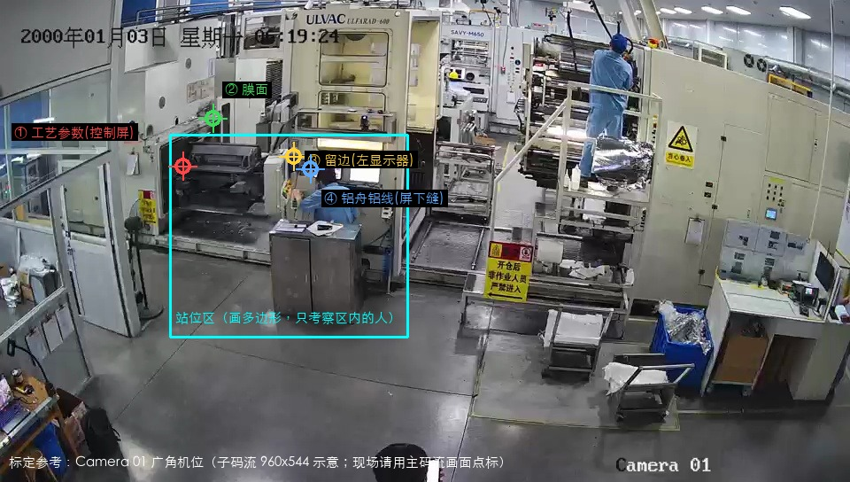

# 六和蒸镀点检 现场配置手册

> **给谁看**：去现场装机的部署工程师。工控机装好最新 Windows 安装包后，照本手册从零配出「蒸镀点检」项目并当场验收。
> **场景**：ULVAC ULFARAD-600，**一台广角相机（Camera 01）**看整个操作区。客户文档标题写「三工位」，**不是**软件里的三工位一屏，而是同一机位上的四个观察点。
> **判定逻辑**：工程师在画面上点出仪表位置、画出站位区、填停留秒数 N 和间隔秒数 T。软件自己算人的朝向——面向该点停留满 N 秒 =「看过」；超过 T 秒没人看过 = 超时报警。
> **只认蓝工装操作员**，黄背心外协/参观不计入。
>
> **适用版本**：已含「内置能力模型入仓 + 朝向驻留」的 Windows 安装包（v3.56 及之后含此能力的构建）。
> **预计耗时**：40 分钟（画框约 10 分钟）。
> **本文不讲**：朝向算法原理（见 `docs/rfc/朝向驻留监控_蒸镀点检场景_设计方案_RFC.md`）。

---

## 0. 装机前提（缺一不可）

| 项 | 要求 | 为什么 |
|---|---|---|
| 相机取流 | **主码流，分辨率 ≥ 1920×1080** | 远处人头太小时朝向判定不稳。调试用过的 960×544 子码流**不能用于生产** |
| 机位 | 广角预置位**锁死**：装完不许转、不许变焦 | 仪表点是画面上的固定坐标，机位一动全部作废，要重新标 |
| 构图 | 控制台、左侧机柜、右侧过道都要入画 | 侧后方约 30~40° 俯视，人的上半身完整可见 |
| 工装 | 操作员穿**蓝工装**；外协/参观穿黄背心 | 软件按衣服颜色区分，这是现场管理前提 |

安装：运行安装包 → 首次启动激活 License → 进入主界面。

---

## 1. 接入相机

打开「工位与输入源」：

1. 工位 1 添加视频源（海康 NVR / RTSP 均可），填**主码流**地址；
2. 画面出来后对照下图核对**位置关系**——四个观察点和控制台前站位区都要在画面里，方位大致一致。差太多先调相机预置位，再往下配。

> 这张图是调试期子码流截图，只说明相对位置。现场标定时以你自己的主码流画面为准，不要抄图上的像素坐标。

---

## 2. 确认模型（不用上传文件）

打开「模型仓库」，确认安装包自带这几行在列即可：

| 名称 | 用途 |
|---|---|
| **通用检人 (YOLO11n)** | 项目**主模型**，检出 `person` |
| **人体朝向 (YOLO11n-pose)** | 朝向驻留规则跑起来后自动用来算朝向，不用当主模型 |
| 头姿（若在列） | 近景精化，有则更好，没有也能跑 |

都是安装包自带的，**不要另传权重**。正式授权头姿文件若后续另发，再在模型仓库上传并绑到「头部朝向」即可热替换。

---

## 3. 新建项目

「项目配置」→「新建项目」：

| 项 | 填什么 |
|---|---|
| 项目名称 | `蒸镀点检`（可按现场改） |
| 任务类型 | 目标检测 |
| 逻辑模式 | **区域事件模式** |

创建后先打开「基础设置」：

1. **主模型**选「通用检人 (YOLO11n)」；
2. （建议）「能力挂件」→「添加挂件」→「人体朝向」，间隔 1 秒。  
   朝向驻留规则**不依赖**这个挂件也能判定；挂上是为了装机时能在结果里看到朝向角，方便对容差。

点右上角**保存配置**。

---

## 4. 检测步骤表（选完模型后经常是空的，不用等它弹出来）

选「通用检人」后，「步骤设置」很可能仍显示「暂无步骤配置」，顶上也可能黄条「未能解析到标签」。

**这是内置检人模型没带类别列表，不是操作漏了。** 区域事件模式真正生效的是下一节的规则，点检卡片也按规则名生成，**不要**在步骤表里加「确认工艺参数」。

本节能跳过，直接去第 5 节建事件、第 6 节加规则。规则的主体类别手填 `person`（必须英文）。

如果步骤表里已经有很多行（80 个英文类别），只保留 `person` 启用，其余关掉即可。

---

## 5. 先建超时事件（规则里要挂）

「事件设置」→「+ 新增事件」：

| 项 | 填什么 |
|---|---|
| 名称 | `点检超时` |
| 颜色 | 橙色或红色均可 |
| 计数器动作 | **不要加**。超时不是工件 NG，加了会把不良/总产量刷脏 |
| 显示提示框 | **勾上**，提示框选「NG提示框」（新建事件默认不弹窗，不勾现场不响） |
| 需人工确认 | 关 |

系统自带的「合格(OK) / 不良(NG)」不要改、不要挂到确认规则上——确认规则一挂 NG，每次「看过」都会弹不合格。

> 不建这个事件、或建了但没勾「显示提示框」、或规则里没选上：超时只会记在数据里，现场不响不亮。

保存配置。

---

## 6. 规则清单（共 8 条，可选第 9 条）

打开「逻辑设置」。区域事件规则卡片里点「+ 新增动作」，**不要**用顶部一键模板「面向仪表点检」——它默认主体类别是「人」，本项目主模型输出的是 `person`，对不上就不打卡。

每条规则共同项（先设再改名字和秒数）：

| 项 | 值 |
|---|---|
| 类型 | **朝向驻留（面向仪表点）** |
| 主体类别 | **`person`**（必须英文，不要填「人」） |
| 朝向容差（度） | 30 |
| 只认操作员（蓝工装） | **开** |
| 结算周期 | **关** |
| 区域跟随锚点 | 关 |

四个观察点各两条：一条打卡、一条超时。四个点**各有各的时钟**，确认了工艺参数不会重置膜面的倒计时。

### 6.1 四条确认规则（「无人面向才告警」关）

| 规则名 | 确认时长（秒）= 停留多久算看过 | 附加触发事件 |
|---|---|---|
| 确认工艺参数 | 3 | 不选 |
| 确认膜面 | 3 | 不选 |
| 确认留边 | 3 | 不选 |
| 确认铝舟铝线 | 2 | 不选 |

### 6.2 四条超时规则（「无人面向才告警」开）

「确认时长」在超时规则里的含义变成**间隔秒数**（隔多久必须再看一次）：

| 规则名 | 确认时长（秒）= 间隔 | 无人面向才告警 | 附加触发事件 |
|---|---|---|---|
| 工艺参数确认超时 | 300（5 分钟） | **开** | 点检超时 |
| 膜面确认超时 | 360（6 分钟） | **开** | 点检超时 |
| 留边确认超时 | 420（7 分钟） | **开** | 点检超时 |
| 铝舟确认超时 | 600（10 分钟） | **开** | 点检超时 |

间隔客户要改，只改这一格数字。N 和 T 都自由可设。

### 6.3 第九条（可选）

「进入卷绕小车门」：类型选「进区/驻留（进入区域）」，主体 `person`，最少帧数 8，只认操作员开。客户这份位置划分文档**没有**标小车门，没有明确要求可以不建。

---

## 7. 画框标定（本手册核心）

> **先点仪表点，再点「保存配置」。**  
> 朝向驻留规则卡片上如果还写着「仪表点：未标定」，一点保存这条规则会被软件直接丢掉（界面变空，像没配过）。这是设计如此，不是保存失败。  
> 卡片上那句橙色「未标定（该类型规则必须标定，否则保存时被丢弃）」就是这个意思。

每条「朝向驻留」要做两件事：**点仪表点** + **画站位区**。  
确认规则和对应超时规则各做一遍，**同一观察点的两个坐标必须一致**（点完看「已标定 (x, y)」，超时那条照着点到同一位置）。

先保证「工位与输入源」里本工位已经出画，再打开标定窗（编辑器取的是当前通道快照）。

### 7.1 点仪表点（每条朝向规则必点）

规则卡片 → **「在画面上点标仪表位置」** → 在弹出画面上**单击一次**：

| 观察点 | 点在哪 | 千万别点成 |
|---|---|---|
| ① 工艺参数（控制屏） | 机柜**左侧的小观察窗** | 不是控制台上那两块显示器 |
| ② 膜面 | 左侧柜体**上方的大观察窗** | — |
| ③ 留边 | 控制台**左边那块亮着的显示器** | **不要**点右边卷绕区的膜卷——人站柜前会把它完全挡住（客户《六和三工位位置划分》给了反例） |
| ④ 铝舟铝线 | 双屏**正下方那条横向观察缝** | 不是设备平台顶部 |

点完应显示「已标定 (x, y)」。没标仪表点的朝向规则，点「保存配置」时会被整条丢掉。

### 7.2 画站位区（8 条规则画同一个区）

规则卡片 → **「绘制区域」** → 沿控制台一带画四边形（参考图青色框）：

- 圈进：控制台前操作员站着干活的那一块；
- 圈出：过道、右侧卷绕平台、画面里路过的人。

单击加顶点，点回第一个点闭合。

不画站位区：过道上路过的人朝这边看一眼也可能被记「看过」。

### 7.3 保存并核对

右上角**保存配置**。回来数一遍：

- 朝向规则还在 8 条（没被丢掉）；
- 每条都显示仪表点「已标定」；
- 每条站位区都是「已标定 (4 个顶点)」。

---

## 8. 绑定工位并启动

1. 「工位与输入源」把工位 1 绑到本项目，激活项目；
2. 监控页开始检测；
3. 画面里应出现人的检测框，点检卡片区出现规则卡。

改过规则或标定点之后：**停止检测 → 再开始检测** 才生效。只点保存、不重开检测，现场仍跑旧配置。

---

## 9. 验收核对单（现场当场做）

验收时可把四条超时的「确认时长」临时改成 60 秒，**验完改回 300/360/420/600**。

| # | 动作 | 预期 | 不符时查 |
|---|---|---|---|
| 1 | 蓝工装操作员站进站位区，面向左侧小窗（控制屏）站稳 3 秒 | 「确认工艺参数」打卡 | 主体是不是 `person`；人在不在站位区；容差调到 35° |
| 2 | 同一人转身面向膜面大窗 3 秒 | 「确认膜面」打卡，**其他点倒计时不动** | — |
| 3 | 黄背心人员做同样动作 | **什么都不触发** | 「只认操作员」是否打开 |
| 4 | 所有人离开超过间隔 | 对应超时规则触发，弹出点检超时提示 | 事件是否勾了提示框；规则是否挂了「点检超时」 |
| 5 | 人从过道走过、瞟一眼控制屏 | 不打卡 | 站位区画大了，收窄 |

---

## 10. 现场调参速查

| 症状 | 调什么 |
|---|---|
| 明明看了却不打卡 | 主体类别改成 `person`；容差 30°→35°；确认时长 3→2 秒；确认人没出站位区 |
| 看留边时铝舟也一起打卡 | 这两个点挨得近，四条规则容差一起改成 20~25° |
| 路过的人误打卡 | 站位区收窄 |
| 人站着不动却反复打卡/中断 | 「消失确认（秒）」给 1~2 |
| 检测框时有时无 | `person` 阈值 0.3→0.25；看主码流和画面亮度 |
| 超时不响 | 见第 5 节：事件、提示框、规则挂接 |

**改完任何数字都要：保存配置 → 停止检测 → 开始检测。**

---

## 11. 红线（出问题先看这四条）

1. **相机动了没有？** 变焦、转动、重设预置位之后，四个仪表点和站位区**全部重标**。这是最常见的「突然全不准了」。
2. **是不是用了子码流？** 低于 1080p 朝向会抖，打卡时有时无。
3. **主体类别写成了「人」？** 一键模板默认就是「人」。本项目必须是 `person`，否则朝向规则永远不命中。
4. **保存后规则消失？** 仪表点还是「未标定」就点了保存。先点「在画面上点标仪表位置」，显示「已标定」后再保存。站位区可以后画，仪表点必须先点。

---

**文档版本**：2026-09-14 v1.1  
**标定依据**：客户《六和三工位位置划分.docx》（2026-09-13）四个红框 + 现场录像核对
