# 国岳滤网清洁检测模型 · 图片标注规范（v2 重构版）

> **交付对象**：标注工程师
> **配套素材**：`标注规范assets/`（本文所有示例图）
> **有疑问**：拿不准的帧不要猜，截图集中反馈给项目负责人统一裁定
> **版本说明**：v2 是对第一版模型（best(4).pt，4 类：出水口吹扫/皮锤敲击毛坯外形/检查滤网/进水口吹扫）的**完全重构**。旧标注数据不直接复用，类别定义全部以本文为准。

---

## 一、背景：为什么要重构（先读，影响画框方式）

现场流程：**出水口吹扫 → 皮锤敲击 → 检查滤网 → 进水口吹扫 → 皮锤敲击 → 检查滤网**，六步一个工件。

第一版模型在真实产线机位（固定监控相机、俯视远景）上暴露了三个致命问题，v2 的类别设计就是针对它们来的：

1. **吹枪驻留误报**。现场吹枪长时间插在工件接口上不拔（敲击、检查滤网期间都插着），第一版把"枪组件出现"当成"正在吹扫"，导致吹扫标签几乎全程常亮，顺序判定被打乱。
   → v2 规定：**只有手握着枪正在吹的帧才标**，枪插着没人碰的帧不标（是重要负样本）。
2. **进水口/出水口分不开**。两类的唯一视觉差异是接口硬件（出水口=方形四孔法兰板，进水口=圆形凸台转接头，见示例图），近景能分、远机位只剩二三十像素分不了，第一版在产线上把进水口吹扫全部误报成出水口吹扫。
   → v2 规定：**两类合并为一类 `吹扫`**。进/出水的区分由软件按**检测框中心落在画面哪个接口区域**判定（工件在台面上摆放位置固定，两个口在画面上是两个稳定区域）——与电机装配线"模型只报打螺丝、软件按位置判第几颗"同款方案，已验证有效。
3. **没有工件边界信号**。第一版没有"工件"类，换件时刻只能靠动作步骤间接推断。
   → v2 新增 `工件` 类：软件用"工件消失 → 新工件出现"直接切换周期，换件判定不再依赖动作。

由此产生本规范最重要的一条铁律：

> ⚠️ **`吹扫` 的框中心必须落在枪头插入的那个接口附近。**
> 框的中心点就是软件区分进水口/出水口的判定依据，中心偏了 = 现场判错步骤 = 误报警。
> 所以吹扫**只框"握枪的手 + 枪头 + 接口"的作业接触区，不框整条气管**。

其余类别没有中心点要求，按常规"贴合目标外轮廓"画即可。

## 二、素材与交付

| 项 | 内容 |
|---|---|
| 素材来源 | 现场固定机位（Camera 01）监控录像抽帧，另补少量近景/多角度视频（见第六节采集要求） |
| 参考视频 | `国岳数据采集` 一批 5 段；标注前先完整看一遍任意一段完整工件流程 |
| 标注工具 | labelImg / X-AnyLabeling 等任意支持 YOLO 格式的工具 |
| 交付格式 | YOLO 目标检测格式：`images/` + `labels/`（每图一个同名 txt）+ `classes.txt`（类别顺序必须与下表 id 一致） |
| 框类型 | 全部为水平矩形框（bbox），无多边形、无关键点 |

## 三、类别定义（4 类）

| id | 类别名 | 一句话定义 | 大约何时出现 |
|----|--------|-----------|------------|
| 0 | `工件` | 台面上的滤网壳体（在制件，立放） | 全程大部分时间 |
| 1 | `吹扫` | **手握吹枪、枪头插在工件接口上正在吹**的作业接触区 | 每个工件 2 次（出水口一次、进水口一次），每次数十秒 |
| 2 | `皮锤敲击` | 皮锤锤头接触/挥向工件壳体的动作 | 每个工件 2 轮，每轮连敲多下 |
| 3 | `检查滤网` | 手持滤网芯举到眼前查看的动作 | 每个工件 2 次 |

**类别设计的三个关键点（标注时必须理解）**：

1. **`吹扫` 标的是动作不是物体**。判据 = 手在枪上。吹枪插在接口上但**没有手握着**的帧，一律不标（这正是第一版最大的错误来源）。进水口和出水口**不分类别**，都标 `吹扫`，软件按框中心位置区分。
2. **`工件` 是软件的换件边界信号**。壳体立在台面上就标，被人手/工具部分遮挡照标（按完整轮廓框）；壳体被搬离台面、台面空置的帧自然无框——软件靠这个"消失→重现"切周期。
3. **动作类（1/2/3）都遵循"作业进行中才标"**：工具/滤网拿在手里悬空移动、放在台面上闲置，都不标。

## 四、每类怎么画框（每类都有正确/错误对照图，务必两张都看）

> 对照图约定：**绿框 = 正确画法，红框 = 错误画法**，图顶黑条是该图的一句话判词。

### 0 `工件` — 正确 ex_v21_工件_正确 / 错误 ex_v21_工件_错误

- 贴合壳体外轮廓整体一框（立放的圆筒壳体，含左侧接口凸台）。
- 被操作员身体、皮锤、吹枪部分遮挡时，**按完整轮廓框**（脑补被挡部分），不要框成残缺的一小块——工件框是软件"换件判定"和"接口区域跟随"的锚点，框残缺 = 这两个功能全部失真。
- 只标台面上正在处理的这一台；背景货架、地面上的其他壳体不标。
- 拿不准"挡了多少还要不要标"：**只要还能认出这是壳体、且它立在台面上，就按完整轮廓标**；完全被人挡死看不见的连续帧可跳过。

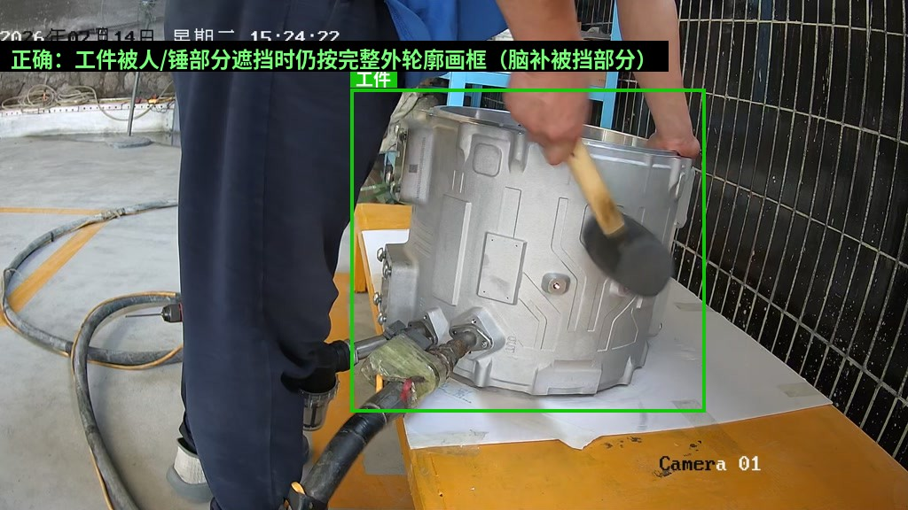

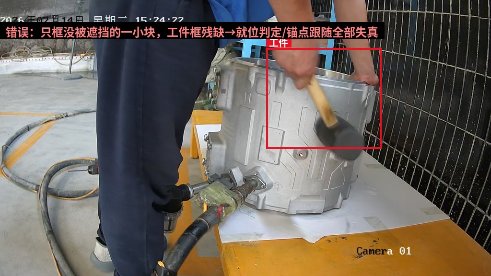

### 1 `吹扫` — 正确 ex_v21_吹扫_正确 / 错误两张（框太大、驻留误标）

- **框"握枪的手 + 枪身前段 + 插入的接口"**，框中心 ≈ 枪头插入的那个接口。
- 不框整条气管、不框枪后拖着的软管、不框过滤杯；手一定要框进来（手是"正在吹"的判据，也是模型最该学的特征）。
- 判定"正在吹"：手握在枪体/阀门上。**手离开枪就停止标注**，哪怕枪还插在口上。
- 进水口、出水口一律标 `吹扫`，**不要**试图在标注层区分（软件按框中心位置区分，所以中心必须贴着接口）。
- 两只手都在时（一手扶接口一手握枪）把两只手都框进来；框可以适当放大，但**中心不能离开接口**。

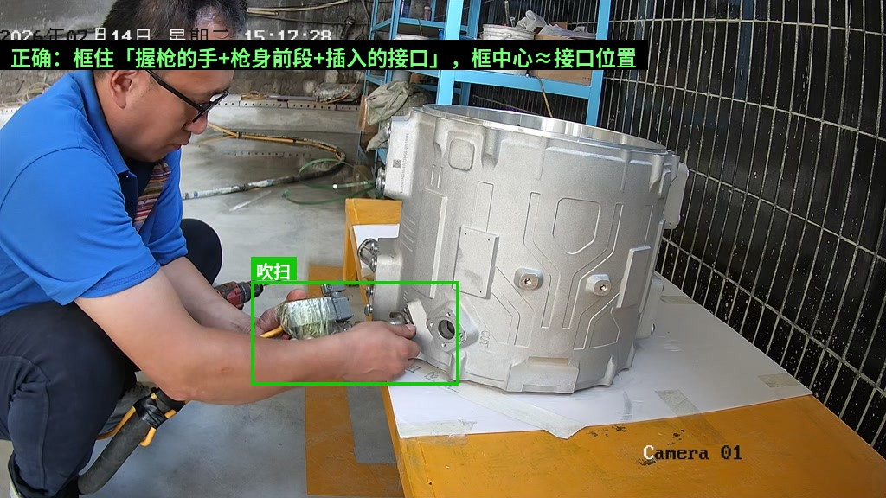

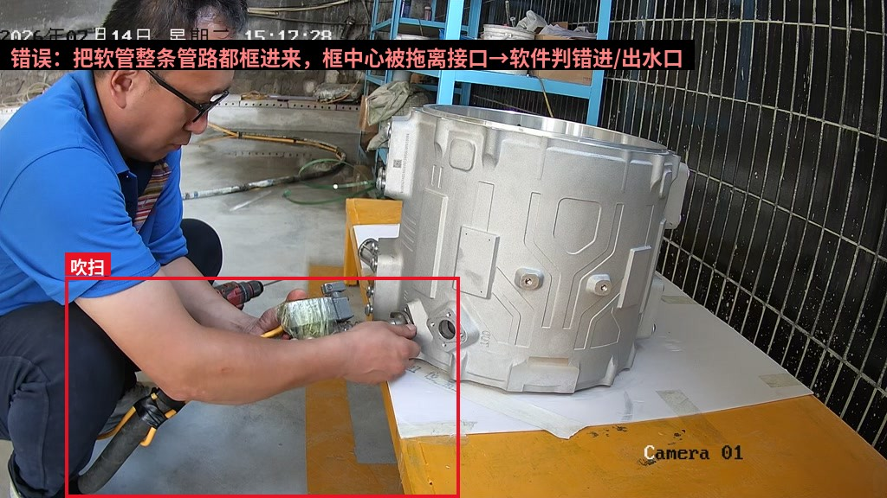

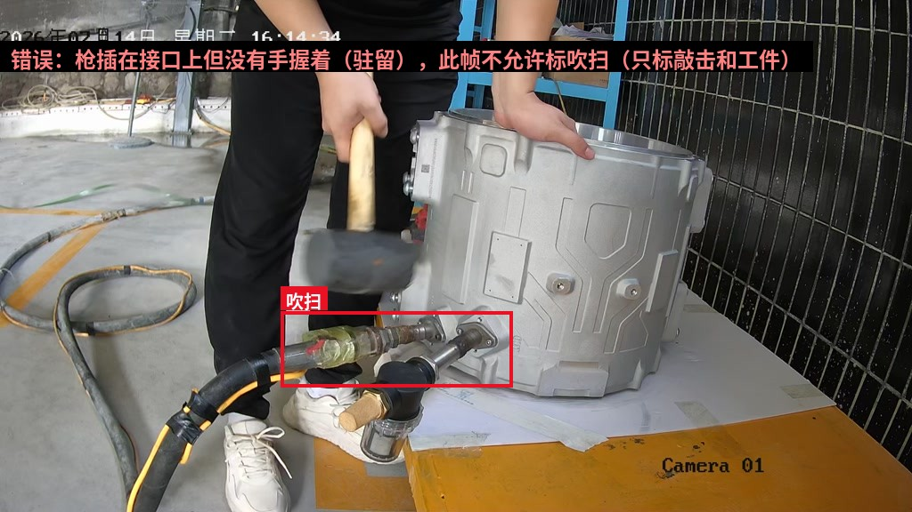

近景参考——两个接口长这样（帮助理解框中心该落在哪，不代表要区分类别）：

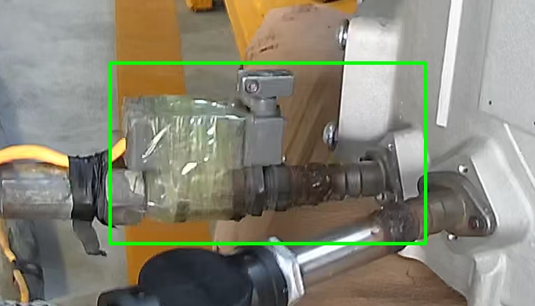

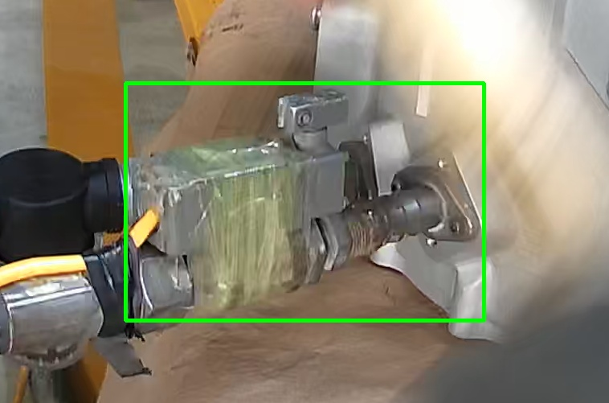

### 2 `皮锤敲击` — 正确 ex_v21_敲击_正确 / 错误 ex_v21_敲击_错误

- 框皮锤锤头 + 锤柄前段 + 持锤的手，锤头接触点在框内。
- **不要把整条手臂、半个身子、大半个工件都框进去**——那样模型学到的是"有人站在工件旁边=敲击"，站着不动也会误报。
- 从"锤子挥向工件"到"离开工件"期间的帧都标；连敲多下期间连续标。
- 挥锤过程运动模糊很正常，**模糊也要标**，这正是模型必须见过的样子。
- 皮锤拿在手里走动、放在台面上、扛在肩上，不标。

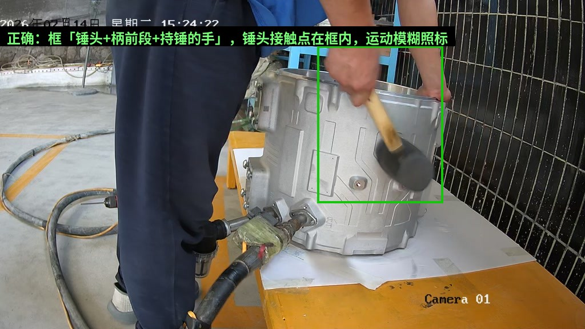

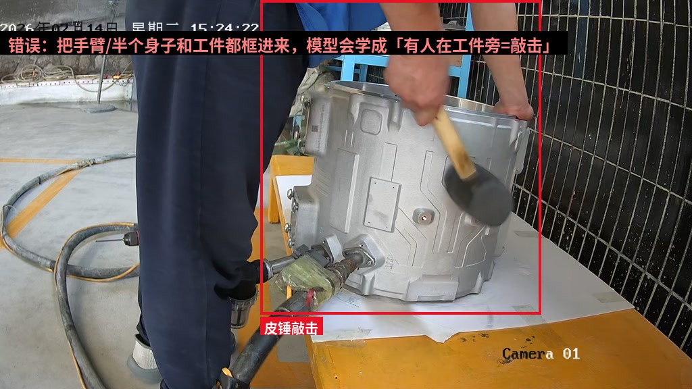

### 3 `检查滤网` — 正确 ex_v21_检查滤网_正确 / 错误 ex_v21_检查滤网_错误

- 框滤网芯 + 持芯的手，框到手腕即可。
- **不要只框滤网芯不带手**——芯体只有几十像素，单框它检出率差；而且"拿在手里查"和"放在台面闲置"就分不开了，手正是两者的区别。
- 从"滤网芯被举离工件/举到眼前"开始标，到"放回/放下"为止。**举起和放下的过程帧也要标**（第一版这类检出片段太短，就是因为只有正对镜头的标准姿态被学到了；侧姿、半举、部分遮挡的帧都要标进去）。
- 滤网芯装在工件里、放在台面上，不标。
- 透明过滤杯拿在另一只手里时，**不**并入检查滤网的框（判据是芯，不是杯）。

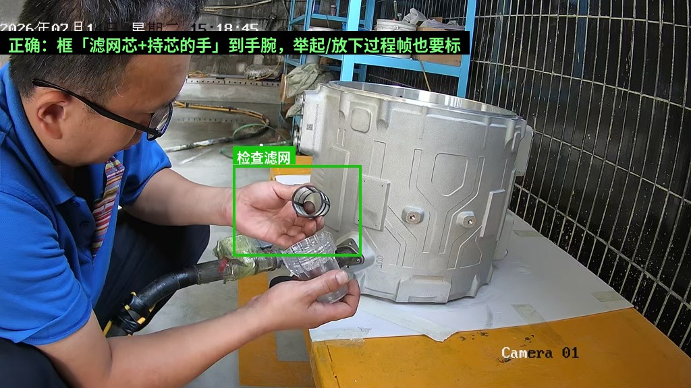

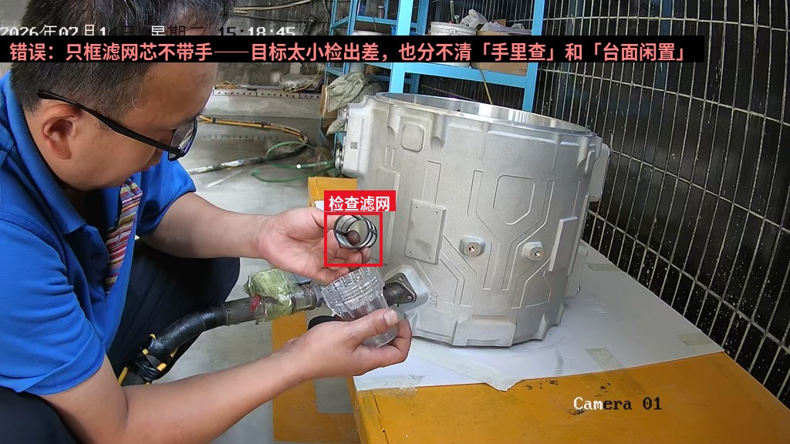

## 五、不标注清单（负样本纪律，和正样本同等重要）

以下内容**任何情况都不画框**——错标它们比漏标更伤模型：

1. **吹枪驻留**：枪插在接口上但没有手握着（示例 ex_反例：敲击进行中枪还插在口上，此帧只标 `皮锤敲击` 和 `工件`，**不标吹扫**）。这类帧务必**保留在数据集里作为背景负样本**（图片入库、txt 里不写吹扫框），不要因为"没东西标"就把图删了。

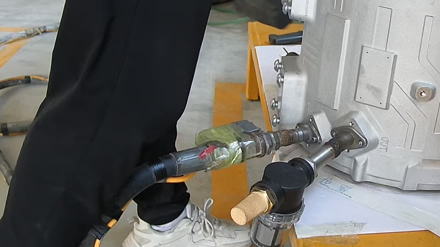

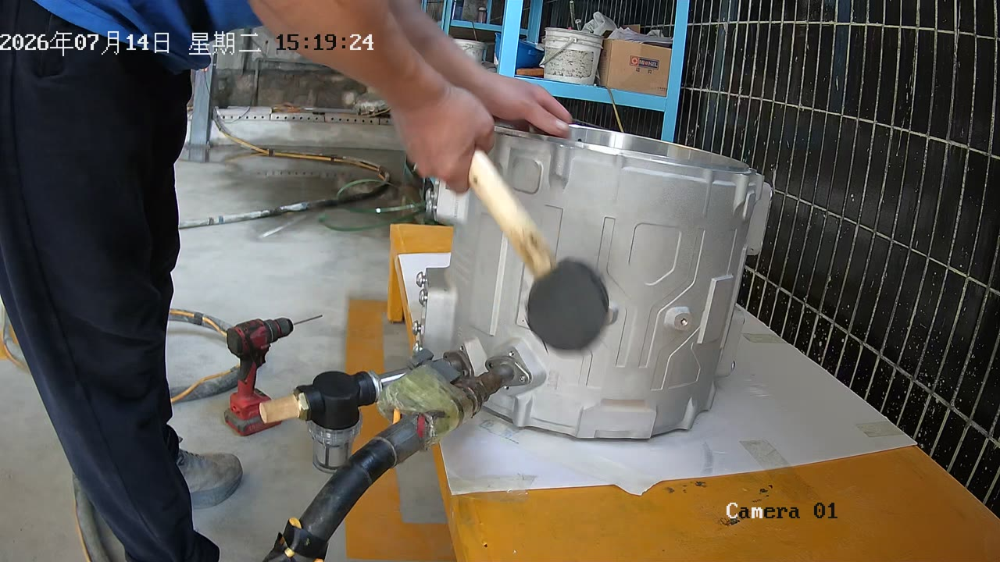

2. **闲置工具**：台面上的电钻、皮锤、扫码枪、放着不用的吹枪。
3. **搬运过渡帧**：壳体被抱起搬离/搬上台面的悬空过程，`工件` 不标（落定立放后再标）。
4. **背景物**：货架、料箱、地面气管、背景里的其他壳体。
5. **人体**：手、手臂不单独标（只作为动作框的一部分被带入）。

## 六、素材覆盖要求（给采集/抽帧的人）

第一版模型的另一半问题出在训练素材和产线机位不匹配（近景演示视频训练、远景监控机位部署）。v2 素材必须满足：

1. **以产线固定机位（Camera 01）录像为主体**，近景演示视频只作少量补充（比例建议 ≥ 8:2）。
2. **操作员覆盖 ≥ 3 人，以裸手（无手套）为主**——现场已确认生产时不戴手套（2026-07-15），首批采集的 1/2/3.mp4 三段裸手视频即主力素材；白2.mp4（白手套）只作辅助鲁棒性样本，可不进第一批训练集。需覆盖深色衣袖、不同站位习惯。
3. **光照覆盖**：至少含上午/下午两个时段；如夜班开灯生产，补夜间段。
4. 每类目标帧数建议：`吹扫`/`皮锤敲击`/`检查滤网` 各 ≥ 1500 框，`工件` ≥ 3000 框，吹枪驻留负样本图 ≥ 800 张。
5. 抽帧密度：动作进行段每 2~3 帧抽 1 张，静止段每 30 帧抽 1 张即可。

## 七、交付后的流程

1. 工程师先标 **200 张试标批** → 项目负责人按本规范逐条验收（重点查：吹扫是否含手、驻留帧是否误标、框中心是否落在接口）→ 裁定疑难帧、必要时修订本规范。
2. 试标通过后铺开全量标注。
3. 全量交付后由项目方决定训练方案（从头训 / 在第一版基础上微调），并用**未参与训练的整段产线录像**做回放验收。

---

**版本**：v2.1（2026-07-15）
**修订记录**：
- v2.1 每类补齐正确/错误画法对照图（绿框正确/红框错误，图顶烧判词），画法条目补细化判据（遮挡取舍、双手同框、透明杯不并入等）。
- v2.0 完全重构类别体系——吹扫合并单类+动作化定义、新增工件类、进/出水口区分移交软件区域拆分。
