# 国岳滤网清洁检测 · 部署配置指南（v2 方案）

> **交付对象**：现场部署工程师
> **配套素材**：`部署指南assets/`（本文全部截图，均为真实程序界面）
> **模型版本前提**：本指南按 **v2 模型（4 类：工件/吹扫/皮锤敲击/检查滤网）** 写，模型须按《标注规范_滤网清洁.md》v2.1 标注训练。文中所有截图来自「滤网清洁v2预演」演示项目——用虚拟剧本模拟 v2 模型输出、在真实程序里跑通了完整六步流程 + 合格结算，**界面与操作和拿到真模型后完全一致**，照着配即可。
> **置信度声明**：文中阈值（55/60）是预演占位值，新模型到手后按现场实测调，帧数/时间类参数是主要抓手（与项目 26 的调参结论一致）。

---

## 一、方案总览（先看懂再动手）

现场流程六步一件：**出水口吹扫 → 皮锤敲击 → 检查滤网 → 进水口吹扫 → 皮锤敲击 → 检查滤网**。

v2 方案的分工：

| 层 | 职责 |
|---|---|
| 模型 | 只认 4 个它学得会的概念：`工件`（壳体在台上）、`吹扫`（手握枪在吹，**不分进出水口**）、`皮锤敲击`、`检查滤网` |
| 同标签区域拆分 | 把模型输出的 `吹扫` 按**框中心落在哪个接口区域**改写成 `出水口吹扫` / `进水口吹扫` 两个虚拟步骤（满足客户强制区分要求）。区域**锚定在工件检测框上**，工件在台面挪位、区域自动跟随 |
| 顺序状态机 | 六步序列（含敲击/检查各重复两次，期望重复逻辑自动处理）+ 第一步结算（下一件的出水口吹扫重现 = 上一件结算）+ 240 秒空闲超时兜底 |
| 就位提示 | 用 `工件` 检测框给操作员显示"工件已就位"引导 |

为什么吹扫必须靠拆分而不是让模型直接分两类：v1 模型实测两类吹扫在产线机位下完全不可分（接口特征只有二三十像素），而工件摆放位置相对固定，位置区分可靠得多。这与电机装配线"模型只报打螺丝、软件按位置判第几颗"是同一个已验收的打法。

## 二、接入视频源

进入**视频源**页，接现场固定机位（Camera 01，海康 NVR / RTSP 均可）。调机位对照采集视频：**侧俯视工位台，工件主体落在画面中部，左下两个接口无遮挡**。机位调好锁死支架。

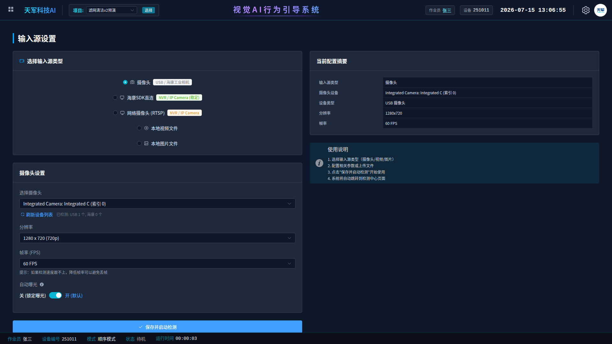

> 预演时用「本地视频文件」放采集录像即可复现本文全部截图；正式部署选摄像头。

## 三、新建项目与模型

新建项目「滤网清洁检测v2」（预演项目名为"滤网清洁v2预演"），任务类型**目标检测**，逻辑模式**顺序模式**；模型配置里选 v2 模型（预演项目未挂真模型，故截图显示"未配置模型"——正式部署这里必须选上）。

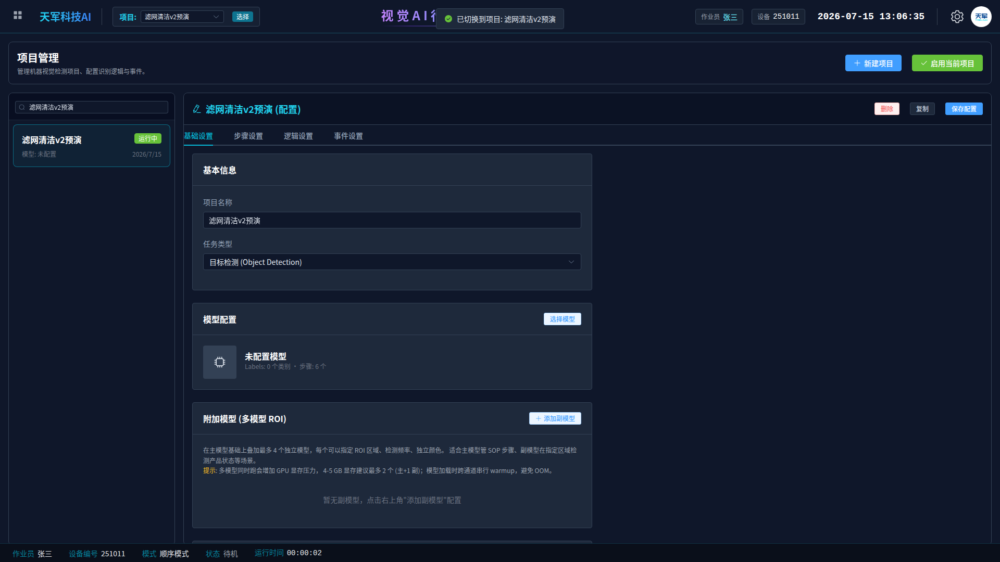

## 四、步骤设置

### 4.1 步骤表

配完拆分规则（4.2 节）后，步骤表共 6 行。**启用状态是关键**：

| 标签 | 启用 | 角色 |
|---|---|---|
| `工件` | ❌ 停用 | 只作拆分锚点 + 就位提示，不参与序列判定 |
| `吹扫` | ❌ 停用 | 只作拆分原料，检测到后被改写成虚拟步骤 |
| `皮锤敲击` | ✅ | 序列第 2/5 步 |
| `检查滤网` | ✅ | 序列第 3/6 步 |
| `出水口吹扫`（带「拆分」徽标） | ✅ | 序列第 1 步（虚拟步骤，保存拆分规则后自动生成） |
| `进水口吹扫`（带「拆分」徽标） | ✅ | 序列第 4 步（虚拟步骤） |

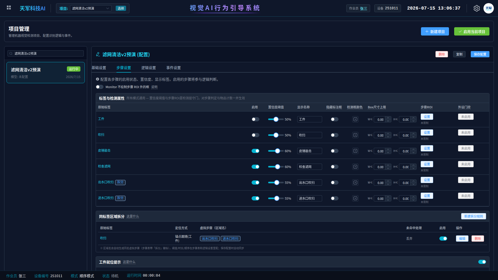

### 4.2 拆分规则：吹扫 → 出水口/进水口（锚点跟随）

步骤设置页下方「同标签区域拆分」卡片 → 「新建拆分规则」：

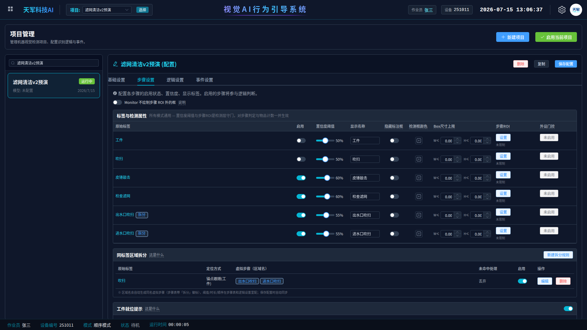

编辑器里按以下顺序配：

1. **原始标签**选 `吹扫`；
2. **区域定位方式**选 **锚点跟随**，锚点标签选 `工件`；
3. 让画面里出现一个摆放到位的工件（视频源正常推流时点「刷新画面快照」），点**「从当前画面抓取锚点框」**——把"画区域那一刻工件在哪"记为跟随基准；锚点丢失沿用最近位置设 **3 秒**（工件被人短暂挡住时区域不漂移）；
4. 在画布上画 2 个区域：**下方接口带命名 `出水口吹扫`、上方接口带命名 `进水口吹扫`**（区域名就是虚拟步骤名）。判定看检测框**中心点**，所以：**区域画大一点、上下留清晰分界、不要压线**；
5. **未命中任何区域的「吹扫」如何处理**选 **丢弃**（枪在两口之间移动的过渡帧不参与判定）；
6. 多轮次拆分**不开**（进/出水口靠位置分，不靠轮次）；
7. 保存规则 → 步骤表自动出现两个带「拆分」徽标的虚拟步骤 → **保存配置**。

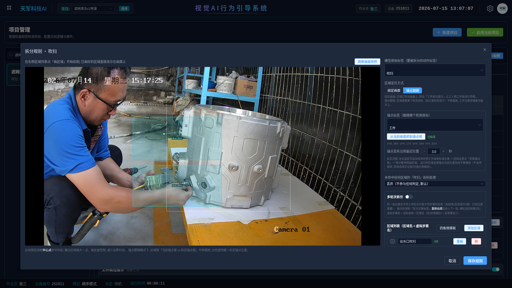

> 画布上白色虚线框是已标定的锚点基准位置，两个着色框就是出水口（下）/进水口（上）区域。截图里的区域是预演验证过的相对位置，现场以真实画面里两个接口的实际位置为准微调——**画完区域后务必让操作员各吹一次，确认监控页检测框标签分别显示"出水口吹扫/进水口吹扫"**。
> ⚠️ 两个接口的物理位置以现场工件为准：吹哪个口时枪头中心落在哪个区域，哪个区域就叫那个口的名字。拿不准就先跑一遍真流程看框中心轨迹再命名。

### 4.3 工件就位提示（可选但推荐）

「工件就位提示」卡片：开关打开，锚点标签选 `工件`，绘制引导框圈住台面上工件应放的位置。监控页会显示"工件已就位/请放置工件"引导。

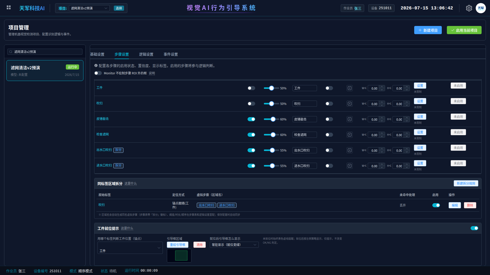

### 4.4 步骤参数（预演值，现场按新模型实测调）

| 步骤 | 置信度 | 最少帧数 | 消失等待(秒) | 等待不被打断 | 只计一次 |
|---|---|---|---|---|---|
| 出水口吹扫 | 55 | 5 | 10 | ✅ | ✅ |
| 皮锤敲击 | 60 | 2 | 15 | ✅ | ✅ |
| 检查滤网 | 60 | 6 | 12 | ✅ | ✅ |
| 进水口吹扫 | 55 | 5 | 10 | ✅ | ✅ |

要点：

- **「等待不被打断」全开**（v3.34 新增开关，在消失等待时间列右侧）：现场"多步骤并行可见"（吹枪驻留期间敲击/检查同框），不开的话别的步骤一出现就掐掉消失等待，会误判重现。
- v2 模型的吹扫只在"手握枪"时出框，消失等待可以比 v1 的 30 秒配短（预演 10 秒）；**若新模型实测吹扫检出仍有长闪断，往大调这一列，别急着动置信度**。
- 帧数/时间是主要抓手，置信度留给现场微调——每个工人速度不一样，参数要容得下最慢的人。

## 五、逻辑设置

结算方式卡片：

- **第一步结算**：新一件的「出水口吹扫」出现 = 上一件自动结算。六步齐 → 合格；缺步 → 不良；
- **空闲超时 240 秒**：最后一件没有"下一件"来触发，空闲 4 分钟自动结算兜底（周期内最长步骤间隔实测 91 秒，240 秒留 2.6 倍余量）；
- **周期超时 0**（不启用）；违序即时触发**不触发（默认）**——顺序靠序列排序约束，不做即时报警；
- 步骤排序按 **出水口吹扫 → 皮锤敲击 → 检查滤网 → 进水口吹扫 → 皮锤敲击 → 检查滤网** 拖好（敲击/检查出现两次是正常的，程序自带期望重复逻辑）。

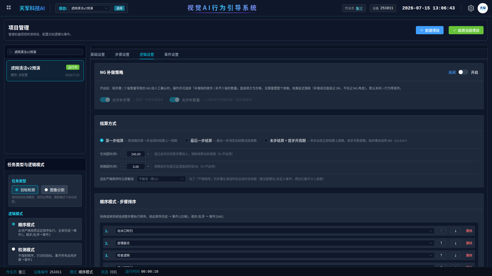

## 六、事件设置

两条标准事件即可：周期合格 → 「合格(OK)」计数器 +1；周期不良 → 「不良(NG)」+1；均带总产量 +1。有语音/报警灯需求再往事件上挂动作。

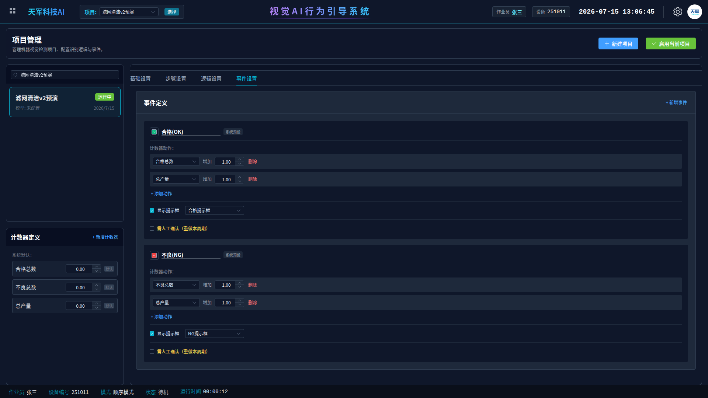

## 七、监控页验收（预演实录）

以下截图是虚拟剧本按真实节奏走完一整件 + 换件的实录，**验收时真模型跑真流程应看到完全一致的行为**：

**① 出水口吹扫进行中**——检测框标签显示的是虚拟步骤名"出水口吹扫"（不是"吹扫"），步骤统计第 1 行"已检测"，画面左上"工件已就位"：

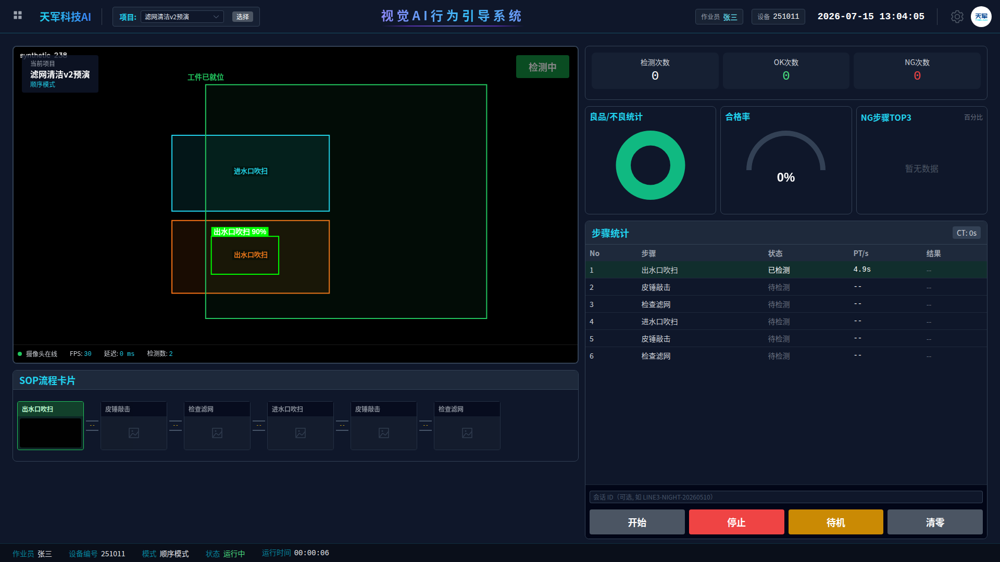

**② 前三步齐**——SOP 流程卡前三张点亮：

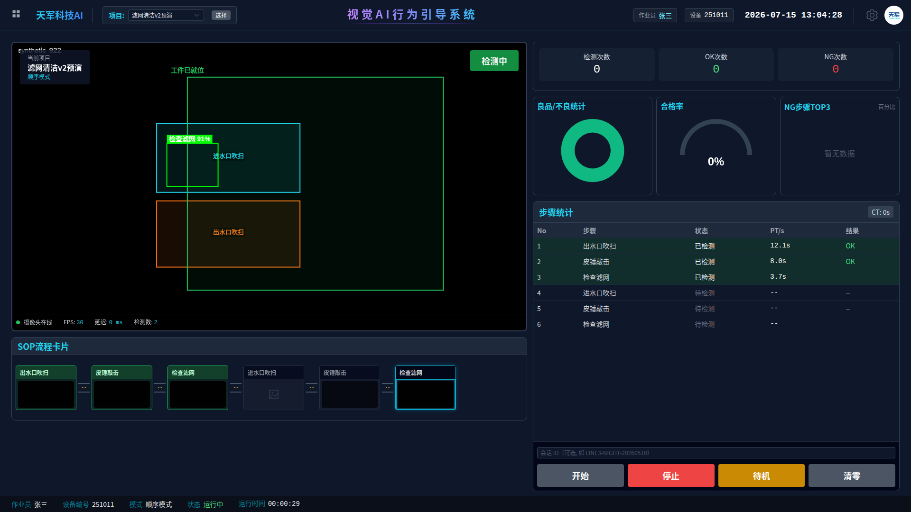

**③ 进水口吹扫**——同一个"吹扫"模型输出，因为枪头中心落在上方区域，标签改写为"进水口吹扫"，第 4 行点亮。**这一屏是"客户强制区分进出水口"的直接证据**：

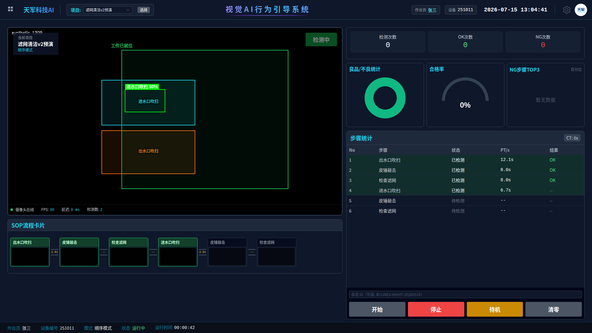

**④ 六步齐待结算**——六行全部"已检测"，等下一件首步触发结算：

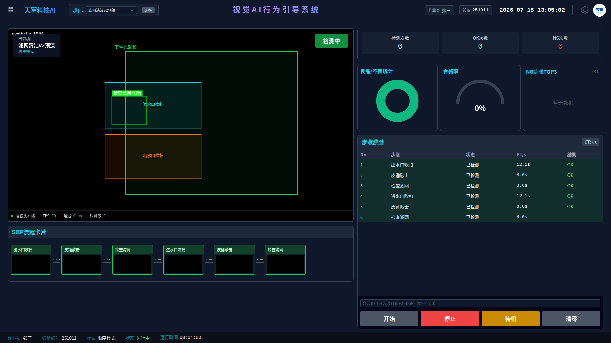

**⑤ 换件结算**——新工件放上、出水口吹扫重现，上一件立即结算：检测次数 1、OK 1、合格率 100%，步骤统计清零重新走：

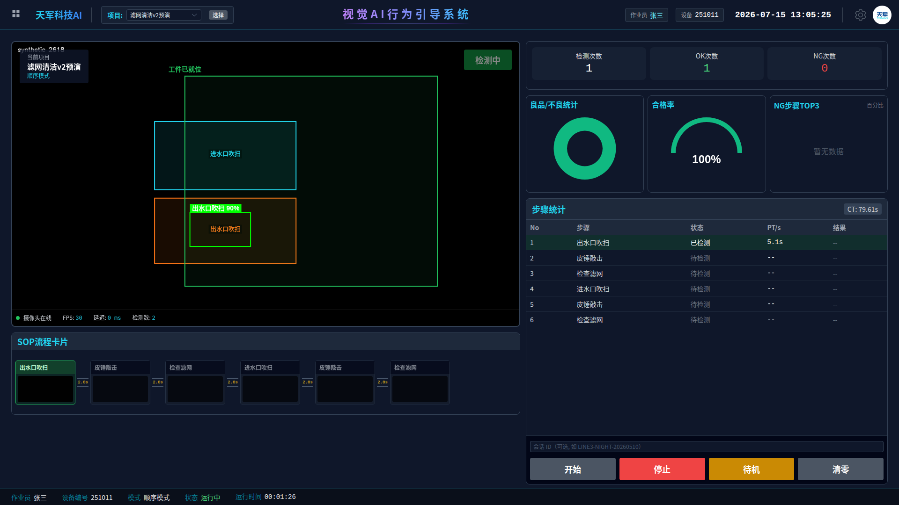

## 八、常见问题排查

| 现象 | 排查 |
|---|---|
| 检测框一直显示"吹扫"而不是"出水口/进水口吹扫" | 拆分规则没启用 / 保存后没重新「启用当前项目」（配置改动必须重新激活才进状态机） |
| 两个吹扫总是被判成同一个 | 区域画反了或分界不清：开着监控页让操作员各吹一次，看框中心落点，重画区域留大间隙 |
| 吹扫在敲击期间反复"消失又出现" | 该步骤「等待不被打断」没开，或消失等待时间太短；也检查模型是否把"枪驻留无手"误报成吹扫（那是标注/训练问题，回标注规范第五节） |
| 工件挪个位后区域判定错 | 锚点没标定（编辑器里"从当前画面抓取锚点框"必须点过且显示"已标定"）；或工件框残缺导致锚点漂移（回标注规范：工件按完整轮廓标） |
| 一直不结算 | 第一步结算靠"下一件出水口吹扫重现"；最后一件等空闲超时（240 秒）。单件测试时等满 4 分钟或直接放下一件 |
| 换件瞬间误结算 | 工件搬离期间若吹扫误检出会提前触发——确认「未命中区域→丢弃」已选（工件不在 → 锚点丢失超 3 秒 → 区域失效 → 吹扫全部丢弃，天然免疫） |
| 步骤统计有行永远"待检测" | 序列里步骤 id 与步骤表对不上（虚拟步骤删了重建会换 id）：逻辑设置里重新拖一遍序列 |

## 九、给验收人的一句话清单

- [ ] 监控页看到的吹扫标签是"出水口吹扫/进水口吹扫"，不是"吹扫"
- [ ] 两个口各吹一次，标签分别正确（客户强制要求）
- [ ] 完整六步走完 + 放下一件 → 上一件合格 +1
- [ ] 故意跳过一步（如不敲第二轮）→ 下一件触发时上一件不良 +1
- [ ] 工件在台面上挪动 20cm，区域跟着走、判定不乱（锚点跟随）
- [ ] 空台面 4 分钟（最后一件）→ 自动结算

---

**版本**：v1.0（2026-07-15，随标注规范 v2.1 发布）
**预演环境**：主程序 v3.34 开发版 + 虚拟剧本源（RUNTIME_MODE=test），预演项目「滤网清洁v2预演」（项目 id 30）保留在开发机数据库中可随时复跑。
