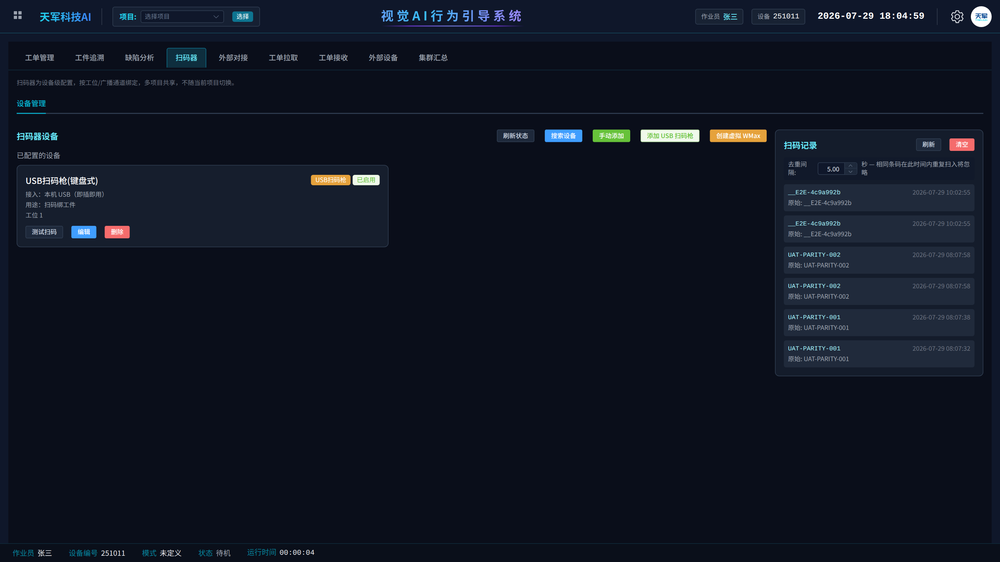
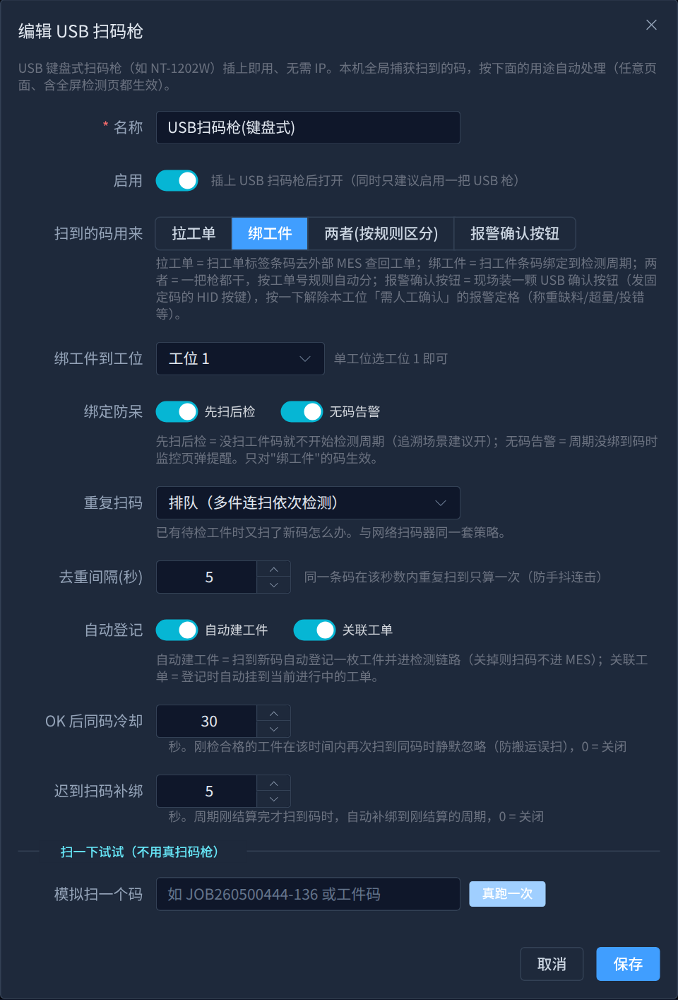
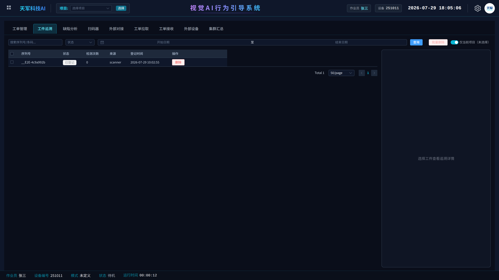

# USB 键盘扫码枪配置手册（扫码追溯场景）

> **交付对象**：现场部署工程师
> **软件版本**：v3.46 及以上（该版本起，USB 键盘扫码枪与网络扫码器使用同一套绑定行为配置，均在界面可配、真实生效）
> **适用场景**：客户要求"扫完工件二维码再开始检测；事后出问题时，按二维码调出该工件的检测记录逐步核对"。**不需要对接 MES**，全部数据在本机闭环。

---

## 一、方案总览：扫码如何撑起追溯

整条链路只有三步，全部由主程序原生完成：

1. **扫码 → 登记工件**：操作员用 USB 扫码枪扫工件上的二维码，系统立刻登记一枚"待检工件"。
2. **检测 → 绑定周期**：检测周期开始后，这枚工件自动绑定到当前周期；周期结束时，判定结果（合格/不良）、每一步的检测数据、现场录像都挂在这枚工件名下。
3. **追溯 → 按码调档**：后期客户反馈某个工件有问题，在「MES → 工件追溯」页输入二维码即可调出该工件的全部检测记录，逐步核对哪一步没做/做错。

> USB 键盘式扫码枪（如 NT-1202W）插上即用、无需配 IP。软件在**任意页面**（含全屏检测页）都全局捕获扫到的码，按配置的用途自动处理。

---

## 二、添加扫码枪

入口：**MES → 扫码器 → 添加 USB 扫码枪**。

配置完成后设备页如下图：设备卡片显示枪的用途与绑定工位，右侧「扫码记录」面板实时滚动最近扫到的码，是现场排查"枪到底扫没扫到"的第一观察点。

---

## 三、逐项配置说明

编辑弹窗全貌（追溯场景推荐配置示例）：

### 3.1 扫到的码用来（用途）

| 用途 | 含义 | 追溯场景选它吗 |
|---|---|---|
| 拉工单 | 扫工单标签条码，去外部 MES 查回工单 | 否（本场景不连 MES） |
| **绑工件** | 扫工件条码，绑定到检测周期 | **是（追溯场景选这个）** |
| 两者(按规则区分) | 一把枪都干，按工单号正则自动分流 | 只有同时要拉工单时才用 |
| 报警确认按钮 | USB 确认按钮，按一下解除本工位报警定格 | 否 |

选「绑工件」后指定**绑定到哪个工位**——单工位现场选"工位 1"即可。

### 3.2 绑定防呆（追溯场景建议全开）

| 开关 | 作用 | 建议 |
|---|---|---|
| 先扫后检 | 没扫工件码就**不开始检测周期**，从源头保证每个周期都有码可追 | **开** |
| 无码告警 | 万一某个周期没绑到码，监控页立刻弹提醒 | **开** |

### 3.3 绑定行为参数（v3.46 起与网络扫码器同一套）

| 参数 | 含义 | 追溯场景推荐值 |
|---|---|---|
| 重复扫码 | 已有待检工件时又扫了新码怎么办：覆盖 / 拒绝 / 排队 | 单件节拍选**覆盖**（默认）；多件连扫依次检测选**排队** |
| 去重间隔(秒) | 同一条码在该秒数内重复扫到只算一次，防手抖连击 | 2~5 |
| 自动建工件 | 扫到新码自动登记工件并进检测链路（关掉则扫码不进系统） | **开** |
| 关联工单 | 登记工件时自动挂到当前进行中的工单 | 有本地工单管理需求就开 |
| OK 后同码冷却(秒) | 刚检合格的工件短时间内再扫到同码时静默忽略，防搬运误扫 | 0（默认关）；转运容易误扫时设 30~60 |
| 迟到扫码补绑(秒) | 周期刚结算完才扫到码时，自动补绑到刚结算的周期 | 3（默认） |

> 注意：以上防呆与行为参数只对"绑工件"的码生效。用途为"拉工单/报警确认按钮"的枪与检测周期无关，不参与这些逻辑。

---

## 四、配好后先试一枪（不用真扫码枪）

弹窗底部「模拟扫一个码」：输入任意工件码点**真跑一次**，码会走与真枪完全相同的处理链。到「扫码器」页右侧的扫码记录和监控页确认码上屏，再上真枪。

---

## 五、追溯怎么查

入口：**MES → 工件追溯**。顶部搜索框输入工件二维码（支持模糊搜），点开该工件即可看到：

- 每次检测的周期结果（合格/不良）与不良原因
- 周期内每个步骤的完成情况与时长
- 关联的现场录像（可回放核对操作员实际动作）

---

## 六、现场注意事项

1. **同时只启用一把 USB 枪**。多把并存请只保留一把"启用"，避免全局键盘捕获相互干扰。
2. **扫码枪需设置为"扫码后回车"**（绝大多数 USB 键盘枪出厂默认如此）。若扫码无反应，先用记事本试枪：扫一下应输出码+换行。
3. **软件任意页面都能扫**，不需要停在特定页面；但工位必须已激活项目，否则码会被丢弃（扫码记录面板可见、检测链路不登记）。
4. 与网络扫码器并存于同一工位时，**以网络扫码器的配置为准**。
5. 「先扫后检」开着时忘扫码，检测周期不会开始——监控页会有提示，扫一下码即可继续。扫错码想重扫：监控页「清除本次扫码」按钮。

---

## 七、验收清单（交付前逐项打勾）

| # | 检查项 | 通过标准 |
|---|---|---|
| 1 | 真枪扫码上屏 | 扫码器页"扫码记录"出现该码 |
| 2 | 先扫后检生效 | 不扫码不开周期；扫码后周期正常开始 |
| 3 | 码绑定周期 | 周期结束后工件追溯页能查到该码，状态为已检 |
| 4 | 无码告警生效 | 关掉"先扫后检"、不扫码跑一个周期，监控页弹"未绑码"提醒 |
| 5 | 追溯闭环 | 按码调出工件 → 步骤明细与录像都能打开 |
