# 滤网清洁检测 · 项目配置手册

> **版本 v1.0 · 2026-07-29 · 交付对象：部署工程师**
> 本手册对应模型 **best(15)**（类别：工件 / 吹扫 / 皮锤敲击 / 检查滤网），全部参数已用定版机位的两段实录视频灌进真实检测管线回放验证：**4 个工件全部按六步序列判定合格，零误报、零违序**。照本手册逐页配置即可复现。

---

## 〇、一页速查（先看这张表）

| 配置项 | 值 |
|---|---|
| 逻辑模式 | 顺序模式 |
| 步骤序列 | 出水口吹扫 → 皮锤敲击 → 检查滤网 → 进水口吹扫 → 皮锤敲击 → 检查滤网 |
| 结算方式 | **第一步结算**（下一件的出水口吹扫出现 = 上一件结算） |
| 空闲超时 | 240 秒（收尾兜底：最后一件没有"下一件"来触发，靠它结算） |
| 周期超时 | 0（不启用） |
| 同时出现组 | **不配置**（本方案不需要） |
| 拆分规则 | 吹扫 → 固定画面拆两块区域：出水口吹扫 / 进水口吹扫，区域外丢弃 |
| 就位提示 | 启用，锚点=工件，常驻显示 |
| 事件 | 合格(OK) / 不良(NG) 各自 +1 到对应计数器与总产量 |

启用的四个步骤的行为参数（**时间参数是本方案的命脉，先照抄，别改**；置信度阈值统一先放 50%，现场按误检情况再抬）：

| 步骤 | 最短持续(秒) | 消失等待时间(秒) | 等待不被打断 | 单次接受 |
|---|---|---|---|---|
| 出水口吹扫 | 1.5 | 5.0 | 开 | 开 |
| 皮锤敲击 | 1.0 | 1.5 | 开 | 开 |
| 检查滤网 | 0.5 | 1.5 | 开 | 开 |
| 进水口吹扫 | 1.5 | 6.5 | 开 | 开 |

> **为什么这几个数**：吹扫中途工人会歇枪换手，实测出水口段内最长空档 3.9 秒、进水口 5.9 秒——消失等待必须盖过这个空档，否则一次吹扫被劈成两次；"等待不被打断"必须开，否则等待期间画面里出现其他步骤会把等待掐断，等价于没设。每轮敲击会在两个位置各敲一段（间隔≤7 秒），靠"单次接受"把第二段静默吸收，不用改序列。

---

## 一、适用前提

1. **机位已定版**：相机、工件位置均已固定（2026-07-27 后采集的机位）。本手册所有区域坐标都基于这个机位——**相机或工件挪过位，必须重画第三节的两块区域和引导框**。
2. 模型用 **best(15)** 或其后续迭代版，类别必须是：工件、吹扫、皮锤敲击、检查滤网。
3. 每件工件的作业流程：出水口吹扫 → 皮锤敲两处 → 举起看滤网 → 进水口吹扫 → 再敲两处 → 再看滤网 → 换下一件。

---

## 二、新建项目与基础设置

项目页新建项目，名称建议 `滤网清洁v2`，任务类型选 **目标检测**。模型配置里绑定 best(15)（截图中未绑定，现场绑上即可，绑定后步骤表会自动出现模型的四个类别）。

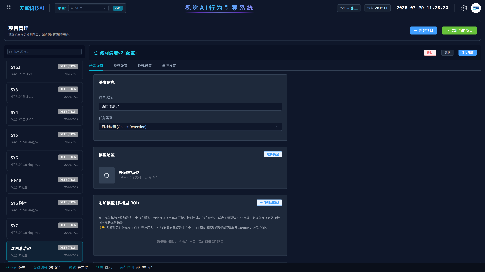

---

## 三、步骤设置（本手册的核心页）

### 3.1 标签与检测属性

- **启用**这四个：皮锤敲击、检查滤网、出水口吹扫、进水口吹扫（后两个是拆分规则自动生成的虚拟步骤，带「拆分」徽标）
- **不启用**这两个：工件（只当就位锚点用）、吹扫（是拆分的原料，启用了反而串戏）
- 置信度阈值统一先放 **50%**，现场跑一天后按误检情况逐步上调

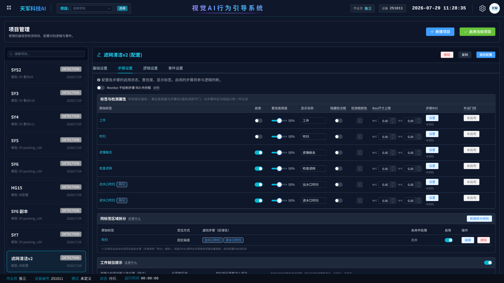

### 3.2 同标签区域拆分（进/出水口区分就靠它）

模型只报一个"吹扫"，靠**发生位置**拆成两个步骤。在「同标签区域拆分」卡片点**新建拆分规则**：

- 模型原始标签：`吹扫`
- 区域定位方式：**固定画面**（工件已固定，不用锚点跟随）
- 未命中任何区域：**丢弃**
- 区域列表加两块，名字就是虚拟步骤名：`出水口吹扫`、`进水口吹扫`

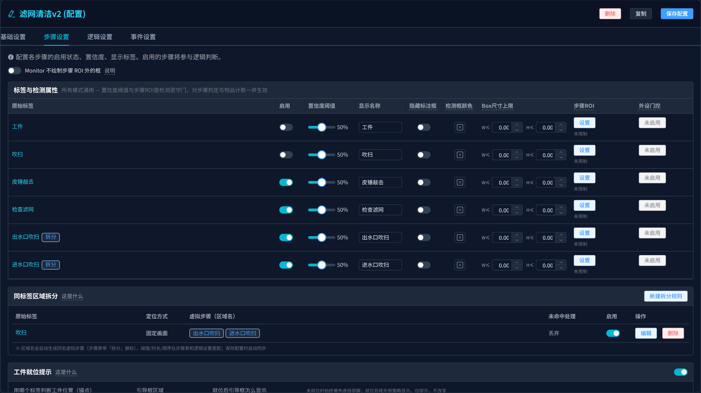

点「编辑」进入拆分编辑器，**若画布是黑的，点右上角「刷新画面快照」**。照下图把两块区域画在两个接口上（判定用的是检测框**中心点**，区域画大一点没关系，两块**别互相重叠**）：

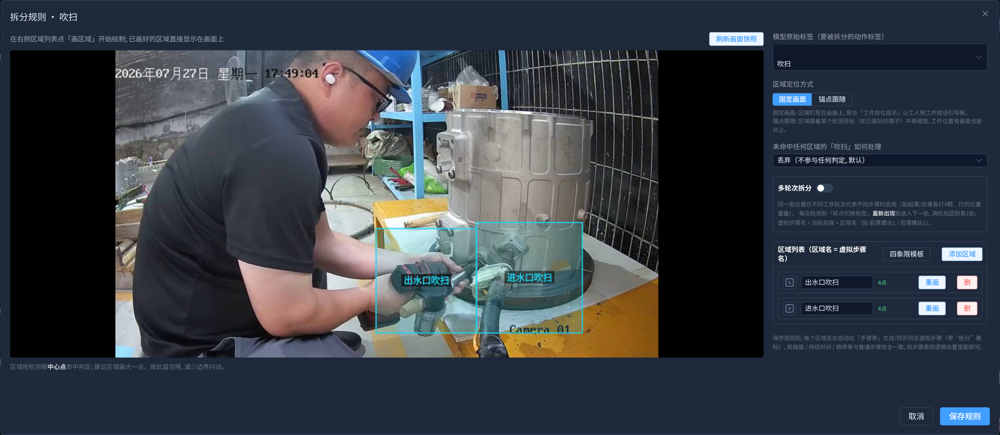

按定版机位标定的参考坐标（归一化，画完可以对照右侧区域列表核对）：

| 区域 | X 范围 | Y 范围 |
|---|---|---|
| 出水口吹扫（左块） | 0.48 ~ 0.665 | 0.58 ~ 0.92 |
| 进水口吹扫（右块） | 0.665 ~ 0.86 | 0.56 ~ 0.92 |

> 两段实录里全部吹扫框中心聚成明显的左右两簇，簇间净空约 0.11（百余像素），分界线 x=0.665 放在正中间，不存在骑线风险。

### 3.3 步骤行为参数

「步骤行为参数」卡片按速查表填（下图即终版数值）：

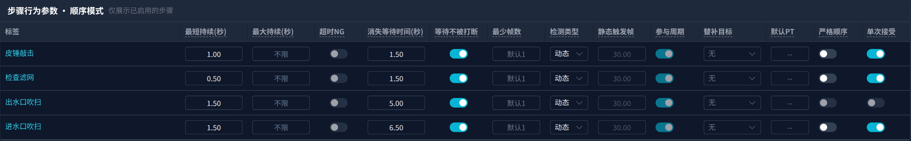

### 3.4 工件就位提示（可选但建议开）

引导工人把工件放到定版位置，位置对 = 绿框，偏了 = 黄虚线提醒（只提示、不影响判定）：

- 锚点标签：`工件`
- 显示策略：常驻显示（就位变绿）

点「重绘引导框」，把框画在工件正常摆放的位置（参考坐标：X 0.53~0.93，Y 0.13~0.90）：

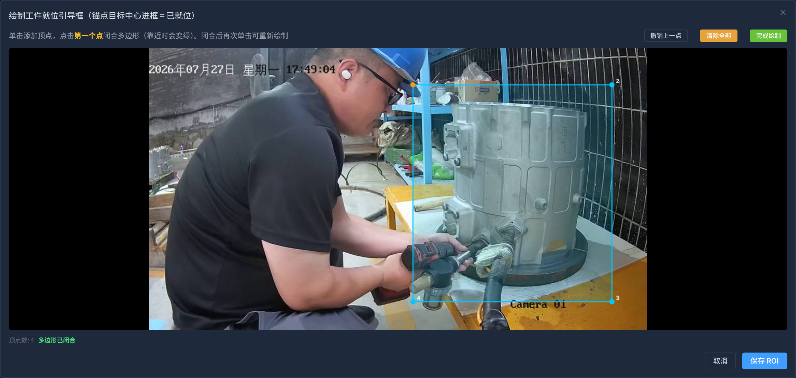

---

## 四、逻辑设置

- 逻辑模式：**顺序模式**
- 结算方式：**第一步结算**；空闲超时 **240** 秒；周期超时 0
- NG 判定：违规出现时=不处理（等周期结算再判）；结算缺步骤时=直接判NG（默认值即可）

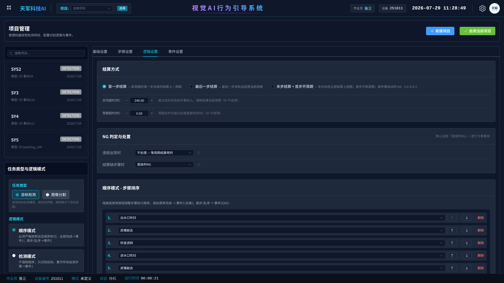

步骤排序按 1~6 填（皮锤敲击、检查滤网各出现两次是正常的，程序原生支持重复步骤）：

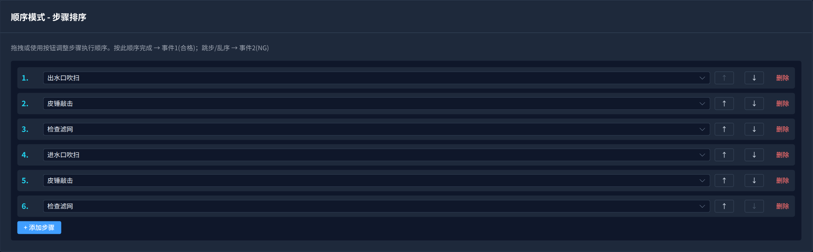

> 「同时出现组」保持空白，「误判过滤」两个开关保持关闭——本方案都不需要。

---

## 五、事件与计数器

事件两条：合格(OK) → 合格总数+1、总产量+1；不良(NG) → 不良总数+1、总产量+1。都勾「显示提示框」。计数器用系统默认三个（合格总数 / 不良总数 / 总产量）。

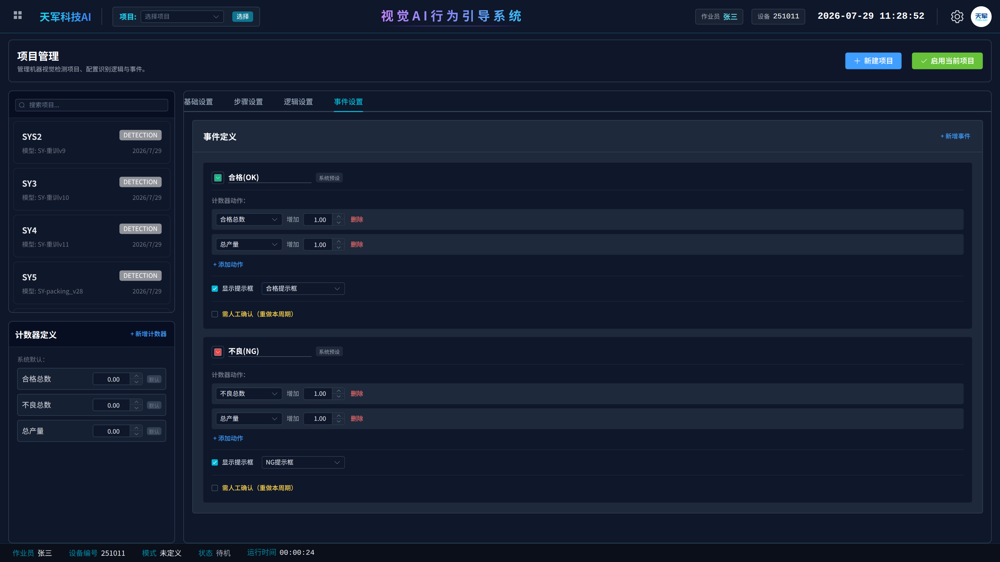

---

## 六、视频源

现场按实际相机类型配置（USB / 海康均可），分辨率建议不低于 960×540，帧率 20 FPS 以上。**相机装好后不要再动**——动了要回第三节重画区域。

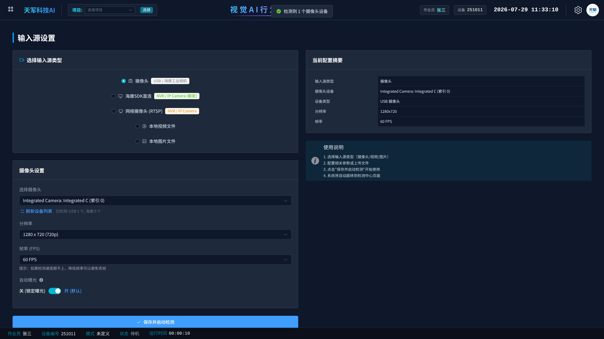

---

## 七、监控页验收

配置保存后：顶部选中项目 → 启用当前项目 → 开始检测。验收标准：

1. 每完成一件工件，**恰好弹一次合格提示、合格总数+1**（前一件的合格是在下一件开始吹出水口时弹出，属正常；最后一件等 240 秒空闲后弹）
2. 工人吹哪个口，步骤统计里亮的必须是对应的"出水口吹扫/进水口吹扫"——亮错了说明区域画反或画偏
3. 工人中途回头**补吹**一次已做过的口：不弹任何提示（被"单次接受"吸收）——这是对的，不是漏检
4. 全程不该出现 NG；出现 NG 先看是哪一步缺了，再对照下面的排查表

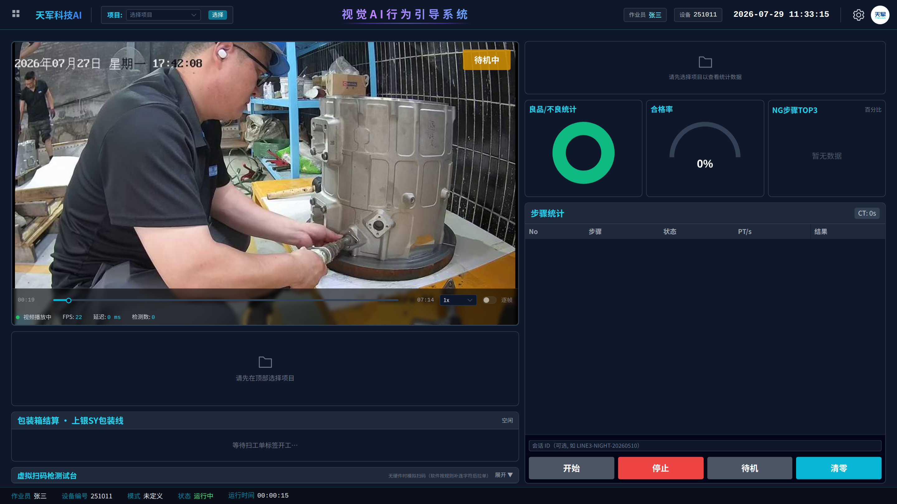

---

## 八、现场排查速查

| 症状 | 先查什么 | 怎么调 |
|---|---|---|
| 一次吹扫被记成两次 | 该步骤"消失等待时间"是否照表填、"等待不被打断"是否开 | 把对应吹扫步骤的消失等待再加 1~2 秒 |
| 检查滤网经常漏 | 该动作只举 1 秒左右，最短持续是否误填大了 | 最短持续从 0.5 降到 0.3 |
| 吹口亮错边 | 拆分编辑器里两块区域位置 | 对照 3.2 坐标表重画；确认相机没被挪动 |
| 偶发误检导致乱序 NG | 哪个步骤在没人操作时也亮 | 只抬该步骤的置信度阈值（55→60→65 逐档试） |
| 合格弹得"晚一拍" | 无需处理 | 第一步结算的固有特性：上一件在下一件开工时结算 |

---

**文档版本**：v1.0（2026-07-29）· 配套模型 best(15) · 参数经两段定版视频真实状态机回放验证（4 工件全 OK）
**维护**：天军科技 AI 视觉检测
