# 捷昌 B 站打包线 · 一工位模型 · 黑款产品图片标注规范

> **交付对象**：标注工程师
> **通道**：一工位（三通道流水线的第一道；二工位大件、二工位小件另有各自规范）
> **产品款别**：**黑款**（白款一工位另出规范；两款**共用同一套 5 类**，本文示例全部取自黑款现场实拍）
> **配套素材**：`标注规范assets_一工位_黑款/`（截自现场实拍视频 1280×720@29fps，约 80 秒）
> **有疑问**：拿不准的帧不要猜，截图集中反馈给项目负责人统一裁定

---

## 一、背景：这批标注是干什么用的（先读，影响画框方式）

工位场景：俯拍相机对着滚筒输送线，包装箱滑进画面 → 操作员把**脚件、立柱、线钩**放进箱内泡沫槽 → 满箱滑向二工位。一工位只盯这批大件骨架，不管二工位才放的侧板/传动杆/小件袋。

软件跑的是**跟踪模式 + 齐件即结算**：模型认出每样物品，软件数"该到的东西是否都稳定出现"，凑齐并稳定若干帧当场判合格。两个判定机制直接吃标注质量：

1. **框中心点落区判定**——物品算不算"放进来了"，看检测框**中心点**是否落在检测区域内；
2. **稳定帧数判定**——目标要**连续若干帧稳定检出**才计数，检出忽有忽无 = 永远凑不齐 = 整箱误判。

由此产生本规范最重要的两条铁律：

> ⚠️ **铁律一：框只贴目标本体，不框手、不框手臂。**
> 放置过程手会把框中心拽偏；框里带手还会让模型学到"物品=物品+手"，物品放定手离开后反而检不出。手指少量遮挡边缘可带入，**成片的手背/手臂绝不入框**（见 std3、ex 正误对照）。
>
> ⚠️ **铁律二：同一目标相邻帧的框要稳，宁可略松不要抖。**
> 边界忽紧忽松训出来的模型框会抖，直接冲击"稳定 N 帧"判定。贴合外轮廓、误差按验收标准控制即可，不追求逐帧像素级精抠。

## 二、素材与交付

| 项 | 内容 |
|---|---|
| 素材来源 | 本工位现场相机实拍抽帧（**必须现场最终机位**，机位变动要通知项目负责人） |
| 首段视频 | 约 80 秒 @ 29fps，1280×720，覆盖一个装箱过程（进站泡沫就位 → 放脚件/立柱/线钩 → 两箱同框） |
| 抽帧密度 | 每 3 帧 1 张起步，放置动作前后 2 秒逐帧保留 |
| 标注工具 | labelImg / X-AnyLabeling 等任意支持 YOLO 格式的工具 |
| 交付格式 | YOLO 目标检测格式：`images/` + `labels/`（每图一个同名 txt）+ `classes.txt`（**必须写英文类名**，顺序与第三节 id 一致，一个不加一个不减） |
| 框类型 | 全部为水平矩形框（bbox），无多边形、无关键点 |
| 独立性 | 本数据集只属于一工位模型，**不得与二工位大件/小件素材混标混训** |

## 三、类别定义（5 类，id 顺序与现役模型 `GW1_an.pt` 完全一致）

> 类别名沿用现役模型的**英文命名**，`classes.txt` 必须按此顺序原样写英文（增量训练要和旧模型 id 对齐）。下表括号里的中文只给标注员认物，**不要写进 classes.txt**。

| id | 类别名（写入 classes.txt） | 中文俗称 | 一句话定义 | 备注 |
|----|--------------------------|---------|-----------|------|
| 0 | `box` | 箱子 | **箱口**（箱体开口那圈，不含摊开的箱盖） | ⚠️ 遮挡场景检出弱，补样时注意人挡箱的帧 |
| 1 | `foot` | 脚件 | 长条横梁，槽内常有滚轮 | 一箱通常两根，各画各的框 |
| 2 | `pillar_no_core` | 不带芯立柱 | **空心**黑方管，端面看不见内部芯 | 与 id3 互斥 |
| 3 | `pillar_with_core` | 带芯立柱 | 端面或侧面能看见**银色/灰色金属芯** | 与 id2 互斥 |
| 4 | `cable_hook` | 线钩 | 较短的黑色板件/挂钩，嵌在泡沫槽里 | 一箱通常两个，各画各的框 |

**和二工位规范最大的差别（标之前先记住）**：

1. **本模型没有泡沫槽类**——泡沫内衬、空槽、有物槽全部不标，只标箱子和放进去的零件。
2. **`pillar_no_core` 与 `pillar_with_core` 是互斥对**：同一根立柱按当前实际状态标其一，绝不同帧双标；分不清带没带芯的帧**跳过并截图反馈**。
3. **同类多个必须拆开画**：两根脚件 = 两个 `foot` 框，两个线钩 = 两个 `cable_hook` 框，禁止合成一个大框。
4. **箱子框只框箱口**（箱体开口那圈：泡沫腔 + 箱口内沿）——**摊开/翻开的箱盖、纸箱外壁不入框**。这是现役模型的既有口径，增量补数据必须保持一致，框大了新旧数据会互相打架。
5. **`box` 只标当前作业位上的箱子**（项目负责人亲标裁定）：输送线上排队的下一箱、备用箱，哪怕完整可见也**不标**；操作员整个人压在箱口上、箱口轮廓认不出时，`box` 也不标。

## 四、每类怎么画框（对照示例图）

### id0 `box` 箱子

🏅 **本类为项目负责人亲标口径**（下图及 std 系列的 box 框均为亲标后渲染）：

- **只框箱口**：泡沫腔 + 箱口内沿，摊开的箱盖、纸箱外壁不入框；
- **只标当前作业位上的箱子**：输送线上的下一箱、备用箱不标（哪怕完整可见）；
- 箱口被截断可见不足一半、或被人压住认不出轮廓 → 不标。

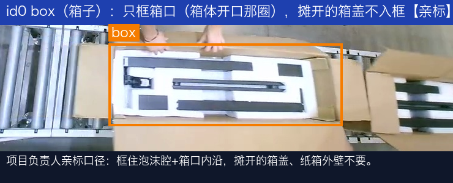

### id1 `foot` 脚件

贴长条本体。两根就画两个框。正在被手按进槽里时，框仍然只包黑色长条。

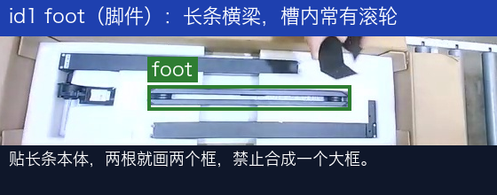

### id2 `pillar_no_core` 不带芯立柱

看**端面**：空心、无银色芯轴 → 标这一类。

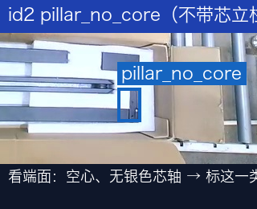

### id3 `pillar_with_core` 带芯立柱

看**端面或侧面**：露出金属芯 → 标这一类。

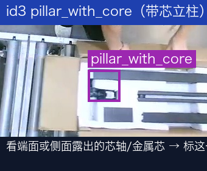

### 立柱互斥对照（最容易标错的一对）

判定只看端面：露出金属芯 = `pillar_with_core`；空心方管 = `pillar_no_core`。同一根只能标其中一个；看不清本帧跳过。

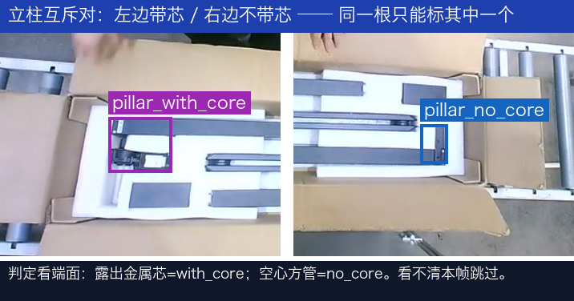

### id4 `cable_hook` 线钩

比脚件短得多，通常嵌在泡沫的独立小槽里。多个线钩各画各的框，不要跟立柱搞混。

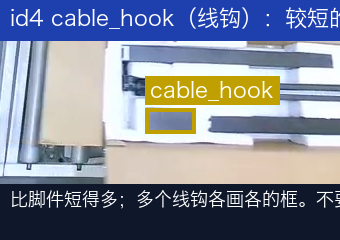

## 五、整帧场景画法

### 进站 / 泡沫已就位 — std5

- 先标 `box`（只框箱口，摊开的箱盖不入框）；
- 泡沫内衬本身没有类别，**不标**；空槽也不标；
- 箱内还没放的零件不要脑补；
- 左侧另一只箱子箱口被截断、可见不足一半 → 不标。

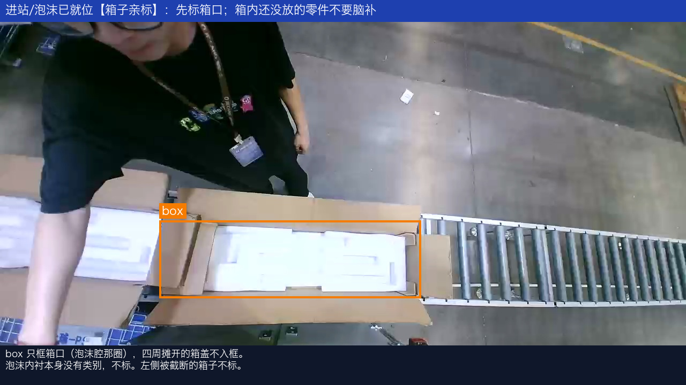

### 手入画 — std3 / 正误对照（铁律一的主战场）

- 正在放的脚件只框物品本体，手和手臂绝不入框；
- 已放定、没被手挡住的零件照标；
- 被手挡住认不清的零件此帧不标，不猜。

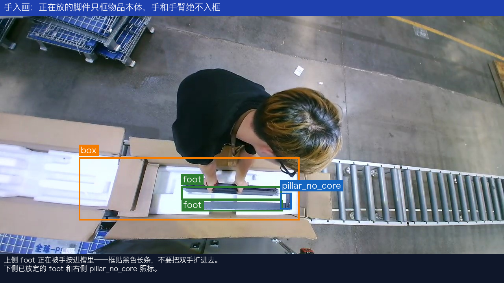

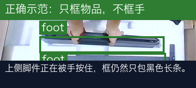

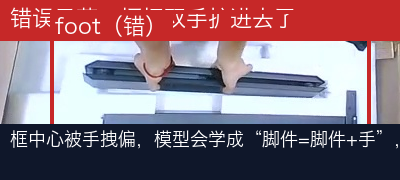

### 放置中途 — std2

- 已放定的物品照标；被手挡住看不清的不猜；
- 左侧另一只箱子可见不足一半不标。

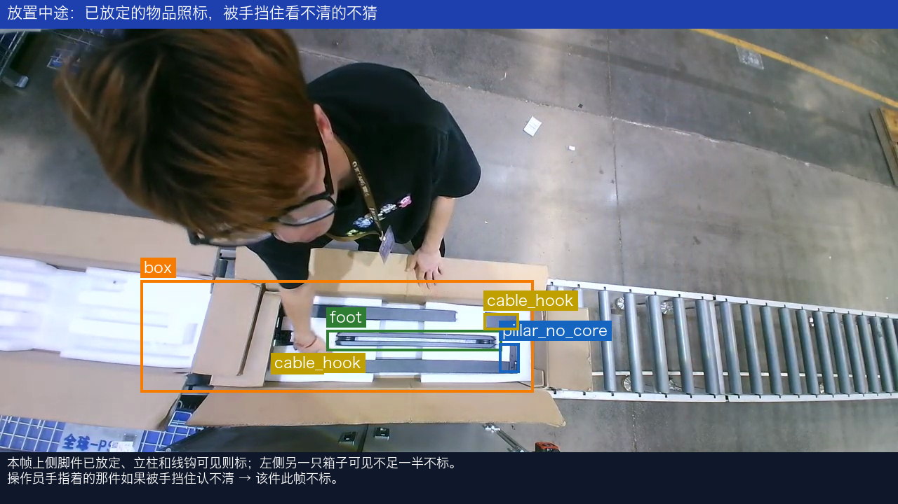

### 满箱 — std1

一箱的标准配置（以本段实拍为准，实际数量以当前帧实物为准）：

- 1 个 `box`：**只标作业位上这只**（亲标裁定）——右侧输送线上的下一箱完整可见也不标；
- 2 个 `foot`（各画各的）；
- 1 个 `pillar_with_core` + 1 个 `pillar_no_core`——**立柱框只贴竖条本体，别把旁边的白泡沫框进去**；
- 2 个 `cable_hook`（各画各的）；
- 人、滚筒、蓝筐一律不标；
- 下一箱里的零件同样不标（不是作业对象，且被箱盖阴影挡住辨不清）；
- 两箱之间竖立的小纸箱不是打包对象，不标。

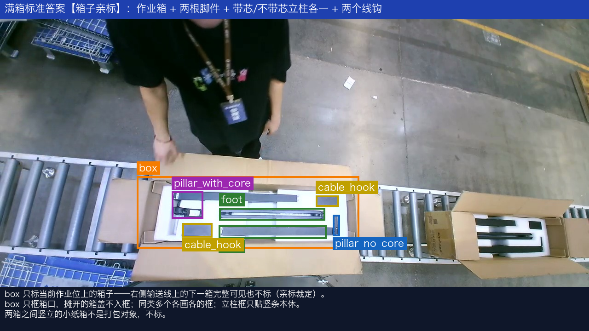

### 人压箱帧 — std4【亲标：整帧零标注】

- 操作员整个人压在箱口上、箱口和零件都认不出 → `box` 和零件**全部不标**（不猜）；
- 右侧下一箱虽然完整可见，但 `box` 只标作业位上的箱子 → 也不标；
- **整帧零标注照常交付**（空标注文件），这是重要的负样本，不许从数据集里删掉。

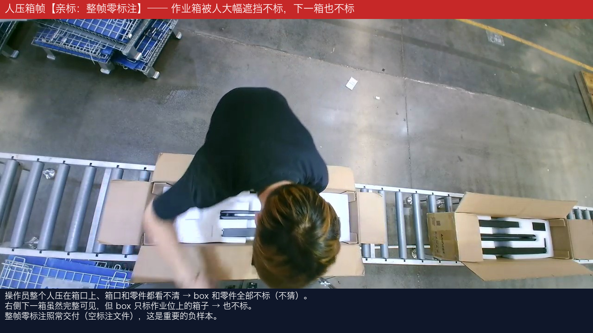

### 装箱中（人在箱边）— std6【箱子亲标】

- 和 std4 的分界：人在箱边、**箱口整体轮廓还认得出** → `box` 照标；被人压得认不出 → 不标（std4）。

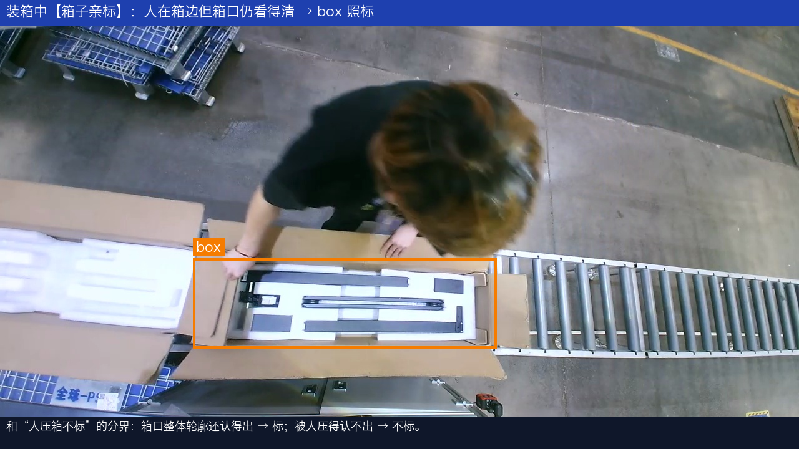

### 不标注区 — neg

以下内容**任何情况都不画框**——错标它们比漏标更伤模型：

1. **人体**：手、手臂、头、躯干（铁律一）；
2. **蓝筐 / 料架 / 地面标识 / 滚筒输送线本体**；
3. **泡沫内衬本身**（本模型没有泡沫槽类）；
4. **输送线上的下一箱 / 备用箱及其内零件**（亲标裁定：`box` 只标作业位上的箱子）；
5. **两箱之间竖立的小纸箱**（不是打包对象）；
6. **箱口可见不足一半、或被人压住认不出的箱子**；
7. **二工位才放的物料**如果偶尔入画（侧板、传动杆、小件袋等）——不是本通道目标，不标。

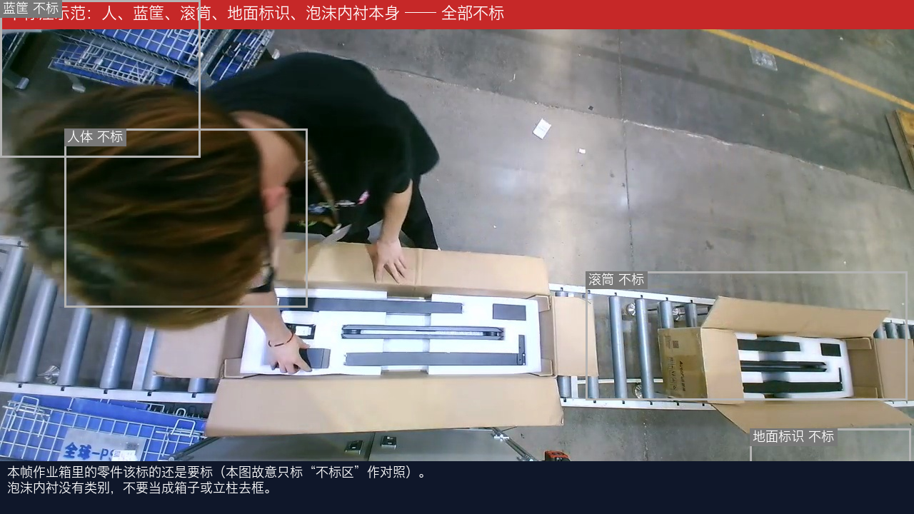

## 六、时序边界速查（拿不准"这帧算不算"时查这里）

| 情形 | 处理 |
|---|---|
| 物品在手中移入画面 | 类别可辨 → 只框物品；辨不清 → 跳过 |
| 正在放入、手还按在上面 | 只标物品，不框手；不另标"过渡状态"（本模型没有空/有物状态类） |
| 物品放定、手已离开 | 照常标 |
| 被手或手持物挡住看不清 | 该件此帧不标，不猜 |
| 立柱端面看不清带没带芯 | 该立柱此帧不标，截图反馈 |
| 箱子滑动中（进入/离开作业位） | 作业箱箱口可见过半照标 `box` + 箱内可见零件；可见 < 一半全部不标 |
| 两箱同框 | **只标作业位上的箱子**；下一箱/备用箱及其内零件不标（亲标裁定，std4） |
| 操作员整个人压在箱口上 | `box` 和零件全部不标，整帧可为零标注（std4） |
| 两箱之间的空线帧 | 整帧零标注，照常交付 |
| 运动模糊 | 类别可辨照标；肉眼认不出跳过 |
| 完全认不出/严重遮挡 | 跳过，宁缺毋滥，截图反馈 |

## 七、数量与配重要求（按现役模型弱点定向加码）

现役 `GW1_an.pt` 在本段实拍 20 帧抽样（conf≥0.15）实测：`box` 只检出 3 次、`pillar_with_core` 6 次，且有把操作员衣服误检成立柱的假阳性。配重按这个弱点加码：

| 类别 | 下限 | 理由 |
|---|---|---|
| `box` | ≥ 1000 | 现场无遮挡时检得稳；按亲标口径**人压箱帧不标 box**（作为负样本交付），补样重点是进站空箱、人在箱边但箱口可辨、出画临界等边界帧 |
| `pillar_with_core` | **≥ 1200** | 检出少，且会把衣服误检成它，需要干净正样本 |
| `cable_hook` | **≥ 1000** | 小目标，易跟立柱/泡沫槽边混淆 |
| `foot` | ≥ 1000 | 现役尚可，维持覆盖；强调"两根拆开画" |
| `pillar_no_core` | ≥ 800 | 现役相对稳定，维持覆盖 |

- 相邻帧近似重复也**逐帧都标**（用标注工具"复制上一帧标注"提效）；
- 覆盖要求：不同班次光照、不同操作员、戴手套/徒手、零件不同摆放角度；同一箱重录多遍不如多录几箱；
- 黑白两款素材都要进集（比例按项目负责人的训练方案定），**共用同一套 5 类英文名，不按款拆类**。

## 八、质量验收

交付前自检，项目方按同样标准抽检 10%：

1. 类别错误率 = 0（重点：立柱带芯/不带芯按端面裁定，不得自行猜类；线钩不得标成立柱或脚件）；
2. **立柱互斥抽检**：同一根立柱同帧出现 `pillar_no_core` + `pillar_with_core` = 不合格；
3. **手/手臂入框抽检**：随机抽放置动作帧，框内成片手背/手臂 = 不合格（铁律一）；
4. **拆框抽检**：两根脚件合成一个大框、两个线钩合成一个大框 = 不合格；
5. 不标注清单（第五节 neg）零违例，重点查泡沫内衬误标、蓝筐误标、人体误标、**下一箱/备用箱误标**；
6. 框贴合度：边界与目标轮廓偏差 ≤ 目标尺寸 10%；同一静止目标相邻帧框抖动 ≤ 5%（铁律二）；
7. `classes.txt` 必须是下面五行英文，一个字都不能改：

```
box
foot
pillar_no_core
pillar_with_core
cable_hook
```

---

**文档版本**：v1.1（2026-08-17）— `box` 类全部示例替换为项目负责人在 labelImg 亲标后的渲染图（5 帧），并据此裁定三条口径回填：① box 只框箱口不含摊开箱盖；② box 只标当前作业位上的箱子，下一箱/备用箱不标；③ 人整个压在箱口上认不出轮廓时 box 不标（整帧可零标注）。
**类别来源**：5 类直接读自现役模型 `GW1_an.pt`，id 顺序一致，便于增量重训。
**配重依据**：现役黑款模型在本工位实拍视频逐秒 80 帧推理实测（`box` 无遮挡帧检得稳、操作员压箱帧基本检不出 / `pillar_with_core` 有把衣服误检的假阳性 / 其余类相对稳定）。
**示例来源**：全部截自 2026-08 黑款一工位现场实拍视频。
**待项目负责人确认**：① 满箱标准件数量是否固定为 2 脚件 + 1 带芯立柱 + 1 不带芯立柱 + 2 线钩；② 本批视频机位是否为现场最终机位。
