# 捷昌 B 站打包线 · 二工位大件模型 · 白款产品图片标注规范

> **交付对象**：标注工程师
> **通道**：二工位大件（三通道流水线之一；一工位、二工位小件另有各自规范）
> **产品款别**：**白款**（类别表与黑款模型 `dajian4.23.pt` 完全一致，共用同一套 9 类，本文示例全部取自白款现场实拍）
> **配套素材**：`标注规范assets_二工位大件_白款/`（截自现场实拍视频 1280×720@30fps）
> **有疑问**：拿不准的帧不要猜，截图集中反馈给项目负责人统一裁定

---

## 一、背景：这批标注是干什么用的（先读，影响画框方式）

白款产品**目前没有大件模型**——这批标注用于**首训/混训**白款大件模型（与黑款素材混训，共用同一套 9 类，不按款拆类）。工位场景：俯拍相机对着滚筒输送线，长条包装箱滑进画面 → 操作员把大件（框架/板件/传动杆等）逐件放进白色泡沫槽 → 收尾放手套+说明书 → 箱子滑走，下一箱进来。**画面里经常同时有两个箱**（上游装箱中 + 下游收尾），这是常态。

软件跑的是**跟踪模式 + 齐件即结算**，两个判定机制直接吃标注质量：

1. **框中心点落区判定**——物品算不算"放进来了"，看检测框**中心点**是否落在检测区域内；
2. **稳定帧数判定**——目标要**连续若干帧稳定检出**才计数，检出忽有忽无 = 永远凑不齐 = 整箱误判。

由此产生本规范最重要的两条铁律（三通道通用）：

> ⚠️ **铁律一：框只贴目标本体，不框手、不框手臂。**
> 放置过程手会把框中心拽偏；框里带手还会让模型学到"物品=物品+手"，物品放定手离开后反而检不出。手指少量遮挡边缘可带入，**成片的手背/手臂绝不入框**。
>
> ⚠️ **铁律二：同一目标相邻帧的框要稳，宁可略松不要抖。**
> 边界忽紧忽松训出来的模型框会抖，直接冲击"稳定 N 帧"判定。贴合外轮廓、误差按验收标准控制即可，不追求逐帧像素级精抠。

**白款大件的特有难点**：白色部件放在白色泡沫上，加上现场顶灯直射，**素材大面积过曝、白上白对比度极低**。这意味着：① 框的贴合边界要靠部件投影/接缝辨认，拿不准宁可略松；② 白色结构件类别（线槽/侧板/大框架/小框架）是本批数据的绝对重点（见第八节配重）。

## 二、素材与交付

| 项 | 内容 |
|---|---|
| 素材来源 | 本工位现场相机实拍（2026-08-13 晚班约 9 分钟，1280×720@30fps） |
| 抽帧密度 | 每 3 帧 1 张起步，放置动作前后 2 秒逐帧保留 |
| 光照覆盖 | ⚠️ 本批素材全部为晚班灯光且箱内过曝明显，白天素材后续补充迭代（先按本批起训） |
| 标注工具 | labelImg / X-AnyLabeling 等任意支持 YOLO 格式的工具 |
| 交付格式 | YOLO 目标检测格式：`images/` + `labels/`（每图一个同名 txt）+ `classes.txt`（顺序必须与第三节 id 一致，一个不加一个不减） |
| 框类型 | 全部为水平矩形框（bbox），无多边形、无关键点 |
| 独立性 | 本数据集只属于大件通道模型，**不得与一工位/小件通道素材混标混训** |

## 三、作业版图（先认清楚画面里什么归大件通道）

俯拍画面从上到下分四层：

- **上层背景（备料区）**：膜卷堆、**传动杆备料堆**（粉色托架上一堆白色长杆）、白板堆、包材袋、隔壁料架——**全部不标**，一帧都不标（第六节）；
- **中层滚筒线**：作业主体。箱子在线上串行流动，**同框两箱是常态**（上游装箱中 + 下游收尾），各标各的；
- **箱内**：大件通道的主战场——箱体（`箱子`）、泡沫内衬的每条槽（`泡沫槽`）、放入的各结构件、收尾的 `手套`+`说明书`；
- **下层前景**：工控机/键盘/鼠标——不标。

**箱内还会看到小件通道的东西**（螺钉包、适配器等小袋物、水杯架轮盘）：那些是**二工位小件模型**的目标，**在大件数据集里一个框都不画**——与小件规范里"传动杆/侧板不标"互为镜像。

## 四、类别定义与逐类示例（9 类，id 顺序与黑款 classes.txt 完全一致）

| id | 类别名 | 白款长相 | 备注 |
|----|--------|---------|------|
| 0 | `箱子` | **只框泡沫内衬那圈**（箱体内腔外沿）——纸箱箱壁、端部翻耳、摊开的箱盖全部不入框 | 锚点类；口径按黑款规范 v1.1 项目负责人亲标裁定，黑白混训必须一致 |
| 1 | `线槽` | 白色长条线槽件 | ⚠️ 本批视频未能确认放入时机/外观，见「待裁定」 |
| 2 | `侧板` | 白色大平板 | ⚠️ 候选=部件A，见「待裁定」 |
| 3 | `大框架` | 白色框架主体件 | ⚠️ 候选=部件B，见「待裁定」 |
| 4 | `小框架` | 白色小框架件 | ⚠️ 候选=部件C，见「待裁定」 |
| 5 | `传动杆` | 细长金属杆，放在箱内顶部长槽 | 已确认，背景备料堆上的杆不标 |
| 6 | `手套` | 白色布手套（散放不带袋），收尾放入 | 已确认 |
| 7 | `说明书` | 深色印刷说明板/袋装说明书，收尾放入 | 已确认，常被手套压住 |
| 8 | `泡沫槽` | 箱内每条泡沫内衬槽各一框 | 大件通道**无** 空/有物 状态类之分 |

### id0 箱子

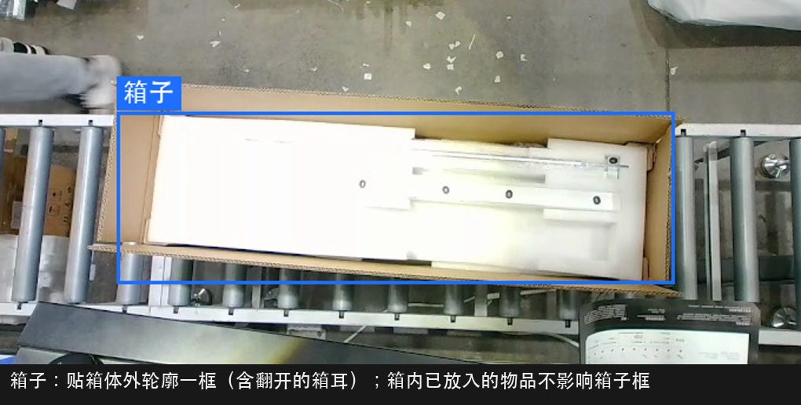

### id5 传动杆

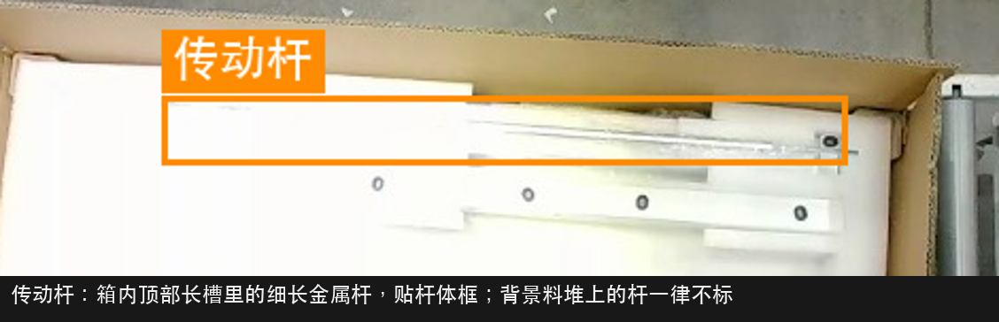

### id6 手套

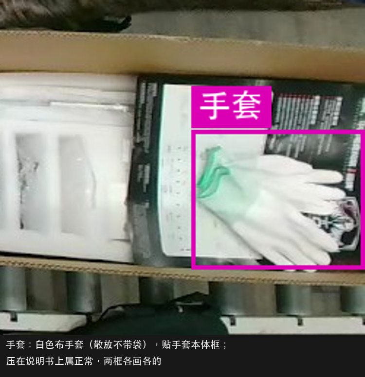

### id7 说明书

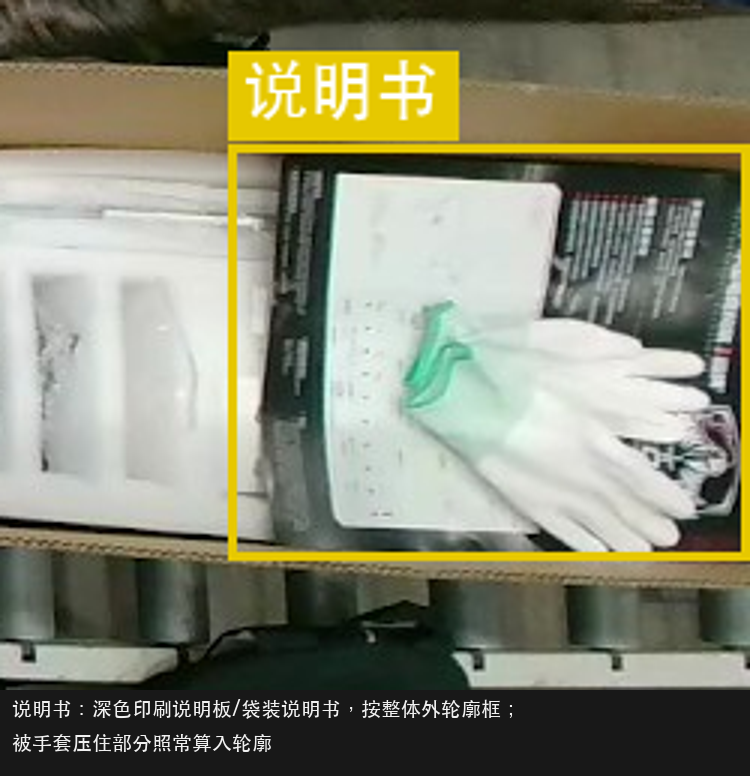

### id8 泡沫槽

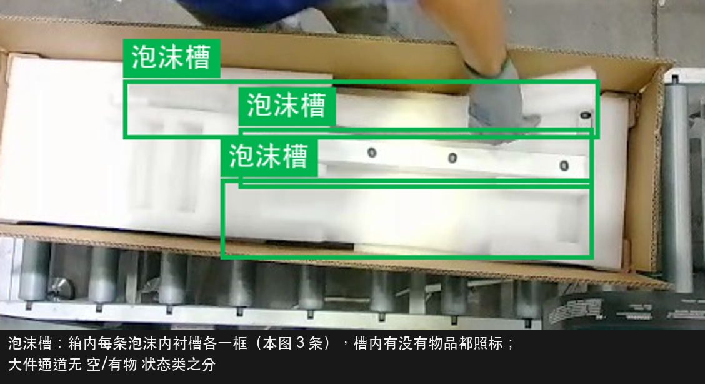

### ⚠️ 待裁定：四个白色结构件（线槽/侧板/大框架/小框架）与实物的对应

白上白+过曝素材里，这四类与画面部件的对应**需项目负责人按实物裁定后回填本节**，裁定前这四类**先不开标**（其余 5 类可先标）。当前视频里能辨认出的三个候选部件：

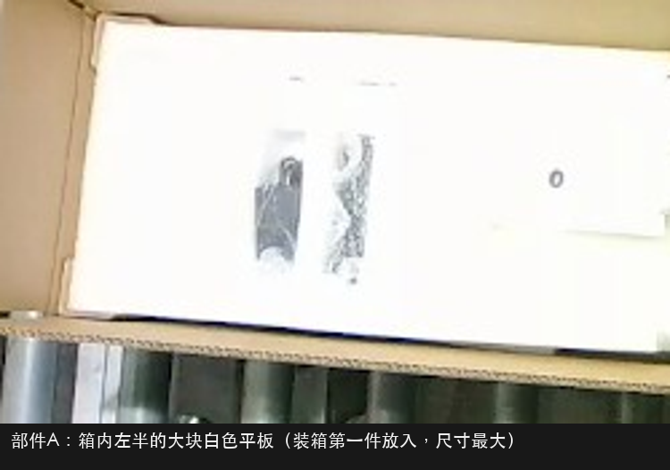

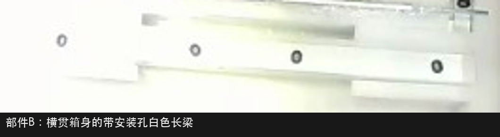

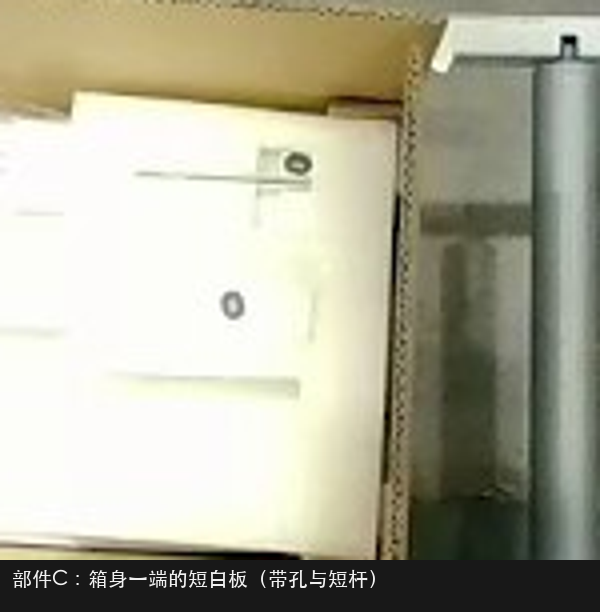

| 候选 | 画面特征 | 推测类别（待确认） |
|---|---|---|
| 部件A | 箱内左半的大块白色平板，装箱第一件放入、尺寸最大 | `侧板` |
| 部件B | 横贯箱身的带安装孔白色长梁 | `大框架` |
| 部件C | 箱身一端的短白板（带孔与短杆） | `小框架` |
| —— | `线槽` 在本段视频中未能辨认出 | 需现场确认放入时机/外观 |

## 五、整帧场景画法（六张标准答案）

### 进站帧 — std_g1

- 箱子 + 可见泡沫槽照标；背景备料区零框。

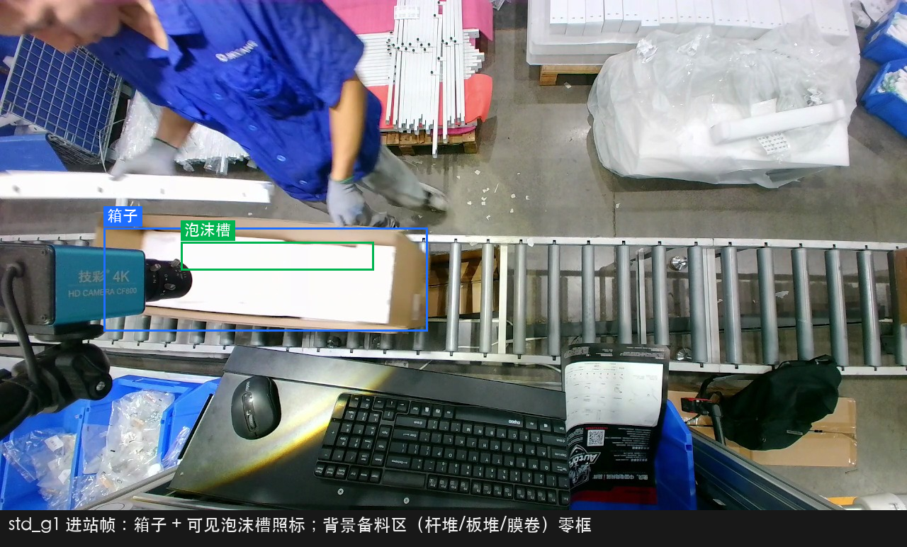

### 装箱中帧 — std_g2

- 已放定的部件逐帧照标；传动杆贴杆体框；灰色虚线两件为待裁定部件（第四节定名后按实线补标）。

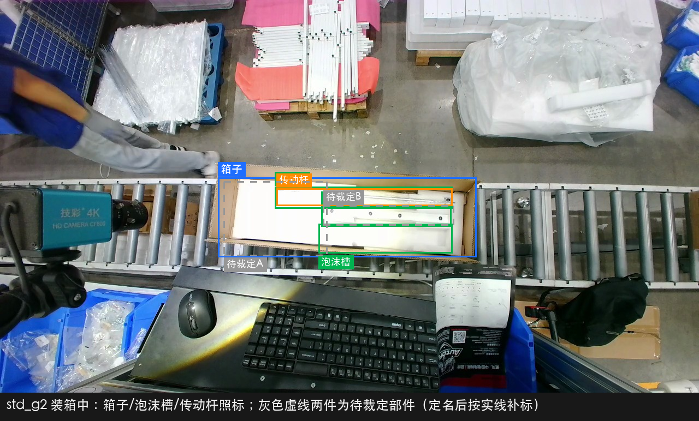

### 两箱同框帧 — std_g3（本通道最高频场景）

- **各标各的，互不合并**：两个 `箱子` 各一框，各自箱内的泡沫槽/部件各归各箱；
- 下游箱的收尾件（`手套`+`说明书`）照标，手套压在说明书上两框各画各的；
- 贴画面边缘的框画到边为止。

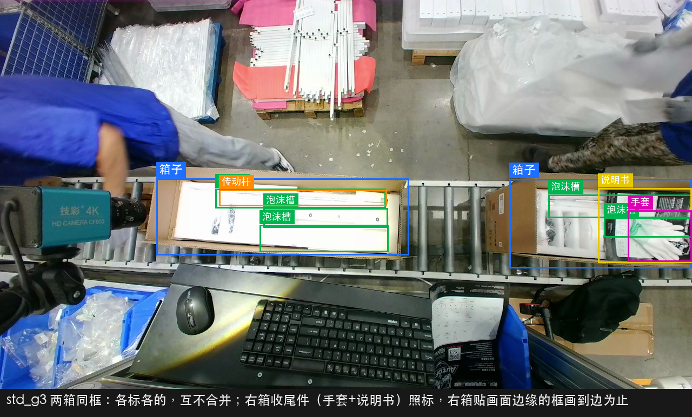

### 手入画帧 — std_g4（铁律一的主战场）

- 手/手臂零框，也不带入任何物品框；
- 正在被手大面积遮挡、认不清的部件该帧不标；可见 ≥ 一半按完整轮廓框。

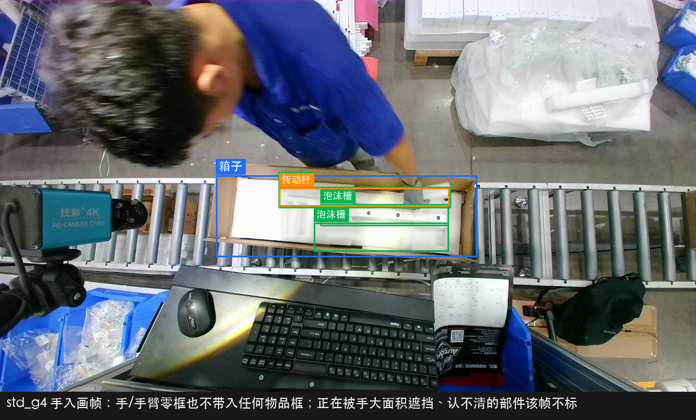

### 出画/进画临界帧 — std_g5

- 箱子滑动中：可见 ≥ 一半按可见部分框（框画到画面边）；可见 < 一半整箱（含箱内所有目标）不标；
- 本图右箱出画中照标、左箱刚进画约一半也照标。

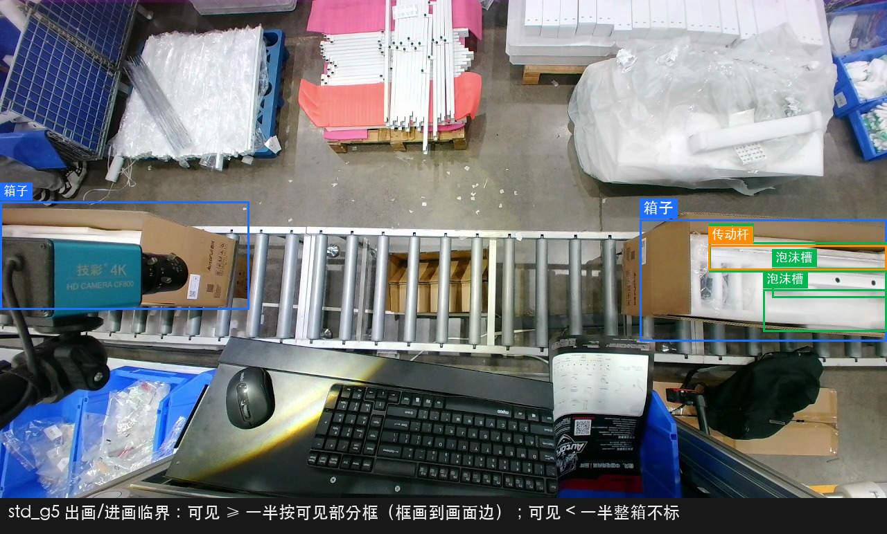

### 备料区负样本纪律 — std_g6（白款大件最大的坑）

- **背景备料堆里全是同类物件**（传动杆堆、白板堆、包材），误标一次伤全模型——红色虚线区域任何帧都不画框；
- 两箱之间的空线帧**整帧零标注照常交付**（空 txt 或无 txt，按工具默认），是重要负样本，不许从数据集里删掉。

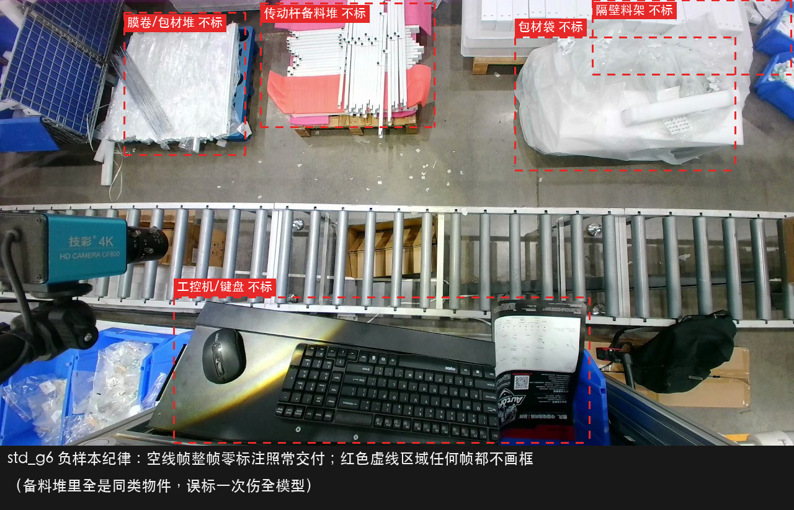

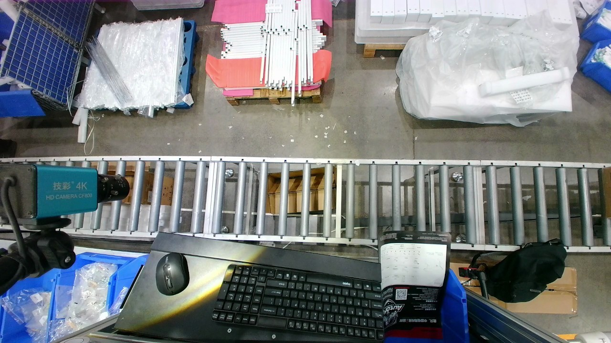

## 六、不标注清单（负样本纪律，同样重要）

以下内容**任何情况都不画框**——错标它们比漏标更伤模型：

1. **背景备料区**：传动杆备料堆（最高危！和箱内传动杆是同一种东西）、膜卷/白板/包材堆、隔壁料架（std_g6）；
2. **小件通道目标**：箱内可见的螺钉包/适配器/手控器/水杯架等小袋物——归二工位小件模型，进大件数据集就是污染；
3. **人体**：手、手臂不单独标，也不作为物品框的一部分带入（铁律一）；
4. **前景设备**：工控机、键盘、鼠标、扫码枪、台面杂物；
5. **可见 < 一半的出画箱**（整箱连内件全部不标）；
6. **已封箱**（箱耳合上后不再标内件，箱子本体在画内仍照标）。

## 七、时序边界速查（拿不准"这帧算不算"时查这里）

| 情形 | 处理 |
|---|---|
| 部件在手中移入画面 | 类别可辨 → 只框部件；辨不清 → 跳过 |
| 放置瞬间被手大面积挡住 | 可见 ≥ 一半按完整轮廓框；< 一半该目标此帧不标 |
| 部件放定、手已离开 | 从下一清晰帧起逐帧照标（数量大头） |
| 两箱同框 | 各标各的，互不合并；每箱内件归各自箱 |
| 箱子滑动中（进画/出画） | 可见 ≥ 一半按可见部分框到画面边；< 一半整箱不标 |
| 两箱之间的空线帧 | 整帧零标注，照常交付 |
| 手套压住说明书 | 两框各画各的，被压部分照常算入说明书轮廓 |
| 白上白看不清部件边界 | 按投影/接缝取边界，宁可略松不要抖；完全认不出跳过并截图反馈 |
| 待裁定四类（线槽/侧板/大框架/小框架） | 项目负责人定名前**不开标**，其余 5 类照标 |

## 八、数量与配重要求

白款大件是**从零补齐**——用黑款模型在白款素材上实测：`箱子`/`泡沫槽`/`传动杆`/`说明书`/`手套` 尚可迁移检出，**四个白色结构件（线槽/侧板/大框架/小框架）全线检不出**，是本批标注的绝对主力：

| 类别 | 下限 | 理由 |
|---|---|---|
| `侧板` / `大框架` / `小框架` | 各 **≥ 1500** | 黑款模型对白款件 0 检出 + 白上白过曝，全类最难 |
| `线槽` | **≥ 1200** | 同上，且放入时机短，抽帧要放置前后逐帧保留 |
| `传动杆` | **≥ 1000** | 细长目标+过曝，且背景有同类杆堆（负样本对照重要） |
| `手套` / `说明书` | 各 ≥ 800 | 收尾件出现窗口短，注意多箱覆盖 |
| `箱子` / `泡沫槽` | 各 ≥ 800 | 全程在画自然达标，照标不设上限 |

- 相邻帧近似重复也**逐帧都标**（用标注工具"复制上一帧标注"提效）；
- 覆盖要求：不同操作员、不同摆放顺序/角度、两箱同框场景必须充分覆盖；
- 本批只有晚班过曝素材；白天素材到位后按同规范补标混入，**若现场加装遮光/调曝光，机位素材要重新采集**。

## 九、质量验收

交付前自检，项目方按同样标准抽检 10%：

1. 类别错误率 = 0（重点：四个白色结构件裁定后不得互混；箱内传动杆 vs 背景杆堆不得错位）；
2. **备料区误标抽检**：随机抽帧查 std_g6 红区，出现任何框 = 不合格（白款大件最高危违例）；
3. **手/手臂入框抽检**：随机抽放置动作帧，框内成片手背/手臂 = 不合格（铁律一）；
4. **两箱同框抽检**：合并框 / 内件归错箱 = 不合格；
5. 框贴合度：边界与目标轮廓偏差 ≤ 目标尺寸 10%；同一静止目标相邻帧框抖动 ≤ 5%（铁律二，白上白场景重点抽）；
6. 空线负样本帧不得缺失；小件通道目标零误标。

---

**文档版本**：v1.0.1（2026-08-17）——勘误：`箱子` 只框箱口那圈，不含摊开的箱盖/箱耳（黑款现役模型实测口径，混训必须一致；v1.0 曾误写"含翻开箱耳"）。
**类别来源**：与黑款 classes.txt 完全一致（9 类，id 顺序同 `dajian4.23.pt`），黑白混训共用。
**示例来源**：全部截自 2026-08-13 白款现场实拍视频；`手套`/`说明书`/`传动杆`/`箱子`/`泡沫槽` 五类框位经黑款现役模型在白款素材上实测交叉验证。
**待项目负责人裁定（裁定前四类不开标）**：① 部件A/B/C 与 `侧板`/`大框架`/`小框架` 的对应关系（第四节表格为推测；可对照黑款规范 v1.1 第四节的同款黑色零件实拍图裁定）；② `线槽` 的实物外观与放入时机（本段视频未辨认出）；③ 本批视频机位与曝光是否为现场最终状态（白上白过曝若可通过调曝光改善，建议先调再采集主力素材）；④ 两箱同框/进出画的"作业箱"边界：黑款 v1.1 亲标口径为**只标作业位上那一箱**（排队箱/滑走箱整箱不标）——白款下游收尾箱是否算作业箱，待现场确认后本文第五节 std_g3/std_g5 同步修订。
