# 捷昌 B 站打包线 · 二工位大件模型 · 黑款产品图片标注规范

> **交付对象**：标注工程师
> **通道**：二工位大件（三通道流水线之一；一工位、二工位小件另有各自规范）
> **产品款别**：**黑款**（现役模型 `dajian4.23.pt`，本批为**增量补数据**，类别一个不加一个不减）
> **配套素材**：`标注规范assets_二工位大件_黑款/`（截自现场实拍视频 960×544@25fps）
> **有疑问**：拿不准的帧不要猜，截图集中反馈给项目负责人统一裁定

---

## 一、背景：这批标注是干什么用的（先读，影响画框方式）

黑款大件**已有现役模型在线上跑**——这批标注是给它**增量补数据**：新老数据会混在一起再训，所以**每一条画框口径都必须跟现役模型保持一致**（尤其箱子只框泡沫内衬那圈、只标作业箱，见第四节亲标口径）。框大了框小了，新旧数据互相打架，模型不升反降。

工位场景：俯拍相机对着滚筒输送线，长条包装箱滑进画面 → 操作员把大件（框架/板件/传动杆等）逐件放进白色泡沫槽 → 收尾放手套+说明书 → 箱子滑走，下一箱进来。**画面里经常同时有两个箱**（作业中 + 右缘排队进站），这是常态。

软件跑的是**跟踪模式 + 齐件即结算**，两个判定机制直接吃标注质量：

1. **框中心点落区判定**——物品算不算"放进来了"，看检测框**中心点**是否落在检测区域内；
2. **稳定帧数判定**——目标要**连续若干帧稳定检出**才计数，检出忽有忽无 = 永远凑不齐 = 整箱误判。

由此产生本规范最重要的两条铁律（三通道通用）：

> ⚠️ **铁律一：框只贴目标本体，不框手、不框手臂。**
> 放置过程手会把框中心拽偏；框里带手还会让模型学到"物品=物品+手"，物品放定手离开后反而检不出。手指少量遮挡边缘可带入，**成片的手背/手臂绝不入框**。
>
> ⚠️ **铁律二：同一目标相邻帧的框要稳，宁可略松不要抖。**
> 边界忽紧忽松训出来的模型框会抖，直接冲击"稳定 N 帧"判定。贴合外轮廓、误差按验收标准控制即可，不追求逐帧像素级精抠。

## 二、素材与交付

| 项 | 内容 |
|---|---|
| 素材来源 | 本工位现场相机实拍（约 4 分钟，960×544@25fps；后续批次继续补） |
| 抽帧密度 | 每 3 帧 1 张起步，放置动作前后 2 秒逐帧保留 |
| 标注工具 | labelImg / X-AnyLabeling 等任意支持 YOLO 格式的工具 |
| 交付格式 | YOLO 目标检测格式：`images/` + `labels/`（每图一个同名 txt）+ `classes.txt`（顺序必须与第三节 id 一致，一个不加一个不减） |
| 框类型 | 全部为水平矩形框（bbox），无多边形、无关键点 |
| 独立性 | 本数据集只属于大件通道模型，**不得与一工位/小件通道素材混标混训** |

## 三、作业版图（先认清楚画面里什么归大件通道）

俯拍画面从上到下分四层：

- **上层背景（备料区）**：木托盘、粉白色料架、膜卷/包材、**白色传动杆备料堆**——**全部不标**，一帧都不标（第六节）；
- **中层滚筒线**：作业主体。箱子在线上串行流动，两箱同框是常态，按第五节 std_h3 的"过半才标"规则处理；
- **箱内**：大件通道的主战场——泡沫内衬那圈（`箱子`）、内衬里的每条槽（`泡沫槽`）、放入的各结构件、收尾的 `手套`+`说明书`；
- **下层前景**：工控机/键盘/鼠标/相机支架——不标。

**箱内还会看到小件通道的东西**（螺钉包、适配器等小袋物）：那些是**二工位小件模型**的目标，**在大件数据集里一个框都不画**。

## 四、类别定义与逐类示例（9 类，id 顺序与现役 classes.txt 完全一致）

| id | 类别名 | 黑款长相 | 备注 |
|----|--------|---------|------|
| 0 | `箱子` | **只框泡沫内衬那圈**（箱体内腔外沿）——纸箱箱壁、端部翻耳、摊开的大箱盖全部不入框 | 锚点类，项目负责人亲标口径；且**只标作业位上那一箱**（见 std_h3） |
| 1 | `线槽` | 最宽的黑色长板，端部有白色箭头丝印，放下排槽 | 四长条件之一，先看 cmp 对照图 |
| 2 | `侧板` | 窄长黑条，板面一排圆孔，放中排槽 | 四长条件之一 |
| 3 | `大框架` | 两根平行长梁+连接件的整体框架，整件一框 | 四长条件之一，**不拆成两根梁分别框** |
| 4 | `小框架` | 缠透明膜的细长条（膜面反光发亮），放上排槽 | 四长条件之一，⚠️ 现役模型最弱类 |
| 5 | `传动杆` | 白色长杆（常带泡沫护套），放上排槽 | ⚠️ 背景备料堆有同款白杆，一根都不标 |
| 6 | `手套` | 白色布手套，收尾时散放在说明书上 | 与说明书叠放时各画各的 |
| 7 | `说明书` | 印刷袋装说明书，收尾放入 | 被手套压住按完整轮廓框 |
| 8 | `泡沫槽` | 箱内每条泡沫槽各一框，空槽有物都标 | 无 空/有物 之分，槽内有件时与零件框叠标 |

### ⚠️ 必读：四个黑色长条件对照（最容易互混）

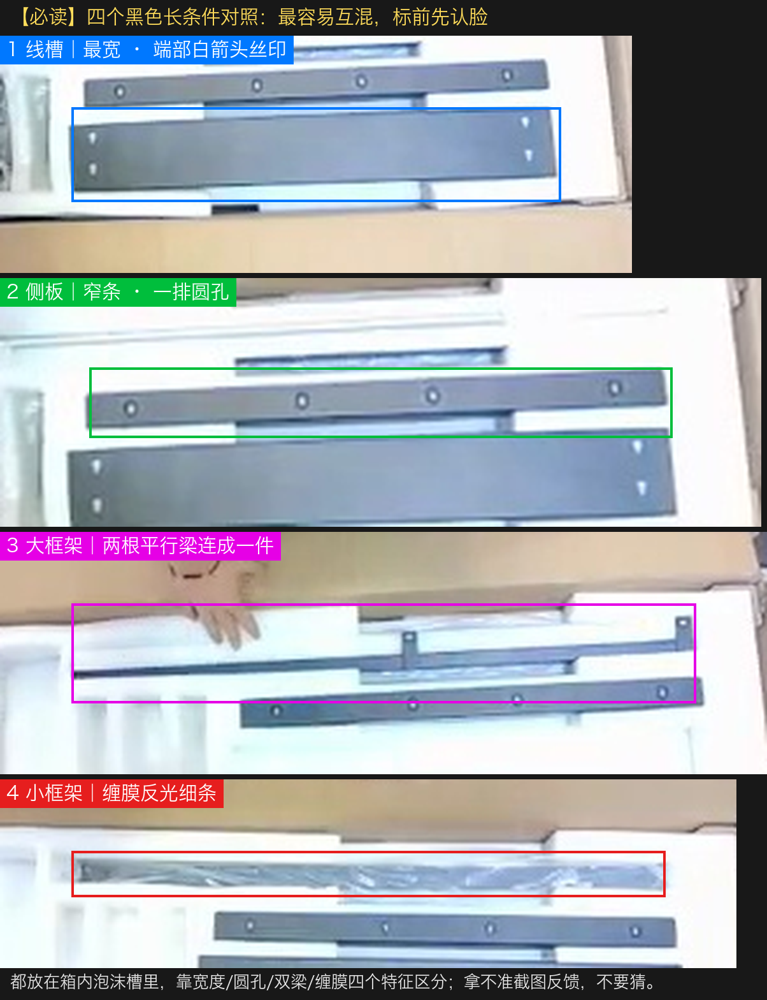

### id0 箱子

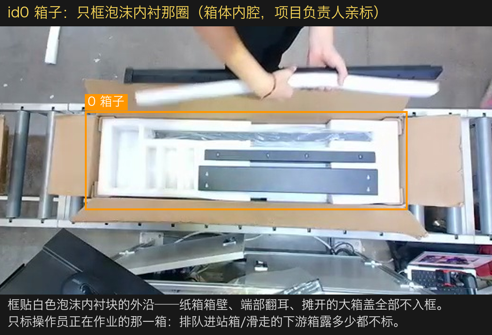

### id1 线槽

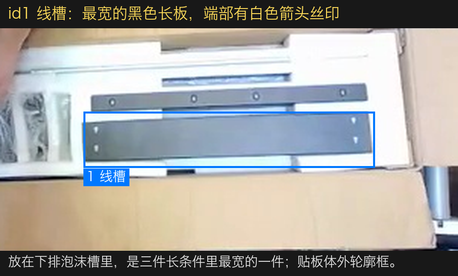

### id2 侧板

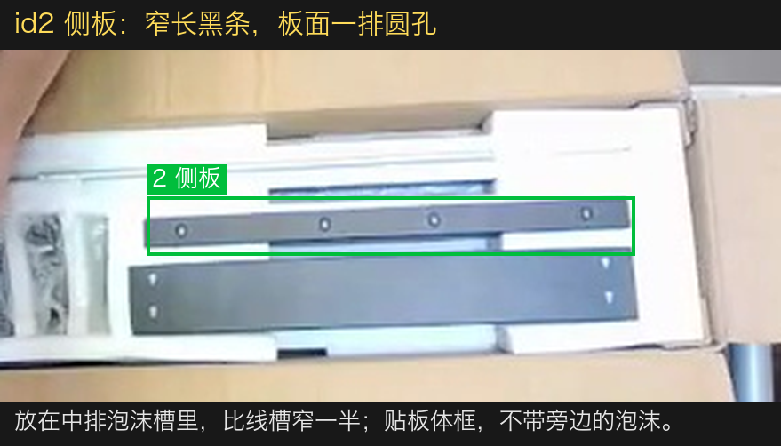

### id3 大框架

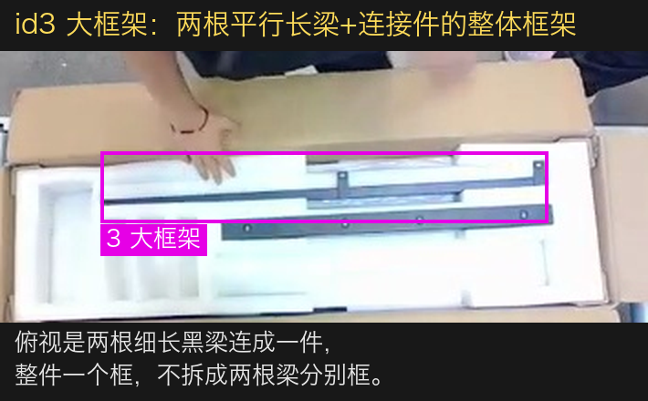

### id4 小框架

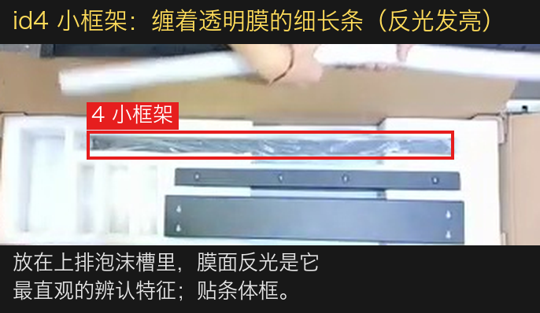

### id5 传动杆

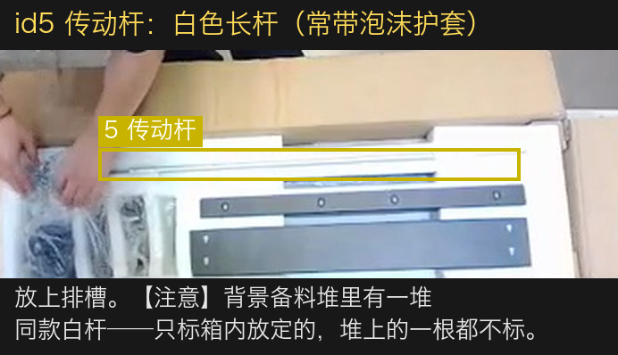

### id6 手套

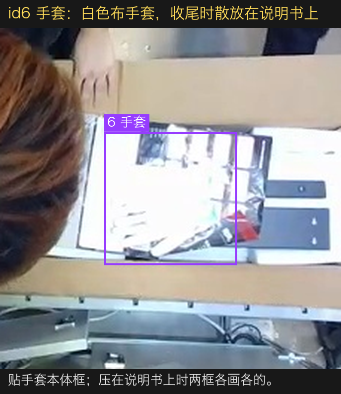

### id7 说明书

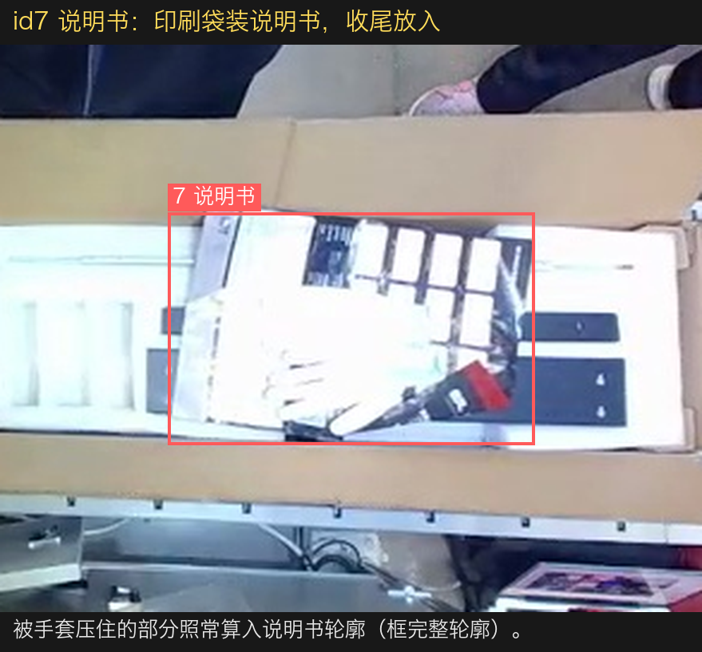

### id8 泡沫槽

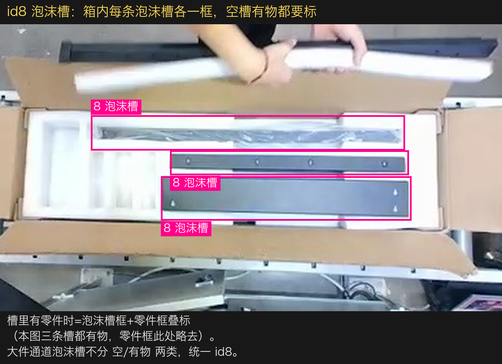

## 五、整帧场景画法（五张标准答案）

### 进站帧 — std_h1

- 新箱进作业位：箱子（框贴泡沫内衬外沿）+ 可见泡沫槽照标；
- 操作员手臂横在箱上——手/手臂不入任何框，被挡住可见不足一半的槽该帧不标；
- 右缘排队箱：不是作业箱，露多少都不标，连内件一起不标。

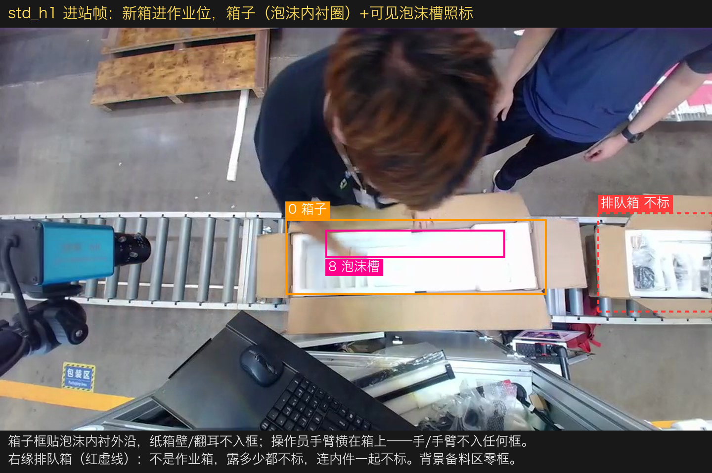

### 装箱中帧 — std_h2（数量大头）

- 放定的件逐件框：每条泡沫槽一框，槽内零件再叠一框（叠标是本通道常态，别怕框重叠）；
- 手持移动中的物件不标，放定手离开后从下一清晰帧开始标。

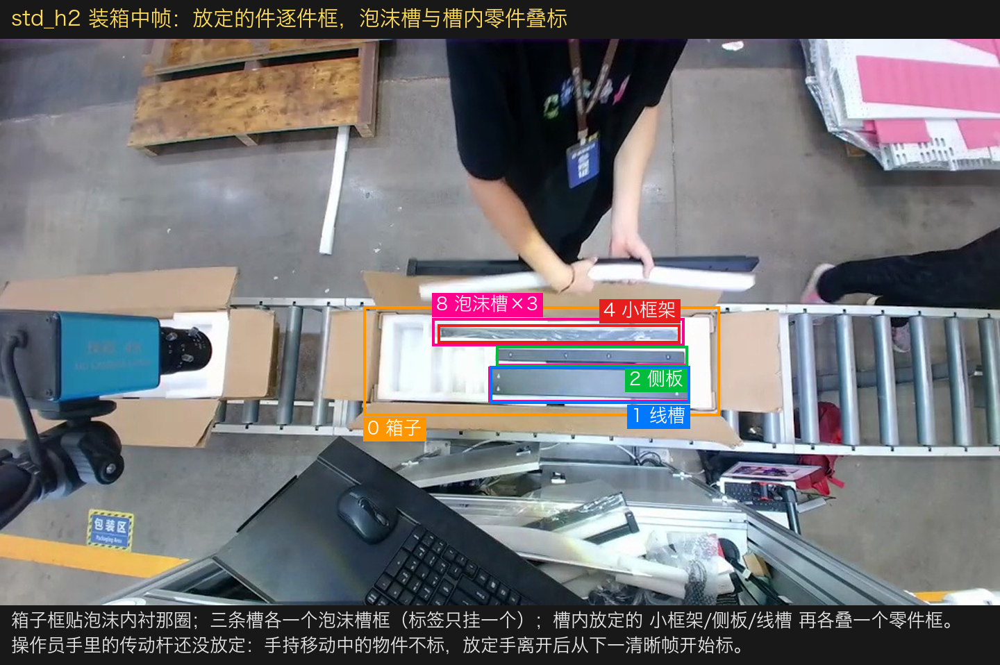

### 两箱同框帧 — std_h3（亲标裁定）

- **只标操作员正在作业的那一箱**：箱子框（泡沫内衬圈）+ 三槽泡沫槽框 + 零件框；
- 右缘排队进站箱：**露多少都不标**——箱子、泡沫槽、内件一个框都不画；
- 左缘已滑走的下游箱同理（见 std_h4）。

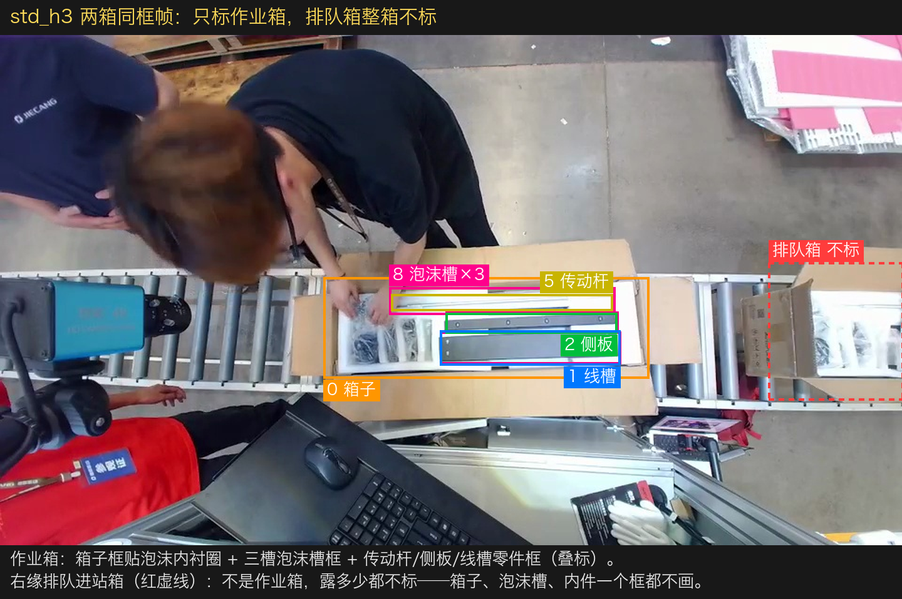

### 收尾帧 — std_h4（铁律一的主战场）

- 手套压在说明书上：两框各画各的，被压住的说明书按完整轮廓框；
- 手/手臂零框；
- 左缘下游箱：已滑离作业位，露多少都不标，连内件一起不标。

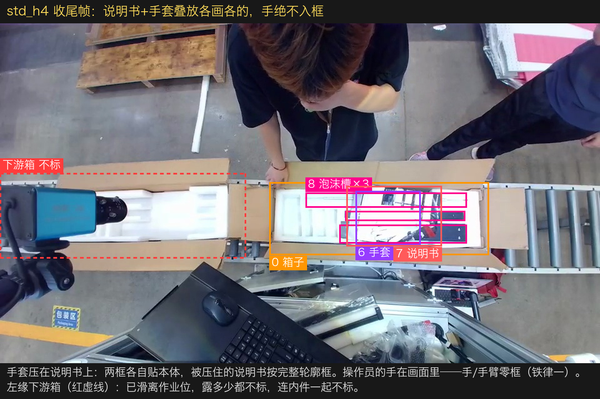

### 空线负样本帧 — std_h5

- 两箱之间的空线帧**整帧零标注照常交付**（空 txt 或无 txt，按工具默认），是重要负样本，不许从数据集里删掉；
- 右缘刚冒头的排队箱照旧不标；
- 地面杂物/背景备料区/前景设备任何帧都不标。

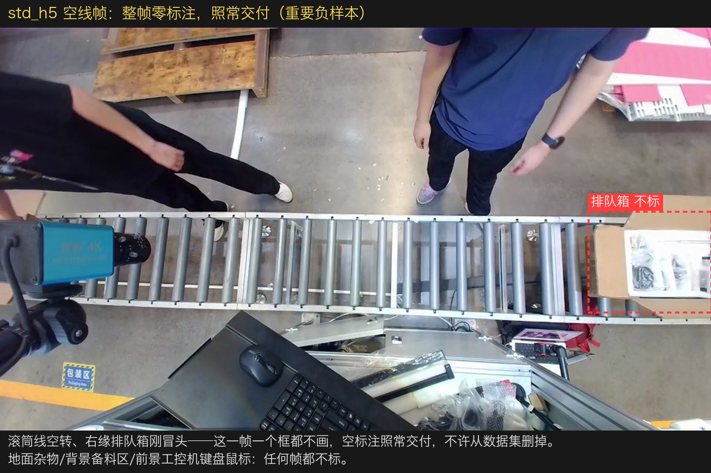

## 六、不标注清单（负样本纪律，同样重要）

以下内容**任何情况都不画框**——错标它们比漏标更伤模型：

1. **背景备料区**：白色传动杆备料堆（最高危！和箱内传动杆是同一种东西）、木托盘、粉白料架、膜卷/包材；
2. **小件通道目标**：箱内可见的螺钉包/适配器等小袋物——归二工位小件模型，进大件数据集就是污染；
3. **人体**：手、手臂不单独标，也不作为物品框的一部分带入（铁律一）；
4. **前景设备**：工控机、键盘、鼠标、相机支架、台面杂物；
5. **非作业箱**：右缘排队进站箱、左缘滑走的下游箱——露多少都不标，箱子/泡沫槽/内件一个框都不画（亲标裁定）；
6. **纸箱箱壁、端部翻耳、摊开的大箱盖**（箱子只框泡沫内衬那圈）；
7. **已封箱**（箱盖合上后不再标内件，泡沫内衬认不出时箱子也不标）。

## 七、时序边界速查（拿不准"这帧算不算"时查这里）

| 情形 | 处理 |
|---|---|
| 部件在手中移入画面 | 手持移动中不标；放定手离开后从下一清晰帧起标 |
| 放置瞬间被手大面积挡住 | 可见 ≥ 一半按完整轮廓框；< 一半该目标此帧不标 |
| 部件放定、手已离开 | 逐帧照标（数量大头） |
| 泡沫槽里有零件 | 泡沫槽框 + 零件框叠标，两个都要 |
| 两箱同框 | 只标作业箱；排队箱/下游箱露多少都不标（连内件） |
| 作业箱滑动中（进画/出画） | 进入作业位、泡沫内衬认得出时开始标；滑离作业位后整箱停标 |
| 两箱之间的空线帧 | 整帧零标注，照常交付 |
| 手套压住说明书 | 两框各画各的，被压部分照常算入说明书轮廓 |
| 四长条件认不出是哪类 | 对照 cmp 图四特征（宽度/圆孔/双梁/缠膜）；仍拿不准截图反馈，不要猜 |

## 八、数量与配重要求

本批是**增量补数据**——用现役模型在本段素材上实测（119 帧全帧推理）找短板：`泡沫槽`/`箱子`/`侧板` 检出稳定；`线槽` 置信度常年偏低（0.4~0.67 居多）；`小框架` 119 帧只检出 3 次，是全模型最弱类；`手套`/`说明书`/`大框架` 出现窗口短、样本量先天不足。配重如下：

| 类别 | 下限 | 理由 |
|---|---|---|
| `小框架` | **≥ 1200** | 现役模型最弱类（119 帧仅 3 检出），缠膜反光形态多变，绝对主力 |
| `线槽` | **≥ 1000** | 检得出但置信度低，压在下排槽常被上层零件半遮挡，重点补遮挡态 |
| `大框架` | **≥ 800** | 出现窗口短；双梁整体框的口径要靠数据夯实 |
| `手套` / `说明书` | 各 ≥ 600 | 收尾件出现窗口短，注意多箱覆盖；叠放态重点补 |
| `传动杆` | ≥ 600 | 白杆过曝+细长；背景备料堆同款杆的负样本对照重要 |
| `侧板` / `箱子` / `泡沫槽` | 各 ≥ 600 | 现役已稳，照标巩固，不设上限 |

- 相邻帧近似重复也**逐帧都标**（用标注工具"复制上一帧标注"提效）；
- 覆盖要求：不同操作员、不同产品型号（同一条线混产多款，三条槽里装的组合会变）、人体半遮挡箱体的帧必须充分覆盖；
- 箱子被操作员大面积压住、泡沫内衬认不出的帧：`箱子` 不标（与一工位口径一致）。

## 九、质量验收

交付前自检，项目方按同样标准抽检 10%：

1. 类别错误率 = 0（重点：四个长条件不得互混；箱内传动杆 vs 背景杆堆不得错位）；
2. **箱子口径抽检**：随机抽帧查 `箱子` 框，框到纸箱壁/翻耳/箱盖 = 不合格；排队箱/下游箱出现任何框 = 不合格（亲标口径）；
3. **备料区误标抽检**：随机抽帧查背景备料区，出现任何框 = 不合格；
4. **手/手臂入框抽检**：随机抽放置动作帧，框内成片手背/手臂 = 不合格（铁律一）；
5. **叠标完整性抽检**：槽内有零件的帧，泡沫槽框和零件框缺一个 = 不合格；
6. 框贴合度：边界与目标轮廓偏差 ≤ 目标尺寸 10%；同一静止目标相邻帧框抖动 ≤ 5%（铁律二）；
7. 空线负样本帧不得缺失；小件通道目标零误标。

---

**文档版本**：v1.1（2026-08-17）——`箱子` 类口径经项目负责人亲标 6 帧裁定：只框泡沫内衬那圈（箱体内腔），纸箱壁/翻耳/箱盖不入框；且只标作业位上那一箱，排队箱/下游箱整箱不标。
**类别来源**：现役黑款大件模型 `dajian4.23.pt` 的 9 类，id 顺序不得改动。
**示例来源**：全部截自黑款现场实拍视频；`箱子` 框位为项目负责人亲标，其余类框位经现役模型实测交叉验证。
**与白款规范的关系**：白款（`标注规范_捷昌B站_二工位大件_白款.md`）与本规范共用同一套 9 类混训。白款视频过曝导致四个长条件"待裁定"——本规范第四节的黑款实拍对照图可作为白款裁定的参照（同一零件的白色款式）。
