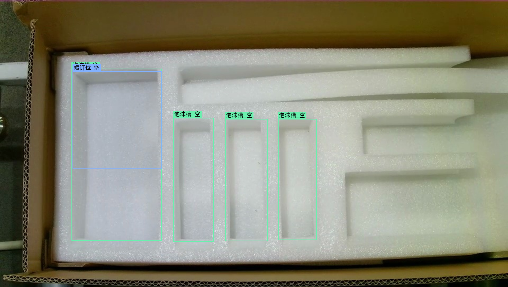
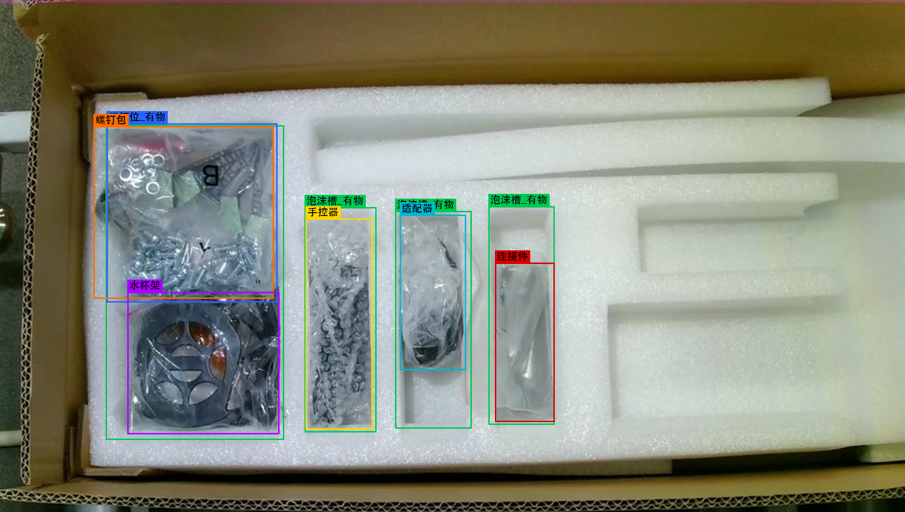
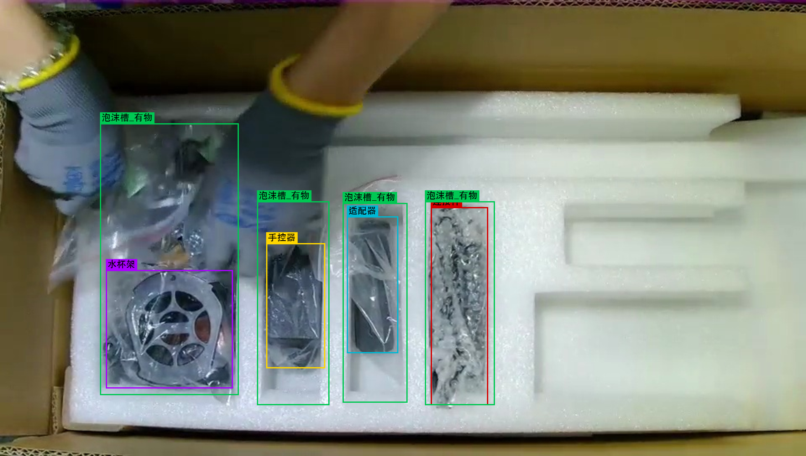
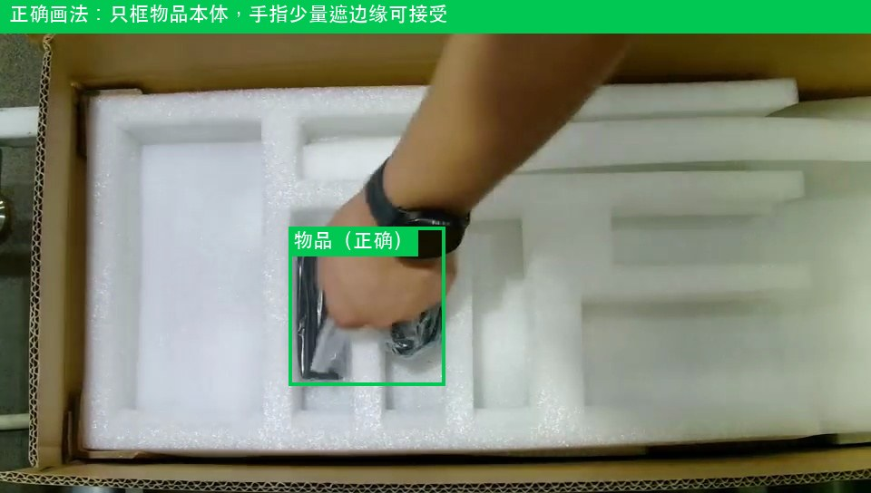
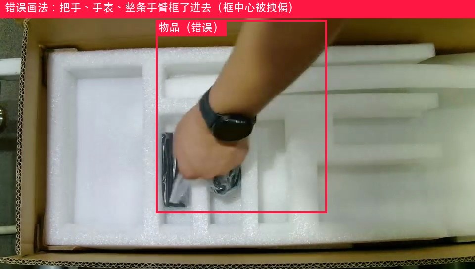
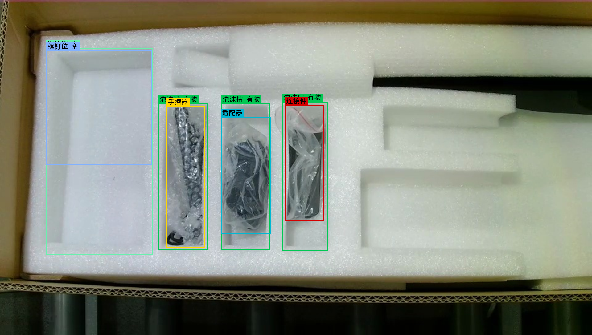
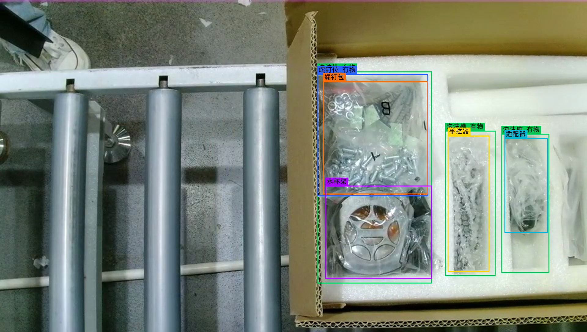
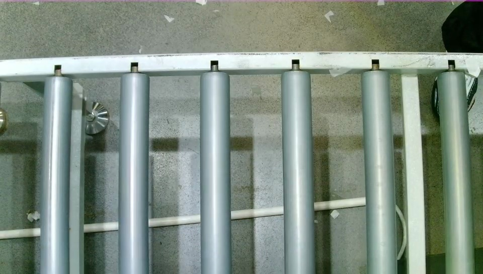
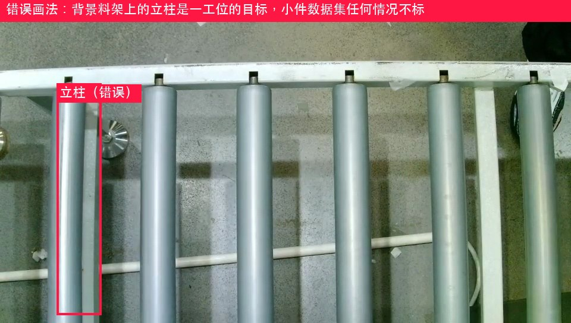

# 捷昌 B 站打包线 · 二工位小件模型 · 图片标注规范

> **交付对象**：标注工程师
> **通道**：二工位小件（三通道流水线之一；一工位、二工位大件另有各自规范）
> **配套素材**：`标注规范assets_二工位小件/`（本文所有示例图，均截自现场实拍视频 960×544@29fps）
> **有疑问**：拿不准的帧不要猜，截图集中反馈给项目负责人统一裁定

---

## 一、背景：这批标注是干什么用的（先读，影响画框方式）

工位场景：俯拍相机对着滚筒输送线，包装箱滑进画面 → 操作员把小件逐格放进白色泡沫槽 → 满箱滑走 → 下一个空箱进来。产品分黑、白两款，**现役模型只认黑款**；在现场实拍素材上验证发现螺钉包完全检不出、螺钉位满着却报"空"、水杯架检出闪烁——这批标注就是为补齐这些窟窿重训模型。

软件跑的是**跟踪模式 + 齐件即结算**：模型认出每样物品和每个槽位状态，软件数"该到的东西是否都稳定出现"，凑齐并稳定若干帧当场判合格。两个判定机制直接吃标注质量：

1. **框中心点落区判定**——物品算不算"放进来了"，看检测框**中心点**是否落在检测区域内；
2. **稳定帧数判定**——目标要**连续若干帧稳定检出**才计数，检出忽有忽无 = 永远凑不齐 = 整箱误判。

由此产生本规范最重要的两条铁律：

> ⚠️ **铁律一：框只贴目标本体，不框手、不框手臂。**
> 放置过程手会把框中心拽偏；框里带手还会让模型学到"物品=物品+手"，物品放定手离开后反而检不出。手指少量遮挡边缘可带入，**成片的手背/手臂绝不入框**（见 ex3）。
>
> ⚠️ **铁律二：同一目标相邻帧的框要稳，宁可略松不要抖。**
> 边界忽紧忽松训出来的模型框会抖，直接冲击"稳定 N 帧"判定。贴合外轮廓、误差按验收标准控制即可，不追求逐帧像素级精抠。

## 二、素材与交付

| 项 | 内容 |
|---|---|
| 素材来源 | 本工位现场相机实拍抽帧（**必须现场最终机位**，机位变动要通知项目负责人） |
| 首段视频 | 133.7 秒 @ 29fps，覆盖两个完整装箱周期；抽帧密度每 3 帧 1 张起步，放置动作前后 2 秒逐帧保留 |
| 产品款别 | 本批素材款别以项目负责人交付说明为准（黑/白两款外观不同，**标注类别相同**，见第三节） |
| 标注工具 | labelImg / X-AnyLabeling 等任意支持 YOLO 格式的工具 |
| 交付格式 | YOLO 目标检测格式：`images/` + `labels/`（每图一个同名 txt）+ `classes.txt`（顺序必须与第三节 id 一致，一个不加一个不减） |
| 框类型 | 全部为水平矩形框（bbox），无多边形、无关键点 |
| 独立性 | 本数据集只属于小件通道模型，**不得与一工位/大件通道素材混标混训** |

## 三、类别定义（9 类，id 顺序与现役模型 `best7.8xiaojian.pt` 完全一致）

| id | 类别名 | 一句话定义 | 备注 |
|----|--------|-----------|------|
| 0 | `连接件` | 连接件（连袋框） | ⚠️ 现役模型弱类，重点补样 |
| 1 | `适配器` | 电源适配器（连袋框） | — |
| 2 | `手控器` | 手控器（连袋框） | — |
| 3 | `水杯架` | 水杯架（连袋框） | ⚠️ 现役模型检出闪烁，重点补样 |
| 4 | `螺钉包` | 螺钉/五金小包（含 B 字样标签袋等） | ⚠️ 现役模型完全检不出，头号补样对象 |
| 5 | `泡沫槽_空` | 还没放东西的泡沫槽格 | 状态类，标槽位本身 |
| 6 | `泡沫槽_有物` | 已放入物品的泡沫槽格 | 状态类，标槽位本身 |
| 7 | `螺钉位_空` | 还没放螺钉包的螺钉位 | 状态类，标槽位本身 |
| 8 | `螺钉位_有物` | 已放入螺钉包的螺钉位 | ⚠️ 现役模型会把满位判成空，重点补样 |

**槽位版图（先认清楚箱内格局，再谈画框）**：

小件区只占泡沫内衬的**左半边**，共 **4 个槽位**：

- **左侧大格**：一整格算**一个**泡沫槽（上半区是螺钉位、下半区放水杯架，但泡沫槽框只画一个罩住整格）；螺钉位是这格内部的**子区域**，用 `螺钉位_空/_有物` 单独叠标在上半区；
- **三条窄槽**：各自独立一格，逐格框，绝不合并；
- **右半区的所有凹槽属于二工位大件通道**——不管空满、任何情况**一个框都不画**（见第五节不标注清单）。

**类别设计的四个关键点（标注时必须理解）**：

1. **物品类（0~4）连物带袋一起框**——现场就是带包装袋放入的，模型必须认带袋状态；裸件出现也标同一类。
2. **状态类（5~8）标的是槽位本身**：槽框贴**槽腔轮廓画满整槽**——哪怕物品只占槽的一半，`泡沫槽_有物` 也要框整条槽，不跟着物品缩水。
3. **物品框紧贴物品本体，可以比槽框小**：适配器只占槽的上半段，就只框上半段；不许为了和槽框对齐把物品框拉大。即"满槽帧"= 状态框（整槽）+ 物品框（贴物）两个框叠着，这是对的（见 std1 亲标示范）。
4. **状态互斥**：同一个槽/位每帧只能标 `_空`/`_有物` 其中一个；**正在放入的过渡帧**（物品一半在槽里、手还没离开）两个状态类**都不标**，只标物品本身。物品放定手离开后，从下一个清晰帧起标 `_有物`。

> ✅ 两个此前待裁定问题已由项目负责人**亲标裁定**（见 std 系列示范图）：
> ① **黑色圆盘带橙色中心的件 = `水杯架`**；
> ② **珠链状透明包（内为盘绕线缆）= `手控器`**——那是手控器的螺旋线，不是独立类别。

## 四、每类怎么画框（对照示例图）

> 🏅 **std1~std5 五张为项目负责人亲标后渲染的标准答案**，与本节文字冲突时以图为准，再反馈修订文字。

### 空箱基准帧 — 亲标示范 std2

- 空箱滑入定位后：**4 个框**——左侧大格 1 个 `泡沫槽_空` 罩整格 + 其上半区叠 1 个 `螺钉位_空`，三条窄槽各 1 个 `泡沫槽_空`；
- 三条窄槽逐格分别框，不合并；左侧大格**不许**拆成两格（它是一个槽，螺钉位是叠标的子区域）；
- 右半区大件通道的凹槽全部无视。

### 满箱帧 — 亲标示范 std1

- 每格状态按实际标：左侧大格 `泡沫槽_有物` 罩整格，上半区叠 `螺钉位_有物`，三条窄槽各标 `泡沫槽_有物`；
- 格内物品逐个另标：`螺钉包`（贴袋子，与螺钉位框基本重合是正常的）、`水杯架`（下半区）、三条窄槽内的 `连接件`/`适配器`/`手控器` 贴物画框——**注意 std1 里适配器只占槽上半段，物品框就只框上半段**；
- 同类物品多个（如多袋螺钉包）**各画各的框**，绝不合并；
- ⚠️ 窄槽里装哪样物品**不固定**（不同箱次连接件/适配器/手控器的槽位会互换），按当前帧实物认类，不按槽位位置背答案。

### 手入画帧 — 亲标示范 std4 / 正误对照 ex7、ex7b（铁律一的主战场）

- 手/手臂在画内但**没有正在往槽里放东西**：其余槽位照标（std4：手在左上方，三条窄槽和水杯架照标不误）；
- **被手或手持物遮挡、状态看不清的子区域直接不标**——std4 里螺钉位被手里的袋子挡住，`螺钉位_*` 和 `螺钉包` 都没标，这是标准答案，不要猜状态；
- 手持物品入画：物品类别清晰可辨 → 只框物品不框手（ex7 正确、ex7b 错误，**务必对照看**）；辨不清 → 跳过该帧；
- 正在放入的那格：状态类不标（第三节关键点 4），只标物品。

### 放置中途帧 — 亲标示范 std3

- 已放定的格标 `_有物` + 物品；未放的格照标 `_空`（std3：三条窄槽已放好照标有物+物品，左侧大格还空着就标 `泡沫槽_空`+`螺钉位_空`）；
- 每一帧都是"状态混合"的：严格按**当前帧实际状态**逐格标，不参考前后帧脑补。

### 满箱滑出/空档帧 — 亲标示范 std5 / 负样本 ex4

- 箱子滑出画面：**可见的槽照标、已出画的槽不标**（std5：连接件槽已出画就没标，其余照标）；整箱可见 < 一半时全部不标；
- 两箱之间只剩滚筒和背景的空档帧（ex4）：**整帧零标注**，这是重要的负样本，照常交付（空 txt 或无 txt，按工具默认）；
- ⚠️ ex4 背景里的**银灰色立柱料架**是隔壁工序的产品，任何情况不标——它们是一工位模型的目标，进了小件数据集就是污染。

## 五、不标注清单（负样本纪律，同样重要）

以下内容**任何情况都不画框**——错标它们比漏标更伤模型：

1. **右半区大件通道的所有凹槽**——那是二工位大件模型的地盘，空的满的都不标（std1/std2/std5 里右半区全程零框，照此执行）；
2. **背景立柱/料架/隔壁工位物料**（ex4，最高频的坑）；
3. **人体**：手、手臂不单独标，也不作为物品框的一部分带入（铁律一）；
4. **滚筒输送线本体**、台面、地面杂物、脚；
5. **已滑出作业区的箱子**（可见 < 一半时）；
6. **箱体纸箱本身**——注意小件模型类别表里**没有"箱子"类**，纸箱不标（状态类只标泡沫槽格）。

## 六、时序边界速查（拿不准"这帧算不算"时查这里）

| 情形 | 处理 |
|---|---|
| 物品在手中移入画面 | 类别可辨 → 只框物品；辨不清 → 跳过 |
| 正在放入某格的过渡帧 | 该格两个状态类都不标，只标物品 |
| 物品放定、手已离开 | 从下一清晰帧起：格标 `_有物`，物品另标 |
| 槽位/子区域被手或手持物挡住看不清 | 该槽此帧不标（std4 的螺钉位就是这么处理的），不猜状态 |
| 箱子滑动中（进入/离开） | 可见的槽照标、出画的槽不标（std5）；整箱可见 < 一半全部不标 |
| 两箱之间的空线帧 | 整帧零标注，照常交付 |
| 小件区仍空着的格 | 照标 `_空`，不脑补（右半区大件槽除外——永远不标） |
| 运动模糊 | 类别可辨照标；肉眼认不出跳过 |
| 完全认不出/严重遮挡 | 跳过，宁缺毋滥，截图反馈 |

## 七、数量与配重要求（按现役模型弱点定向加码）

各类目标框数下限（**不是平均主义**，弱类必须超额）：

| 类别 | 下限 | 理由 |
|---|---|---|
| `螺钉包` | **≥ 1500** | 现役模型 0 检出，头号补样对象；多袋各框，样本自然多 |
| `螺钉位_有物` | **≥ 1000** | 现役模型把满位判成空（判定性错误） |
| `水杯架` | **≥ 1200** | 现役模型检出闪烁（40 帧抽样仅 4 检出） |
| `连接件` | **≥ 1000** | 现役模型置信度贴地（0.5 附近） |
| `泡沫槽_空` / `泡沫槽_有物` / `螺钉位_空` | 各 ≥ 800 | 全程在画，自然达标，照标不设上限 |
| `适配器` / `手控器` | 各 ≥ 800 | 现役表现尚可，维持覆盖 |

- 相邻帧近似重复也**逐帧都标**（用标注工具"复制上一帧标注"提效）；
- 覆盖要求：不同班次光照、不同操作员、戴手套/徒手、物品不同摆放角度；同一箱重录多遍不如多录几箱；
- 黑白两款素材都要进集（比例按项目负责人的训练方案定），**共用同一套 9 类，不按款拆类**。

## 八、质量验收

交付前自检，项目方按同样标准抽检 10%：

1. 类别错误率 = 0（重点：珠链状透明包=手控器、橙心圆盘件=水杯架，按第三节裁定归类，不得自行猜类；窄槽物品逐帧认实物，不按槽位背答案）；
2. **状态互斥抽检**：同一槽位同帧出现 `_空`+`_有物` 双标 = 不合格；过渡帧带状态标 = 不合格；
3. **手/手臂入框抽检**：随机抽放置动作帧，框内成片手背/手臂 = 不合格（铁律一）；
4. 不标注清单（第五节）零违例，重点查背景立柱误标；
5. 框贴合度：边界与目标轮廓偏差 ≤ 目标尺寸 10%；同一静止目标相邻帧框抖动 ≤ 5%（铁律二）；
6. 空线负样本帧不得缺失（不许把"没东西的帧"从数据集里删掉）。

---

**文档版本**：v1.1（2026-08-17）— 正确示范全部替换为项目负责人在 labelImg 亲标后的渲染图（std1~std5），并据此修订：左侧大格=单槽+螺钉位叠标、物品框贴物可小于槽框、右半区大件通道槽位一律不标、两项类别裁定回填。
**类别来源**：9 类直接读自现役模型 `best7.8xiaojian.pt`，id 顺序一致，便于增量重训。
**配重依据**：现役黑款模型在本工位实拍视频 40 帧抽样推理实测（螺钉包 0 检出 / 螺钉位满判空 / 水杯架 4 检出 / 连接件 conf≈0.5）。
**已裁定回填**：① 橙心圆盘件 = 水杯架；② 珠链状透明包 = 手控器（螺旋线缆）。
**仍待确认**：③ 本批素材是黑款还是白款（写进交付说明）。
