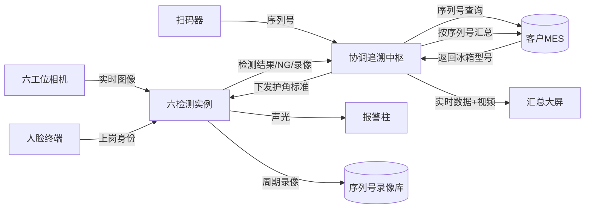
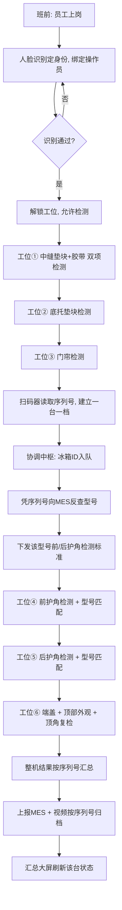
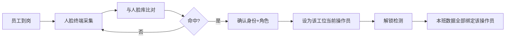
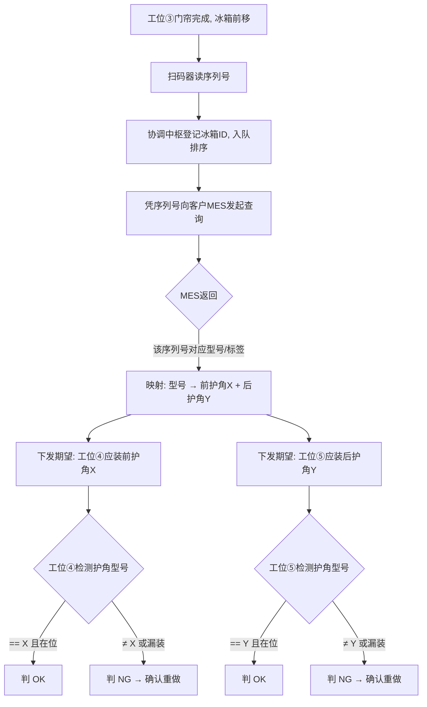
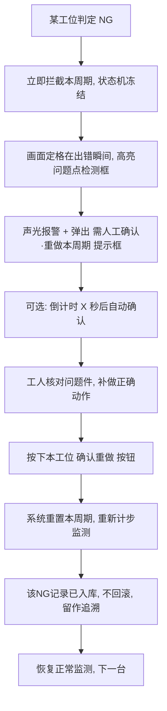
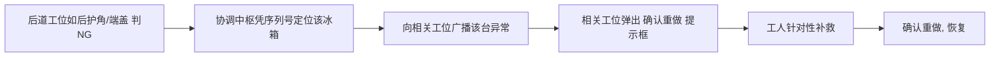
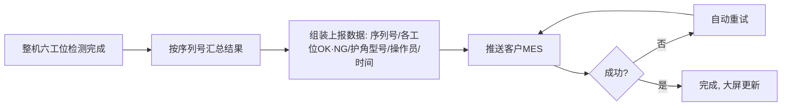

# 海信冰箱包装线 · 六工位 AI 视觉检测系统建设方案

> 文档性质：技术建设方案（提报版）
> 版本：V2.0　日期：2026-06-07
> 编制单位：天军科技 · AI 视觉检测事业部

---

## 目录

一、项目概述
二、系统设计理念（方案灵魂）
三、系统总体架构
四、硬件配置与选型说明
五、六工位检测设计（逐工位深挖）
六、核心业务流程（七大流程详图）
七、核心技术亮点（八大亮点逐个讲透）
八、数据管理与质量追溯体系
九、系统可靠性·安全性·扩展性
十、实施计划与服务保障
十一、方案价值总结

---

## 一、项目概述

### 1.1 项目背景与现场痛点

冰箱包装线由多个串联工位顺序作业，每个工位由工人完成特定包装动作。当前依赖"工人自检 + 抽检"的模式存在四类难以根除的质量风险：

| 痛点 | 具体表现 | 后果 |
|---|---|---|
| **漏装 / 漏封** | 垫块、护角漏装，胶带漏封 | 运输损伤、客诉退货 |
| **错装（型号放错）** | 不同型号冰箱护角不同，工人放错型号护角 | 装配不匹配、返工 |
| **假动作 / 不到位** | 做了动作但没装到位，或装上又拿走 | 单帧抽检发现不了 |
| **无法追溯** | 出问题后查不到是哪台、哪工位、哪个人、哪一刻 | 责任不清、改进无据 |

### 1.2 建设目标

针对海信冰箱包装线**六个关键包装环节**，部署天军 AI 视觉检测系统，达成：

- **全工位在线检测**：六环节 100% 在线检测，杜绝漏检。
- **动作 + 结果双维度判定**：既看动作做没做，又看结果对不对。
- **一台一档全程追溯**：每台冰箱以序列号为唯一身份，数据与视频可按序列号调取。
- **检测标准自适应**：对接 MES，按型号自动切换护角检测标准。
- **防错硬闭环**：异常实时拦截、画面定格、确认重做，带病件不流转。
- **质量责任到人**：人脸识别确认上岗身份，数据绑定操作员。
- **全线集中管控**：六工位视频与关键数据汇聚一块大屏。

### 1.3 方案价值速览

```
传统方案                          本方案
─────────────                     ─────────────
只看结果有没有        ──►          看动作 + 看结果（双维度）
NG 只报警            ──►          NG 拦截 + 画面定格 + 确认重做（硬闭环）
录像按时间堆         ──►          按序列号一台一档（一键追溯）
检测标准写死         ──►          对接 MES 按型号自适应
匿名作业            ──►          人脸绑定责任到人
单机孤岛            ──►          六工位集中大屏管控
```

---

## 二、系统设计理念（方案灵魂）

本方案不是"六个摄像头各看各的"，而是围绕**五大设计理念**构建的一套有机系统。这五条理念贯穿全篇，是后续所有功能的源头。

### 理念一：动作 + 结果「双维度」检测

传统视觉只在某一帧判断"成品上有没有这个件"，无法识别"假装做了""装了又拿走""没装到位"。本系统在**时间维度**上完整监测一个包装动作的全过程：

- **动作维度**：确认工人确实执行了安装/封装这个动作（动作发生）。
- **结果维度**：确认动作完成后，目标件**稳定在位**（结果成立）。

只有"动作发生 + 结果稳定"同时满足才判 OK，从根上消灭"假动作""半成品"。

### 理念二：一台一档（序列号驱动的全程追溯）

每台冰箱从扫码起获得唯一序列号，系统以序列号为主键，把它流经各工位的**检测数据、判定结果、录像、操作员、型号、时间戳**全部归档到同一档案下。客户日后凭一个序列号即可调出这台冰箱的完整质量履历与关键工位视频。

### 理念三：防错硬闭环（带病件绝不流转）

检测不是"事后统计 NG 率"，而是**实时拦截**。任一工位判 NG，系统立即冻结本周期、画面定格、声光提示、弹确认框，强制工人补救后确认重做——**不修好就过不去**。

### 理念四：业务自适应（检测标准跟着 MES 走）

检测标准不写死在程序里，而是由 MES 实时驱动。扫码后系统向 MES 反查这台冰箱的型号，自动切换对应的护角检测标准，**支持多型号混线生产**而不会检错。

### 理念五：集中管控 + 明细下沉

关键数据（节拍、良品、NG、在检 ID、操作员）上浮到大屏供管理者全局监盘；完整明细数据下沉在各工位本地，供工艺/质量深查。**上看全局、下查明细**。

---

## 三、系统总体架构

### 3.1 总体架构图

```
┌────────────────────────────────────────────────────────────────────────────────┐
│                            产 线 现 场 层（六工位）                                 │
│                                                                                  │
│  ①中缝垫块    ②底托垫块    ③门帘    ┌扫码器┐   ④前护角    ⑤后护角    ⑥端盖+复检    │
│  相机│光源    相机│光源    相机│光源 │读序列│   相机│光源   相机│光源   相机│光源     │
│  确认钮│报警  确认钮│报警  确认钮│报警└──────┘   确认钮│报警 确认钮│报警 确认钮│报警   │
└────┼──────────┼──────────┼─────────┼──────────┼──────────┼──────────┼──────────┘
     │          │          │         │          │          │          │
┌────▼──────────▼──────────▼─────────▼──────────▼──────────▼──────────▼──────────┐
│                          边 缘 计 算 层（工控机）                                  │
│  ┌──────┐ ┌──────┐ ┌──────┐        ┌──────┐ ┌──────┐ ┌──────┐                   │
│  │实例①│ │实例②│ │实例③│        │实例④│ │实例⑤│ │实例⑥│  ← 每实例:           │
│  └──────┘ └──────┘ └──────┘        └──────┘ └──────┘ └──────┘    AI推理/步骤判定 │
│                                                                   周期录像/数据  │
│  ┌──────────────────────────────────────────────────────────┐                  │
│  │            全 线 协 调 与 追 溯 中 枢                        │                  │
│  │  冰箱ID队列 · 型号下发 · 跨工位NG回溯 · 视频按序列号聚合     │                  │
│  └──────────────────────────────────────────────────────────┘                  │
└──────────────┬──────────────────────┬──────────────────────┬───────────────────┘
               │                      │                      │
   ┌───────────▼──────┐    ┌──────────▼─────────┐   ┌────────▼──────────┐
   │  业务联动层        │    │   展示管控层        │   │   存储追溯层        │
   │  人脸识别终端      │    │   汇总管控大屏      │   │   本地数据库        │
   │  客户MES(双向)     │    │   各工位本地界面    │   │   序列号录像库      │
   │  声光报警          │    │                    │   │   视频归档(可选)    │
   └──────────────────┘    └────────────────────┘   └───────────────────┘
```

### 3.2 架构分层详解

| 层级 | 组成 | 职责 |
|---|---|---|
| 现场感知层 | 工业相机×6、光源×6、扫码器、人脸终端、确认按钮×6、报警柱 | 图像/序列号/身份采集 + 人工交互 + 现场提示 |
| 边缘计算层 | 工控机（六检测实例 + 协调追溯中枢） | 实时推理、步骤判定、录像、数据落地、全线串联 |
| 业务联动层 | 人脸终端、客户 MES（双向）、报警 | 身份确认、型号反查、结果上报、声光联动 |
| 展示管控层 | 汇总大屏、各工位本地界面 | 全局监盘 + 明细查看 |
| 存储追溯层 | 本地库、序列号录像库、归档设备（可选） | 长期留存、按序列号追溯 |

### 3.3 数据流总览



---

## 四、硬件配置与选型说明

| 类别 | 设备 | 数量 | 选型理由 / 在方案中的角色 |
|---|---|---|---|
| 计算主机 | 工业控制计算机（高性能 GPU 配置） | 1 台 | 一机承载六实例 + 协调中枢，集中部署降运维成本 |
| 加速卡 | 独立显卡 GPU | 按负载 | 六路实时推理并发，需足够显存与算力 |
| 工业相机 | 工业/高清网络相机 | 6 套 | 每工位 1 套，分辨率/帧率按检测目标尺寸定 |
| 补光 | 工业光源 | 6 套 | 稳定光照是检测一致性的前提，消除环境光干扰 |
| 扫码 | 工业扫码器 | 1 套 | 装于工位③④之间，读冰箱序列号，建立"档案" |
| 身份 | 人脸识别终端 | 按工位/班组 | 上岗刷脸定身份，数据责任到人 |
| 交互 | 工业防护确认按钮 | 6 个 | 每工位 1 个，NG 后工人确认重做本周期 |
| 展示 | 汇总管控大屏 | 1 块 | 六路视频 + 关键数据集中监盘 |
| 报警 | 声光报警柱/蜂鸣器 | 按工位 | 异常即时声光提示，现场可感知 |
| 归档 | 视频归档设备（NVR/刻录，可选） | 按留存周期 | 长周期合规留存，与系统智能检索互补 |
| 网络 | 工业交换机 + 布线 | 1 套 | 相机/MES/大屏/人脸终端组网 |

> **关于视频归档设备**：本系统软件层已自带"每台冰箱检测视频录制 + 按序列号智能调取"能力——系统负责**智能调取**。外购归档设备负责**海量长存**，二者互补而非替代。

---

## 五、六工位检测设计（逐工位深挖）

> 统一说明：每台冰箱过一个工位 = 一个检测周期。每工位均采用"动作+结果"双维度判定，并具备防误检（连续帧确认）、异常拦截（确认重做）、周期录像能力。以下逐工位说明各自特点。

### 5.1 工位① 安装中缝垫块岗位（双检测项）

- **检测目标**：① 中缝垫块　② 封箱胶带
- **检测逻辑**：
  - 监测工人安装中缝垫块的动作，并确认垫块稳定在位（结果维度）。
  - 监测封箱胶带的封装动作，并确认胶带封贴到位。
  - 两项均 OK 方判该工位通过。
- **难点应对**：一工位双任务，系统并行跟踪两个目标，互不干扰。
- **异常处理**：任一项漏装/漏封 → 拦截 + 确认重做。

### 5.2 工位② 安装底托垫块岗位

- **检测目标**：底托垫块
- **检测逻辑**：监测底托垫块安装动作 + 确认在位。
- **异常处理**：漏装 → 拦截 + 确认重做。

### 5.3 工位③ 安装门帘岗位（+ 序列号采集点）

- **检测目标**：产品门帘
- **检测逻辑**：监测门帘安装动作 + 确认在位。
- **关键节点**：**本工位完成后，冰箱经过扫码器读取序列号**——这是"一台一档"的起点，也是后续护角型号自适应的触发点（详见 6.3 流程）。

### 5.4 工位④ 安装前护角岗位（型号自适应）

- **检测目标**：前护角（**型号随冰箱型号变化**）
- **检测逻辑**：
  1. 系统已凭序列号从 MES 拿到本台冰箱型号，并据此确定"本台应装哪种前护角"。
  2. 监测前护角安装动作 + 确认在位。
  3. **型号匹配校验**：检测到的护角型号是否 == 该冰箱应装型号。
- **异常处理**：漏装、或型号放错（放了别型号护角）→ 判 NG → 拦截 + 确认重做。

### 5.5 工位⑤ 安装后护角岗位（型号自适应）

- 同 5.4，针对**后护角**，同样按型号自适应校验。
- 前后护角型号不同，系统分别下发各自标准，互不混淆。

### 5.6 工位⑥ 装包装箱端盖岗位（三重把关）

末工位承担三重检测，是出厂前最后一道关：

1. **顶盖安装步骤监测**：监测顶盖/端盖安装动作 + 确认在位。
2. **顶部外观检查**：对包装箱顶部做外观检查（破损、错位、脏污等缺陷）。
3. **顶角到位复检**：复检顶角是否安装到位，作为前道护角工序的二次把关。

- 三路检测在同一工位协同运行，全部通过方判整机 OK。
- **意义**：把"步骤合规 + 外观完好 + 关键件复核"压在出厂最后一站，最大化拦截漏网件。

---

## 六、核心业务流程（七大流程详图）

### 6.1 单台冰箱全生命周期（主流程）



### 6.2 上岗人脸考勤流程



### 6.3 扫码 → MES 反查 → 护角自适应（数据流详解）



> 这条链是"防止护角放错"的核心：型号随每台冰箱实时变化，检测标准自动跟着变，**混线生产也不会检错**。

### 6.4 异常拦截 → 人工确认重做（防错硬闭环 · 状态机）



**关键设计点**：
- **画面定格**：NG 瞬间画面冻结并保留检测框，工人一眼看到"哪件、哪里、错在哪"，不是只听见报警声却不知所措。
- **重做语义**：确认后重置的是"本周期检测流程"（让工人补做这一件），而**已判 NG 的统计记录不回滚**——既给工人补救机会，又保留真实质量数据。
- **硬闭环**：不修好、不确认，本周期过不去，带病件不流转。

### 6.5 跨工位 NG 回溯流程



### 6.6 序列号视频追溯流程


### 6.7 MES 结果上报流程



---

## 七、核心技术亮点（八大亮点逐个讲透）

> 每个亮点统一从「行业痛点 → 我们怎么做 → 给客户的价值」三层讲透。

### 亮点 1 ｜ 动作 + 结果双维度检测

- **痛点**：传统单帧检测只看"成品上有没有这个件"，识别不了"假装做了""装了又拿走""没装到位"。
- **我们怎么做**：在时间维度完整监测安装动作全过程，要求"动作真实发生 + 结果稳定在位"双满足才判 OK。
- **价值**：抓住传统方案抓不到的隐性缺陷，从源头杜绝半成品流出。

### 亮点 2 ｜ 一台一档 · 序列号全程追溯

- **痛点**：录像按时间堆在硬盘，出问题翻录像如大海捞针，责任说不清。
- **我们怎么做**：每台冰箱以序列号建唯一档案，六工位数据/视频/型号/操作员/时间全部归档其下，一个序列号调出完整履历与关键工位视频。
- **价值**：客诉、审计、追责"一查到底"，质量改进有据可依。

### 亮点 3 ｜ MES 双向联动 · 检测标准自适应

- **痛点**：检测标准写死，换型号靠人工改配置，易漏改、易出错，不支持混线。
- **我们怎么做**：扫码后实时向 MES 反查型号，自动切换对应护角检测标准，型号变标准就变。
- **价值**：支持多型号混线生产，从根上杜绝"护角放错型号"。

### 亮点 4 ｜ 画面定格 · 人工确认重做防错硬闭环

- **痛点**：传统 NG 只报警，工人不知哪里错，带病件可能继续往下流。
- **我们怎么做**：NG 瞬间拦截 + 画面定格高亮问题点 + 声光 + 弹确认框，工人补做后按钮重做本周期，不修好过不去。
- **价值**：把"事后统计"升级为"实时硬拦截"，带病件零流转。

### 亮点 5 ｜ 人脸身份绑定 · 质量责任到人

- **痛点**：匿名作业，出问题查不到人。
- **我们怎么做**：上岗刷脸定身份，全班检测数据绑定操作员，识别通过才能开工。
- **价值**：质量问题精确到人、到机、到工位、到时刻，管理闭环。

### 亮点 6 ｜ 六工位集中大屏管控

- **痛点**：六工位各自为政，管理者掌握不了全线实时状态。
- **我们怎么做**：六路实时视频 + 关键数据（节拍/良品/NG/在检 ID/操作员）汇聚一块大屏，明细下沉各工位本地。
- **价值**：管理者一屏掌控全线，异常一眼可见。

### 亮点 7 ｜ 智能视频追溯（区别于被动归档）

- **痛点**：单纯堆一台刻录机只是"被动存"，要用的时候还得人工大海捞针。
- **我们怎么做**：视频与序列号、检测结果智能绑定，输入序列号一键调取，可与归档设备配合做长期留存。
- **价值**：从"存得下"升级到"查得到、对得上"。

### 亮点 8 ｜ 工业级高可靠架构

- **痛点**：单点故障拖垮全线，软件不稳定影响生产。
- **我们怎么做**：六工位独立运行互不影响、单工位异常不拖累全线、异常自恢复、本地化部署数据不出厂，面向 7×24 连续作业设计。
- **价值**：稳定可靠，敢上产线、敢连续跑。

### 亮点 9 ｜ 目标检测为主 + 手势（关键点）检测为辅 · 双引擎动作识别

- **痛点**：只看"物料在不在"，判断不了工人手上的动作到底做没做、做得规不规范。
- **我们怎么做**：以目标检测看"物料 / 护角 / 产品 / 结果"为主，叠加人体关键点（手势）检测看"工人手部动作姿态"为辅，双引擎交叉印证一个动作。
- **价值**：对"拿没拿、装没装、装到不到位"这类动作细节判得更准，误判漏判更少，尤其适合人工装配类工序。

### 亮点 10 ｜ 越用越准 · 自学习进化 + 天军产品生态互联

- **痛点**：模型装完就固化，现场一变（换人、护角换颜色 / 换型号）准确率就往下掉，想维护还得反复求厂家。
- **我们怎么做**：
  - 检测过程中自动沉淀典型样本（可按需导出指定置信度区间的画面），一键导入天军配套的训练软件做正负样本迁移学习，**模型持续进化、越用越准**。
  - 现场怎么变、模型就怎么跟：员工换了、护角换色换型，模型同步加强，不怕产线变化。
  - 客户可**自主维护、自主更新模型**，不被厂家绑死。
  - **天军产品生态互联**：检测系统与训练软件（及未来更多天军产品）像"万物互联"一样互联互通，数据与模型在天军生态内自由流转、协同进化——买的不是一台孤立设备，而是一个会成长的系统。
- **价值**：模型常用常新、自动适应产线变化、客户自主可控、生态越用越强。

### 亮点 11 ｜ 不合格多渠道实时告警 · 异常秒级直达班长手上

- **痛点**：异常只进 MES、只在现场屏幕报警，管理者一旦不在工位旁就不知道，响应慢、追责难。
- **我们怎么做**：不合格结果除上报 MES 外，多管齐下第一时间推送到人：
  - **手机 / 平台 APP**：推送不合格工位、结论、照片、视频片段与语音，指定人员随时随地查看。
  - **短信**：直接发到指定手机，可点开查看不合格信息、照片、视频片段。
  - **呼麦机（对讲机）**：一线班长人手一台，异常语音实时喊到手上，无需盯着屏幕。
  - 可同步**拨打指定人员电话**做强提醒。
- **价值**：异常"找得到人、传得到位、响应快"——班长无论身在产线何处，都能秒级知晓、第一时间到岗处置。

---

## 八、数据管理与质量追溯体系

| 维度 | 能力 |
|---|---|
| 明细数据 | 各工位完整保存周期/步骤/事件/判定/操作员/时间戳 |
| 序列号录像库 | 后三关键工位录像按序列号绑定，支持按序列号检索 |
| 统计报表 | 良品率、NG 分布、节拍、产量多维报表，按日/周/月/区间导出 |
| MES 上报 | 检测结果按约定推送客户 MES（序列号/工位结果/型号/操作员/时间） |
| 长期归档 | 配合归档设备实现合规级长周期留存 |

---

## 九、系统可靠性 · 安全性 · 扩展性

- **工位隔离**：六实例独立运行，任一工位维护/异常不影响其余。
- **异常自恢复**：崩溃恢复机制保障产线连续作业。
- **本地化部署**：核心计算在工控机本地，不依赖外网，数据不出厂。
- **平滑扩展**：可按需增减工位、扩展检测项、对接更多上游系统。
- **权限分级**：操作员/工程师/管理员分级权限，操作可控可审计。

---

## 十、实施计划与服务保障

| 阶段 | 内容 | 交付 |
|---|---|---|
| 现场勘测 | 工位布局、光照、网络、MES 接口、节拍调研 | 勘测报告 |
| 部署集成 | 硬件安装、相机标定、系统部署、MES/人脸/扫码联调 | 可运行系统 |
| 建模调参 | 各工位模型训练与参数调优 | 检测达标 |
| 试运行 | 产线试跑、误检漏检优化 | 试运行报告 |
| 培训验收 | 操作培训、文档交付、客户验收 | 验收文件 |
| 售后服务 | 远程支持 + 现场响应 + 持续优化 | 服务承诺 |

---

## 十一、方案价值总结

本方案以**"动作+结果双维度检测"**为技术内核，以**"序列号一台一档"**为追溯主线，以**"MES 自适应"**为业务大脑，以**"画面定格确认重做"**为防错闭环，以**"人脸责任到人"**与**"集中大屏管控"**为管理抓手，构建覆盖海信冰箱包装线六个关键环节的全流程智能质量管控系统。

最终为客户带来：**漏装错装零放过、质量问题全追溯、护角型号不放错、带病产品不流转、生产质量看得见、管理责任落到人、模型越用越聪明。**

---

## 附录 A：本项目设备技术要求

> 针对海信冰箱包装线六工位行为识别项目的设备配置与技术指标，作为方案落地的设备依据。

### A.1 设备配置清单

| 序号 | 名称 | 规格 / 要求 | 数量 | 用途说明 |
|---|---|---|---|---|
| 1 | 工业相机 | 高清工业相机（800 万像素级），超广角无畸变，全程无噪点 | 6 | 每工位 1 套，覆盖检测区域 |
| 2 | 工控机 | 高性能 CPU + 独立 GPU（足够显存）+ 大容量存储，可同时驱动 6 相机、6 屏、6 按钮 | 1 | 承载六检测实例 + 协调追溯中枢 |
| 3 | 显示屏 | 各工位作业屏（21 寸级）+ 1 块大屏（35 寸级）用于汇总/展示 | 多 | 工位监看 + 集中管控大屏 |
| 4 | 固定扫码器 | 工业级固定扫码枪 | 1（或前后各 1） | 装于工位③④之间，读序列号建档 |
| 5 | 无线补扫枪 | 手持无线扫码（兼容主流条码） | 1 | 条码漏扫时人工补扫 |
| 6 | 人脸识别终端 | 局域网 TCP/IP，IP65 防护，1-2s 识别/录入 | 按工位/班组 | 上岗刷脸定身份、责任到人 |
| 7 | 确认（复判）按钮 | 工业防护按钮 | 6 | NG 后确认重做本周期 |
| 8 | 三色报警灯 | 工业声光报警 | 6 | 对应工位异常实时报警 |
| 9 | 工业音响 | 大音量工业音响（5m 可闻），语音可配置 | 6 | 语音提醒异常工位 |
| 10 | 光电开关 | 工业漫反射光电 | 按需 | 产品定位 / 触发扫码 |
| 11 | 网络 / 机柜 / 辅材 | 工业交换机、桥架、线缆、机柜（接入生产网/MES网） | 1 套 | 组网与集成 |
| 12 | 信号联动（如需） | PLC / IO 联动停线放行 | 按需 | 与产线联动 |

> 注：具体品牌型号可按客户既有标准与现场勘测确定；本系统对主流工业相机/扫码器/人脸终端均可适配。

### A.2 技术性能指标（对标并满足项目要求）

| 指标 | 要求 |
|---|---|
| 检测节拍 | 满足停线检测，单次结果输出达 0.05–0.1s 级 |
| 扫码节拍 | 序列号扫码 1–2s 完成 |
| 视频质量 | 全程 1080P 高帧率流畅，无白屏、噪点、卡顿掉帧 |
| 检测准确率 | **≥ 98%** |
| 误判率 | **≤ 2%**（误判指：动作做了且到位，却被报 NG） |
| 人脸识别 | 1–2s 完成识别 / 录入 |
| 帧率显示 | 实时检测画面显示当前帧率 |

### A.3 在岗与放行管理

- **全员登录才放行**：六工位员工全部人脸登录后产线方可放行检测；任一工位未登录则强制停线。
- **单工位检测开关**：可在软件中单独关闭某工位检测，关闭后该工位无需人脸登录即可放行其余工位。
- **离岗自动登出**：员工离岗超时（如 10 分钟）自动登出，需重新刷脸恢复在岗。
- **复判（确认重做）**：员工按钮确认重做，仅重检 NG 动作，合格后自动恢复；复判过程的照片/视频计入复判结果。
- **管理员放行**：管理员密码进入后可手动放行，但该放行结果仍计入不合格、不计入复判。

### A.4 班次统计与追溯

- 按班次自动切换统计（白班/夜班），汇总：检测台数、不合格台数、复判数、合格率、历史条码结果。
- 复判合格计入复判数、不再计入不合格数；管理员放行计入不合格。
- 支持按条码 / 时间范围查询追溯，复判结果在历史表中明确标注。

### A.5 环境 / 安全 / 质保 / 工期

| 项 | 要求 |
|---|---|
| 温度 | -20℃ ~ 60℃ |
| 湿度 | 5% ~ 95% |
| 噪音 | ≤ 75dB |
| 防护 | 关键设备 IP65 防尘防水 |
| 电源 | 380V/220V 三相五线 50Hz，电压波动 ±10% |
| 安全 | 符合国家电气装置安装规范，走线规范，颜色统一 |
| 质保 | 整机 1 年；主板等特殊电气件 3 年 |
| 工期 | 采购 / 现场施工 / 软件调试分阶段推进，配合客户停产窗口施工 |

---

> 本方案最终以现场勘测、MES 接口规范与负载评估结果为准，欢迎进一步沟通定制。
>
> 天军科技 · 让每一台产品的质量都有迹可循。
