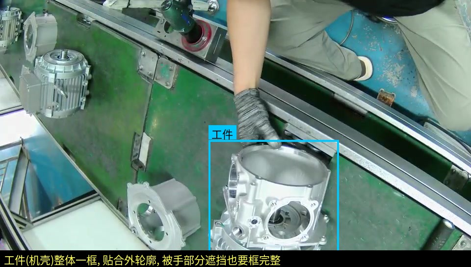
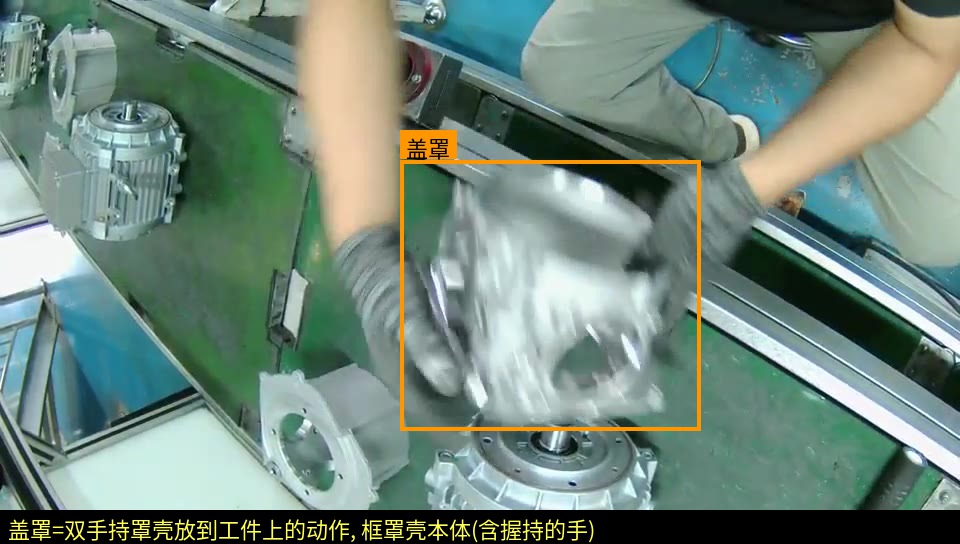
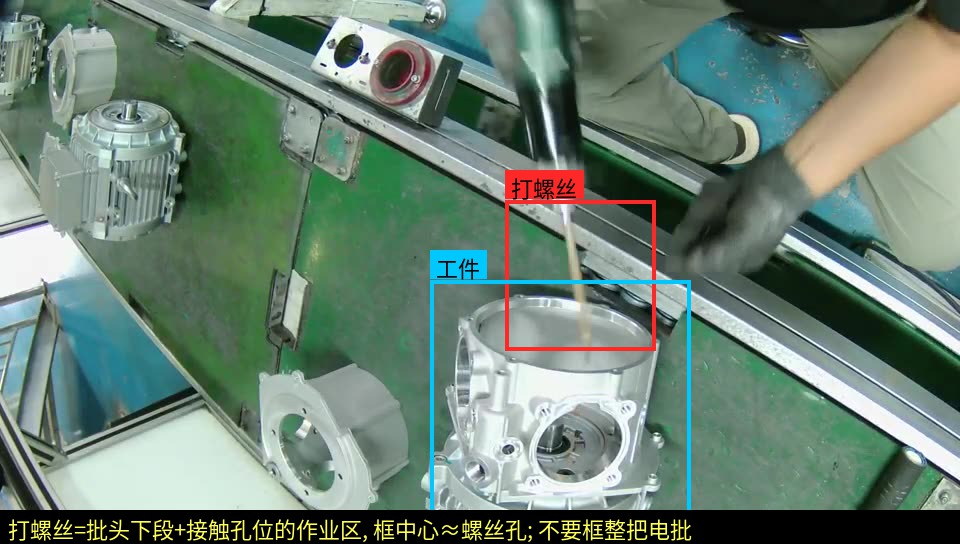
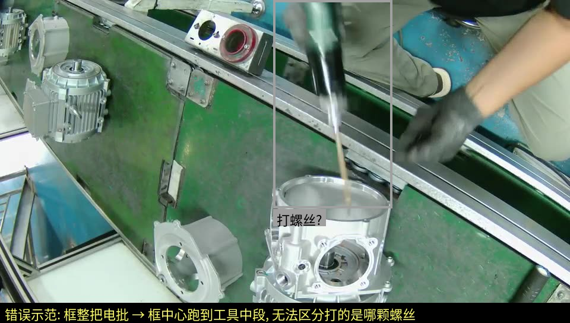
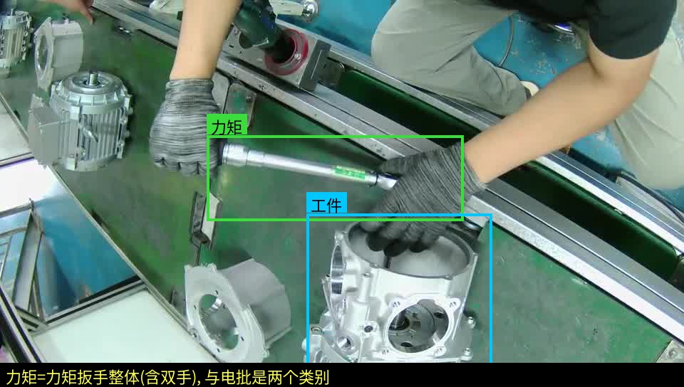
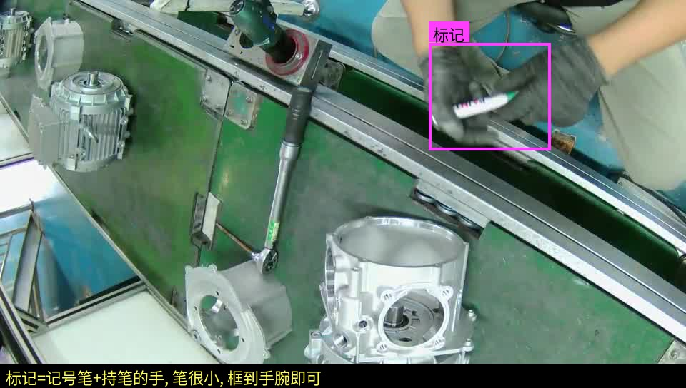
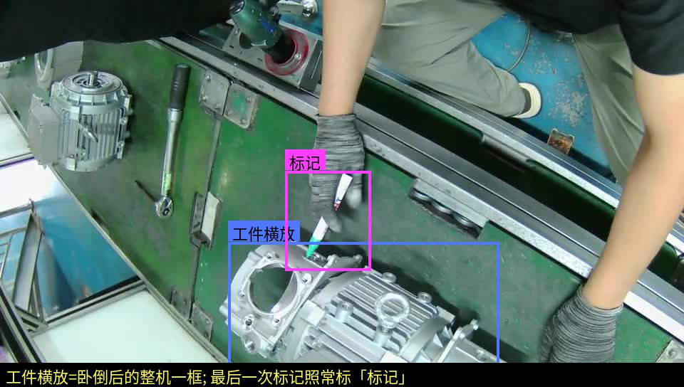
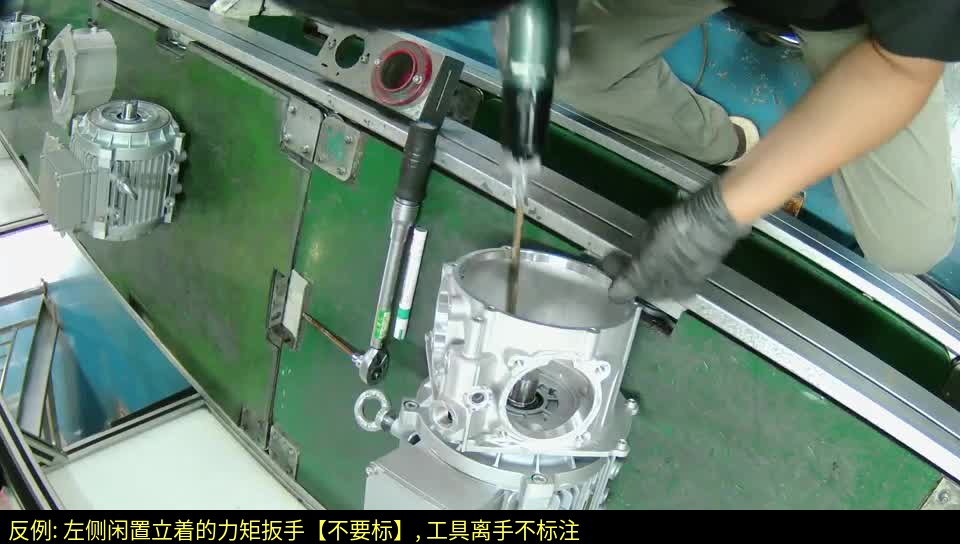

# 电机装配线检测模型 · 图片标注规范

> **交付对象**：标注工程师
> **配套素材**：`标注规范assets/`（本文所有示例图）；抽帧图片在交接目录（见第二节）
> **有疑问**：拿不准的帧不要猜，截图集中反馈给项目负责人统一裁定

---

## 一、背景：这批标注是干什么用的（先读，影响画框方式）

现场要检测电机装配全流程：装前罩 → **按对角顺序打 4 颗螺丝** → 力矩复紧 → 笔标记 → 翻面装后罩 → 再打 4 颗 → 力矩 → 标记 → 横放电机做最后标记。

螺丝被罩壳完全遮挡，模型认不出"打的是哪一颗"——软件侧的方案是：模型只需要输出"打螺丝"这个笼统动作，软件按**检测框的中心点落在画面哪个区域**来判定是第几颗螺丝。

由此产生本规范最重要的一条铁律：

> ⚠️ **「打螺丝」的框中心必须落在正在打的那颗螺丝孔位附近。**
> 框的中心点就是软件的判定依据，中心偏了 = 现场判错螺丝顺序 = 误报警。
> 所以打螺丝**只框作业接触区，不框整把电批**（详见第四节）。

其余类别没有这个中心点要求，按常规"贴合目标外轮廓"画即可。

## 二、素材与交付

| 项 | 内容 |
|---|---|
| 首批图片 | `标注抽帧_电机装配线/全程抽帧_每3帧1张/`（4548 张，960×544，**整段视频**（源 21fps 共 13643 帧）每 3 帧抽 1 张 ≈ 每秒 7 张，覆盖全部工件周期） |
| 参考视频段 | 原视频 1 分 41 秒 ~ 3 分 15 秒是一个完整工件流程，标注前先完整看一遍 |
| 标注工具 | labelImg / X-AnyLabeling 等任意支持 YOLO 格式的工具 |
| 交付格式 | YOLO 目标检测格式：`images/` + `labels/`（每图一个同名 txt）+ `classes.txt`（类别顺序必须与下表 id 一致） |
| 框类型 | 全部为水平矩形框（bbox），无多边形、无关键点 |

## 三、类别定义（6 类）

| id | 类别名 | 一句话定义 | 大约何时出现 |
|----|--------|-----------|------------|
| 0 | `工件` | 立在工装上的**在制**电机机壳（开口朝上） | 全程大部分时间 |
| 1 | `盖罩` | **双手持罩壳放到工件上的动作过程**（罩壳在手中/正在落位） | 每个工件 2 次，每次约 2~4 秒 |
| 2 | `打螺丝` | 电批批头下探进工件、正在拧螺丝的**作业接触区** | 每个工件 8 次（前后罩各 4 颗） |
| 3 | `力矩` | 力矩扳手在手中对工件复紧的动作 | 每个工件 2 轮 |
| 4 | `标记` | 记号笔在手中做标记的动作 | 每个工件 3 次 |
| 5 | `工件横放` | 卧倒（轴线水平）放置的整机 | 每个工件流程末尾 |

**类别设计的两个关键点（标注时必须理解）**：

1. `盖罩` 标的是**动作**不是"装好之后的罩子"。软件靠"盖罩出现 → 消失 → 再出现"来区分前罩轮次和后罩轮次，所以罩壳**装好落定之后就不再标**，只标"在手中/正在落位"的过程帧。运动模糊很正常（见示例图 ex2），**模糊也要标**。
2. `工件` 与 `工件横放` 互斥：机壳立着算 `工件`，卧倒算 `工件横放`，同一个物体不会同时标两类。翻面过程中被双手抱起的过渡帧（悬空、姿态倾斜）**跳过不标**。

## 四、每类怎么画框（对照示例图）

### 0 `工件` — 示例 ex1

- 贴合机壳外轮廓整体一框，含底部接线盒。
- 被手/工具部分遮挡时，**按完整轮廓框**（脑补被挡部分），不要框成残缺的一小块。
- 只标**作业区中央正在加工的这一台**。画面左侧料架上的成品电机、台面下方镜面里的倒影，**一律不标**（见第五节）。

### 1 `盖罩` — 示例 ex2

- 框罩壳本体，握持罩壳的手一并框入。
- 从"罩壳被拿进画面"到"落到工件上手松开"期间的帧都标；落定后不标。
- 该动作快、普遍运动模糊，模糊帧照标，这正是模型必须见过的样子。

### 2 `打螺丝` — 示例 ex3（正确）/ ex3b（错误，务必对照看）

- **只框作业接触区**：批头下段 + 螺丝孔位周边，框中心 ≈ 正在打的螺丝孔。
- **不要框整把电批**——电批机身很长，框整把会把中心拉到工具中段，软件就没法判断打的是哪颗螺丝（ex3b 就是错误示范）。
- 框的大小参考：接触点周边约 1/6 ~ 1/4 画面高，允许把扶着批头的手指框入。
- 判定"正在打"：批头已接触/伸入孔位。电批悬空移动、换头、拿起放下的帧**不标**。

### 3 `力矩` — 示例 ex4

- 框力矩扳手整体（含握持的双手）。
- 只标"正在对工件施力/套上孔位"的帧；扳手拿在手里但还没碰工件的过渡帧不标。
- 它与电批是**两个类别**，不要混：电批 = 绿色电动工具；力矩扳手 = 银色长杆手动工具。

### 4 `标记` — 示例 ex5

- 框记号笔 + 持笔的手（笔太小，单框笔检出率差），框到手腕即可。
- 从拔笔帽/笔尖朝向工件开始标，到笔离开工件收起为止；笔闲置放在台面上**不标**。

### 5 `工件横放` — 示例 ex6

- 卧倒后的整机一框，规则同 `工件`。
- 横放状态下做的最后一次标记，照常另标 `标记`。

## 五、不标注清单（负样本纪律，同样重要）

以下内容**任何情况都不画框**——错标它们比漏标更伤模型：

1. **闲置工具**：立在/躺在台面上、没有握在手里的电批、力矩扳手、记号笔（见示例 ex7：画面左侧立着的力矩扳手不标）。

2. **背景成品电机**：画面左上料架上挂着的已装配电机。
3. **镜面倒影**：台面下方镜面/亮面反射出的工件、人手、工具。
4. **散件**：台面上待装的端盖/罩壳（没被拿在手里时）、螺丝、批头。
5. **人体**：手、手臂本身不单独标（只作为动作框的一部分被带入）。

## 六、时序边界速查（拿不准"这帧算不算"时查这里)

| 情形 | 处理 |
|---|---|
| 动作刚开始/刚结束的临界帧 | 工具已接触工件 → 标；未接触 → 不标 |
| 运动模糊 | `盖罩` 必标；其他类别模糊到肉眼认不出类别就跳过该帧 |
| 翻面搬动中的工件（悬空/倾斜） | 不标（既不算 `工件` 也不算 `工件横放`） |
| 一帧里同时有多个动作 | 各标各的（如一手扶工件一手打螺丝：标 `打螺丝` + `工件`） |
| 目标出画面一半 | 可见部分 ≥ 一半按可见部分框；< 一半不标 |
| 完全认不出/严重遮挡 | 跳过，宁缺毋滥，截图反馈 |

## 七、数量与多样性要求

- 首批 4548 张全标（整段视频每 3 帧抽 1 张 ≈ 每秒 7 张，含全部工件周期；机位已确认为现场最终机位，首批即正式训练集）。有效动作帧（打螺丝/力矩/标记/盖罩）预计占三成左右，其余大量"只有工件"的帧同样要标 `工件`——它兼做锚点定位，数量越足越稳；相邻帧画面近似重复也**逐帧都标**，不要跳帧（建议用标注工具的"复制上一帧标注"功能提效）。
- 各类目标框数建议下限：`打螺丝` ≥ 600、`力矩` ≥ 300、`标记` ≥ 300、`盖罩` ≥ 150、`工件` ≥ 1500、`工件横放` ≥ 150。首批不够的部分由后续补录视频扩充。
- 后续采集用同一机位，覆盖：不同工人、不同班次光照、戴不同颜色手套的情况。
- 当前只有一个电机型号；后续新增型号若动作与工具不变，按本规范原样补标注、增量并入同一模型即可（类别表不变）。

## 八、质量验收

交付前自检，项目方按同样标准抽检 10%：

1. 类别错误率 = 0（尤其电批/力矩扳手不得互混）；
2. `打螺丝` 框中心落点抽检：中心点必须能对应到某颗螺丝孔位，偏到工具中段的判不合格；
3. 不标注清单（第五节）零违例；
4. 框贴合度：边界与目标轮廓偏差不超过目标尺寸的 10%。

---

**文档版本**：v1.0（2026-07-07，基于客户原始视频 960×544@21fps 制定）
