# 电机装配线（对角打螺丝）现场部署指南

> **给谁看**：去现场装机的部署工程师。照本指南从零把「电机装配全流程」项目配出来并跑通验收。
> **前提**：工控机已装好天军 AI 视觉检测系统（v3.32+），摄像头画面与训练视频机位一致（960×544 俯视装配位）。
> **本指南全部截图取自真实软件界面 + 客户真实视频与真实模型**，照着截图逐屏核对即可。
>
> ⚠️ **模型版本前提**：本指南按满配 **13 步**写（含前罩/后罩力矩两步）。力矩两步要求模型按《标注规范 v1.1》的**接触点标法**（只框扳手头+螺丝孔位）重标训练。若现场拿到的还是旧标法模型（整把扳手框），力矩检测位置不可靠——先把力矩拆分规则和两个力矩步骤**停用**，按 11 步跑，其余配置不变；换新模型后再启用补齐 13 步。

---

## 零、这条线在检测什么（30 秒读懂）

工人流程：装前罩 → **按对角顺序**打 4 颗螺丝 → 力矩复紧 → 笔标记 → 翻面装后罩 → 再对角打 4 颗 → 力矩 → 标记 → 工件横放收尾。

模型只认 6 个类别：`工件 / 盖罩 / 打螺丝 / 力矩 / 标记 / 工件横放`——它看不出打的是**哪一颗**螺丝。软件靠两层配置补上：

1. **同标签区域拆分**：在画面上画 4 个螺丝区域，"打螺丝"发生在哪个区域就改写成"螺丝 N"；
2. **多轮次拆分**：前罩/后罩两轮打的位置重叠，靠"盖罩"动作切轮次——第 1 轮改写成"前罩螺丝 N"，第 2 轮改写成"后罩螺丝 N"。

再配合顺序模式的**严格顺序**校验，打错对角顺序当场弹"违序警告"。

---

## 一、导入模型

菜单进入**模型管理**，点右上「上传模型」，选交付的 `.pt` 文件（本项目模型名：**电机装配打螺丝**）。上传后系统自动解析标签，确认 6 个类别齐全：`工件、盖罩、打螺丝、力矩、标记、工件横放`。

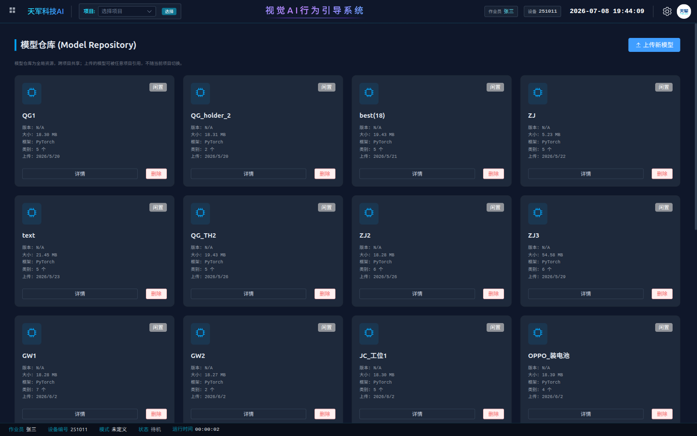

## 二、新建项目 + 基础设置

进入**项目管理** → 「新建项目」，任务类型选**目标检测**，逻辑模式选**顺序模式**，主模型绑定上一步导入的模型。

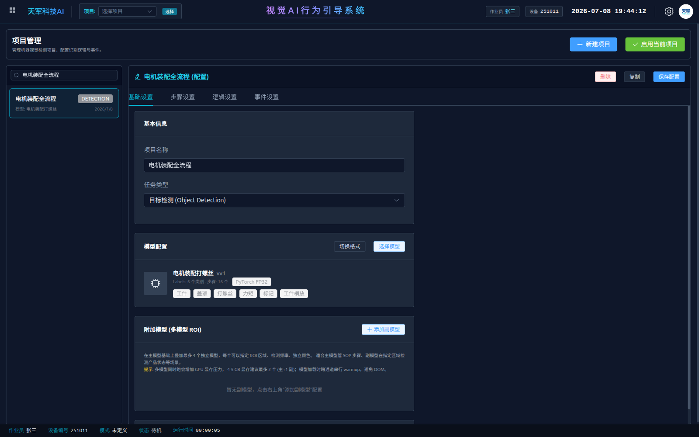

## 三、接入视频源

进入**视频源**页，按现场情况接摄像头（海康 NVR / 工业相机 / RTSP 均可）。调机位时对照客户原始视频：**俯视装配位，工件主体落在画面中下部**。机位一旦调好就锁死支架——区域拆分里"固定画面"类的区域都以此机位为基准。

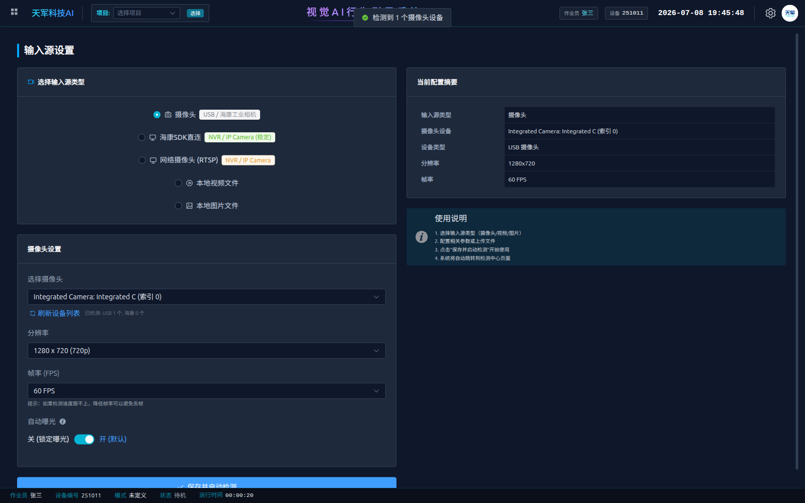

## 四、步骤设置（本项目的核心）

### 4.1 步骤表总览

配完拆分规则后，步骤表会自动出现带「拆分」徽标的虚拟步骤（前罩螺丝 1-4、后罩螺丝 1-4、前罩/后罩力矩、前罩/后罩标记），加上手工启用的"工件横放"，**启用步骤共 13 个**。原始标签"打螺丝/力矩/标记"本体保持停用（它们只作拆分原料）。

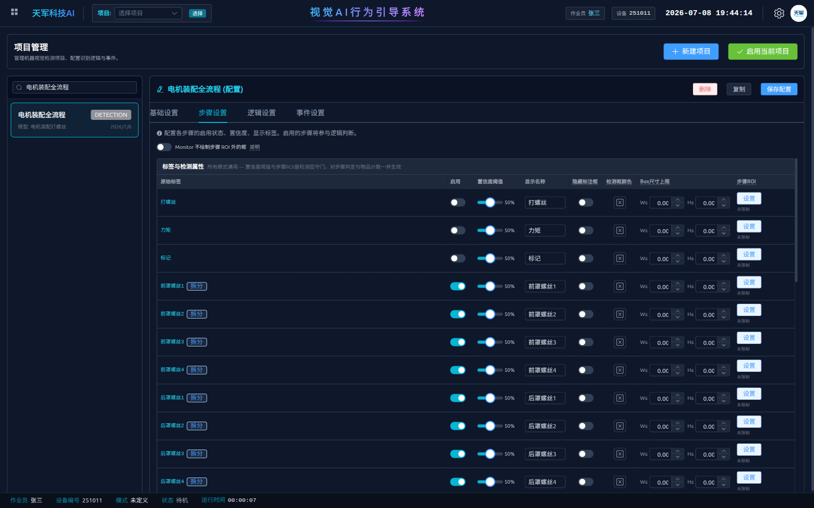

各步骤行为参数照抄下表（步骤表右侧逐列填）：

| 步骤 | 置信度 | 最短持续(秒) | 消失确认(秒) | 严格顺序 | 单次接受 |
|---|---|---|---|---|---|
| 前罩螺丝1 | 50 | 0.6 | 1.5 | 关（首步不勾） | 关 |
| 前罩螺丝2~4 / 后罩螺丝1~4 | 50 | 0.6 | 1.5 | ✅ | ✅ |
| 前罩力矩 / 后罩力矩 | 50 | 1.0 | 1.5 | ✅ | ✅ |
| 前罩标记 / 后罩标记 | 50 | 1.0 | 1.5 | ✅ | ✅ |
| 工件横放 | 50 | 2.0 | **10** | ✅ | ✅ |

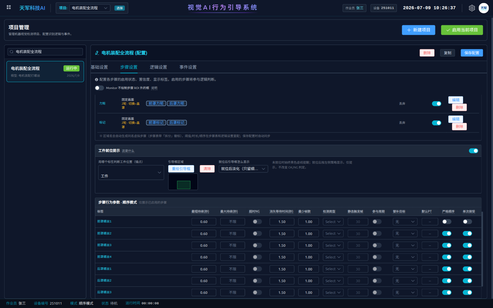

> 两条参数不要乱调：
> - **"工件横放"最短持续 2 秒**：翻面瞬间电机也是横躺的，模型同样会报"工件横放"（实测置信度可到 0.96）。翻面动作一晃而过（约半秒），2 秒门槛把它挡掉，只认收尾时真正躺稳的那次。不要调小。
> - **"工件横放"消失确认 10 秒**：它是结算触发器（见第五节）。收尾横放期间工人会俯身做标记，把工件挡住 6~7 秒，检测会"断成两段"——10 秒的消失确认把两段桥起来，工人真正拿走工件、画面持续 10 秒没有横放后才结算。不要调小到 7 秒以下。

### 4.2 拆分规则一：打螺丝 → 4 颗螺丝（锚点跟随 + 多轮次）

步骤设置页下方「同标签区域拆分」卡片 → 「新建拆分规则」：

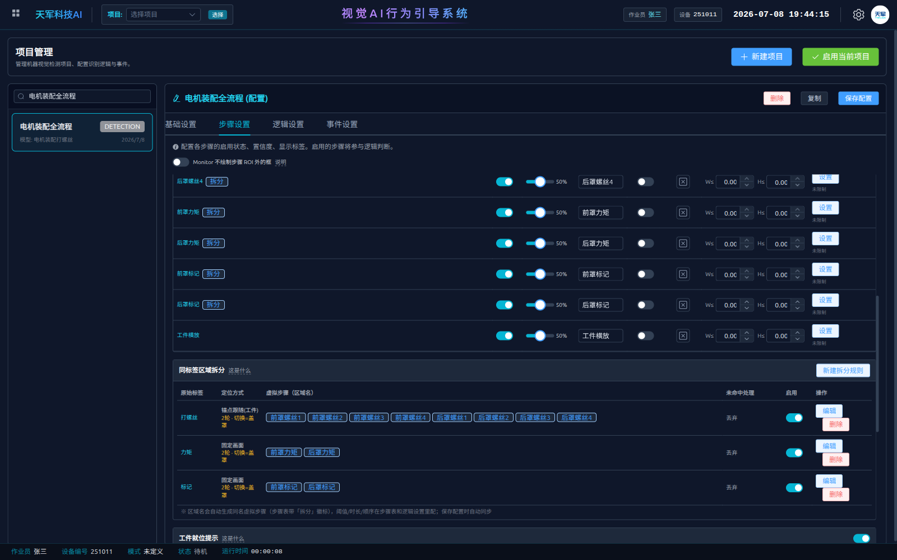

编辑器里按以下顺序配：

1. **模型原始标签**选`打螺丝`；
2. **区域定位方式**选`锚点跟随`，锚点标签选`工件`——区域会跟着工件的位置/大小平移缩放，流水线上工件停的位置有偏差也不影响；
3. 让画面里出现一个摆放到位的工件，点**「从当前画面抓取锚点框」**——这一步把"画区域那一刻工件在哪"记下来，作为跟随的基准。**现场标准操作顺序**：监控页启动检测（让模型进显存）→ 把工件摆稳到标准位置、人手离开 → 点「停止」或「待机」→ 切到项目管理页打开本编辑器 → 点「刷新画面快照」→ 点「抓取锚点框」。画面里没有实时检测结果时软件会**自动对当前画面现推一帧**（v3.42.0+），停止后的定格画面、待机中的实时画面都能抓；若提示"没有检测到工件"，说明当前画面里工件被遮挡或不清晰，回监控页重新停在工件清晰可见的画面再来一次；
4. 在画布上**依对角顺序**画 4 个区域，命名`螺丝1`~`螺丝4`（区域名就是虚拟步骤名后缀）。判定看的是检测框**中心点**落在哪个区域，所以：**区域画大一点、彼此留空隙、不要互相压线**；
5. **未命中处理**选`丢弃`——工人手在两颗螺丝之间移动时的误检不参与任何判定。

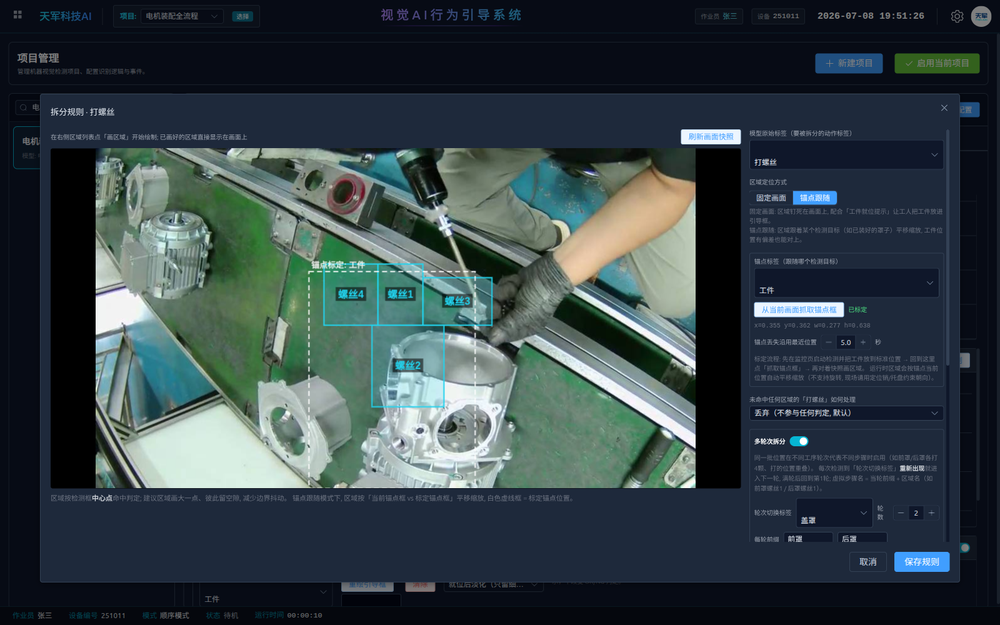

> 画布上白色虚线框是已标定的锚点基准位置，四个青色框就是螺丝区域。截图里就是验收合格的那套区域，照这个相对位置画。

接着打开**多轮次拆分**开关：

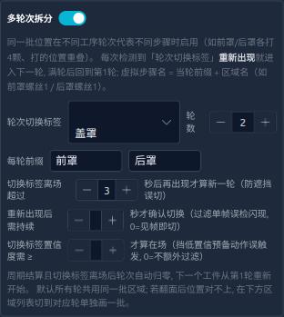

| 项 | 值 | 说明 |
|---|---|---|
| 轮次切换标签 | `盖罩` | 每检测到一次"盖罩"动作进入下一轮 |
| 轮数 | 2 | 前罩一轮 + 后罩一轮，满轮后回绕 |
| 每轮前缀 | `前罩`、`后罩` | 虚拟步骤名 = 前缀 + 区域名 |
| 切换标签离场超过 | 3 秒 | 再出现才算新一轮（防遮挡误切） |
| 需持续 | 0.5 秒 | 盖罩动作要连续在场半秒才算数 |
| 置信度需 ≥ | **0.85** | 关键参数：打螺丝时模型偶尔会低置信度误报"盖罩"，0.85 把误报挡掉。实测低于此值会导致轮次错切、后罩螺丝全部误判违序 |

### 4.3 拆分规则二/三：力矩、标记（全画面 + 多轮次）

`力矩`和`标记`按 13 步流程**不需要分位置**（每轮只算"做没做"一步），但需要分前罩轮/后罩轮。同样新建拆分规则：

- 原始标签分别选`力矩`/`标记`，定位方式选`固定画面`；
- 区域只画**一个盖住全画面**的矩形，区域名分别填`力矩`/`标记`；
- 多轮次开关、参数与打螺丝完全一致（切换标签`盖罩`、2 轮、前缀`前罩`/`后罩`、置信度 0.85）。

得到`前罩力矩 / 后罩力矩 / 前罩标记 / 后罩标记`四个虚拟步骤。

> **力矩与新模型的关系**：按《标注规范 v1.1》，力矩只标"扳手头 + 正在复紧的螺丝孔位"的接触区，检测框中心就落在那颗螺丝上。所以全画面区域一定接得住它；将来客户如果要求"力矩也按对角顺序校验"，把这条规则改成与打螺丝相同的`锚点跟随` + 4 螺丝区域即可（区域画法完全照 4.2 那张截图），不需要改模型。旧标法（框整把扳手）的模型中心落在杆身、随手臂大幅漂移，**不能**用于力矩步骤——遇到旧模型按开头的提示先停用力矩两步。

### 4.4 工件就位提示（可选但推荐）

步骤设置页「工件就位提示」卡片：开关打开，锚点标签选`工件`，点「绘制引导框」在传送带工位处画一个框，"就位后怎么显示"选`就位后淡化`。

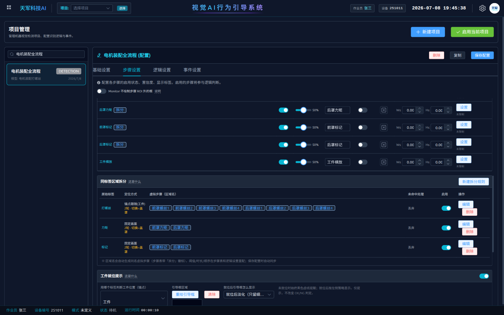

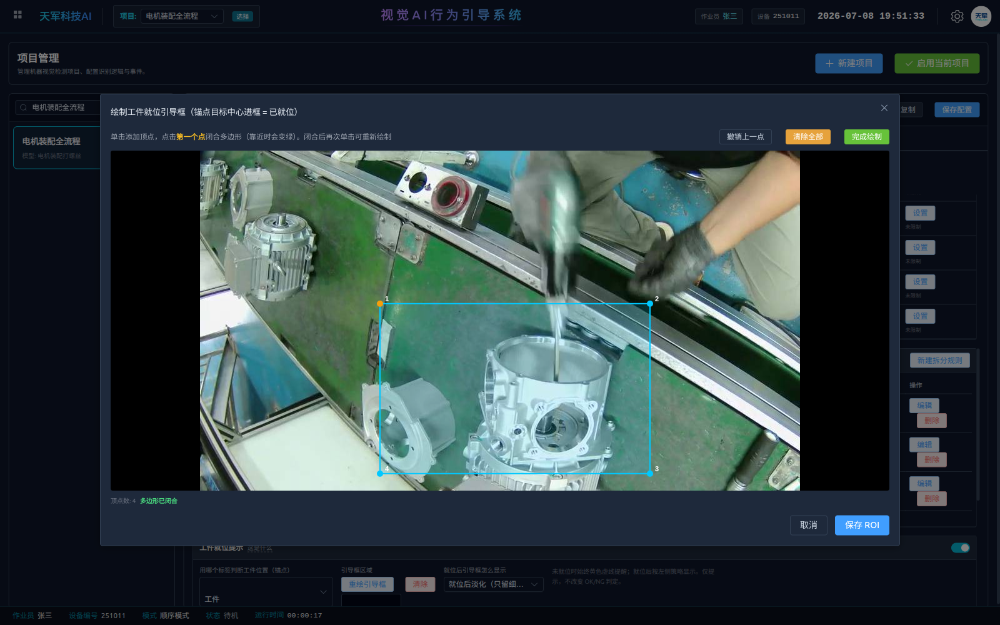

监控页效果：工件没到位时黄色虚线框提示"等待工件就位"，到位后淡化成细框。只做引导，不影响判定。

## 五、逻辑设置（顺序 + 结算 + 违序报警）

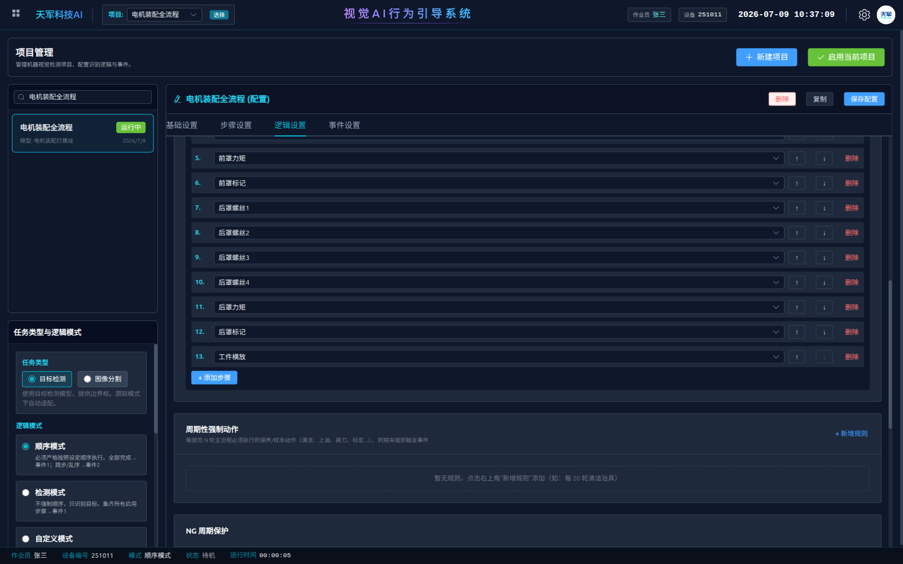

**步骤排序**按工艺真实顺序拖满 13 步：

```
前罩螺丝1 → 前罩螺丝2 → 前罩螺丝3 → 前罩螺丝4 → 前罩力矩 → 前罩标记
→ 后罩螺丝1 → 后罩螺丝2 → 后罩螺丝3 → 后罩螺丝4 → 后罩力矩 → 后罩标记
→ 工件横放
```

**结算方式**（截图中已选好，照抄）：

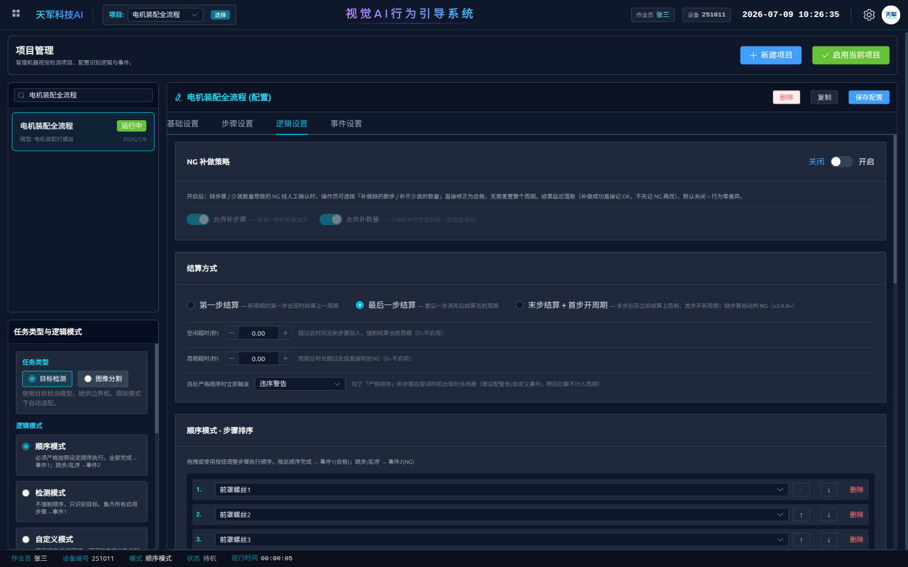

| 项 | 值 | 为什么 |
|---|---|---|
| 结算方式 | **最后一步结算** | "工件横放"是整件收尾动作且不重复——它离场（消失确认 10 秒走完）当场落账，不用等下一件 |
| 空闲超时 | **0（不启用）** | 结算由横放离场触发，不需要空闲兜底 |
| 违反严格顺序时立即触发 | **违序警告** | 打错对角顺序当场报警，不用等整件做完 |

> 这套组合能成立，靠的是第四节两条"不要乱调"的参数托底：
> ① **横放最短持续 2 秒**挡掉翻面瞬间的横放误检——翻面闪现只有半秒左右，进不了周期，自然也不会触发结算；
> ② **横放消失确认 10 秒**桥接收尾时工人俯身标记造成的 6~7 秒遮挡断档，避免横放"断成两段"后第二段开出一个只有横放的幽灵周期。
> 在客户真实视频上验证过：1 件完整工件 = 合格 1、不良 0、违序 0、无幽灵周期。
>
> ⚠️ 三条参数是一体的：谁改小了横放的最短持续 / 消失确认，或者往流程里塞了会在收尾遮挡期间闪现的步骤，这套结算就会中途误触发。改动前先在测试项目上回放验证。

**备选方案**（现场如果发现横放检测很不稳、频繁误结算再换）：结算方式改**第一步结算** + 空闲超时 **25 秒**。语义变成"下一件的前罩螺丝1 出现时，上一件才落账"；批次最后一件由 25 秒空闲兜底。代价是每件落账晚约 20 秒。空闲超时取值原则：**大于工人单件内最长停顿（实测约 7 秒），小于件间间隔（实测约 27 秒）**。

## 六、事件设置

三个事件都要配（截图中为验收通过的配置）：

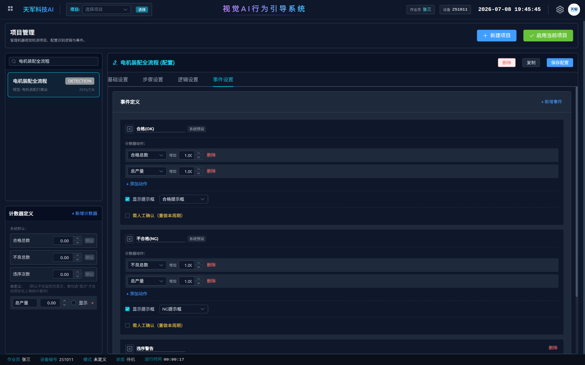

| 事件 | 计数器动作 | 显示提示框 | 需人工确认 |
|---|---|---|---|
| 合格(OK) | 合格总数+1、总产量+1 | ✅ 合格提示框（绿） | 按客户要求 |
| 不合格(NG) | 不良总数+1、总产量+1 | ✅ NG提示框（红） | 按客户要求 |
| 违序警告 | 违序次数+1 | ✅ NG提示框 | 按客户要求 |

计数器在左下「计数器定义」里建：`合格总数 / 不良总数 / 违序次数 / 总产量`。

**「需人工确认」两种玩法**（客户现场二选一）：

- 不勾（默认）：违序只弹提示+计数，产线不停；
- 勾上 + 再勾**「确认后保留周期（断点补做）」**：违序瞬间画面定格、产线停下，班组长确认后**从被打断的那一步继续补做**，已完成的步骤不作废。不勾"保留周期"则确认后整件重做。

## 七、保存、启用、开始检测

1. 右上「保存配置」；
2. 项目列表点「启用当前项目」；
3. 进入**监控**页，点「开始」。

## 八、上线验收（对照截图逐条打勾）

**① 待机就位提示**：工件未到位时画面出现黄色虚线引导框 + "等待工件（工件）就位"：

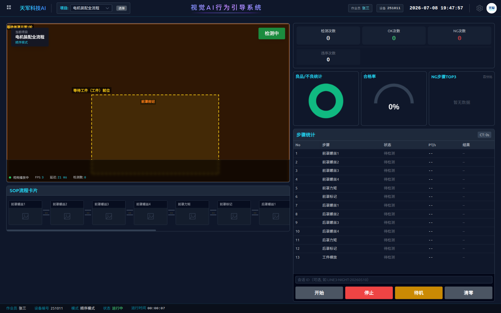

**② 打第一颗螺丝**：画面左上角出现`第1/2轮·前罩`轮次角标；检测框标签显示**前罩螺丝1**（不是"打螺丝"）；右侧步骤统计第 1 行变"已检测"，SOP 卡片出现现场截图：

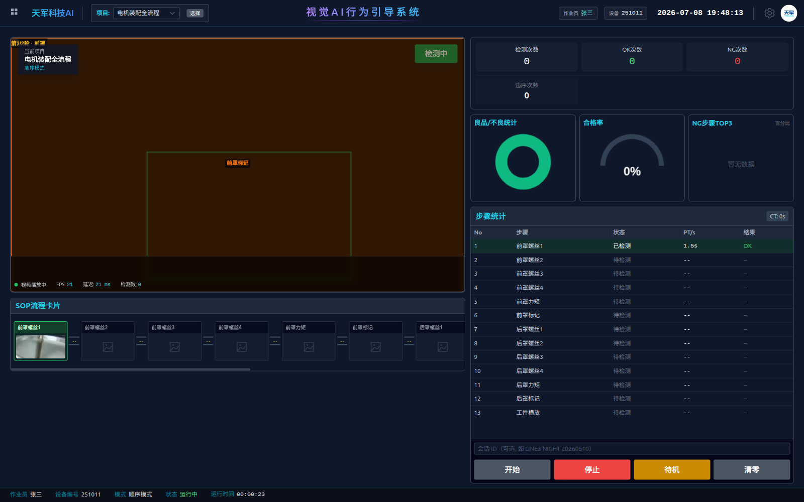

**③ 前罩半程**：对角顺序打完 4 颗 + 力矩 + 标记，步骤统计前 6 行依次点亮：

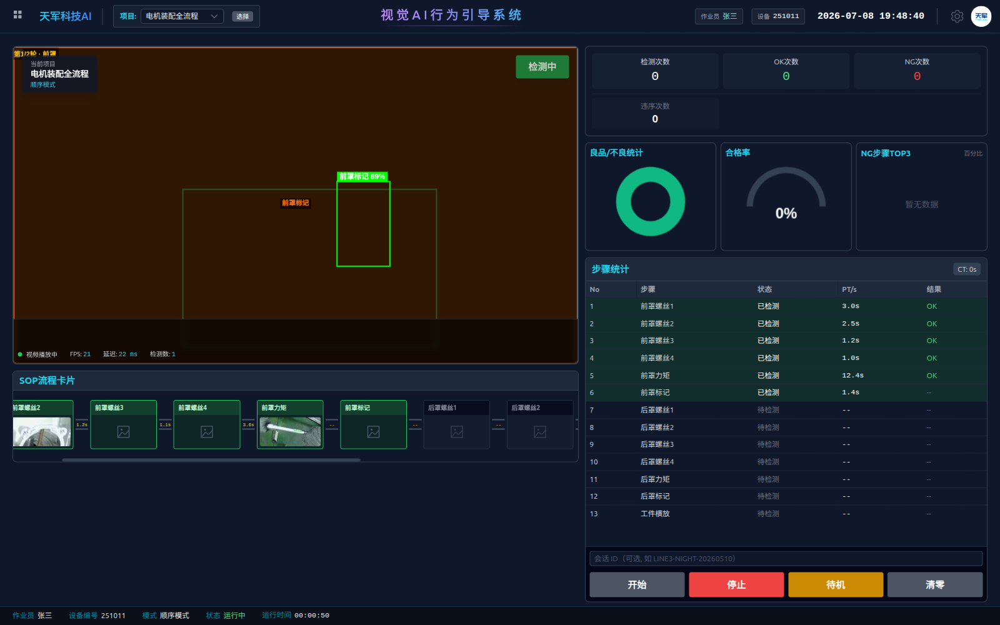

**④ 翻面后**：轮次角标变`第2/2轮·后罩`，后罩 6 步依次点亮，13 步全齐：

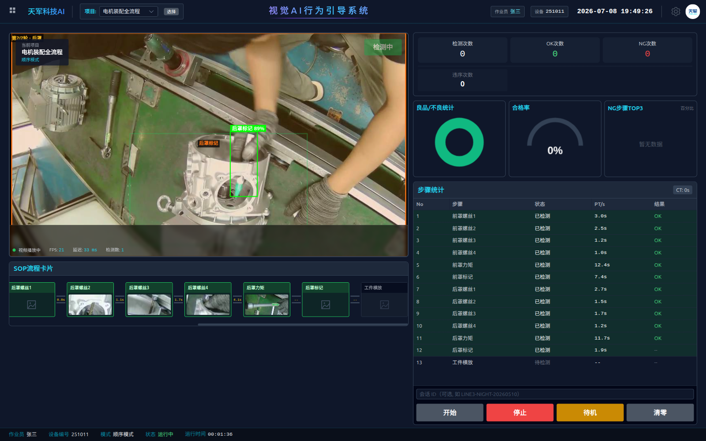

**⑤ 结算**：工件横放收尾、工件被拿走后**约 10 秒**（消失确认走完），右上弹**绿色"合格"提示框**，OK 次数 +1、合格率刷新：

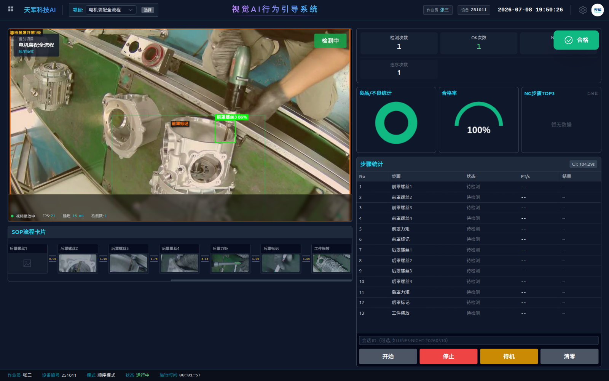

**⑥ 违序试验**（必做）：让工人故意跳打（如 1→3），画面立即弹违序提示、"违序次数"+1，被跳过的步骤不点亮；补打回正确顺序后整件仍可合格落账。

## 九、常见问题速查

| 现象 | 先查什么 |
|---|---|
| 检测框一直显示"打螺丝"而不是"前罩螺丝N" | 拆分规则没启用 / 保存后没重新「启用当前项目」 |
| 螺丝序号张冠李戴 | 锚点基准框没抓（编辑器里要显示"已标定"）；或区域互相压线，把区域画开 |
| 后罩那轮全部报违序 | 轮次错切了：查"盖罩"置信度阈值是否 ≥0.85、离场超过是否 3 秒；起播/开检时机避开上一件的后罩动作 |
| 整件做完不结算 | 工件还留在画面里（横放不离场就不触发）；横放那一段没被检出（查置信度/最短持续 2 秒是否被误调大） |
| 工件拿走后要等很久才弹结果 | 正常现象，横放消失确认 10 秒是刻意留的遮挡桥接窗口；确认离场 10 秒后仍不结算才需要排查 |
| 周期中途就被结算 / 多出只有横放的幽灵周期 | 横放的"最短持续 2 秒 / 消失确认 10 秒"被人调小了——改回去（见第四、五节） |
| 就位提示框不显示 | 就位提示开关没开；`display` 选了"就位后隐藏"且工件一直在位 |
| 合格/NG 不弹提示框 | 事件设置里"显示提示框"没勾 |
| 抓锚点框报"没有检测到工件" | 本次运行还没在监控页启动过检测（模型没进显存）；或当前画面里工件被手/工具挡住——回监控页启动检测、工件摆稳后点停止/待机，再来抓（v3.42.0 起停止/待机状态都能抓，软件会自动现推一帧） |

---

**文档版本**：v1.2（2026-07-17）
**v1.2 变更**：标定操作顺序更新——「抓取锚点框」支持在**停止/待机**状态下自动对当前画面现推一帧（v3.42.0），不再要求检测运行中抓取（检测运行中本来切不进项目页）；FAQ 补对应条目。
**v1.1 变更**：结算方式由"第一步结算+空闲 25 秒"改为**最后一步结算**（横放消失确认 10 秒、空闲 0），第一步结算降为备选；"工件横放"消失确认由 1.5 秒调整为 10 秒并说明遮挡桥接原理；新增模型版本前提（力矩需 v1.1 接触点标法模型，旧模型先按 11 步跑）；补步骤行为参数表截图。
**配套材料**：`标注规范_电机装配打螺丝.md/pdf`（给标注工程师）、模型`电机装配打螺丝`（.pt）
**验收基线**：客户原始视频 95~255 秒（1 个完整工件 + 下一件开头），期望 合格=1 / 不良=0 / 违序=0
