# 装弹逐压计数 Demo 教程 —— 对一条实拍视频自训 YOLO 模型

> **版本**: v1.0（2026-09-11）
> **交付对象**：现场/集成工程师（会用命令行即可，无需算法背景）
> **目标**：拿一条手机实拍视频，半天内做出「已压 n 发」逐压计数的演示视频给客户看
> **本次成绩**：36 秒视频、人工数真值 24 发压入，demo 计数 **24/24 全对，零多计零漏计**

---

## 一、做出来的效果长什么样

最终交付一条带叠加层的回放视频：画面顶部大字实时显示**已压 n 发**，每压一发闪一次绿色 **+1**；画面里模型认出的弹（橙框）、弹匣（蓝框）、手（绿框）逐帧画出，匣口区有弹时亮红框。

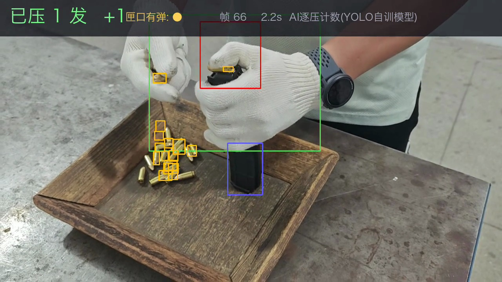

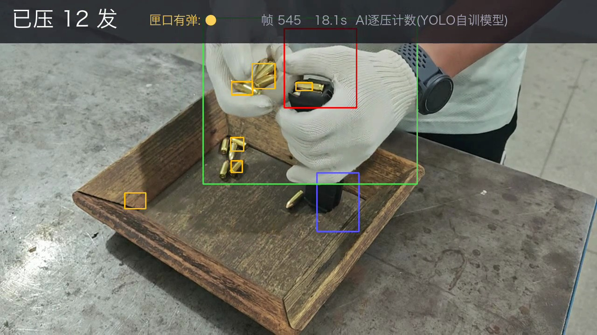

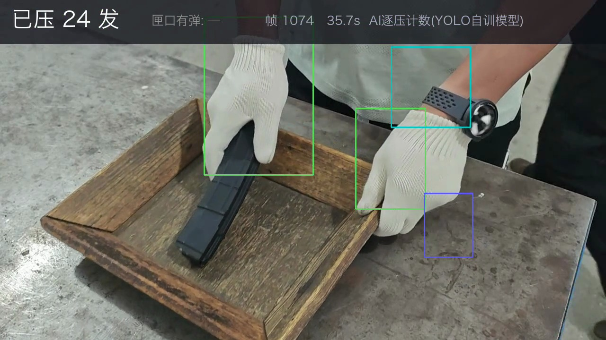

**用料清单**：

| 项 | 本次用的 | 说明 |
|---|---|---|
| 素材 | 手机实拍 1280×720 @30fps，36 秒（1078 帧） | 一个完整装弹周期：抓弹→逐发压入→放回托盘 |
| 标注量 | 180 张（每 6 帧抽 1 张），3 个类别 | 半自动引导 + 人工复核，约 2 小时 |
| 模型 | YOLO11n（最小档，5.5 MB） | Ultralytics 官方预训练权重上微调 |
| 训练耗时 | **6 分钟**（Mac M5 Pro / MPS） | 现场 CUDA 工控机同量级或更快 |
| 计数逻辑 | 约 80 行 Python 状态机 | 见第六节，可直接抄 |

**流程总览（五步，每步对应下文一节）**：

```
抽帧(第四节) → 标注(第四节) → 训练(第五节) → 逐压计数状态机(第六节) → 渲染出片(第七节)
```

---

## 二、为什么要训模型（先看这段，少走弯路）

我们先试过**不训模型**的做法：用颜色规则（黄铜色 HSV 门限）数托盘剩余量，按「守恒记账」推已压数（已压 = 开局总数 − 盘余 − 手持）。结论是**只能数到 17/24**——差的 7 发是「从头到尾没被相机看见的弹」：

- 开局盘中的弹是**叠着的**，底下压着的 3~4 发从未露过脸；
- 开拍时左拳里已经攥着 2~3 发，只露出一两个弹尾；
- 托盘沿高光造成常驻误检，进一步垫高「盘余」。

守恒口径的基线一开始就错了，后面记账再准也追不回来。**这是遮挡的物理问题，不是调参问题。**

要数准，必须换成**逐压计数**：每压一发，当场 +1。它要求认出「匣口上横躺的那发弹」——被手套半遮挡、只露黄铜尾的目标，这正是检测模型擅长、手写颜色规则做不到的。所以：**规则数总量，模型数动作。**

---

## 三、类别设计：只要 3 类

| id | 类别名 | 框什么 | 在计数里干什么用 |
|----|--------|--------|------------------|
| 0 | `弹`（bullet） | 每一发可见的弹，含只露弹尾的 | 落入「匣口区」→ 产生压入信号 |
| 1 | `弹匣`（magazine） | 露在拳头下方的黑色匣体 | 匣口区的**定位锚点** + 位移否决（第六节） |
| 2 | `手`（fist/glove） | 攥握状态的手套拳 | 辅助类，帮模型区分「弹在手里」和「弹在盘里」 |

> 💡 **为什么不做「匣口带弹 / 匣口空」两个状态类？** 状态类边界模糊（带弹到什么程度算带弹？）、正样本少（每次压入只有十几帧）、标注员容易标飘。用「弹」这个实体类 × 「匣口区」几何窗口组合判断，标注省一半，鲁棒性反而更好。**能用几何组合解决的，不要发明状态类。**

---

## 四、抽帧与标注（最花时间的一步，直接决定上限）

### 4.1 抽帧

每 6 帧抽 1 张（30fps → 5 张/秒），1078 帧出 180 张。压弹动作一次持续 20~40 帧，这个密度保证每次压入至少 3~6 张采样：

```python
import cv2
cap = cv2.VideoCapture("装弹.mp4")
i = 0
while True:
    ok, frame = cap.read()
    if not ok: break
    if i % 6 == 0:
        cv2.imwrite(f"images/all/f{i:05d}.jpg", frame)
    i += 1
```

### 4.2 标注规范（配图对照）

工具用 labelImg / X-AnyLabeling 任意一个，输出 YOLO 格式（每图一个同名 txt）。规则就三条：

**① 盘中散弹逐发框，叠着的只框看得见的部分**；弹匣框贴黑色匣体；手框整个攥握的拳：

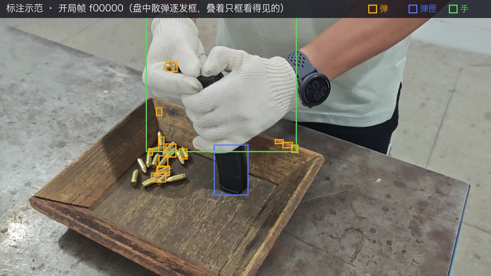

> ⚠️ 上图由半自动引导标注生成，托盘右沿有两个高光误框——**人工复核时必须剔除这类框**，托盘沿高光、木纹阴影是本场景最常见的两种假目标。

**② 匣口横躺的弹是全场最重要的样本，一张都不能漏**。它决定逐压信号的成败——被手指半遮挡时也要框，只框弹体本身：

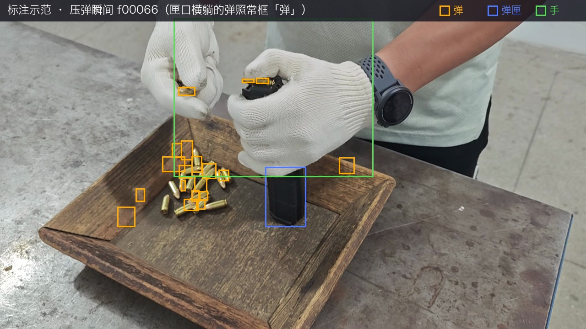

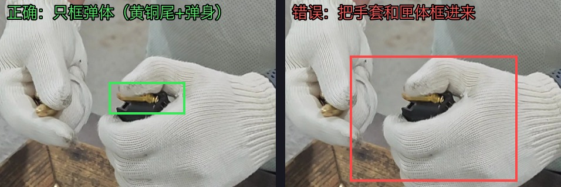

**③ 同一目标相邻帧的框要稳**，宁可略松不要抖（模型框抖 = 信号闪断 = 计数错）。

### 4.3 省力技巧：半自动引导标注

我们没有从零手画 180 张：先用简单颜色规则（黄铜 HSV 门限 + 连通域）批量生成初版框，人工只做**复核修正**——删误框（托盘沿高光）、补漏框（匣口横弹）、修飘框。工作量从 3 小时压到 2 小时以内。没有颜色规则也可以先手标 30 张训一版粗模型，再用粗模型预标注剩下 150 张，人工修正后训正式版（业内叫 model-assisted labeling，YoloVision 训练平台同样支持这个流程）。

### 4.4 训练/验证划分

144 张训练 / 36 张验证，**按时间段切，不要随机打散**——相邻帧几乎一样，随机打散等于用训练集考试，指标会虚高。

---

## 五、训练：一条命令，6 分钟

数据描述文件 `mag.yaml`：

```yaml
path: /Users/tianjun/datasets/mag_demo
train: images/train
val: images/val
names:
  0: bullet
  1: magazine
  2: fist
```

训练命令（Mac 用 `device=mps`，现场 CUDA 工控机用 `device=0`）：

```bash
yolo detect train data=mag.yaml model=yolo11n.pt imgsz=640 epochs=60 batch=8 device=mps
```

60 轮 6 分钟跑完，训练曲线和验证集预测（Ultralytics 自动生成在 `runs/` 下）：

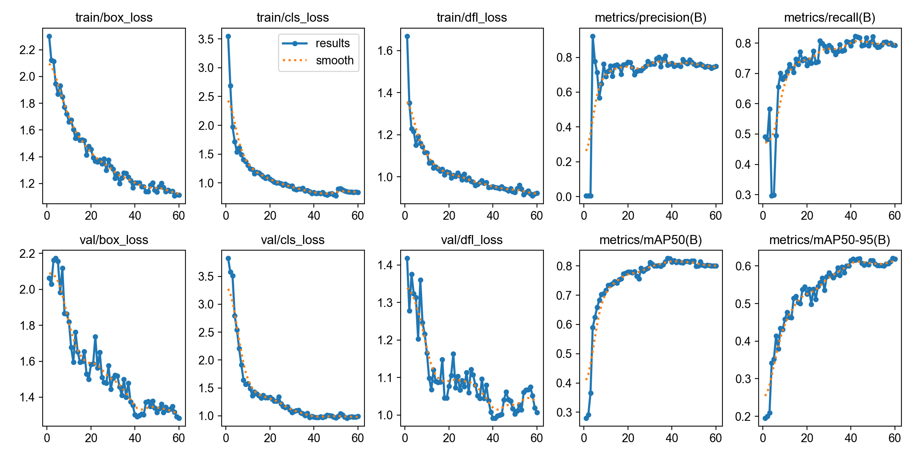

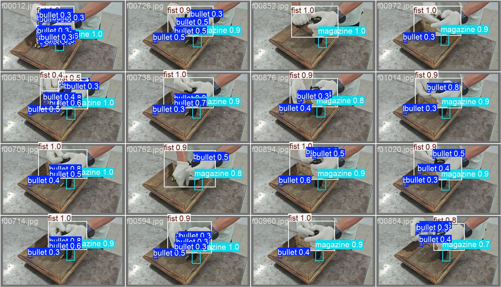

结果：整体 mAP50 = 0.80（弹匣 0.97、手 0.93、弹 0.50）。

> 💡 **「弹」类 0.50 不用慌**。这是对着半自动标注算的指标，分数低一半是标注噪声（引导标注漏的小弹尾被模型检出来反而算「误检」）。**验收看的是最终计数对不对（第八节），不是 mAP。** demo 阶段指标够用就往下走，别在这里刷分。

---

## 六、逐压计数状态机（核心，约 80 行）

### 6.1 匣口区：跟着弹匣走的固定偏移窗

模型每帧给出弹匣框，匣口区 = 弹匣框上方一个固定偏移窗（弹匣被手攥着，露出的匣体在拳下方，压弹发生在拳上沿，所以窗口在匣框上方约 140~310 px、略偏左）。弹匣偶尔丢检就沿用上一帧位置：

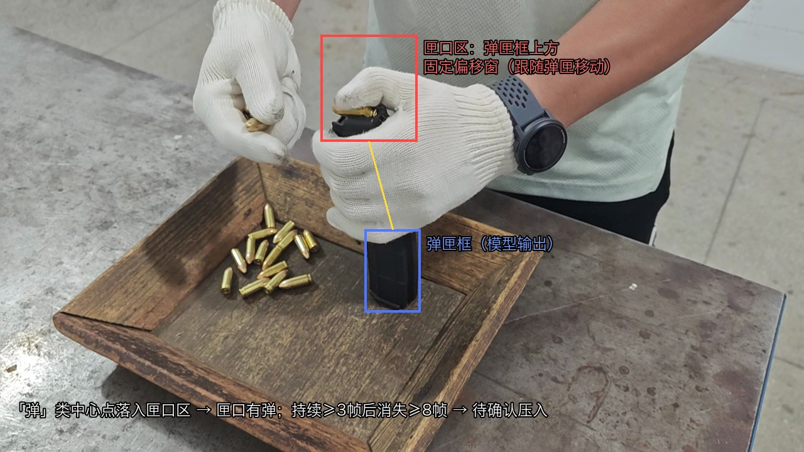

### 6.2 一次压入的信号形态

「弹」类中心点落入匣口区 → 该帧**匣口有弹**。一次真实压入 = 匣口有弹**持续若干帧**（弹被摆上匣口），然后**消失**（被拇指压进匣体）。整段视频的信号时序：

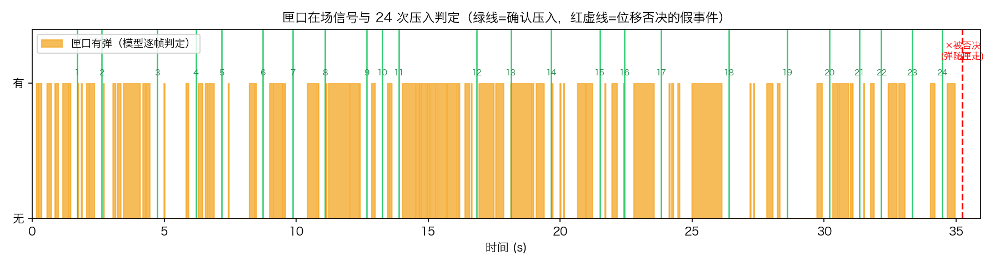

### 6.3 状态机与两个关键防错

判定参数（30fps 下实测值，可直接抄）：

| 参数 | 值 | 含义 |
|---|---|---|
| MIN_RUN | 3 帧 | 匣口连续见弹 ≥3 帧才算「待压」（滤单帧误检） |
| GAP | 8 帧 | 消失 ≥8 帧才算「压入了」（滤手指短暂遮挡） |
| REFRACTORY | 10 帧 | 计数后不应期（防拇指反复遮挡二次计数） |
| PENDING_W | 15 帧 | **延迟确认观察期**（见下） |
| MAG_MOVE_VETO | 100 px | 观察期内弹匣位移超此值 → 作废 |

**防错一：延迟确认 + 位移否决。** 装满后操作员把弹匣放回托盘，露在匣口的最后一发会「随匣消失」——信号形态和真压入一模一样，会假 +1。解法：+1 不立即入账，先挂「待确认」，再观察 15 帧（0.5 秒）：真压入时弹匣原地不动（实测位移 ≤63px），放回托盘时弹匣飞出（4 帧内位移 >180px），一条 100px 阈值干净分开：

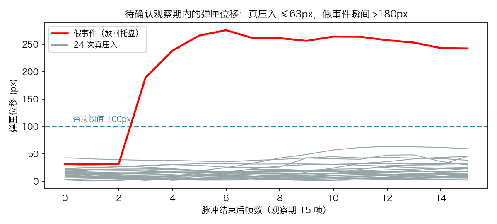

**防错二：锚点冻结。** 位移的参照点取「匣口刚见弹那一刻」的弹匣位置并**冻结**，不逐帧跟随更新——否则弹匣缓慢移动时参照点跟着走，永远量不出位移。

核心代码（完整版在仓库 `tools/demo_mag_press_count.py`）：

```python
class PressCounter:
    def step(self, i, present, mag_center):
        self._resolve_pending(i, mag_center)          # 先结算待确认事件
        if self.state == "idle":
            if present:
                self.run += 1
                if self.run >= MIN_RUN and self.cooldown == 0:
                    self.state = "armed"
                    self.anchor = mag_center          # 锚点在此冻结
        else:  # armed：匣口有弹
            if present:
                self.gap = 0
            else:
                self.gap += 1
                if self.gap >= GAP:                   # 弹消失了 → 挂待确认
                    self.pending.append((i, self.anchor, i + PENDING_W))
                    self.state = "idle"
                    self.cooldown = REFRACTORY

    def _resolve_pending(self, i, mag_center):        # 观察期内逐帧检查
        for fire, anchor, deadline in self.pending:
            if dist(mag_center, anchor) > MAG_MOVE_VETO:
                ...   # 弹随匣走 → 作废，不 +1
            elif i >= deadline:
                self.count += 1                       # 弹匣原地 → 确认压入
```

---

## 七、渲染出片

三条命令跑完全流程（推理结果落 CSV，调参数时不用重复推理）：

```bash
python tools/demo_mag_press_count.py detect   # 全帧推理 → dets.csv（一次即可）
python tools/demo_mag_press_count.py count    # 计数分析，对着真值调参
python tools/demo_mag_press_count.py render   # 渲染成品 overlay.mp4
```

输出 H.264 + faststart 的 mp4，微信直接发给客户能播。

---

## 八、验收口径与已知边界

**验收方法**：人肉对账。逐帧看原视频数出真值（本条 24 发），跑 `count` 子命令比对每一次 press 的帧号和总数。本次结果 24/24 全对，且结尾「放回托盘」的假事件被位移否决正确拦下。

**已知边界（给客户演示时心里有数，被问到能答上）**：

1. **模型是对这条视频自训自测的**——给客户看效果完全成立，但换机位、换光照、换弹种需要补素材重训。上产线的正规做法：多班次多光照采 5~10 条视频、500+ 张标注。
2. **机位是成败关键**。本条视频是斜俯拍手机随手拍，匣口经常被拇指完全遮住，全靠时序逻辑补。上产线建议双视角：**俯拍托盘**（数余量）+ **匣口侧近景**（数压入），逐压信号会干净一个量级。
3. 计数确认有 0.5 秒延迟（观察期），实时显示无感，但要知道它存在。
4. 转正式功能的路径：本 demo 的「实体类 × 几何区 × 时序状态机」和主程序**区域事件模式**（region_events）的动作规则引擎同构，模型换成正式训练版后可以走主程序原生配置承载，不需要为它发明新模式。

---

## 附录：本次 demo 的文件清单

| 内容 | 路径 |
|---|---|
| 数据集（180 张图 + 标注 + mag.yaml） | `~/datasets/mag_demo/` |
| 训练产物（best.pt 5.5MB + 曲线） | `~/datasets/mag_demo/runs/v1/` |
| 推理+计数+渲染脚本 | 仓库 `tools/demo_mag_press_count.py` |
| 半自动引导标注脚本 | 仓库 `tools/mag_demo_dataset.py` |
| 颜色规则版（守恒计数，教训版） | 仓库 `tools/demo_mag_load_count.py` |
| 成品演示视频 | 本目录 `成品演示_装弹逐压计数24发.mp4` |
