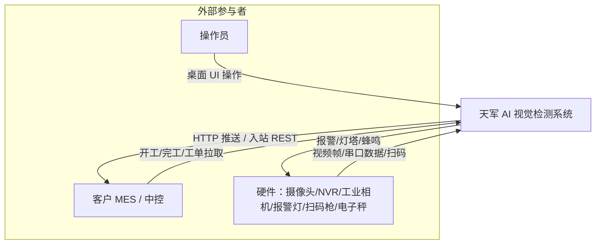

# 系统上下文（C4 L1）

> **类型**：explanation（架构 · arc42 §3）
> **本文不讲**：容器内部怎么拆（→ [02_容器视图.md](02_容器视图.md)）
> **与代码冲突时**：以代码为准。

系统边界：天军运行在工控机本地，与外部系统通过 HTTP/串口/扫码枪/MES 协议交互。

## 边界说明

| 外部实体 | 交互方式 | 系统侧落点 |
|---|---|---|
| 操作员 | Electron 桌面 UI | `frontend/` + `electron/` |
| 摄像头/NVR/文件/虚拟源 | RTSP/文件/海康 SDK/剧本 JSON | `backend/api/source*.py` |
| 报警设备 | 串口 Modbus 等 | `backend/api/alarm.py` + 共享灯柱合成 |
| 扫码枪 | USB 键盘/WMax/网络 | `backend/services/scanner.py` |
| 电子秤/外设 | 串口协议 | `backend/services/external_device*.py` |
| 客户 MES | HTTP 出站推送 + 入站 REST | `mes_gateway.py` / `mes_inbound.py` |
| 集群副机 | HTTP 心跳 + 周期上报 | `cluster_collector.py` |

## 不在系统边界内

- 客户 ERP/MES 服务端实现细节
- 模型训练流水线（仅加载已转换模型推理）
- 插件作者的业务系统（插件通过 hook/API 与主程序交界）

## 代码位置

- 路由总览：`backend/api/router_manifest.py`
- MES 出站：`backend/services/mes_gateway.py`
- MES 入站：`backend/services/mes_inbound.py`
- 集群：`backend/services/cluster_collector.py`
