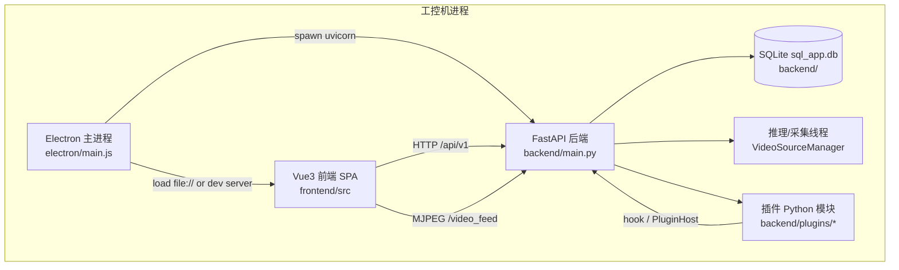

# 容器视图（C4 L2）

> **类型**：explanation（架构 · arc42 §5）
> **本文不讲**：分层 import 规则（→ [03_分层依赖规则.md](03_分层依赖规则.md)）
> **与代码冲突时**：以代码为准。

## 六容器职责

| 容器 | 技术 | 职责 | 关键入口 |
|---|---|---|---|
| Electron 壳 | Node 32+ | 启后端、License、Splash、8 步关机、崩溃恢复、日志落盘 | `electron/main.js` |
| 前端 SPA | Vue3 + Pinia + Element Plus | 监控/项目/数据/MES/设置 UI；轮询检测状态；MJPEG 显示 | `frontend/src/main.js` |
| FastAPI 后端 | Python 3.10 + uvicorn | REST API、ORM、业务编排、插件加载 | `backend/main.py` → `router_manifest.py` |
| SQLite | 单文件 WAL | Session/Cycle/Step、MES、配置、插件登记 | `backend/db/database.py` |
| 推理采集 | OpenCV + PyTorch/YOLO | 每通道 VideoSourceManager：采帧→推理→状态机→落库 | `backend/api/source.py` |
| 插件模块 | 签名包解压 | 客户定制 hook/路由/UI；错误隔离 | `backend/plugin_system/` |

## 进程与线程（容器内）

- **uvicorn worker**：处理 HTTP（async 路由 + 同步 ORM）
- **每通道采集线程**：`_capture_loop`（source mixin 体系）
- **MES Hook worker**：单线程消费 `mes-hook-worker`（`mes_hooks.py`）
- **报警/外设/集群**：各有后台线程或定时器（见 [04_横切概念.md](04_横切概念.md)）

## 部署形态

- 出厂：Inno Setup 一键包（conda-pack 环境 + Nuitka 编译核心 `.pyd` + Electron）
- 开发：`tianjun` conda env + Vite dev server + uvicorn（见 [getting-started.md](../getting-started.md)）

## 代码位置

- Electron 启后端：`electron/backend-manager.js`
- 前端 API baseURL：`frontend/src/api/index.js`
- 路由挂载：`backend/api/router_manifest.py`
