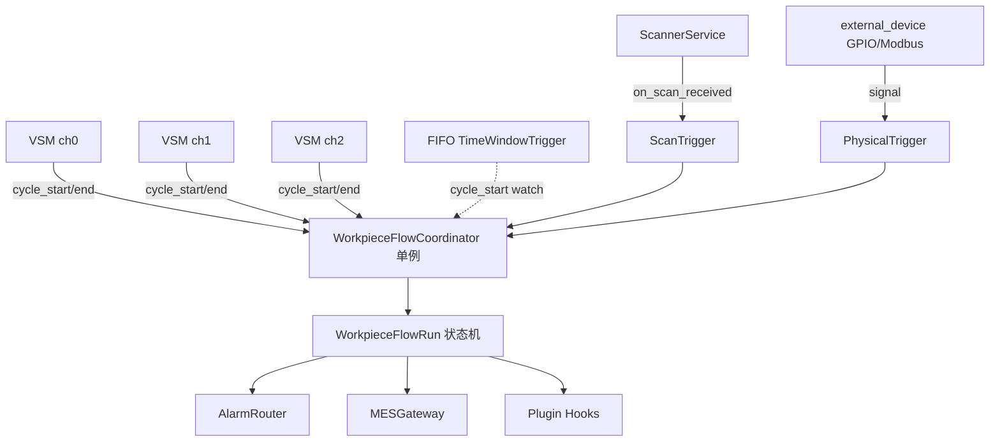
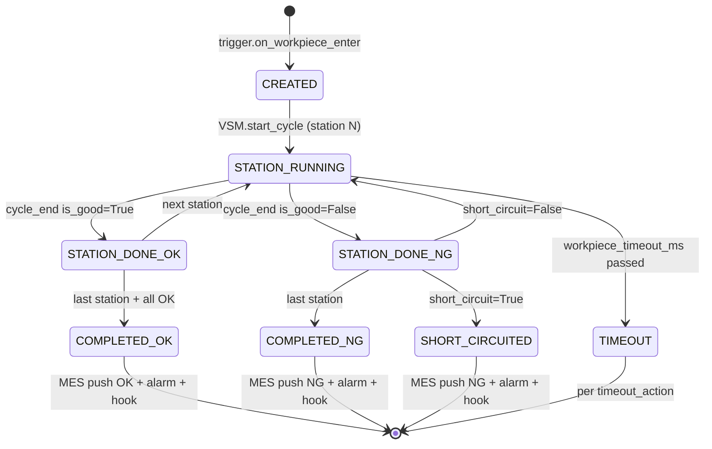
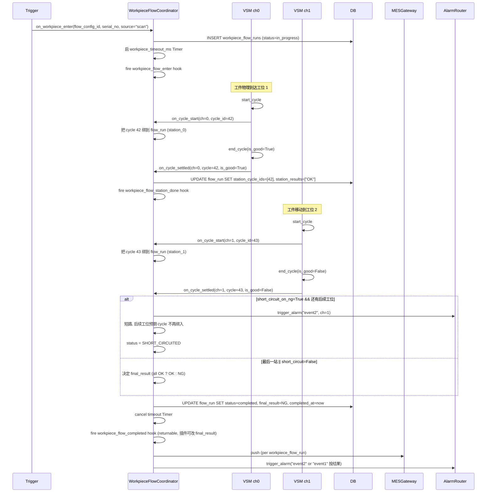

# 11 — 串行流水线（WorkpieceFlow）主程序原生 RFC

> 适用版本：基于 v3.13.x 主线（v3.14.0 引入）
> 本文目的：把"单机内多工位 **串行流水线** 结算"作为主程序**原生概念**落地。同一工件依次走过 N 个摄像头工位，全部 OK 才算合格。
>
> **关键边界**：
> - 串行流水线（L2）跟工位组并行联动（L1, RFC 10）是**同一台机器上的两层正交概念**：并行=多摄像头同时拍同一工件不同侧面；串行=多摄像头沿流水线依次拍同一工件不同阶段
> - 串行流水线（L2）跟集群（L3, cluster）也是**两层正交概念**：L2 是单机内工件流转；L3 是多机产品/箱聚齐
> - 启用流水线时与工位组**互斥**（同一工位不能同时属于并行组和串行组）
>
> 阅读前置：`design/00_overview.md`、`design/09_v3_13_platform_upgrade_rfc.md`、`design/10_channel_group_rfc.md`、AGENTS.md 第六·四节（多通道管理）+ 第六·七节（扫码器）。

---

## 一、动机与现状

### 1.1 真实需求

**客户场景**（福建金龙等多家）：

> 单台工控机 + N 个摄像头沿流水线依次排开 → 同一个工件被传送带送过 N 个工位 → 每个工位检测一部分工序（例：工位 1 检"正面涂黑/翻转/反面涂黑"3 步，工位 2 检"放置/压墨"2 步）→ 全部工位的工序都 OK 才算工件合格。

**与 v3.13 工位组（RFC 10）的本质差异**：

| 维度 | RFC 10 ChannelGroup（**并行合一**）| RFC 11 WorkpieceFlow（**串行流转**，本 RFC）|
|---|---|---|
| 物理形态 | 多摄像头**同时**拍同一工件不同侧面 | 多摄像头沿流水线**依次**拍同一工件不同阶段 |
| 工件流动 | 工件**不动**，多摄像头各拍各的 | 工件**移动**，依次经过多个工位 |
| 各工位 cycle 时间 | 时间相近，几乎同时 cycle_end | **错时**，工位 1 先结束，过段时间工位 2 再结束 |
| 工序定义 | 各工位检不同侧 / 不同特征 | 各工位检**不同阶段**的工序 |
| 同步抓手 | 时间窗（cycle_end 接近就当一组）| **必须有"同一工件"的标识**才能关联 |
| 结算策略 | any_ng / all_ok | all_ok（全过才算合格）+ short_circuit（任一 NG 立即停后续）|
| 类比 | 多角度合一张大照 | 串行安检通道，先扫包再扫人 |

### 1.2 客户级 workaround 评估

不做主程序原生、纯走 RFC 09 插件能不能解决？答：**不行**：

- 插件层 `cycle_end` hook 只能后端事后挂钩，但**跨工位"同一工件"标识**需要在 cycle_start 之前就确定，插件 hook 介入太晚
- 插件需要写另一通道的 cycle 字段 / 调度另一通道的 cycle_start，违反 G1 命名空间 + channel scope 越权原则
- 工件级 FIFO 队列管理（多个工件同时在线追）涉及进程级单例 + 状态机 + 线程安全，是基础设施层职责
- 三种触发模式（扫码 / 时间窗 / 物理 GPIO）都需要直接接入主程序的 ScannerService / ChannelManager / external_device 子系统

所以串行流水线必须做成**主程序原生**，沿用 RFC 10 的设计哲学：**协调器单例 + 状态机 + hook 留口**。

### 1.3 现有"工件"概念盘点（必须先看清楚再设计）

| 概念 | 文件 | 串行流水线场景下的复用 |
|---|---|---|
| `Workpiece` 表 | `backend/models/mes_models.py:114` | **直接复用**做工件追溯（`serial_no` + `raw_barcode`）|
| `WorkpieceInspection` 中间表 | 同上:162 | **直接复用**记一个工件被多个工位多次检测（`(workpiece_id, cycle_id)` 一对多 + `inspection_seq` + `channel_id`）|
| `ScannerDevice.broadcast_channels` | 同上:287 | **直接复用**做"一扫码器入口广播多工位"|
| `DetectionCycle.channel_group_id` / `group_settle_result` / `group_settled_with` | `backend/models/models.py:233` | **语义扩展复用**做"工件级合并结果"标识（v1 暂不动这三个字段，避免与 RFC 10 语义冲突；v2 评估是否合并）|
| `scan_pair` 状态机 | `backend/services/mes_hooks.py:733` | **不复用**（语义冲突，启用 Flow 时禁用同组工位的 scan_pair）|
| `mes_hooks.on_scan_received` | 同上:381 | **直接复用**做 ScanTrigger 的入口 |
| `cluster.box_serial` / `BoxAggregation` | `backend/services/cluster_collector.py` | **不在 v1 范围**（v1 工件流完成只推 MES 一次，不接入 box 汇总；v2 评估）|

**结论**：90% 数据模型可复用，新增成本主要在 **`WorkpieceFlowCoordinator` 协调器** + **3 个 Trigger** + **2 张新表（配置 + 历史 run）**。

---

## 二、目标与反目标

### 2.1 目标

| 目标 | 说明 |
|---|---|
| **支持单机内 2/3/4 工位的串行流水线结算** | 同一工件依次走过所有工位，全 OK 才算合格 |
| **支持三种触发模式** | 扫码绑定 / 时间窗 FIFO / 物理 GPIO（v1 留接口，M7 实现）|
| **支持短路** | 任一工位 NG 立即停后续工位（节省检测资源）|
| **支持工件超时探测** | 工件流转超时（在某工位卡住或物理丢失），按 timeout_action 处理 |
| **支持多工件并行追踪** | FIFO 队列，同时追 N 个 in-flight 工件（默认上限 3）|
| **零差异默认**：项目不开 WorkpieceFlow 时，所有通道按 v3.13 行为字节级一致 |
| **与 RFC 10 ChannelGroup 互斥但共存** | 同台机器上可以同时配多个 group 和多个 flow，但同一工位不能同时属于两者 |
| **给插件留 5 个 hook + 1 个 slot** | 客户级变种走插件（最终结果合并、超时策略等）|

### 2.2 反目标

| 反目标 | 原因 |
|---|---|
| ❌ 不做"跨机串行流水线" | 跨机靠 cluster (L3) 解决，单机就 N 个工位足够 |
| ❌ 不做工件返工流转（v1） | v2 加 `Workpiece.status='rework'` 重新走 flow |
| ❌ 不做 Flow→Box 联动（v1） | 工件流完成只推一次 MES，cluster 端按现有 box_serial 逻辑独立汇总。v2 评估联动 |
| ❌ 不做多 worker 进程支持 | uvicorn `--workers > 1` 时协调器单例失效，明示客户必须单 worker。v2 搬 Redis |
| ❌ 不做进程重启状态恢复 | 进程重启时 in-flight workpiece flow 全部 `aborted`，不做磁盘持久状态机（避免引入复杂的一致性约束）|
| ❌ 不做 FIFO 模式下的乱序到达自动纠正 | FIFO 固有风险，文档明示"无扫码场景**强烈推荐**升级硬件加扫码器"|
| ❌ 不做工位组级别的录像拼接 | 录像按 channel 各自走，前端可视化层做合并显示 |

---

## 三、数据模型

### 3.1 新增：`workpiece_flow_configs` 表

```python
# backend/models/mes_models.py
class WorkpieceFlowConfig(Base):
    """流水线串行结算配置（v3.14+）。

    与 channel_groups (RFC 10) 平级，不污染并行模型。
    一台机器可以有 0~N 个 flow 配置，每个 flow 管 2~N 个有序工位。
    """
    __tablename__ = "workpiece_flow_configs"
    __table_args__ = (
        Index("ix_workpiece_flow_enabled", "enabled"),
    )

    id = Column(Integer, primary_key=True, index=True)
    name = Column(String(64), nullable=False, unique=True)
    enabled = Column(Boolean, default=False)

    # 有序工位列表 (流水线方向). 例 [0, 1, 2] 表示工件从工位 0 → 1 → 2
    station_channel_ids = Column(JSON, nullable=False)

    # 触发模式: scan / time_window / physical
    trigger_mode = Column(String(16), nullable=False, default="time_window")

    # --- scan 模式专属 ---
    scan_device_id = Column(Integer,
                            ForeignKey("scanner_devices.id", ondelete="SET NULL"),
                            nullable=True)
    # entry: 入口扫一次, 广播全部工位 (依赖 ScannerDevice.broadcast_channels)
    # each_station: 每工位前都扫一次 (更可靠, 防错绑)
    scan_bind_strategy = Column(String(16), default="entry")

    # --- time_window 模式专属 ---
    # FIFO 队列上限 (同时追 N 个 in-flight 工件)
    fifo_max_in_flight = Column(Integer, default=3)
    # 工位间 cycle_end → 下一工位 cycle_start 的预期时间窗 (毫秒)
    cycle_to_cycle_window_ms = Column(Integer, default=15000)

    # --- physical 模式专属 (v1 留接口, M7 实现) ---
    physical_trigger_config = Column(JSON, nullable=True)
    # 例: {"device_id": 1, "channel_signal_map": {"0": "io_in_1", "1": "io_in_2"}}

    # --- 通用 ---
    # 结算策略: all_ok_required (v1 默认且唯一)
    settle_strategy = Column(String(16), default="all_ok_required")
    # 任一工位 NG 立即停后续工位检测
    short_circuit_on_ng = Column(Boolean, default=True)
    # 单工件超时 (从入口算, 毫秒)
    workpiece_timeout_ms = Column(Integer, default=60000)
    # 超时动作: force_ng / drop / alarm_only
    timeout_action = Column(String(16), default="force_ng")

    plugin_data = Column(JSON, nullable=True)

    created_at = Column(DateTime(timezone=True), server_default=func.now())
    updated_at = Column(DateTime(timezone=True), server_default=func.now(), onupdate=func.now())
```

### 3.2 新增：`workpiece_flow_runs` 表

```python
class WorkpieceFlowRun(Base):
    """工件流转记录（每次工件流转一行）。

    与 Workpiece 表的差异:
    - Workpiece 是"工件实体" (一个工件可能被多次返工检测)
    - WorkpieceFlowRun 是"一次流转事件" (从入口到出口的一次完整流转)
    - 一个 Workpiece 可以有多个 flow_runs (返工场景), 但 v1 不做返工
    """
    __tablename__ = "workpiece_flow_runs"
    __table_args__ = (
        Index("ix_flow_run_config", "flow_config_id"),
        Index("ix_flow_run_status", "status"),
        Index("ix_flow_run_serial", "serial_no"),
    )

    id = Column(Integer, primary_key=True, index=True)
    flow_config_id = Column(Integer,
                            ForeignKey("workpiece_flow_configs.id", ondelete="CASCADE"),
                            nullable=False, index=True)
    workpiece_id = Column(Integer,
                          ForeignKey("workpieces.id", ondelete="SET NULL"),
                          nullable=True, index=True)

    flow_uuid = Column(String(32), unique=True, nullable=False, index=True)
    # 扫码值 (scan 模式) 或 FIFO 自生成 (time_window 模式)
    serial_no = Column(String(128), nullable=True, index=True)

    # 状态机: in_progress → completed/timeout/short_circuited/aborted (终态)
    status = Column(String(16), nullable=False, default="in_progress")

    # 各工位 cycle 关联 (按 flow_config.station_channel_ids 顺序对齐). 例 [42, 43, 44]
    station_cycle_ids = Column(JSON, nullable=True)
    # 各工位结果 (与 station_cycle_ids 同序). 例 ["OK", "OK", "NG"]
    station_results = Column(JSON, nullable=True)
    # 最终合并结果 (OK / NG / NULL=in_progress)
    final_result = Column(String(8), nullable=True)

    # 触发信息 (审计 / 回溯用)
    trigger_mode = Column(String(16), nullable=True)
    trigger_source_id = Column(Integer, nullable=True)  # 扫码器 ID / 物理设备 ID 等

    started_at = Column(DateTime(timezone=True), server_default=func.now())
    completed_at = Column(DateTime(timezone=True), nullable=True)

    flow_config = relationship("WorkpieceFlowConfig")
    workpiece = relationship("Workpiece")
```

### 3.3 启动迁移

`backend/main.py:migrate_database()` 新增：

```python
# v3.14.0: workpiece_flow_configs / workpiece_flow_runs 两张新表的 schema
# 由 Base.metadata.create_all 自动建. 老库需要 ALTER TABLE 兼容:
# 这两张表全新, 无字段补丁, 仅需 create_all.
```

不动现有任何表的字段（保证 v3.13 → v3.14 升级零数据迁移风险）。

---

## 四、运行时架构

### 4.1 协调器单例



**协调器职责**：

1. 持有所有 enabled flow 的内存快照（`_flows: Dict[int, FlowConfig]`）
2. 维护 in-flight workpiece flow runs（`_in_flight: Dict[flow_uuid, FlowRunState]`）
3. 接收三种 Trigger 的 `on_workpiece_enter` 信号 → 注册新 flow run
4. 接收 VSM 的 `on_cycle_settled` 信号 → 推进 flow run 状态机
5. 管理超时 timer（`threading.Timer`，跟 ChannelGroupCoordinator 一致）
6. 完成时触发 hook + 调 `WorkpieceService.set_result` + 推 MES + 触发报警
7. 提供查询 API（PluginHost 也通过这里查 in-flight 状态）

**线程模型**：
- 进程内单例（惰性初始化）
- 所有内部状态由 `threading.Lock` 保护
- Trigger 调进来不阻塞：仅 dict 更新 + fire hook（hook 自带错误隔离）
- Timer 用 `threading.Timer`（daemon=True）

### 4.2 工件流转状态机



### 4.3 端到端时序图



---

## 五、三种 Trigger

### 5.1 抽象基类

`backend/services/flow_triggers/base.py`:

```python
class FlowTriggerBase(ABC):
    """工件流转触发器抽象 (策略模式)."""

    def __init__(self):
        self._coordinator = None
        self._config = None
        self._attached = False

    def attach(self, coordinator, config):
        """绑定到协调器 + flow_config. 注册必要的回调/监听器."""
        self._coordinator = coordinator
        self._config = config
        self._on_attach()
        self._attached = True

    def detach(self):
        """卸载 + 清理回调/监听器."""
        if not self._attached:
            return
        self._on_detach()
        self._attached = False

    @abstractmethod
    def _on_attach(self): ...

    @abstractmethod
    def _on_detach(self): ...
```

### 5.2 TimeWindowTrigger (FIFO)

**场景**：无扫码器，工件在传送带上按 FIFO 顺序到达各工位。

**实现要点**：
- 监听**第一个工位**的 `mes_hooks.on_cycle_start`
- 每收到一个 ch0 cycle_start → 自动生成 `serial_no = f"auto-{flow_id}-{uuid4().hex[:8]}"` → 调 `on_workpiece_enter`
- 后续工位的 `on_cycle_start` 按 FIFO 顺序绑到队列头的 flow_run
- `fifo_max_in_flight` 超出时拒绝新工件入队（触发 alarm + log）

**已知弱点（文档明示）**：
- 工件跳过某工位 → 后续工位的 cycle 错绑到上一工件 → 该工件超时 NG，下一工件结果也错
- 节拍抖动严重时容易错绑
- **强烈推荐**升级硬件加扫码器

### 5.3 ScanTrigger (扫码绑定)

**场景**：流水线入口（或每个工位前）有扫码器。

**实现要点**：
- `scan_bind_strategy="entry"`：入口扫一次，依赖 `ScannerDevice.broadcast_channels` 把工件号同时推送给所有工位
- `scan_bind_strategy="each_station"`：每工位前都扫一次，二次扫到同 serial_no 时**幂等去重**（1 秒内的重复扫码忽略）
- 监听 `mes_hooks.on_scan_received`（在 hook 链路里挂一层 ScanTrigger 适配器）
- 扫码触发 → 调 `on_workpiece_enter(serial_no=barcode, source="scan", trigger_source_id=device_id)`
- 复用已有的 `Workpiece` 表：扫到的码先调 `WorkpieceService.create_or_get_by_barcode`，拿到 `workpiece_id` 写到 `WorkpieceFlowRun.workpiece_id`

**与 scan_pair 的互斥**：
- 启用 flow 时把 `station_channel_ids` 里的工位的 scanner 配置加一个**禁用 scan_pair**的运行时 flag
- 防御性：ScannerService 的 scan_pair 路径里判断 "本工位是否属于某 flow"，是则跳过 scan_pair

### 5.4 PhysicalTrigger (GPIO / Modbus)

**场景**：流水线入口有光电开关 / 接近开关，触发 IO 信号。

**实现要点（v1 仅留接口，M7 实现）**：
- 复用 `backend/api/external_device.py` 的 IO 通道
- `physical_trigger_config` JSON 配置：`{"device_id": 1, "entry_signal": "io_in_1", "station_signals": ["io_in_2", "io_in_3"]}`
- 信号触发时调 `on_workpiece_enter(serial_no=f"phy-{counter}", source="physical")`
- 物理触发模式下 serial_no 是自增 counter，没有客户级业务含义

---

## 六、与现有子系统的互操作边界

| 子系统 | 共存策略 |
|---|---|
| **RFC 10 `ChannelGroup`** | 同工位**不能同时**属于 flow 和 group。API 创建/启用时双向校验，前端 Settings 显示冲突警告。已属于某 group 的工位 → POST flow 该工位时 422。已属于某 flow 的工位 → POST channel-group 含该工位时 422。 |
| **`cluster`（机器间）** | L2 完成时正常推 MES（per flow_run）；cluster 端按现有 `box_serial` 逻辑独立汇总。v1 不做 flow→box 联动。 |
| **`scan_pair`（v3.3）** | flow 启用时禁用同组工位的 scan_pair（互斥），文档明示。 |
| **`mes_hooks.on_scan_received`** | ScanTrigger 在 hook 链路里挂一层适配器，**先**判断本通道是否属于某 flow，是则走 flow 路径不再走原 scan_pair。 |
| **`Workpiece` 体系** | flow 完成时调 `WorkpieceService.set_result(workpiece_id, is_good=...)` 写工件最终结果，复用现有 MES 推送链。 |
| **`AlarmRouter`** | flow 完成 / 短路 / 超时时直接调 `trigger_alarm`（参考 RFC 10 v3.13.1 alarm 联动），错误隔离。 |
| **插件 hook 链路** | 5 个新 hook 接入 `hook_dispatch.RETURNABLE_HOOK_FIELDS`，沿用 RFC 09 现有 dispatcher。 |
| **集群副机心跳** | flow 配置不下发 slave，slave 仍按独立工位运行。host 的 flow 跟 slave 完全无关。 |

---

## 七、插件 hook + slot

### 7.1 新增 5 个 hook

`backend/plugin_system/hook_dispatch.py`:

```python
RETURNABLE_HOOK_FIELDS = {
    # ... 已有 RFC 09 / RFC 10 hook
    "workpiece_flow_enter": set(),
    "workpiece_flow_station_done": set(),
    "workpiece_flow_completed": {"override_final_result"},
    "workpiece_flow_timeout": {"override_timeout_action"},
    "workpiece_flow_short_circuit": set(),
}
```

**典型客户级变种用例**：

```python
# 跨工位质量分加权后修正最终结果
def on_workpiece_flow_completed(ctx):
    quality_scores = [c.confidence_avg for c in ctx["station_cycles"]]
    weighted = sum(quality_scores) / len(quality_scores)
    if weighted < 0.85:
        return {"override_final_result": "NG"}
    return None
```

### 7.2 新增 1 个 UI slot

`monitor.workpiece-flow.indicator`：
- 主程序默认实现：当前 in-flight 工件列表（serial_no + 当前所在工位 + 进度条）
- 客户插件可覆盖：定制化的流水线可视化（如带工位图标的横向流程图）

### 7.3 PluginHost 主动 API

`PluginHost.list_workpiece_flows()` / `query_workpiece_flow_state(flow_id)` / `query_in_flight_workpieces(flow_id)` —— 同 RFC 10 通道组 API 设计原则（snapshot 返回，不暴露内部 dict）。

---

## 八、API

### 8.1 REST 端点

`backend/api/workpiece_flows.py`（挂在 `/api/v1/workpiece-flows/*`）：

| 端点 | 方法 | 权限 | 说明 |
|---|---|---|---|
| `/workpiece-flows/` | GET | `system.workpiece_flow.view` | 列表 |
| `/workpiece-flows/` | POST | `system.workpiece_flow.manage` | 创建（校验工位连续性 + 与 channel_groups 互斥）|
| `/workpiece-flows/{id}` | GET | `system.workpiece_flow.view` | 详情 |
| `/workpiece-flows/{id}` | PUT | `system.workpiece_flow.manage` | 更新（enabled toggle 时 coordinator reload）|
| `/workpiece-flows/{id}` | DELETE | `system.workpiece_flow.manage` | 删除（必须 `enabled=False`）|
| `/workpiece-flows/{id}/state` | GET | `system.workpiece_flow.view` | 当前 in-flight 工件状态（诊断用）|
| `/workpiece-flows/{id}/runs` | GET | `system.workpiece_flow.view` | 历史 flow runs（分页 + 过滤）|
| `/workpiece-flows/runs/{run_id}` | GET | `system.workpiece_flow.view` | 单个 run 详情（含各工位 cycle 截图链接）|

### 8.2 权限定义

`backend/core/permissions.py` 新增：

```python
"system.workpiece_flow.view": "查看流水线串行配置与 run 历史",
"system.workpiece_flow.manage": "管理流水线串行配置（创建/修改/删除/启用）",
```

内置角色 `engineer` 加入 `system.workpiece_flow.*` 全套；`operator` 仅 `view`。

### 8.3 Pydantic Schema

`backend/schemas/workpiece_flow.py`：
- `WorkpieceFlowConfigCreate` / `Update` / `Read`
- `WorkpieceFlowRunRead`
- `WorkpieceFlowStateSnapshot`（in-flight 工件列表）

---

## 九、UI

### 9.1 Settings 加 Tab "流水线串行"

- 复用 v3.13.1 已交付的 `settings.tab` slot（其实主程序自带，不走 slot）
- 形态：与 RFC 10 "通道组" tab 平级
- 内容：
  - 顶部：流水线列表 + 启用/禁用 toggle
  - 创建/编辑表单：触发模式下拉 → 表单字段动态切换（scan/time_window/physical）
  - 工位连续性预检：把同组的 channel_id 拖拽排序
  - 启用前校验：与 channel_groups 互斥、scanner 存在性、工位数 >= 2

### 9.2 Monitor 加 indicator slot

`monitor.workpiece-flow.indicator`（新增）：
- 主程序默认实现：横幅式展示当前 in-flight 工件（最多 3 个 / FIFO 上限），每个显示：
  - `serial_no` (8 字符截断)
  - 已通过的工位（绿色勾）
  - 当前所在工位（蓝色脉动）
  - 待检工位（灰色）
- 客户级可通过 RFC 09 插件覆盖此 slot

---

## 十、边缘场景

| 场景 | 处理 |
|---|---|
| **跳工位**：工件物理跳过工位 2 直奔工位 3 | 超时探测捕获 → 触发 `workpiece_flow_timeout` hook → force_ng（默认）|
| **乱序到达**（FIFO 模式）：工件 #2 比 #1 先到工位 3 | 按 cycle_start 顺序绑入对应 flow_run，**可能错绑**。文档明示，推荐升级硬件 |
| **暂停/恢复**：用户在 Monitor 点"停止" | in-flight flow runs 全部标 `aborted`，状态写库 + 不推 MES |
| **跨扫码器去重**：同一 barcode 1 秒内被多个扫码器扫到 | 用 `serial_no` 在 `_in_flight` dict 里去重，二次扫到忽略并 log |
| **多工件并行**：`fifo_max_in_flight=3` 时同时追 3 件 | 队列满时第 4 件触发 alarm + reject + log |
| **工件返工**（v1 不做）| 用户必须先把当前 in-flight clear 再扫返工件；v2 引入 `Workpiece.status='rework'` |
| **进程重启**：进程崩溃 / 升级 | 启动时把 status='in_progress' 的全部标为 `aborted`（不做磁盘状态机持久化）|
| **多 worker（多进程）**：uvicorn `--workers > 1` | **协调器单例失效**，必须单 worker。v2 评估 Redis 方案 |
| **scan_pair 冲突**：flow 启用时同工位 scan_pair 也启用 | 启动时 / API 启用时校验，scan_pair 自动跳过该工位 + log warning |
| **超时与短路同时发生**：工位 1 NG 短路同时 workpiece_timeout 触发 | 短路先生效（事件先到），timeout 走入终态时见 status='short_circuited' 直接 return |
| **配置变更时有 in-flight**：PUT 修改 enabled / 工位列表 | 拒绝（必须先 enabled=False 等所有 in-flight 走完才能改）|

---

## 十一、实施里程碑

| M | 内容 | 工作量 | 关键文件 |
|---|---|---|---|
| **M0** | 本 RFC 文档评审 | 0.5d | `docs/plugin-system/design/11_workpiece_flow_rfc.md` |
| **M1** | 数据模型 + Coordinator 骨架 + DB 迁移 | 2d | `backend/models/mes_models.py`, `backend/services/workpiece_flow_coordinator.py`, `backend/main.py` |
| **M2** | TimeWindowTrigger + unittest | 2d | `backend/services/flow_triggers/time_window_trigger.py`, `tests/workpiece_flow/test_time_window.py` |
| **M3** | ScanTrigger + scan_pair 互斥 + unittest | 2d | `backend/services/flow_triggers/scan_trigger.py`, `backend/services/mes_hooks.py` (互斥点) |
| **M4** | REST API + 权限 + Pydantic + 互斥校验 | 1.5d | `backend/api/workpiece_flows.py`, `backend/schemas/workpiece_flow.py`, `backend/core/permissions.py` |
| **M5** | 5 个 hook + monitor.workpiece-flow.indicator slot + manifest 能力声明 | 1d | `backend/plugin_system/hook_dispatch.py`, `frontend/src/views/Monitor/index.vue`, `docs/plugin-system/design/01_manifest_schema.md` |
| **M6** | Settings Tab + 3 模式表单切换 + i18n | 2d | `frontend/src/views/Settings/index.vue`, `frontend/src/locales/*.json` |
| **M7** | PhysicalTrigger (GPIO/Modbus) | 2d | `backend/services/flow_triggers/physical_trigger.py`, `backend/api/external_device.py`（信号映射）|
| **M8** | BDD 集成测试 + 福建金龙线下 demo + CHANGELOG/AGENTS.md | 2d | `tests/workpiece_flow/features/*.feature` |
| **总计** | | **15 天 单人** | |

---

## 十二、测试矩阵

| 维度 | 取值 |
|---|---|
| `trigger_mode` | scan / time_window / physical |
| 工位数 | 2 / 3 / 4 |
| `short_circuit_on_ng` | true / false |
| `workpiece_timeout_ms` | 准时完成 / 超时 force_ng / 超时 drop / 超时 alarm_only |
| 并发工件数 | 1（单件）/ 3（满 FIFO）/ 4（超上限拒绝）|
| 边缘 | 跳工位 / 乱序 / 暂停 / 扫码重复 / 配置变更阻止 / scan_pair 冲突 |
| 与 RFC 10 互斥 | 同工位被 group + flow 重复配应拒绝 |
| 与 cluster 互操作 | flow 完成推 MES, cluster 仍能 box_serial 汇总 |
| 进程重启 | in_progress → aborted, 不污染下次启动 |
| 插件 hook | `override_final_result` 改写生效 / `override_timeout_action` 改写生效 |
| 权限 | engineer 全权 / operator 仅 view / anonymous 拒绝 |

测试用 `pytest` + `pytest-bdd`，复用 `tests/channel_group/conftest.py` 的 DB 隔离 fixture 模式，新建 `tests/workpiece_flow/conftest.py`。

---

## 十三、已知风险

1. **FIFO 模式可靠性差**：节拍抖动 / 跳工位时容易错绑。v1 接受这个风险，文档明示。
2. **15 天单人开发延期 20-30% 是预期范围**：M7 物理触发涉及硬件协议测试，可能要求实测环境。
3. **`Workpiece.status` 状态机交互**：现有状态机是 `registered → queued → inspecting → ok/ng → rework/scrapped`，flow 完成时调 `set_result` 是否会跟 scan_pair 路径里的 `mark_inspecting` 冲突？需要在 M3 之前先做一次详细的状态机相容性 review。
4. **多 worker 单例失效**：明示客户必须 `--workers=1`。v2 用 Redis 搬状态（参考 ChannelGroupCoordinator 也是同一约束）。
5. **进程重启 in-flight 全 abort**：客户工件被丢，需要重新走流水线。文档明示，建议客户在升级窗口期停产或排空在线工件。

---

## 十四、v3.14.1+ 路线图（不在本 RFC 范围）

- **Flow → Box 联动**：工件流完成后挂到 `cluster_collector` 的 `box_serial` 汇总
- **工件返工**：`Workpiece.status='rework'` 重新走 flow，flow_run 自动 link 到老工件
- **多 worker / 多机 Coordinator**：状态搬 Redis，跨进程一致
- **WorkpieceFlowRun 软删 + 数据保留策略**：3 个月归档，1 年清理
- **可视化报表**：流水线吞吐率、各工位耗时统计、瓶颈分析
- **流水线动态调整**：运行时改成员（v1 必须停机改）

---

**本文件最后更新**：2026-05-29（v3.14.0 RFC 11 起草版）
**维护者**：项目主作者 + AI agents
**关联 RFC**：09（插件平台升级）/ 10（工位组）
