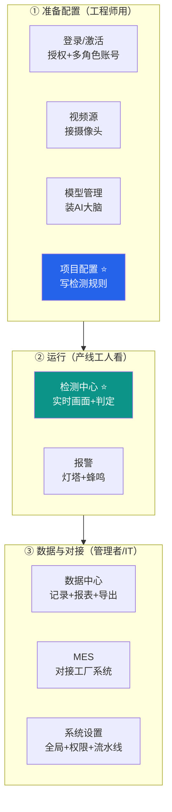
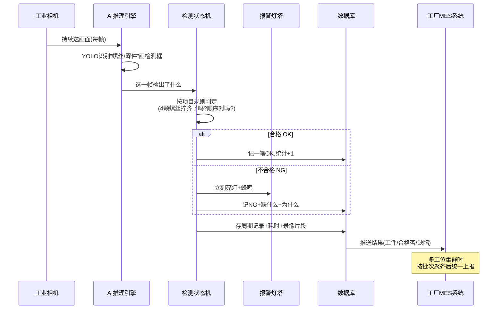
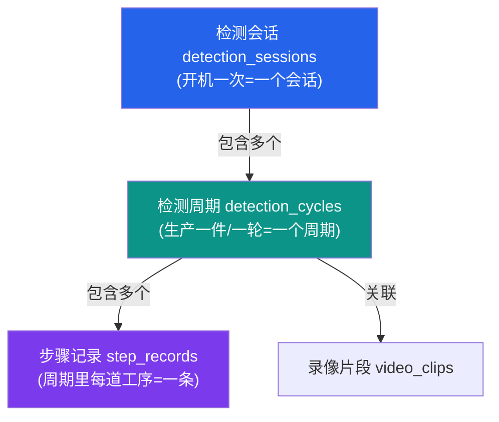
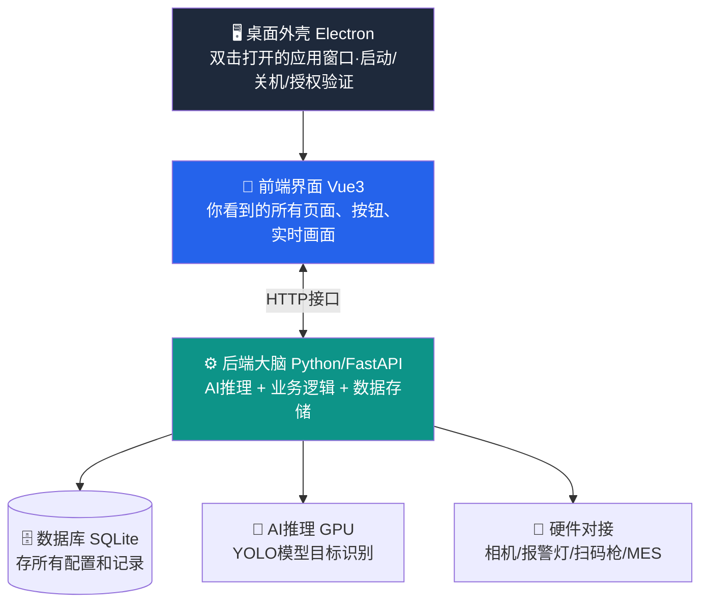
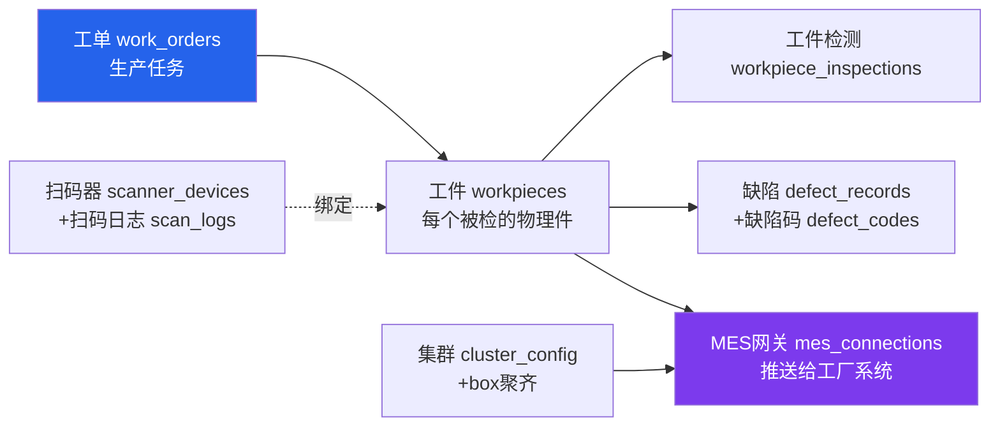
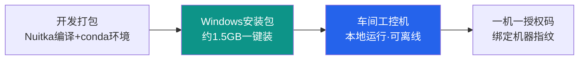
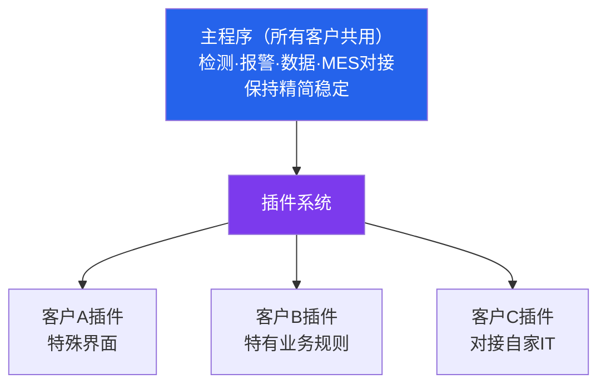

# 天军 AI 视觉检测系统 — 产品说明文档（图文版）

> 面向产品经理。目标：让你看完能完整说清"这产品是什么、卖给谁、有哪些功能、技术上怎么实现、怎么交付"。
> 本文所有功能、字段、模块名**均来自主程序（分支 `main`，版本 v3.22.1）真实代码核实**，配示意图，关键处贴真实代码片段。


> 上图就是这个产品的真实工作场景：流水线上方架着工业相机拍产品，AI 实时框出每个产品——**绿框=合格、红框=不合格**，旁边屏幕显示检测画面和统计，右侧红黄绿报警灯塔在出现不良时亮灯。

---

## 一、一句话看懂这个产品

**这是一套装在工厂产线上的「AI 质检员 + 生产数据管家」。**

它接上产线摄像头，用 AI 实时看每一个产品/每一道工序做得对不对，发现漏装、错装、缺陷就**当场报警**，同时把"什么时间、哪个工件、做了什么、合格不合格"全部记录留痕，并能把数据回传给工厂自己的生产管理系统（MES）。

记住九个字就够：**看得见、记得住、传得出。**


---

## 二、它解决什么问题（客户为什么花钱买）

| 工厂的痛点 | 传统做法 | 本产品的价值 |
|---|---|---|
| 人眼质检累、易漏检、夜班更差 | 招质检工盯着产线看 | AI 7×24 小时不疲劳，漏装/错装/缺陷实时抓 |
| 出了质量问题查不到根因 | 翻纸质记录、靠人回忆 | 每件产品每道工序全程留痕，可回放录像 |
| 质检结果和生产系统是两张皮 | 人工抄录、Excel 转录 | 自动把检测结果回传工厂 MES，数据打通 |

- **客户是谁**：制造业工厂（装配线、包装线为主），部署在车间工控机上。这是**已在多家工厂实际使用的商业项目**，不是 demo。
- **典型场景**：装配检测（拧了几颗螺丝、零件装漏没）、包装检测（该放的放齐没）、多工位集群（一条线多工位同时检测并汇总）、数据回传工厂系统。

---

## 三、产品全景：用户在界面上能做什么

软件是一个**桌面应用**（车间电脑双击打开就用）。打开后左侧是功能菜单。功能页面分三类（核实自前端 31 个页面文件）：



| 页面 | 它是干什么的（产品语言） |
|---|---|
| **登录 / 激活** | 软件需授权码才能用（一机一码，绑定机器指纹防盗用）；支持多角色账号（管理员/工程师/操作员） |
| **视频源** | 告诉软件"摄像头在哪"，支持 6 种接入方式（下节详述） |
| **模型管理** | 上传/管理 AI 检测模型（识别螺丝、零件、缺陷的"大脑"），可做推理加速转换 |
| **项目配置 ⭐** | **核心配置中心**。一个"项目"=一套完整检测脚本：检测什么、按什么步骤、什么算合格、触发什么报警、导出什么数据。**含「复制项目」一键克隆功能** |
| **检测中心 ⭐** | **主画面、用得最多**。实时摄像头画面 + AI 检测框 + 工序进度 + 合格/不合格统计 |
| **报警** | 配置报警动作：不合格时点亮警示灯、响蜂鸣器（接车间灯塔报警柱） |
| **数据中心** | 历史检测记录、统计趋势、回放录像、按日/周/月导出报表，支持自定义/定时导出模板 |
| **MES** | 对接工厂生产系统枢纽：工单、主动拉工单、工件、缺陷、扫码枪、数据网关、集群、外设 |
| **系统设置** | 全局配置：品牌名、账号权限、调试中心、工位组、串行流水线、包装流水线等 |

> 记忆口诀：**视频源接眼睛 → 模型装大脑 → 项目写规则 → 检测中心实时跑 → 报警当场叫 → 数据中心留档 → MES 对接工厂。**

---

## 四、核心概念：什么是"项目"（必懂）

整个产品最核心的概念是**"项目（Project）"**——一条产线的完整"检测剧本"。换产线、换产品，就换一个项目。

一个项目里存了什么？这是从数据模型**真实代码**摘出来的（每个 `_config` 都是一组可配置规则）：

```python
class Project(Base):
    __tablename__ = "projects"
    name             = Column(String)          # 项目名
    task_type        = Column(String)          # 任务类型：检测/分割
    default_model_id = Column(Integer, ...)    # 用哪个 AI 模型
    model_format     = Column(String)          # 推理格式(精度/加速)
    logic_mode       = Column(String)          # 检测逻辑模式
    pipeline_config  = Column(JSON)            # 检测流程：步骤序列、推理模式
    steps_config     = Column(JSON)            # 每步配置：标签、阈值、帧数
    events_config    = Column(JSON)            # 事件配置：自定义 OK/NG/警告
    counters_config  = Column(JSON)            # 计数器配置
    alarm_config     = Column(JSON)            # 报警规则
    detection_config = Column(JSON)            # 检测框样式、语音、提示
    data_config      = Column(JSON)            # 数据导出开关
    is_active        = Column(Boolean)         # 是否当前启用
```

**人话**：一个项目 = 「用哪个 AI 模型」+「检测什么、按什么顺序」+「什么算合格/不合格」+「不合格怎么报警」+「记录导出什么数据」。这七组 `config` 就是把一条产线的质检标准"写成软件能懂的规则"。

### 「复制项目」功能（真实代码）

为了快速搭新产线，项目配置页有一键复制功能——把整套配置**深拷贝**成新项目，新旧互不影响：

```python
@router.post("/{project_id}/duplicate", status_code=201)
def duplicate_project(project_id, db):
    """复制项目：把一个项目的全部配置克隆成新副本.
    副本默认不激活, 名称自动加「副本」后缀防重名.
    JSON 字段全部 deepcopy, 避免新旧项目共享引用导致改一个动另一个."""
    new_name = f"{src.name} 副本"          # 自动去重：副本/副本2/副本3...
    new = Project(
        pipeline_config = copy.deepcopy(src.pipeline_config),
        steps_config    = copy.deepcopy(src.steps_config),
        events_config   = copy.deepcopy(src.events_config),
        # ... 7 组配置全部 deepcopy ...
    )
```

> 已实测：复制接口返回成功，7 组配置逐项与源项目一致，副本默认不激活。

### 检测逻辑模式（适配不同产线节拍）

`logic_mode` 决定"怎么判断一个产品做完了、合格否"，默认无序检测，实际支持多种：

| 模式 | 适合场景 |
|---|---|
| 顺序检测 | 工序必须按固定顺序（步骤1→2→3） |
| 无序检测（默认） | 该做的都做了，顺序不强求 |
| 自定义匹配 | 按优先级规则匹配 |
| 跟踪检测 | 给每个目标分配 ID 全程跟踪 |
| 逐件检测 | N 个个体逐件被工序覆盖（典型：打螺丝） |

---

## 五、一条完整业务流程串讲（理解数据怎么流动）

以"装配线拧螺丝检测"为例：



**核心数据骨架**（从数据库表真实核实）：



一句话：**开机一次=一个"会话" → 每生产一件=一个"周期" → 周期里每道工序=一条"步骤记录"**。所有统计、报表、追溯都建立在这个骨架上。

---

## 六、技术架构（让你能和工程师对话）

记住这个"四层结构"就够和研发沟通：



- **桌面外壳（Electron）**：工人看到的那个应用窗口。负责开机自检、启动后台、验证授权码、优雅关机。
- **前端界面（Vue3）**：屏幕上看到、点击的一切。
- **后端大脑（Python + FastAPI）**：真正干活的核心。接收画面、调 AI 推理、判断合格、存数据、对接工厂系统。
- **数据库（SQLite）**：本地一个文件，存所有项目配置和检测记录（产品规划未来升级到更专业的数据库）。
- **AI 推理**：用显卡（GPU）跑深度学习模型（YOLO 系列）做识别，速度快、可离线。
- **硬件对接**：连各种相机、报警灯柱、扫码枪、以及工厂 MES。

### 6.1 支持的视频源（真实核实 6 种）

```python
# 源自 backend/api/source.py 的真实判断逻辑
self.source_type == 'camera'     # USB 摄像头
self.source_type == 'video'      # 视频文件
self.source_type == 'image'      # 单张图片
self.source_type == 'hikvision'  # 海康工业相机(MvCamera)
self.source_type == 'hcnetsdk'   # 海康网络录像机(NVR)
self.source_type == 'synthetic'  # 虚拟剧本源(无摄像头演示/测试用)
```

> 现场无论用 USB 摄像头、网络摄像头、海康工业相机还是海康录像机都能接入——**兼容性强**是落地的关键优势。

### 6.2 后端接口分组（真实路由前缀，统一在 `/api/v1/` 下）

| 接口前缀 | 负责 |
|---|---|
| `/source/*` | 视频源 + 检测核心 |
| `/projects/*` | 项目配置 CRUD + 激活 + 复制 |
| `/models/*` | 模型上传/转换 |
| `/data/*` | 检测记录 + 导出 |
| `/alarm/*` | 报警灯塔/蜂鸣 |
| `/workstations/*` | 多工位 + GPU 分配 |
| `/mes/*` `/mes/gateway/*` | 工单/工件/缺陷 + 推送外部 MES |
| `/scanner/*` `/wmax/*` | 扫码器 |
| `/cluster/*` | 集群主从汇总 |
| `/export/*` | 自定义/实时/定时导出 |
| `/channel-groups/*` | 工位组（单机多工位并行联动） |
| `/workpiece-flows/*` | 串行流水线（多工位串行结算） |
| `/auth/*` `/users/*` `/roles/*` | 用户系统（账号/角色/权限） |
| `/plugins/*` | 插件系统 |

---

## 七、重头戏：MES 对接能力（核心差异化卖点）

很多视觉检测产品只会"检测+报警"，但**这个产品最大的差异化是能把检测结果真正打通到工厂生产系统**。

MES 子系统数据模型非常完整（从 `mes_models.py` 真实核实，近 20 张表）：



**推送给工厂 MES 支持 5 种对接协议**（从适配器目录真实核实，能适配几乎所有工厂 IT 系统）：

| 协议 | 说明 |
|---|---|
| REST | 标准 HTTP JSON 接口（最常见） |
| 表单 form-data | 整包数据塞进表单字段 |
| 表单编码 form-urlencoded | 键值对展平 |
| 查询串 query-string | 全部走 URL 参数 |
| 工业总线 Modbus | RTU/TCP 写寄存器 |

> 还支持**主动从工厂 MES 拉取工单**、**扫码枪绑定工件**（含 USB 即插即用扫码枪）、**多机集群按批次聚齐后统一上报**——这些都是工厂数字化落地真正需要的能力。

---

## 八、怎么交付给客户（部署模式）



- **形态**：Windows 工控机本地安装包（一键安装，约 1.5 GB）。
- **不依赖云**：所有计算本地完成，工厂断网也能用。
- **授权**：一机一码，绑定机器指纹防盗用。
- **更新**：正式发版走安装包升级；紧急问题用"热补丁"快速修。当前版本 **v3.22.1**。

---

## 九、产品的扩展能力与差异化（核心卖点）

### 「主程序精简稳定，客户定制走插件」——产品最重要的设计理念



**产品决策原则**：来了新需求先判断——**这是所有客户都要的通用能力，还是某一家的特殊定制？** 通用的进主程序；单家定制的做成专属插件，**绝不污染主程序**。好处：核心稳定可靠，又能灵活满足不同工厂"百花齐放"的需求。

### 其他扩展亮点（均已在 v3.22.1 代码中核实存在）
- **多工位并行联动（工位组）**：单机内多工位 NG 时联动结算。
- **多工位串行结算（串行流水线）**：一个产品依次走 N 道工序，全过才合格。
- **包装线流水线（v3.22 新增）**：面向包装产线的专门流水线结算能力。
- **跨机集群汇总**：多台机器结果按批次聚齐统一上报。
- **灵活导出**：自定义/实时/定时导出模板、字段，对接各种下游系统。
- **多角色权限 + 调试中心**：分级账号控制；全局调试日志便于现场排障。

---

## 十、给产品经理的"电梯演讲"模板

> "这是一套部署在工厂产线上的 AI 视觉质检系统。它用摄像头加 AI 实时检查每个产品的装配、包装是否合格，发现问题当场报警，同时把所有质检数据记录下来并对接工厂的生产管理系统。相比人工质检，它不疲劳、不漏检、全程可追溯。产品装在车间工控机上本地运行、一机一授权；核心功能做成通用主程序，每家工厂的特殊需求通过插件扩展，既稳定又灵活。目前已在多家制造业工厂实际使用，最新版本 v3.22.1。"

---

## 附：本文档的真实性说明

本文基于**主程序（分支 `main` / 版本 v3.22.1）真实代码核实**：
- 项目配置 7 组规则字段、复制接口 → 核实自 `backend/models/models.py`、`backend/api/projects.py`
- 6 种视频源类型 → 核实自 `backend/api/source.py` 真实判断分支
- MES 近 20 张表、5 种推送协议 → 核实自 `backend/models/mes_models.py`、`backend/services/mes_adapters/`
- 前端 31 个页面、后端接口分组 → 核实自前端目录与 `backend/main.py` 路由注册
- 包装流水线等 v3.22 能力 → 核实自数据表与设置页面板

如需就某一块深挖（MES 报文长什么样、检测状态机判定细节、插件怎么开发），告诉我可单独展开。
