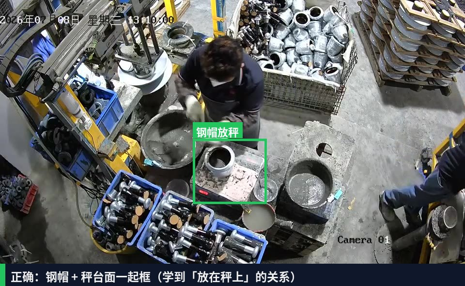
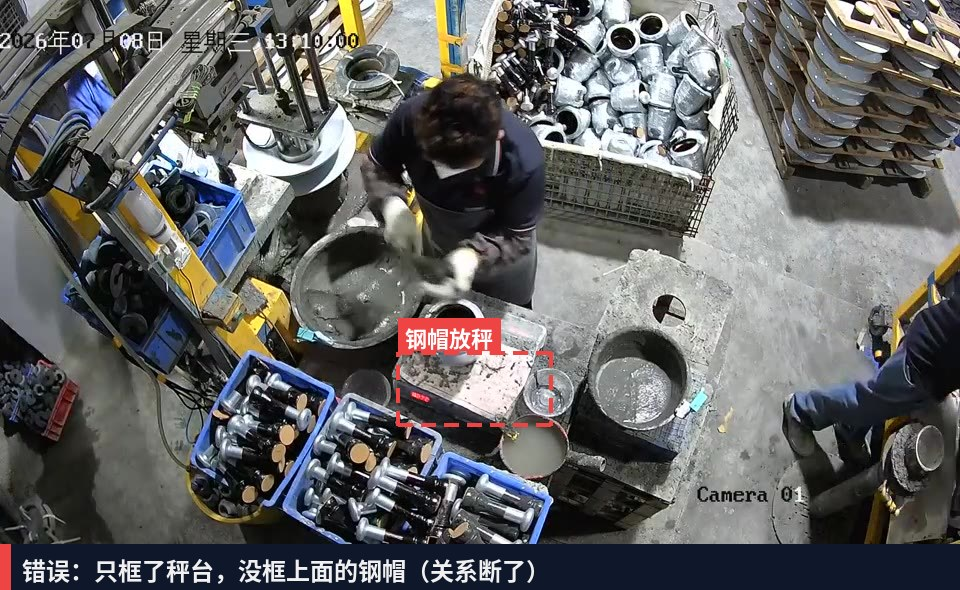
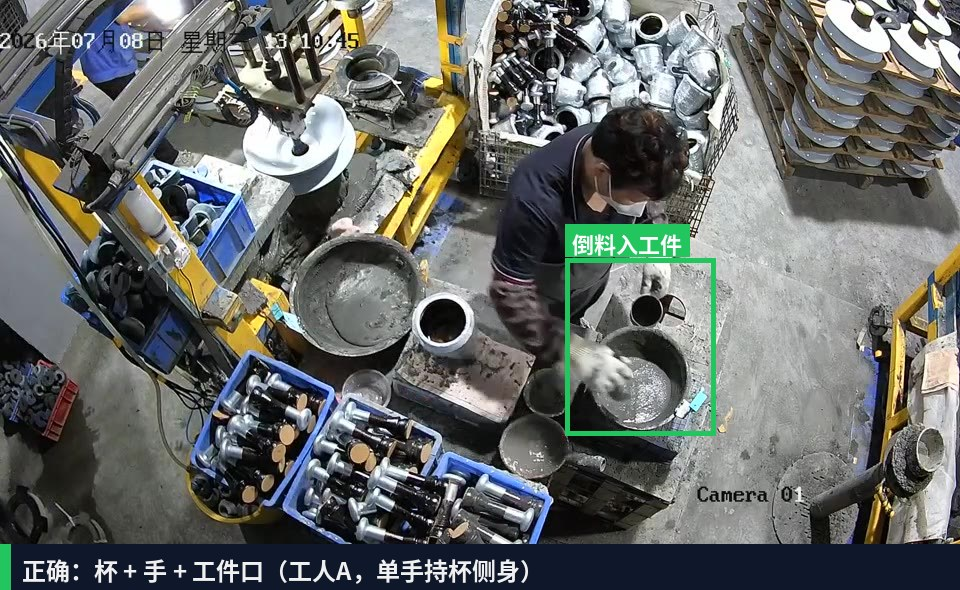
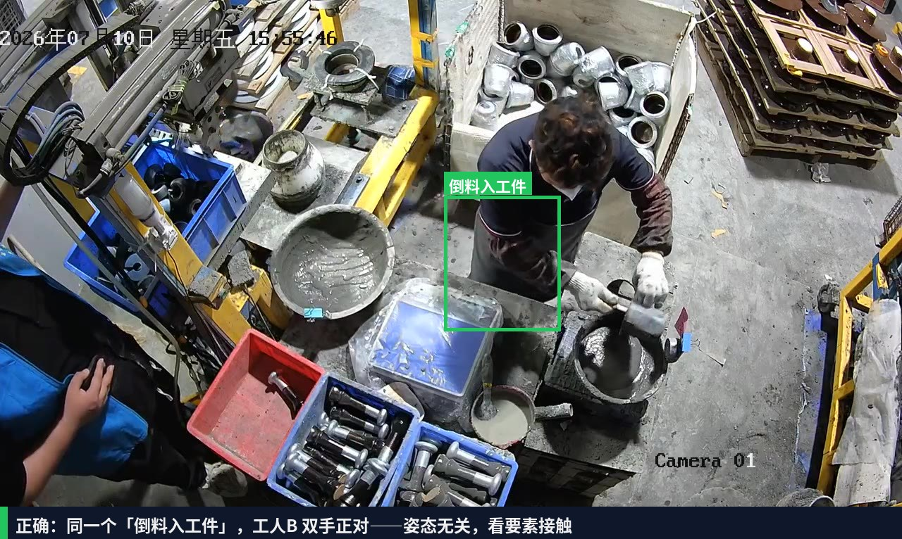
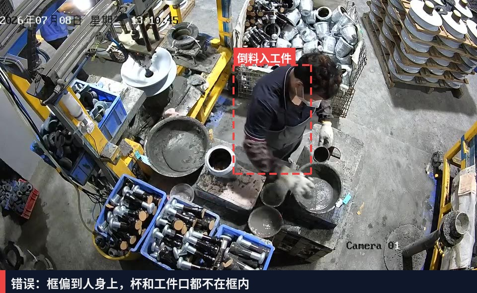

# 萍乡百斯特项目 · 视觉模型标注规范 v1.0

> 适用范围：胶装水泥称重、行为监测及预警项目的 YOLO 检测模型训练。
> 阅读对象：标注人员 + 训练负责人。客户补录视频到位后按本规范开工。
> 更新时间：2026-07-10

---

## 一、总原则

1. **标的是"动作"，不是"料"**。钢帽水泥和钢脚水泥外观无法可靠区分，料别由「动作发生在哪个料盆区域」在软件里判定（区域在项目配置里画，不进模型）。所以标签集里**没有**任何"钢帽/钢脚"字样。
2. **动作框 = 最小完整包络**：框住完成该动作所需的全部要素（手 + 工具 + 接触对象），不带无关背景。
3. **宁缺毋滥**：模糊帧、遮挡过半帧直接丢弃不标。防错场景**误报比漏报更伤信任**，脏样本是误报的第一来源。

## 二、标签集（4 个）

标签名在项目里全部可改，以下为建议默认名。

| # | 标签名 | 定义（何时算这个动作） | 框的范围 | 对应工序 |
|---|---|---|---|---|
| 1 | `钢帽放秤` | 钢帽（工件）被放到秤台面上，从接触台面到手离开 | 钢帽 + 秤台面 | 步骤1：放件（触发去皮门控） |
| 2 | `舀料` | 手持勺/铲**接触料面**开始，到工具**离开料面**结束 | 手 + 工具 + 接触的料面局部 | 步骤2：从料盆取料（视觉料源防错的判定主体） |
| 3 | `装杯` | 杯体在盆沿被填料的全过程 | 杯 + 操作的手 | 步骤3：装杯（限区规则主体，抓"帮工在错误盆装杯"） |
| 4 | `倒料入工件` | 杯口倾斜、料流入工件口，到杯回正 | 杯 + 工件口 | 步骤4：倒料（触发称重判定门控） |

> 若现场实际工序与上表不一致（例如没有独立"装杯"环节），以现场最终确认的四步 SOP 为准增删标签，规则不变。

## 三、正确 / 错误示例（现场真实帧，4 个标签逐个过）

> 以下截图全部取自客户现场监控（作业视频 + 错误示范视频）。**绿色实线框 = 正确标注**，**红色虚线框 = 错误标注**。标注前先把本节所有图过一遍，对齐口径再动手。

### 3.1 `舀料`：框 = 手 + 工具 + 接触的料面局部

**✔ 正确**——最小完整包络，三要素齐全（双手俯身姿态）：

**✔ 正确**——同一个`舀料`，换成单手持勺侧身姿态。**姿态不同，标签相同**（判定只看要素接触，见第四节）：

**✘ 错误一：框太大**——把整个人、机台、周边料箱全框进去，模型会把背景学进特征，误报的第一来源：

**✘ 错误二：框太小**——只框了手，缺工具和接触料面，模型学不到"在舀什么"：

### 3.2 `钢帽放秤`：框 = 钢帽 + 秤台面

**✔ 正确**——工件和秤台一起框，让模型学到"放在秤上"这层关系：

**✘ 错误：只框秤台**——没框上面的钢帽，"放在秤上"这层关系断了，模型只会认秤台本身：

### 3.3 `装杯`：框 = 杯 + 操作的手 + 盆沿局部

**✔ 正确**——工人A，白杯双手操作：

**✔ 正确**——换了工人和杯具，判定要件相同，照样标`装杯`：

**✘ 错误：框整个人**——动作标签框的是"动作要素"（杯+手+盆沿），不是操作者本人：

### 3.4 `倒料入工件`：框 = 杯 + 手 + 工件口

**✔ 正确**——工人A，单手持杯侧身：

**✔ 正确**——工人B，双手正对工件。两人姿态完全不同，但"杯在工件口上方作业"这个要件相同：

**✘ 错误：框偏了**——框到人身上，杯和工件口都不在框内，等于给"人的躯干"打了动作标签：

### 3.5 同帧多动作：各标各的，旁观人员不标

**✔ 正确**——主工位`装杯`和帮工`舀料`同时发生，两个框分别标；右侧旁观人员**不打任何框**：

### 3.6 负样本：无动作帧留白，不打任何标签

**✔ 正确**——工人转身/走动/整理的过渡帧**整帧不标**（留白即负样本，压误报的关键）；下图这类帧照常入库，但零标签：

## 四、工人个体差异怎么处理（判定要件法）

同一个动作，不同工人做出来样子差别很大：有人俯身双手、有人侧身单手，左右利手、杯具颜色、站位朝向都不一样。**如果按"长什么样"标注，模型只会认拍视频那个人**。解决办法是把每个标签定义成一张**判定要件表**——只看"哪些要素发生了接触"，不看人、不看姿态：

| 标签 | 判定要件（全部满足才标） | 明确不看 |
|---|---|---|
| `钢帽放秤` | ① 钢帽在秤台面上 ② 手仍接触或刚离开 | 谁放的、从哪个方向放 |
| `舀料` | ① 手持工具 ② 工具接触料面 | 单手/双手、俯身/侧身、左右手 |
| `装杯` | ① 杯在盆沿区域 ② 手扶杯或向杯内填料 | 杯的颜色材质、几只手 |
| `倒料入工件` | ① 杯在工件口上方 ② 倾斜出料或手在工件口作业 | 站位朝向、持杯手势 |

下图是同一标签、两名工人的实拍对比——**四张图全部是正确标注**：

配套的执行手段（标注和训练两侧同时做）：

1. **每人先标定标 50 帧**：每位工人的素材开标前，先由复核人按要件表校准 50 帧作为该工人的"参考答案"，标注员对齐后再量产。
2. **每标签每工人配额**：每个标签在**每位在岗工人**身上 ≥ 300 框；只有一个人的素材再多也不算够（这也是第七节补录清单要求"每位工人都出镜"的原因）。
3. **验证集必须含"没见过的工人"**：留出至少一名工人的素材完全不进训练集，只进验证集。这名工人身上指标掉得多，说明模型在背"人"而不是学"动作"，需要回头补多样性。
4. **拿不准就过要件表**：边界帧犹豫时，对照上表逐条打勾——全满足就标，有一条不满足就丢帧。禁止"看起来像"式标注。
5. **新工人上岗**：补录该工人素材 1 天，按要件表标注后做增量训练；要件表本身不需要改。

## 五、逐条标注规则

1. **时间边界**：动作类标签按"接触开始 → 分离结束"取帧；边界前后 2-3 帧的过渡姿态**不标**。
2. **遮挡**：目标被遮挡超过 50% 的帧丢弃；轻微遮挡（<50%）正常标。
3. **运动模糊**：肉眼看不清工具/杯轮廓的帧丢弃。
4. **同帧多动作**：一帧里同时有`舀料`和`装杯`（双人作业）→ 各标各的，互不影响。
5. **负样本留白**：以下易混动作**不打任何标签**（留白就是负样本，压误报的关键）：
   - 空手/空勺从盆上方划过
   - 擦手、整理工装、拿放无关物品
   - 空盆、空秤台静置画面
6. **一致性**：同一动作全程由同一人标完；换标注员前先对照已标样本校准 20 帧。

## 六、抽帧策略

| 素材段 | 抽帧率 | 说明 |
|---|---|---|
| 动作发生段 | 3-5 fps | 动作全程密集采，覆盖起始/中段/收尾姿态 |
| 静置/等待段 | 0.2 fps（每 5 秒 1 帧） | 只为负样本背景，少量即可 |

现有素材（作业视频约 10 分钟 + 错误示范 77 秒）作为**起步集**，仅够验证标注口径和跑通训练管线，不够上线。

## 七、客户补录清单（发给百斯特）

- **机位固定不动**（区域防错依赖固定机位，机位挪了区域要重画）
- 不同**班次**、不同**工人**、不同**光照**（白天/晚上/开关灯）各覆盖 ≥ 2 天
- **每位会上这个工位的工人都要出镜**，每人正常作业 ≥ 30 分钟（支撑第四节"每标签每工人 ≥ 300 框"的配额；只录一个熟练工，模型换人就失效）
- 必录场景：
  1. 正常完整作业 ≥ 2 小时
  2. 故意错误示范各 ≥ 10 次：装错盆、跳步（不去皮直接投料）、缺料/超量投料
  3. 双人同时作业（帮工场景）≥ 30 分钟
- 分辨率 ≥ 1080p，帧率 ≥ 15fps，避免逆光

## 八、数据集组织

1. **切分防泄漏**：按**时间段**切 train/val（如前 4 天训练、后 1 天验证），禁止随机按帧切（相邻帧几乎一样，随机切=作弊）。
2. **按工人二次切分**：在时间切分之上，留至少一名工人的素材只进验证集（见第四节第 3 条），专测跨工人泛化。
3. **量级目标**：每标签 ≥ 1000 框起步；`舀料`是防错主判定动作，优先堆到 ≥ 2000 框。
4. **类平衡**：某标签样本 < 其他标签 1/3 时，专门补录该动作。

## 九、模型验收口径

| 指标 | 门槛 |
|---|---|
| mAP@0.5（验证集） | ≥ 0.85 |
| 现场连跑半天误报 | ≤ 1 次/小时 |
| 四步 SOP 逐步识别（现场实测 20 件） | 漏步识别 0 次 |
| 跨工人抽测（未进训练集的工人实测 10 件） | 漏步识别 ≤ 1 次 |

未达标优先补数据（按第七节清单定向补录），其次调置信度阈值（在项目"步骤设置"里按标签单独调），最后才考虑换模型规格。
