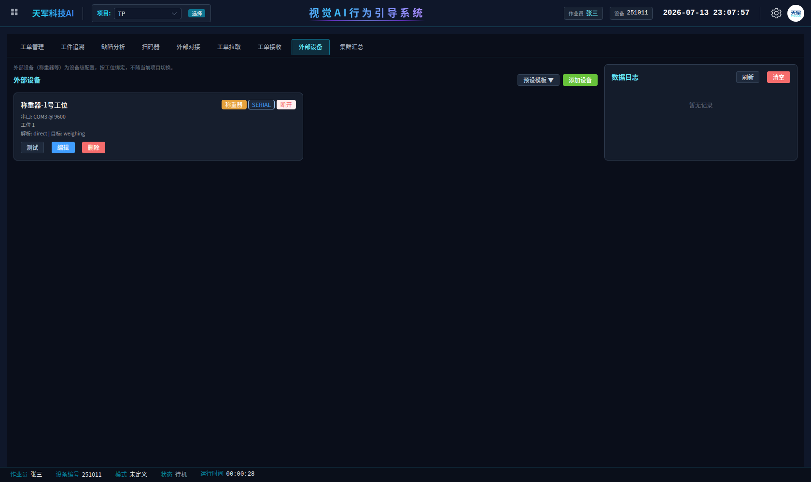

# 萍乡百斯特项目 · 实施总手册（合订本）v1.0

> 胶装水泥称重、行为监测及预警项目 —— 从方案到标注、配置、选型、验收的**唯一交付文档**。
> 阅读对象：项目负责人（第一部分）、标注/训练人员（第二部分）、现场实施工程师（第三、四部分）、验收双方（第五部分）。
> 更新时间：2026-07-13

**目录**

- 第一部分 · 项目总方案（怎么干、模型是什么样）
- 第二部分 · 视觉模型标注规范（新素材规范 + 旧数据集错误示例与处置）
- 第三部分 · 现场配置演练（占位模型实操，全程截图）
- 第四部分 · 硬件与配件选型
- 第五部分 · 上线验收标准

---

# 第一部分 · 项目总方案

## 1.1 工艺（一切设计的出发点）

现场确认的单件作业流程，秤参与两次、全部发生在秤台上：

```
① 空容器放上秤 ──→ 软件发清零指令，秤归零          【秤：去皮】
② 从料盆舀料/备料                                    【视觉：料源防错】
③ 向秤上容器投料，工人看读数装到目标重量            【秤：重量判定】
④ 把称好的料端到压机，倒入压机中的工件              【视觉：收尾】
```

**秤称的是"料"，不是工件**。重量判定发生在第③步（装料到位当场判合格/缺料/超量），不是第④步。

## 1.2 系统架构：视觉 SOP 驱动 + 秤做步骤门控

整个流程由**视觉四步顺序引导**驱动（上秤清零 → 舀料 → 装杯 → 压机加料），电子秤不独立跑流程，而是作为其中两步的**放行条件**：

| 环节 | 谁来判 | 判什么 |
|---|---|---|
| 步骤① 上秤清零 | 视觉看到动作 + **秤门控** | 秤读数稳定 → 软件自动发去皮指令 → 归零确认后放行 |
| 步骤② 舀料 | 视觉 + **区域防错** | 舀料动作发生在哪个料盆区域 = 取的哪种料；与当前应投料别不符立刻报警拦截 |
| 步骤③ 装杯 | 视觉看到动作 + **秤门控** | 净重稳定 → 对比当班型号的标准量±公差 → 合格放行；缺料/超量报警拦截等纠正 |
| 步骤④ 压机加料 | 纯视觉 | 收尾，周期结算 |

配套机制：

- **防"装错盆"**：两种水泥外观无法可靠区分 → 不让模型认料，让**区域**认料（动作 × 固定料盆区域），从取料瞬间拦截，配合现场定置管理。
- **防"忘换型号"**：操作员和产品型号是开工前置项，且配**有效期策略**（每天 08:00 失效强制重选）。
- **异常必须人处理**：缺料/超量/装错盆/前置未满足 → 统一触发"需人工确认"事件，整线定格，工人处理后按 USB 确认按钮（或界面确认）恢复。
- **数据入库**：每件完成后（工件号、型号、操作员、料别、净重、判定、时间）直写客户**达梦数据库**。

## 1.3 模型应该是什么样

- **4 个动作标签**：`上秤清零 / 舀料 / 装杯 / 压机加料`——全部是"动作"，没有料名（料别由区域+型号判定，不进模型）。
- **只认"进行中"**：手（或料流）参与才算数；物体静置一律是负样本。**静置空镜连放 30 分钟零误报**是硬验收线。
- **跨工人泛化**：按"判定要件"定义动作而非"长什么样"，每位在岗工人都要进训练集，并留一名工人只进验证集专测泛化。
- 7.12 首版数据集训练的模型因三个结构性缺陷作废（详见 2.11 节），新模型按第二部分规范从零标注训练；**训练期间现场不用等**——第三部分提供占位模型，项目可先配到只差换模型文件。

---

# 第二部分 · 视觉模型标注规范（v2.0）

> 适用：新补录素材的标注 + 7.12 旧数据集的清洗迁移。**先读 2.1-2.2 对齐口径，再看 2.4 正确/错误示例（含旧数据集真实错误），最后按 2.11 处理旧数据。**

## 2.1 总原则

1. **标的是"动作"，不是"料"**。标签集里**没有**任何"钢帽/钢脚"字样——标签名带料名是 7.12 版的缺陷之一，那会导致每种料都要养一个标签。
2. **标"进行中"，不标"静置"**：所有标签都要求**手（或料流）在画面里参与**。物体静静摆着的帧一律不标——7.12 版把"容器静置在秤上"标成了动作，模型学成了"看见容器就报"，无人时也常亮。
3. **动作框 = 最小完整包络**：框住完成该动作所需的全部要素（手 + 工具/器具 + 接触对象），不带无关背景。
4. **宁缺毋滥**：模糊帧、遮挡过半帧直接丢弃不标。防错场景**误报比漏报更伤信任**，脏样本是误报的第一来源。

## 2.2 标签集（4 个）

| # | 标签名 | 定义（何时算这个动作） | 框的范围 | 称重联动 |
|---|---|---|---|---|
| 1 | `上秤清零` | 手接触容器且容器位于秤台（放置/扶正过程） | 手 + 容器 + 秤台局部 | **去皮门控**：软件发清零指令，秤确认归零后本步放行 |
| 2 | `舀料` | 手持工具**接触料面**开始，到工具**离开料面**结束 | 手 + 工具 + 接触的料面局部 | 无；**料源防错主判定动作**（框落在哪个盆区=取的哪种料） |
| 3 | `装杯` | 料流向秤上容器（持杯倒、整盆倾倒均算），到器具回正 | 器具 + 手 + 秤上容器口 | **重量判定门控**：读数爬到目标并稳定→比标准量；缺料/超量当场报警拦截 |
| 4 | `压机加料` | 称好的料在压机处倒入工件，杯口倾斜到回正 | 杯 + 手 + 压机工件口 | 无秤联动；末步收尾 |

> 标签名在项目里全部可改。若现场最终工序与上表不一致，以现场确认的 SOP 为准增删标签，规则不变。

## 2.3 判定要件法（工人个体差异的解法）

同一个动作，不同工人做出来样子差别很大：有人俯身双手、有人侧身单手，持杯还是整盆倾倒、左右利手、站位朝向都不一样。**如果按"长什么样"标注，模型只会认拍视频那个人**。解决办法是把每个标签定义成一张**判定要件表**——只看"哪些要素发生了接触"，不看人、不看姿态：

| 标签 | 判定要件（全部满足才标） | 明确不看 |
|---|---|---|
| `上秤清零` | ① 容器在秤台上 ② 手接触容器 | 谁放的、从哪个方向放 |
| `舀料` | ① 手持工具 ② 工具接触料面 | 单手/双手、俯身/侧身、左右手 |
| `装杯` | ① 秤上容器在画面 ② 料流向该容器（器具倾斜） | 用杯还是整盆倒、器具颜色 |
| `压机加料` | ① 位置在压机工件口 ② 器具倾斜出料或手在工件口作业 | 站位朝向、持杯手势 |

配套执行手段：

1. **每人先标定标 50 帧**：每位工人的素材开标前，先由复核人按要件表校准 50 帧作为"参考答案"，标注员对齐后再量产。
2. **每标签每工人配额**：每个标签在每位在岗工人身上 ≥ 300 框。
3. **验证集必须含"没见过的工人"**：留至少一名工人的素材完全不进训练集。这名工人指标掉得多 = 模型在背"人"，回头补多样性。
4. **拿不准就过要件表**：边界帧对照上表逐条打勾——有一条不满足就丢帧。禁止"看起来像"式标注。
5. **新工人上岗**：补录 1 天素材增量训练；要件表不用改。

## 2.4 正确 / 错误示例（现场真实帧，逐标签过）

> **绿色实线框 = 正确标注**，**红色虚线框 = 错误标注**。标注前把本节所有图过一遍。

### `上秤清零`：框 = 手 + 秤上容器 + 秤台局部

**✔ 正确**——手在容器上，动作进行中：


**✔ 正确**——另一工人另一机位，要件相同（手接触 + 容器在秤上）：


**✘ 错误：静置帧打标**——容器只是摆在秤上、无人接触。**这种帧是负样本，绝对不标**。7.12 版大量此类标注直接导致模型"无人也报"：


### `舀料`：框 = 手 + 工具 + 接触的料面局部

**✔ 正确**——三要素齐全：


**✔ 正确**——另一工人另一姿态，标签相同（判定只看要件接触）：


**✘ 错误一：框太大**——整个人、机台、料箱全框进去，背景被学进特征，误报第一来源：


**✘ 错误二：框太小**——只框了手，缺工具和接触料面，模型学不到"在舀什么"：


### `装杯`：框 = 器具 + 手 + 秤上容器口

**✔ 正确**——整盆倾倒也是`装杯`（判定要件是"料流向秤上容器"，不限器具）：


**✔ 正确**——另一工人持杯倒料，器具不同、要件相同：


**✘ 错误：框整个人**——动作标签框的是"动作要素"，不是操作者本人：


### `压机加料`：框 = 杯 + 手 + 压机工件口

**✔ 正确**——称好的料倒进压机中的工件：


**✘ 错误：只框机器**——杯和手都不在框内，学到的是"压机部件"不是"加料动作"：


### 同帧多动作：各标各的，旁观人员不标


### 负样本：无动作帧留白，不打任何标签

转身/走动/整理的过渡帧、物体静置帧**整帧不标**（留白即负样本）。7.12 版负样本为零是误报的主因之一，**本次负样本必须占数据集 10-15%**：


### 不同工人同一动作对比（四张全部是正确标注）


## 2.5 逐条标注规则

1. **时间边界**：动作类标签按"接触开始 → 分离结束"取帧；边界前后 2-3 帧的过渡姿态**不标**。
2. **静置不标**（硬规则）：容器在秤上没人碰、称好的料摆着没人端——全部留白。判据：**画面里没有"手参与"就不标**。
3. **遮挡**：目标被遮挡超过 50% 的帧丢弃；轻微遮挡（<50%）正常标。
4. **运动模糊**：肉眼看不清工具/器具轮廓的帧丢弃。
5. **同帧多动作**：双人作业各标各的；旁观人员不标。
6. **负样本留白**（占比 10-15%）：物体静置（容器在秤上无人碰、空秤台、满/空料盆静置）、空手/空勺划过、擦手、整理工装、转身走动。
7. **一致性**：同一动作全程由同一人标完；换标注员前先对照已标样本校准 20 帧。

## 2.6 抽帧策略

| 素材段 | 抽帧率 | 说明 |
|---|---|---|
| 动作发生段 | 3-5 fps | 动作全程密集采，覆盖起始/中段/收尾姿态 |
| 静置/等待段 | 0.2-0.5 fps | **专门作为负样本采**，凑够全集 10-15% |

## 2.7 客户补录清单（发给百斯特）

- **机位固定不动**（区域防错依赖固定机位，机位挪了区域要重画）
- 不同**班次**、不同**工人**、不同**光照**（白天/晚上/开关灯）各覆盖 ≥ 2 天
- **每位会上这个工位的工人都要出镜**，每人正常作业 ≥ 30 分钟
- 必录场景：
  1. 正常完整作业 ≥ 2 小时
  2. 故意错误示范各 ≥ 10 次：从错误料盆取料、跳过清零直接装料、缺料/超量停手
  3. 双人同时作业（帮工场景）≥ 30 分钟
  4. 静置空镜（无人、容器摆秤上、满盆静置）≥ 20 分钟（负样本原料）
- 分辨率 ≥ 1080p，帧率 ≥ 15fps，避免逆光

## 2.8 数据集组织

1. **切分防泄漏**：按**时间段**切 train/val（如前 4 天训练、后 1 天验证），禁止随机按帧切。
2. **按工人二次切分**：留至少一名工人的素材只进验证集，专测跨工人泛化。
3. **量级目标**：每标签 ≥ 1000 框起步；`舀料`是防错主判定动作，优先堆到 ≥ 2000 框。
4. **类平衡**：某标签样本 < 其他标签 1/3 时，专门补录该动作。
5. **负样本硬指标**：空标签帧占全集 **10-15%**，其中至少一半是"物体静置"类。

## 2.9 模型验收口径

| 指标 | 门槛 |
|---|---|
| mAP@0.5（验证集） | ≥ 0.85 |
| 现场连跑半天误报 | ≤ 1 次/小时 |
| **静置空镜连放 30 分钟** | **零误报**（针对 7.12 版缺陷的专项验收） |
| 四步 SOP 逐步识别（现场实测 20 件） | 漏步识别 0 次 |
| 跨工人抽测（未进训练集的工人实测 10 件） | 漏步识别 ≤ 1 次 |

未达标优先补数据（按 2.7 清单定向补录），其次调置信度阈值，最后才考虑换模型规格。

## 2.10 旧数据集（7.12）为什么错、错在哪

首版 2613 帧、四标签（称重清零/舀料/装杯/加钢脚水泥），模型置信度本身不差，但有三个**结构性缺陷**，参数补救不了根：

1. **负样本为零**：2613 帧每帧恰好一框，模型没见过"没有动作"的画面 → 静置容器常亮误报。
2. **静置当动作标**：「称重清零」把容器静置在秤上（无人接触）也标了 → 标签学成了"状态"，无法当步骤锚点。
3. **料名进标签**：「加钢脚水泥」把料别写死在标签里 → 换料就要换标签重训，且与"料别由区域判定"的防错设计冲突。

本规范的"静置不标"硬规则、负样本 10-15% 硬指标、中性标签名，分别对应堵死这三条。

**机器全量复检结果**（通用人体检测 + 几何规则扫全部 2613 帧，逐帧清单见附件 `百斯特萍乡_旧数据集审计/可疑标注清单.csv`）：

| 错误类型 | 判定方法 | 命中 | 违反的规范条款 |
|---|---|---|---|
| 静置误标 | 动作框周边（外扩 60%）**无人** | **732 框**（装杯 343 / 舀料 241 / 称重清零 146 / 加料 2） | 2.1 第 2 条 / 2.5 第 2 条 |
| 框太小 | 宽或高 < 3.5% 画面，装不下"手+工具+接触对象" | **241 框**（加钢脚水泥 198 / 舀料 43） | 2.1 第 3 条 |
| 框太大 | 宽 > 45% 或高 > 60% | 0 | — |
| 连拍重复 | 与前一帧同类别近乎同框（IoU > 0.92） | **629 框** | 2.6 抽帧策略 |

**旧数据集错误标注实拍**（红框 = 打了动作标签但附近根本没有人参与的帧——就是 2.4 节"静置帧打标"错误在旧数据集里的真实批量存在，12 例抽样）：


## 2.11 旧数据集处置：清洗迁移，不必全废

清洗后约六成框可直接迁移为新数据集底料（预计 1-2 人日，远便宜于全部重标）。

**标签映射（旧 → 新）**：

| 旧标签 | 新标签 | 迁移动作 |
|---|---|---|
| `称重清零` | `上秤清零` | 改名 + **过滤**：只留"手接触容器"的帧；静置帧删框留图当负样本 |
| `舀料` | `舀料` | 原样保留，剔除复检清单命中的坏框 |
| `装杯` | `装杯` | 原样保留，剔除复检清单命中的坏框 |
| `加钢脚水泥` | `压机加料` | 改名 + **重框**：旧框大多只框了杯/料流，扩到"杯 + 手 + 压机工件口" |

> 类别序号（0/1/2/3）与新标签集一一对应，YOLO 标签文件里的类别 id 不用改，只改类别名清单四行名字。

**清洗操作顺序**：

1. 整目录备份原始数据集。
2. 类别名清单四行改成新标签名。
3. 打开可疑标注清单，按"问题"列逐类处理：
   - 静置误标 → **逐帧人工复核**后删框（标签文件删那一行；文件留空 = 负样本，**不要删图**）。复核标准就一条：画面里有没有"手在参与这个动作"。机器初筛在工人深弯腰、被设备挡住时会误报"无人"，所以初筛不是判决；
   - 框太小 → 按 2.4 示例图重框到完整要件；
   - 连拍重复 → 每组连拍留 1/3（在前两步之后做，防比例失控）。
4. 每类随机抽 30 帧对照 2.3 要件表逐条打勾抽查。
5. 与新补录素材合并，按 2.8 切分。

**清洗解决不了"没有的"**——负样本类型、工人多样性、错误示范场景、`上秤清零`的动作帧（旧集多为静置，删完会明显变少），全部靠 2.7 补录清单补齐。

---

# 第三部分 · 现场配置演练（占位模型实操）

> **真实模型还没训练出来也能先把项目配完。**本部分用一个"占位模型"（只带标签集、不做真检测）把项目从零配到能跑，每步都有实拍截图；真实模型训练好后只需换掉模型文件，其余配置全部保留。

## 3.0 开始之前

| 准备项 | 说明 |
|---|---|
| 占位模型文件 | `百斯特萍乡_占位模型_v2标签.pt`（约 6MB，随文档包交付）。内含 4 个标签，与真实模型标签集完全一致 |
| 电子秤 | RS232 串口，9600/8/1/无校验；切到**应答模式** |
| USB 转串口线 | 接工控机后在设备管理器确认 COM 口号 |
| USB 确认按钮 | 可选（见第四部分选型） |
| 达梦数据库 | 找客户 IT 要：IP、端口（默认 5236）、账号密码、库名、目标表名 |

**占位模型的意义**：模型文件里带着标签清单，系统靠标签清单来配步骤。占位模型给出和真实模型一模一样的标签清单，所以现在配的每一项换真模型后**原样生效**。占位模型未经训练，不会真的检出目标——演练期不要指望它出框。

## 3.1 上传模型

模型管理页 → 上传模型 → 选占位模型文件。上传完点"详情"确认**类别数 = 4 个**：


> 换真实模型时：同样方式上传真模型 → 项目"基础设置"把绑定模型换成真模型 → 保存。其余全部不动。

## 3.2 新建项目 · 基础设置

项目管理页 → 新建项目。任务类型选**目标检测**，逻辑模式选**顺序模式**，绑定上一步的模型：


## 3.3 步骤设置：四个步骤 + 外设门控

进入"步骤设置"页签。四个步骤按工艺顺序排列，每行右侧的"外设门控"列是本项目核心：**视觉步骤序列驱动流程，电子秤作为其中两步的放行条件**。


| 步骤 | 标签 | 置信度 | 外设门控 | 说明 |
|---|---|---|---|---|
| 1 | 上秤清零 | 60% | **去皮门控** | 看到"手放容器上秤"动作 + 秤读数稳定 → 自动发去皮指令 → 放行 |
| 2 | 舀料 | 55% | 无 | 纯视觉步骤，受"视觉料源防错"区域规则监督 |
| 3 | 装杯 | 50% | **称重判定** | 看到投料动作 + 净重稳定 → 对比型号标准量 → 合格才放行 |
| 4 | 压机加料 | 45% | 无 | 纯视觉步骤，收尾 |

> 置信度是演练初值；真模型上线后按实际表现微调。

点第 1 行"去皮门控"按钮弹出配置——启用开关打开，门控类型选**去皮门控**：


点第 3 行"称重判定"按钮——门控类型选**称重判定**；判定料别**留空**（按料别投料顺序自动取，第一杯判钢帽、第二杯判钢脚）；"不合格拦截等纠正"**开**——缺料/超量时步骤不放行、报警等工人补料或减料，重量回到公差带内自动重新判定放行：


## 3.4 称重配置页签

顶部蓝条提示当前是**"视觉 SOP + 秤门控"融合模式**（因为步骤里配了外设门控，系统自动识别）。

**前置要求 + 前置选择有效期**：开工前必须先选操作人员和水泥型号，本件完成后自动给秤置零。有效期选**每天定时失效（08:00）**，失效字段勾**产品型号**——防止"昨天选的型号今天忘了换"：


**视觉料源防错（防"装错盆"的关键）**：识别方式选**动作 × 固定区域**。给每种料的料盆画一个判定区域：`舀料`动作发生在"钢帽料盆"区域 → 取的是钢帽水泥；发生在"钢脚料盆"区域 → 钢脚水泥。与当前应投料别不符 → 立刻报警拦截，**从取料那一刻就拦住装错盆**：


> 每条规则的"判定区域"点【画区域】进画面框选。**前提是现场定置管理**：两种料的料盆位置固定并画地标线；料盆挪位要重画区域。

**料别顺序 + 型号标准量表**：料别按**投料顺序**排（1. 钢帽水泥 → 2. 钢脚水泥）。标准量表按客户实际产品型号填每种料的标准量和上下公差（截图中数值是演练值，**现场按工艺卡实填**）。去皮与稳定判定保持默认：


**校验与报警映射**：缺料 / 超量 / 料别错 / 前置未满足 / 动作限区违规 五种异常全部映射到**"称重异常-需人工确认"**事件：


## 3.5 事件设置：需人工确认

确认"称重异常-需人工确认"事件：勾选**需人工确认**，超时自动确认填 **0**（永不超时，必须人来处理）。触发时检测线定格、画面弹红色确认框，工人处理完异常后按确认（界面点击或 USB 按钮）才恢复：


配完以上所有页签，**点右上角"保存配置"**，再点"启用当前项目"。

## 3.6 外部设备：接电子秤

MES 管理 → 外部设备 → 添加设备。角色选**称重器**，协议选**串口**，串口号填实际 COM 口（截图 COM3 是演示值），波特率 9600，绑定工位 1，数据去向选**称重引擎**：



> 演练环境没接真秤，设备是停用状态。现场接好秤后打开启用，点"测试"应能读到实时重量。秤要切**应答模式**（与连续输出模式二选一，秤面板可调）。

## 3.7 扫码器：USB 报警确认按钮（可选）

MES 管理 → 扫码器 → 添加 USB 扫码枪。"扫到的码用来"选**报警确认按钮**，确认工位选工位 1。装一颗 USB 确认按钮（本质是只发固定码的 HID 键盘），工人按一下 = 解除本工位"需人工确认"定格：


## 3.8 推送网关：写入客户达梦数据库

MES 管理 → 外部对接 → 新建连接。适配器类型选**数据库直写**：


数据库类型选**达梦 DM**，填客户 IT 提供的 IP / 端口 / 账号 / 库名 / 目标表名；下方模板把字段映射到表列（工件号、型号、操作员、料别、净重、判定结果、时间）：


> 截图中的 IP / 表名 / 字段映射是演示值。现场拿到真实表结构后对着填，点"测试"验证连通，再打开启用开关。

---

# 第四部分 · 硬件与配件选型

## 4.1 USB 报警确认按钮（首选方案）

本质是"只发一串固定字符 + 回车"的 USB HID 键盘，软件已把它做成扫码器设备的一种用途。**免驱、免串口、免额外开发**。

| 指标 | 要求 | 为什么 |
|---|---|---|
| 接口类型 | USB HID 键盘（免驱） | 复用软件全局键盘捕获链路 |
| 可编程 | 支持自定义输出内容，能以**回车结尾** | 软件靠回车判定一次输入结束 |
| 输出内容 | 建议烧录 `TJACK01`（工位1）、`TJACK02`（工位2）… | 每工位独立码，好排查 |
| 按键形态 | 工业大按钮（直径 ≥ 40mm）优先 | 戴手套可拍 |
| 线长 | ≥ 1.5m 或带延长线款 | 工控机到工位有距离 |

参考搜索词：`USB 自定义快捷键按钮`、`USB 一键按钮 可编程`。价位约 **20-80 元/个**，每工位 1 个。

备选：**确认二维码卡片**（≈0 元，已有扫码枪时打印固定码贴工位）；**界面确认按钮**（0 元，软件自带，过渡期用）。

## 4.2 连带配件清单（一次配齐）

| 物品 | 数量 | 要求 |
|---|---|---|
| USB 确认按钮 | 每工位 1 | 见 4.1 |
| 电子秤 | 每工位 1 | 支持 RS232 **指令应答模式**（含远程去皮 T / 置零 Z 指令），协议见已确认的 CHS-D+R / ETC-D+R 说明书；参数 9600/8/N/1 |
| RS232-USB 转接线 | 每秤 1 | FTDI / CH340 芯片均可，线长按现场量 |
| 相机 | 每工位 1 | ≥1080p，固定机位支架（**机位不能动**，动了防错区域要重画） |
| USB HUB（带外供电） | 视工位数 | 按钮 + 秤转接 + 相机可能占满工控机 USB 口 |

## 4.3 达梦驱动（实施注意）

数据库直写用的达梦官方 Python 驱动不在标准安装包里，实施时任选其一：客户机装达梦客户端（自带驱动），或现场按既有热补丁模板走国内源安装。未装驱动时软件不会崩——测试推送会明确提示"达梦驱动未安装"，装完即通。

---

# 第五部分 · 上线验收标准

真实模型训练好后：模型管理页上传（标签集必须还是这 4 个）→ 项目"基础设置"换绑模型 → 保存 → 监控页跑真实作业，逐项验收：

| # | 验收项 | 通过标准 |
|---|---|---|
| 1 | 四步顺序识别 | 正常作业一轮，四步依次点亮，周期正常结算 OK |
| 2 | 去皮门控 | 容器上秤稳定后秤自动去皮，步骤 1 放行 |
| 3 | 称重判定 | 装杯到标准量±公差内步骤 3 放行；故意少装 → 报警拦截，补到位自动放行 |
| 4 | 装错盆拦截 | 故意到错误料盆做舀料动作 → 立刻报警定格 |
| 5 | 人工确认 | 异常定格后界面/USB 按钮确认才恢复 |
| 6 | 型号有效期 | 次日 08:00 后不重选型号直接开工 → 拦截提示 |
| 7 | 数据入库 | 每件完成后达梦表里多一条记录，字段值正确 |
| 8 | 静置零误报 | 无人操作 30 分钟，无任何步骤误触发（验模型负样本质量，对应 2.9 专项验收线） |

模型侧验收（mAP、误报率、跨工人泛化）见 2.9 节，两套验收都过才算交付。

---

**文档版本**：v1.0 合订本（2026-07-13）
**随文档包交付**：占位模型 `百斯特萍乡_占位模型_v2标签.pt` · 旧数据集逐帧复检清单 `百斯特萍乡_旧数据集审计/可疑标注清单.csv`
