# 萍乡百斯特项目 · 实施总手册（合订本）v1.1

> 胶装水泥称重、行为监测及预警项目 —— 从方案到标注、配置、选型、验收的**唯一交付文档**。
> 阅读对象：项目负责人（第一部分）、标注/训练人员（第二部分）、现场实施工程师（第三、四部分）、验收双方（第五部分）。
> 更新时间：2026-07-14（v1.1：第三部分全节展开为逐步操作；新增 3.4.8 监控页显示开关与 3.9 运行监控——检测中心实时显示皮重/净重）

**目录**

- 第一部分 · 项目总方案（怎么干、模型是什么样）
- 第二部分 · 视觉模型标注规范（新素材规范 + 旧数据集错误示例与处置）
- 第三部分 · 现场配置演练（占位模型实操，全程截图）
- 第四部分 · 硬件与配件选型
- 第五部分 · 上线验收标准

---

# 第一部分 · 项目总方案

## 1.1 工艺（一切设计的出发点）

现场确认的单件作业流程，秤参与两次、全部发生在秤台上：

```
① 空容器放上秤 ──→ 软件发清零指令，秤归零          【秤：去皮】
② 从料盆舀料/备料                                    【视觉：料源防错】
③ 向秤上容器投料，工人看读数装到目标重量            【秤：重量判定】
④ 把称好的料端到压机，倒入压机中的工件              【视觉：收尾】
```

**秤称的是"料"，不是工件**。重量判定发生在第③步（装料到位当场判合格/缺料/超量），不是第④步。

## 1.2 系统架构：视觉 SOP 驱动 + 秤做步骤门控

整个流程由**视觉四步顺序引导**驱动（上秤清零 → 舀料 → 装杯 → 压机加料），电子秤不独立跑流程，而是作为其中两步的**放行条件**：

| 环节 | 谁来判 | 判什么 |
|---|---|---|
| 步骤① 上秤清零 | 视觉看到动作 + **秤门控** | 秤读数稳定 → 软件自动发去皮指令 → 归零确认后放行 |
| 步骤② 舀料 | 视觉 + **区域防错** | 舀料动作发生在哪个料盆区域 = 取的哪种料；与当前应投料别不符立刻报警拦截 |
| 步骤③ 装杯 | 视觉看到动作 + **秤门控** | 净重稳定 → 对比当班型号的标准量±公差 → 合格放行；缺料/超量报警拦截等纠正 |
| 步骤④ 压机加料 | 纯视觉 | 收尾，周期结算 |

配套机制：

- **防"装错盆"**：两种水泥外观无法可靠区分 → 不让模型认料，让**区域**认料（动作 × 固定料盆区域），从取料瞬间拦截，配合现场定置管理。
- **防"忘换型号"**：操作员和产品型号是开工前置项，且配**有效期策略**（每天 08:00 失效强制重选）。
- **异常必须人处理**：缺料/超量/装错盆/前置未满足 → 统一触发"需人工确认"事件，整线定格，工人处理后按 USB 确认按钮（或界面确认）恢复。
- **数值可见**：检测中心实时显示**当前读数、皮重（去皮那一刻的工件/容器自重）、净重（去皮归零后的读数 = 已投料量）**与各步骤门控状态，可在称重配置里一键关闭（见 3.4.8 / 3.9）。
- **数据入库**：每件完成后（工件号、型号、操作员、料别、净重、判定、时间）直写客户**达梦数据库**。

## 1.3 模型应该是什么样

- **4 个动作标签**：`上秤清零 / 舀料 / 装杯 / 压机加料`——全部是"动作"，没有料名（料别由区域+型号判定，不进模型）。
- **只认"进行中"**：手（或料流）参与才算数；物体静置一律是负样本。**静置空镜连放 30 分钟零误报**是硬验收线。
- **跨工人泛化**：按"判定要件"定义动作而非"长什么样"，每位在岗工人都要进训练集，并留一名工人只进验证集专测泛化。
- 7.12 首版数据集训练的模型因三个结构性缺陷作废（详见 2.11 节），新模型按第二部分规范从零标注训练；**训练期间现场不用等**——第三部分提供占位模型，项目可先配到只差换模型文件。

---

# 第二部分 · 视觉模型标注规范（v2.0）

> 适用：新补录素材的标注 + 7.12 旧数据集的清洗迁移。**先读 2.1-2.2 对齐口径，再看 2.4 正确/错误示例（含旧数据集真实错误），最后按 2.11 处理旧数据。**

## 2.1 总原则

1. **标的是"动作"，不是"料"**。标签集里**没有**任何"钢帽/钢脚"字样——标签名带料名是 7.12 版的缺陷之一，那会导致每种料都要养一个标签。
2. **标"进行中"，不标"静置"**：所有标签都要求**手（或料流）在画面里参与**。物体静静摆着的帧一律不标——7.12 版把"容器静置在秤上"标成了动作，模型学成了"看见容器就报"，无人时也常亮。
3. **动作框 = 最小完整包络**：框住完成该动作所需的全部要素（手 + 工具/器具 + 接触对象），不带无关背景。
4. **宁缺毋滥**：模糊帧、遮挡过半帧直接丢弃不标。防错场景**误报比漏报更伤信任**，脏样本是误报的第一来源。

## 2.2 标签集（4 个）

| # | 标签名 | 定义（何时算这个动作） | 框的范围 | 称重联动 |
|---|---|---|---|---|
| 1 | `上秤清零` | 手接触容器且容器位于秤台（放置/扶正过程） | 手 + 容器 + 秤台局部 | **去皮门控**：软件发清零指令，秤确认归零后本步放行 |
| 2 | `舀料` | 手持工具**接触料面**开始，到工具**离开料面**结束 | 手 + 工具 + 接触的料面局部 | 无；**料源防错主判定动作**（框落在哪个盆区=取的哪种料） |
| 3 | `装杯` | 料流向秤上容器（持杯倒、整盆倾倒均算），到器具回正 | 器具 + 手 + 秤上容器口 | **重量判定门控**：读数爬到目标并稳定→比标准量；缺料/超量当场报警拦截 |
| 4 | `压机加料` | 称好的料在压机处倒入工件，杯口倾斜到回正 | 杯 + 手 + 压机工件口 | 无秤联动；末步收尾 |

> 标签名在项目里全部可改。若现场最终工序与上表不一致，以现场确认的 SOP 为准增删标签，规则不变。

## 2.3 判定要件法（工人个体差异的解法）

同一个动作，不同工人做出来样子差别很大：有人俯身双手、有人侧身单手，持杯还是整盆倾倒、左右利手、站位朝向都不一样。**如果按"长什么样"标注，模型只会认拍视频那个人**。解决办法是把每个标签定义成一张**判定要件表**——只看"哪些要素发生了接触"，不看人、不看姿态：

| 标签 | 判定要件（全部满足才标） | 明确不看 |
|---|---|---|
| `上秤清零` | ① 容器在秤台上 ② 手接触容器 | 谁放的、从哪个方向放 |
| `舀料` | ① 手持工具 ② 工具接触料面 | 单手/双手、俯身/侧身、左右手 |
| `装杯` | ① 秤上容器在画面 ② 料流向该容器（器具倾斜） | 用杯还是整盆倒、器具颜色 |
| `压机加料` | ① 位置在压机工件口 ② 器具倾斜出料或手在工件口作业 | 站位朝向、持杯手势 |

配套执行手段：

1. **每人先标定标 50 帧**：每位工人的素材开标前，先由复核人按要件表校准 50 帧作为"参考答案"，标注员对齐后再量产。
2. **每标签每工人配额**：每个标签在每位在岗工人身上 ≥ 300 框。
3. **验证集必须含"没见过的工人"**：留至少一名工人的素材完全不进训练集。这名工人指标掉得多 = 模型在背"人"，回头补多样性。
4. **拿不准就过要件表**：边界帧对照上表逐条打勾——有一条不满足就丢帧。禁止"看起来像"式标注。
5. **新工人上岗**：补录 1 天素材增量训练；要件表不用改。

## 2.4 正确 / 错误示例（现场真实帧，逐标签过）

> **绿色实线框 = 正确标注**，**红色虚线框 = 错误标注**。标注前把本节所有图过一遍。

### `上秤清零`：框 = 手 + 秤上容器 + 秤台局部

**✔ 正确**——手在容器上，动作进行中：

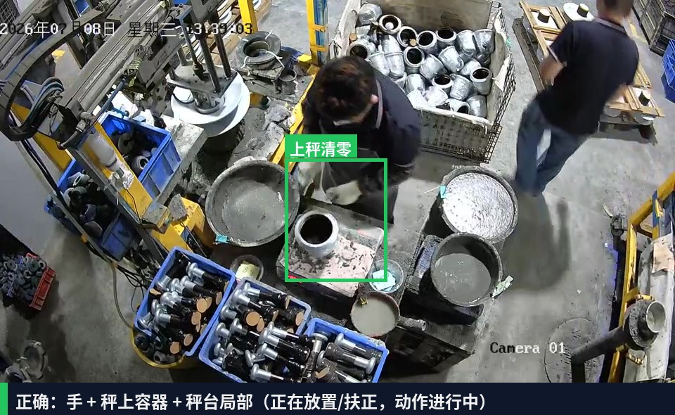

**✔ 正确**——另一工人另一机位，要件相同（手接触 + 容器在秤上）：

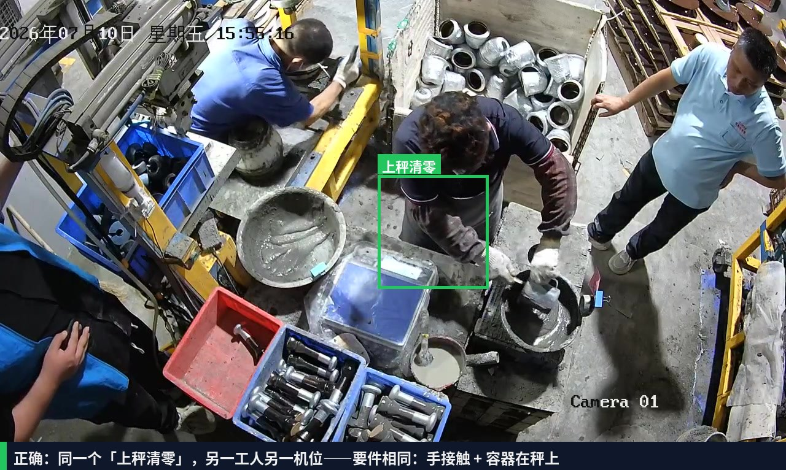

**✘ 错误：静置帧打标**——容器只是摆在秤上、无人接触。**这种帧是负样本，绝对不标**。7.12 版大量此类标注直接导致模型"无人也报"：

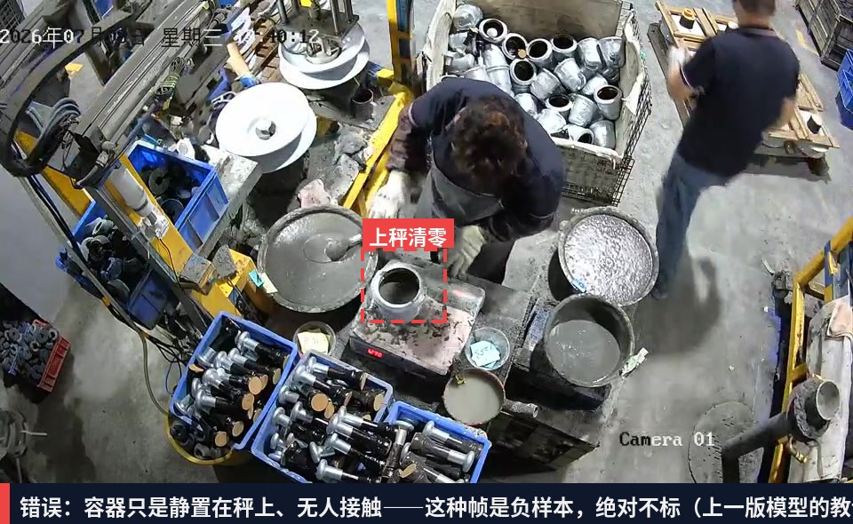

### `舀料`：框 = 手 + 工具 + 接触的料面局部

**✔ 正确**——三要素齐全：

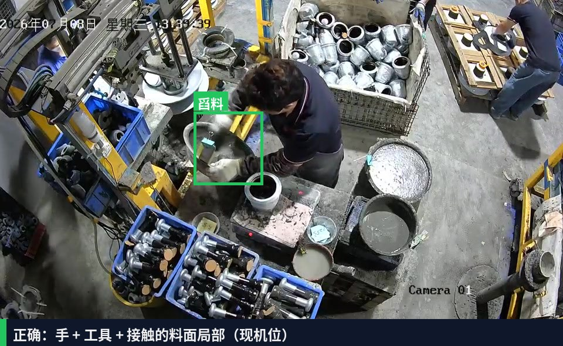

**✔ 正确**——另一工人另一姿态，标签相同（判定只看要件接触）：

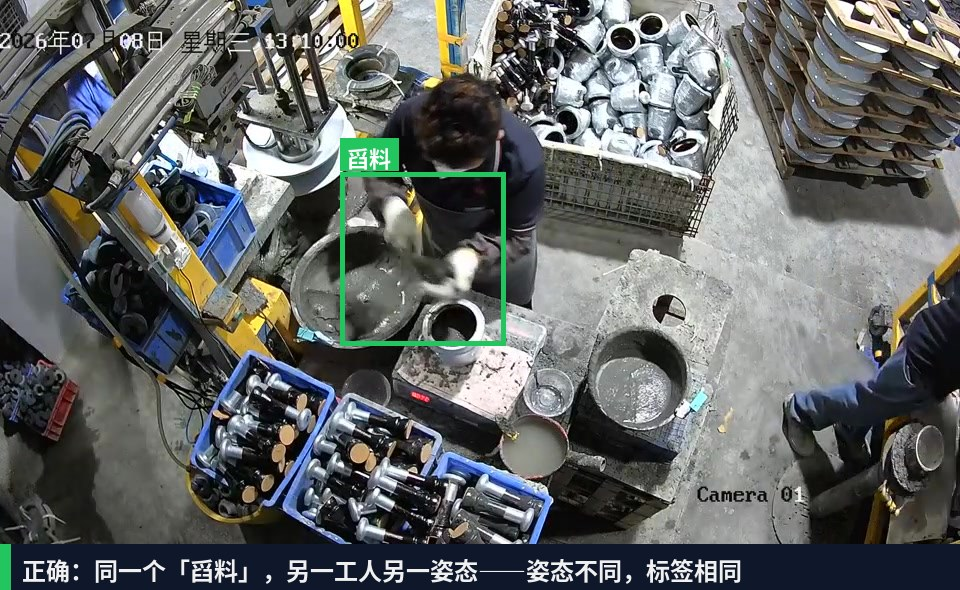

**✘ 错误一：框太大**——整个人、机台、料箱全框进去，背景被学进特征，误报第一来源：

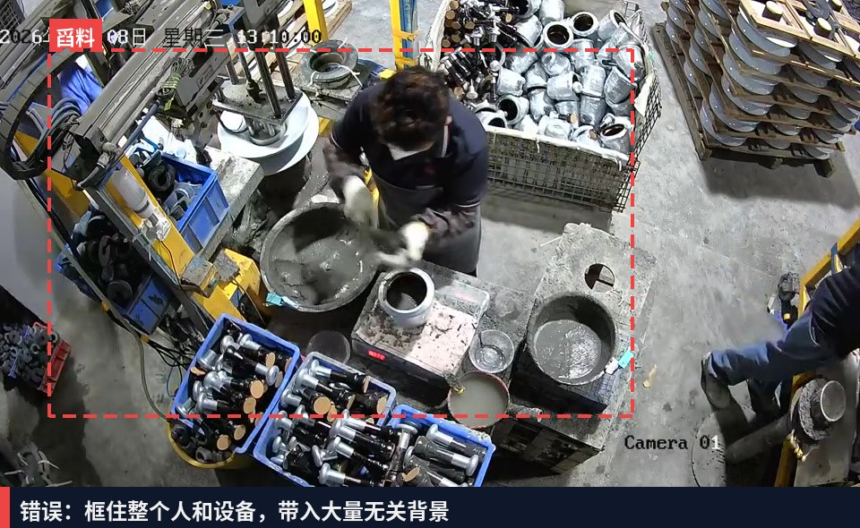

**✘ 错误二：框太小**——只框了手，缺工具和接触料面，模型学不到"在舀什么"：

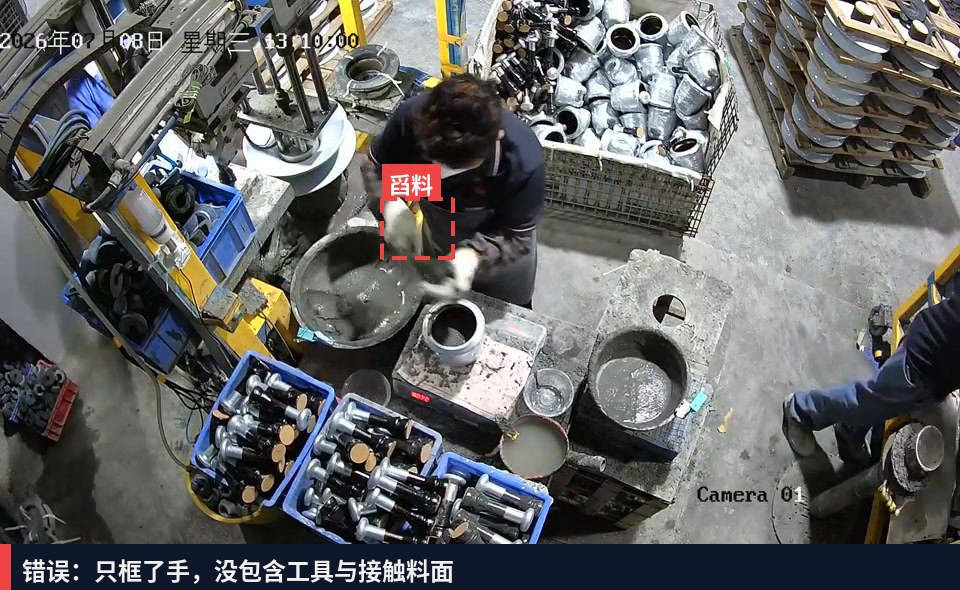

### `装杯`：框 = 器具 + 手 + 秤上容器口

**✔ 正确**——整盆倾倒也是`装杯`（判定要件是"料流向秤上容器"，不限器具）：

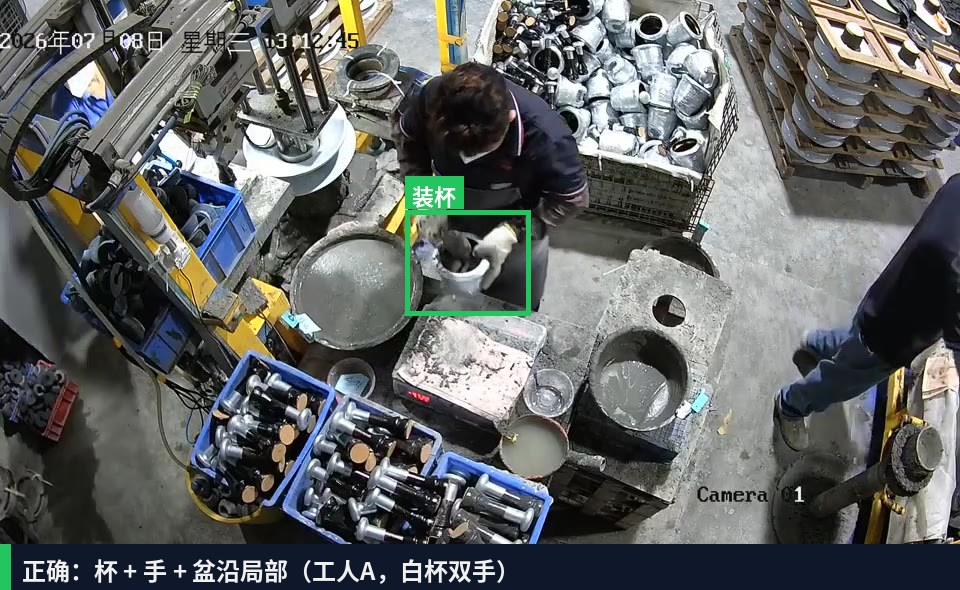

**✔ 正确**——另一工人持杯倒料，器具不同、要件相同：

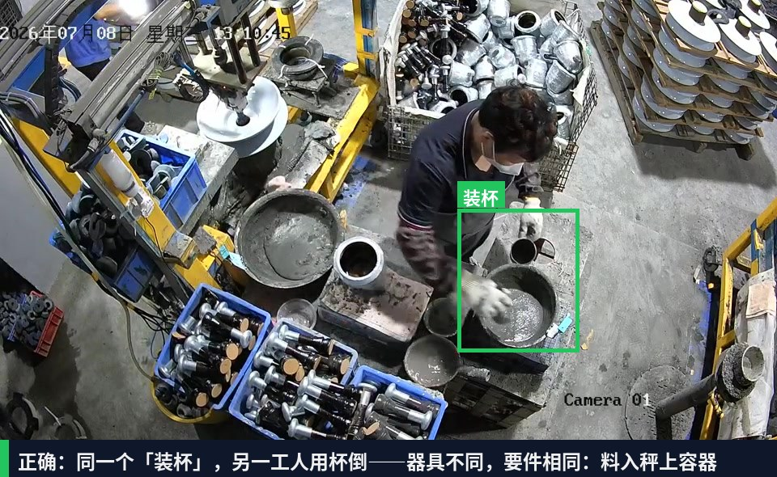

**✘ 错误：框整个人**——动作标签框的是"动作要素"，不是操作者本人：

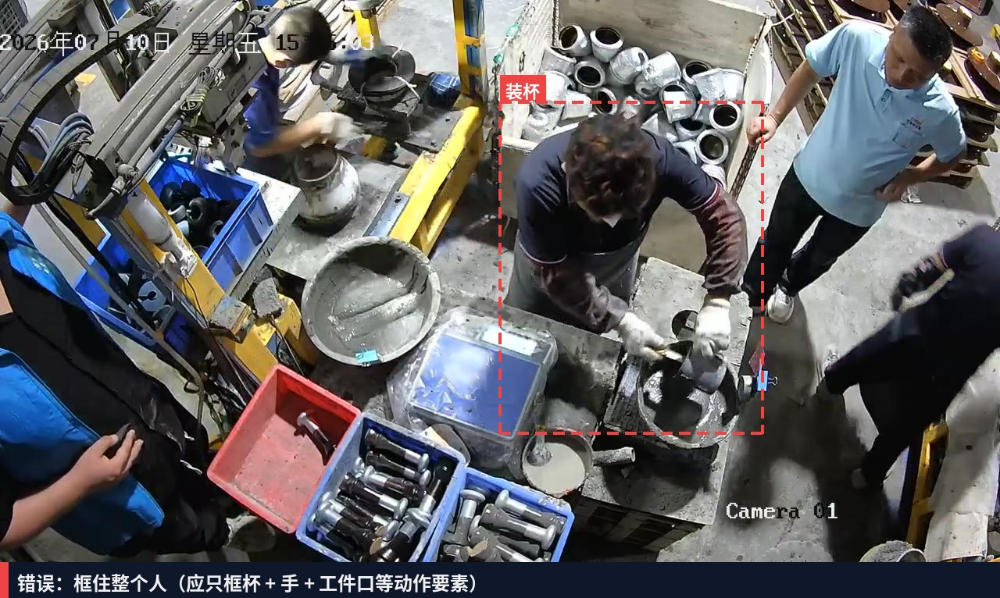

### `压机加料`：框 = 杯 + 手 + 压机工件口

**✔ 正确**——称好的料倒进压机中的工件：

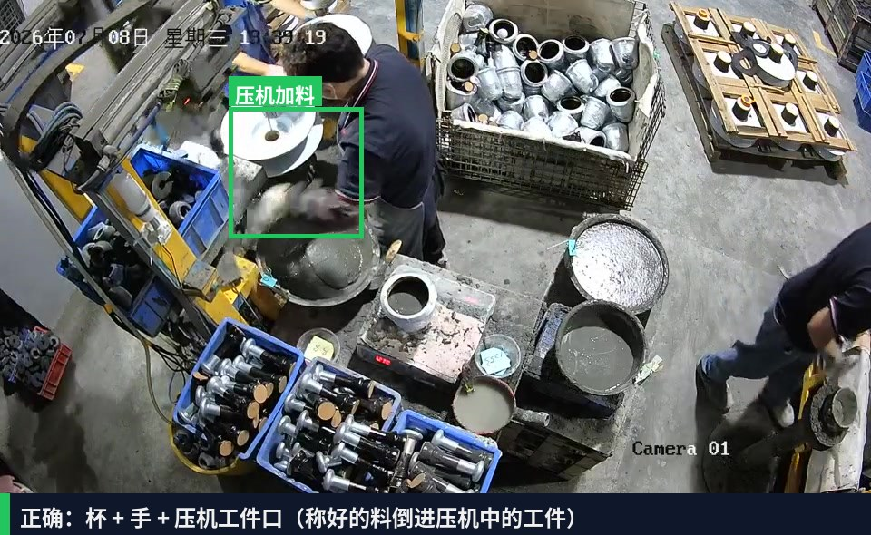

**✘ 错误：只框机器**——杯和手都不在框内，学到的是"压机部件"不是"加料动作"：

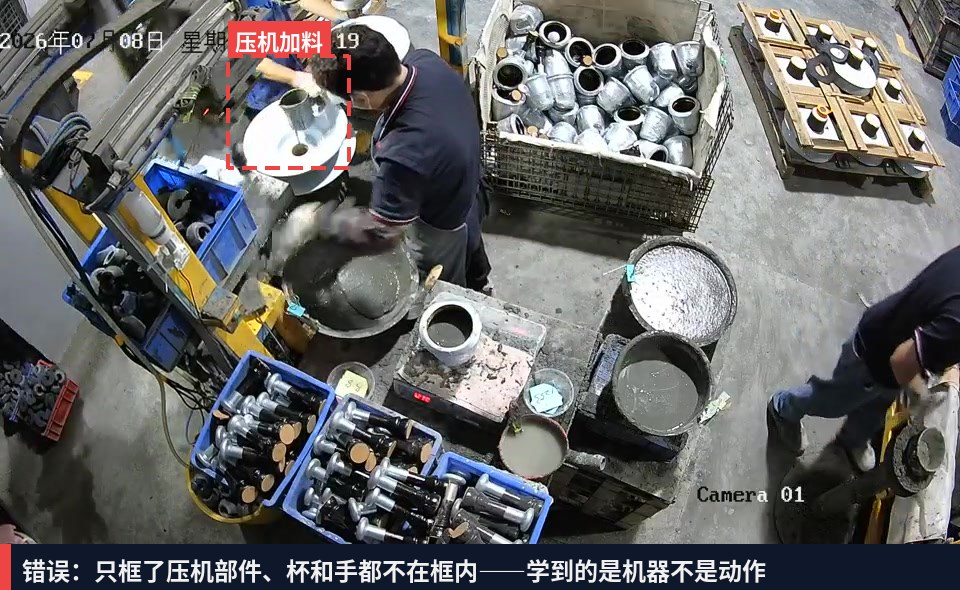

### 同帧多动作：各标各的，旁观人员不标

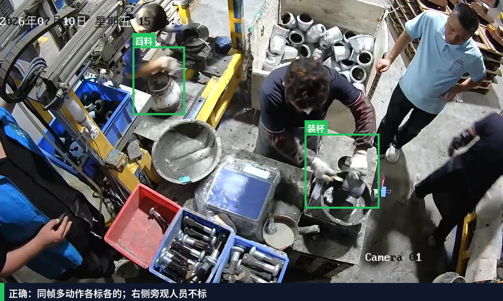

### 负样本：无动作帧留白，不打任何标签

转身/走动/整理的过渡帧、物体静置帧**整帧不标**（留白即负样本）。7.12 版负样本为零是误报的主因之一，**本次负样本必须占数据集 10-15%**：

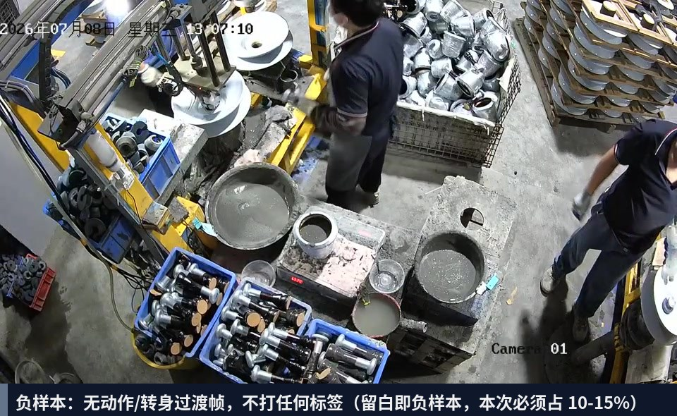

### 不同工人同一动作对比（四张全部是正确标注）

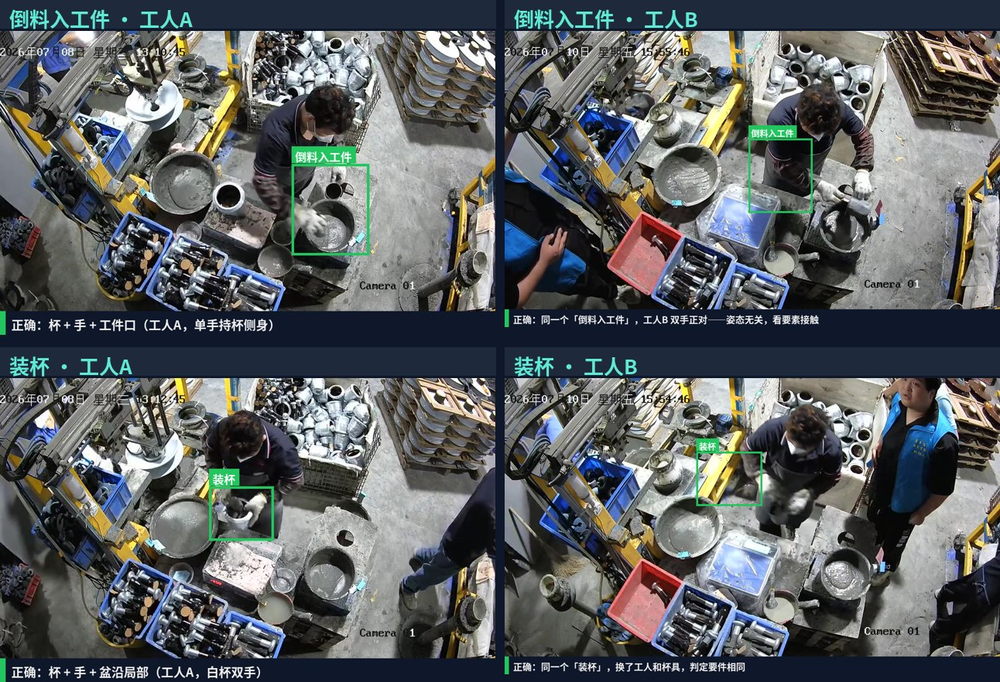

## 2.5 逐条标注规则

1. **时间边界**：动作类标签按"接触开始 → 分离结束"取帧；边界前后 2-3 帧的过渡姿态**不标**。
2. **静置不标**（硬规则）：容器在秤上没人碰、称好的料摆着没人端——全部留白。判据：**画面里没有"手参与"就不标**。
3. **遮挡**：目标被遮挡超过 50% 的帧丢弃；轻微遮挡（<50%）正常标。
4. **运动模糊**：肉眼看不清工具/器具轮廓的帧丢弃。
5. **同帧多动作**：双人作业各标各的；旁观人员不标。
6. **负样本留白**（占比 10-15%）：物体静置（容器在秤上无人碰、空秤台、满/空料盆静置）、空手/空勺划过、擦手、整理工装、转身走动。
7. **一致性**：同一动作全程由同一人标完；换标注员前先对照已标样本校准 20 帧。

## 2.6 抽帧策略

| 素材段 | 抽帧率 | 说明 |
|---|---|---|
| 动作发生段 | 3-5 fps | 动作全程密集采，覆盖起始/中段/收尾姿态 |
| 静置/等待段 | 0.2-0.5 fps | **专门作为负样本采**，凑够全集 10-15% |

## 2.7 客户补录清单（发给百斯特）

- **机位固定不动**（区域防错依赖固定机位，机位挪了区域要重画）
- 不同**班次**、不同**工人**、不同**光照**（白天/晚上/开关灯）各覆盖 ≥ 2 天
- **每位会上这个工位的工人都要出镜**，每人正常作业 ≥ 30 分钟
- 必录场景：
  1. 正常完整作业 ≥ 2 小时
  2. 故意错误示范各 ≥ 10 次：从错误料盆取料、跳过清零直接装料、缺料/超量停手
  3. 双人同时作业（帮工场景）≥ 30 分钟
  4. 静置空镜（无人、容器摆秤上、满盆静置）≥ 20 分钟（负样本原料）
- 分辨率 ≥ 1080p，帧率 ≥ 15fps，避免逆光

## 2.8 数据集组织

1. **切分防泄漏**：按**时间段**切 train/val（如前 4 天训练、后 1 天验证），禁止随机按帧切。
2. **按工人二次切分**：留至少一名工人的素材只进验证集，专测跨工人泛化。
3. **量级目标**：每标签 ≥ 1000 框起步；`舀料`是防错主判定动作，优先堆到 ≥ 2000 框。
4. **类平衡**：某标签样本 < 其他标签 1/3 时，专门补录该动作。
5. **负样本硬指标**：空标签帧占全集 **10-15%**，其中至少一半是"物体静置"类。

## 2.9 模型验收口径

| 指标 | 门槛 |
|---|---|
| mAP@0.5（验证集） | ≥ 0.85 |
| 现场连跑半天误报 | ≤ 1 次/小时 |
| **静置空镜连放 30 分钟** | **零误报**（针对 7.12 版缺陷的专项验收） |
| 四步 SOP 逐步识别（现场实测 20 件） | 漏步识别 0 次 |
| 跨工人抽测（未进训练集的工人实测 10 件） | 漏步识别 ≤ 1 次 |

未达标优先补数据（按 2.7 清单定向补录），其次调置信度阈值，最后才考虑换模型规格。

## 2.10 旧数据集（7.12）为什么错、错在哪

首版 2613 帧、四标签（称重清零/舀料/装杯/加钢脚水泥），模型置信度本身不差，但有三个**结构性缺陷**，参数补救不了根：

1. **负样本为零**：2613 帧每帧恰好一框，模型没见过"没有动作"的画面 → 静置容器常亮误报。
2. **静置当动作标**：「称重清零」把容器静置在秤上（无人接触）也标了 → 标签学成了"状态"，无法当步骤锚点。
3. **料名进标签**：「加钢脚水泥」把料别写死在标签里 → 换料就要换标签重训，且与"料别由区域判定"的防错设计冲突。

本规范的"静置不标"硬规则、负样本 10-15% 硬指标、中性标签名，分别对应堵死这三条。

**机器全量复检结果**（通用人体检测 + 几何规则扫全部 2613 帧，逐帧清单见附件 `百斯特萍乡_旧数据集审计/可疑标注清单.csv`）：

| 错误类型 | 判定方法 | 命中 | 违反的规范条款 |
|---|---|---|---|
| 静置误标 | 动作框周边（外扩 60%）**无人** | **732 框**（装杯 343 / 舀料 241 / 称重清零 146 / 加料 2） | 2.1 第 2 条 / 2.5 第 2 条 |
| 框太小 | 宽或高 < 3.5% 画面，装不下"手+工具+接触对象" | **241 框**（加钢脚水泥 198 / 舀料 43） | 2.1 第 3 条 |
| 框太大 | 宽 > 45% 或高 > 60% | 0 | — |
| 连拍重复 | 与前一帧同类别近乎同框（IoU > 0.92） | **629 框** | 2.6 抽帧策略 |

**旧数据集错误标注实拍**（红框 = 打了动作标签但附近根本没有人参与的帧——就是 2.4 节"静置帧打标"错误在旧数据集里的真实批量存在，12 例抽样）：

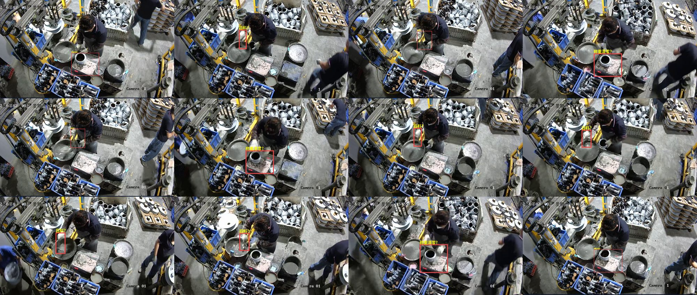

## 2.11 旧数据集处置：清洗迁移，不必全废

清洗后约六成框可直接迁移为新数据集底料（预计 1-2 人日，远便宜于全部重标）。

**标签映射（旧 → 新）**：

| 旧标签 | 新标签 | 迁移动作 |
|---|---|---|
| `称重清零` | `上秤清零` | 改名 + **过滤**：只留"手接触容器"的帧；静置帧删框留图当负样本 |
| `舀料` | `舀料` | 原样保留，剔除复检清单命中的坏框 |
| `装杯` | `装杯` | 原样保留，剔除复检清单命中的坏框 |
| `加钢脚水泥` | `压机加料` | 改名 + **重框**：旧框大多只框了杯/料流，扩到"杯 + 手 + 压机工件口" |

> 类别序号（0/1/2/3）与新标签集一一对应，YOLO 标签文件里的类别 id 不用改，只改类别名清单四行名字。

**清洗操作顺序**：

1. 整目录备份原始数据集。
2. 类别名清单四行改成新标签名。
3. 打开可疑标注清单，按"问题"列逐类处理：
   - 静置误标 → **逐帧人工复核**后删框（标签文件删那一行；文件留空 = 负样本，**不要删图**）。复核标准就一条：画面里有没有"手在参与这个动作"。机器初筛在工人深弯腰、被设备挡住时会误报"无人"，所以初筛不是判决；
   - 框太小 → 按 2.4 示例图重框到完整要件；
   - 连拍重复 → 每组连拍留 1/3（在前两步之后做，防比例失控）。
4. 每类随机抽 30 帧对照 2.3 要件表逐条打勾抽查。
5. 与新补录素材合并，按 2.8 切分。

**清洗解决不了"没有的"**——负样本类型、工人多样性、错误示范场景、`上秤清零`的动作帧（旧集多为静置，删完会明显变少），全部靠 2.7 补录清单补齐。

---

# 第三部分 · 现场配置演练（占位模型实操）

> **真实模型还没训练出来也能先把项目配完。**本部分用一个"占位模型"（只带标签集、不做真检测）把项目从零配到能跑，每步都有实拍截图；真实模型训练好后只需换掉模型文件，其余配置全部保留。

## 3.0 开始之前

| 准备项 | 说明 |
|---|---|
| 占位模型文件 | `百斯特萍乡_占位模型_v2标签.pt`（约 6MB，随文档包交付）。内含 4 个标签，与真实模型标签集完全一致 |
| 电子秤 | RS232 串口，9600/8/1/无校验；切到**应答模式** |
| USB 转串口线 | 接工控机后在设备管理器确认 COM 口号 |
| USB 确认按钮 | 可选（见第四部分选型） |
| 达梦数据库 | 找客户 IT 要：IP、端口（默认 5236）、账号密码、库名、目标表名 |

**占位模型的意义**：模型文件里带着标签清单，系统靠标签清单来配步骤。占位模型给出和真实模型一模一样的标签清单，所以现在配的每一项换真模型后**原样生效**。占位模型未经训练，不会真的检出目标——演练期不要指望它出框。

## 3.1 上传模型（详细步骤）

1. 左侧导航进入**模型管理**页。
2. 点右上角**上传模型** → 文件选择器里选 `百斯特萍乡_占位模型_v2标签.pt` → 确定，等进度条走完（约 6MB，几秒）。
3. 在模型列表里找到刚上传的模型，点**详情**，核对**类别数 = 4**，且四个类别名依次是 `上秤清零 / 舀料 / 装杯 / 压机加料`：

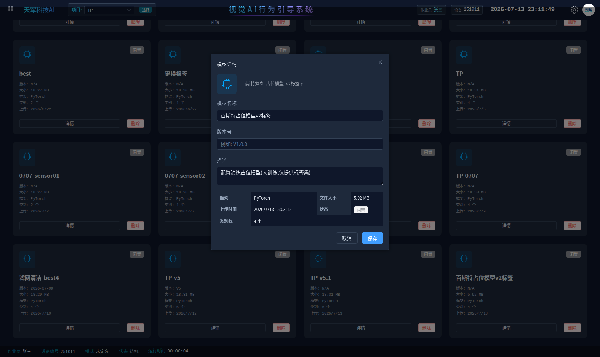

4. 类别数或类别名不对 → 传错文件了，删掉重传。**类别名就是后面步骤配置的"标签"来源，错一个字后面全错**。

> 换真实模型时：同样方式上传真模型 → 项目"基础设置"把绑定模型换成真模型 → 保存。其余全部不动。前提：真模型的 4 个类别名与占位模型**逐字相同**。

## 3.2 新建项目 · 基础设置（详细步骤）

1. 左侧导航进入**项目管理**页 → 点右上角**新建项目**。
2. 在"基础设置"页签逐字段填：

| 字段 | 填什么 | 说明 |
|---|---|---|
| 项目名称 | 如"百斯特称重演示" | 随意，好认即可 |
| 任务类型 | **目标检测** | 本项目用检测框判动作 |
| 逻辑模式 | **顺序模式** | 四步按序引导；配了外设门控后系统自动进入"视觉 SOP + 秤门控"融合模式，**不需要也不要选"称重投料"模式** |
| 绑定模型 | 3.1 上传的占位模型 | 换真模型时只改这里 |

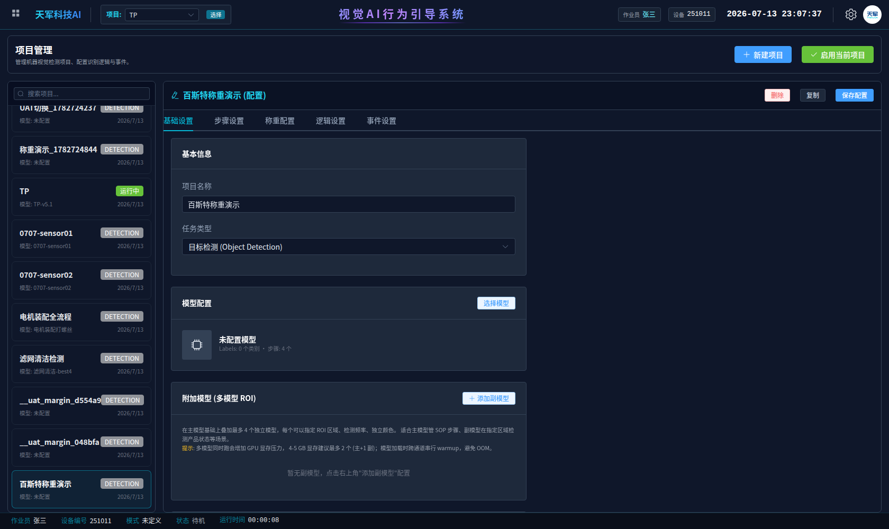

3. 点**保存配置**（右上角）。先保存一次基础设置，再进下一个页签——步骤设置要读模型的标签清单。

## 3.3 步骤设置：四个步骤 + 外设门控（详细步骤）

进入"步骤设置"页签。**视觉步骤序列驱动流程，电子秤作为其中两步的放行条件**，每行右侧的"外设门控"列是本项目核心。

### 第 1 步 · 添加四个步骤

点**添加步骤**四次，每行的"检测标签"下拉从模型标签清单里依次选（顺序必须和工艺一致，可拖动调整）：

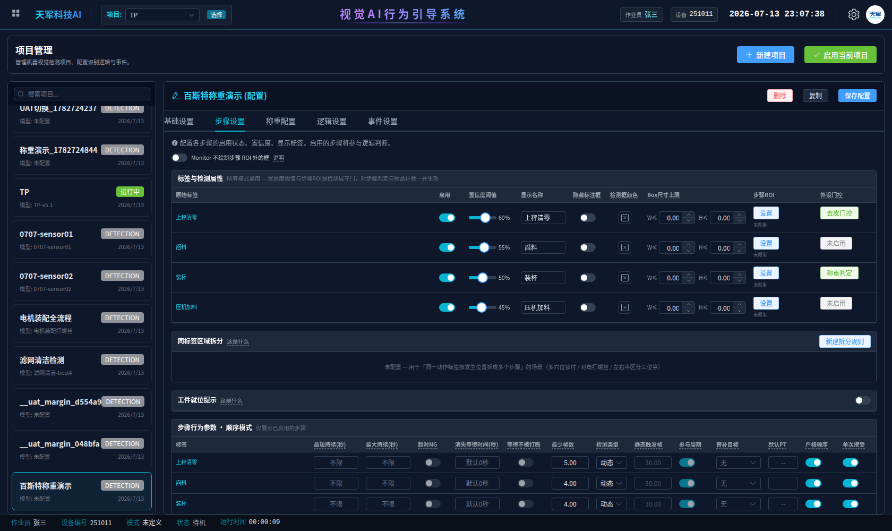

| 步骤 | 标签 | 置信度 | 外设门控 | 说明 |
|---|---|---|---|---|
| 1 | 上秤清零 | 60% | **去皮门控** | 看到"手放容器上秤"动作 + 秤读数稳定 → 自动发去皮指令 → 放行 |
| 2 | 舀料 | 55% | 无 | 纯视觉步骤，受"视觉料源防错"区域规则监督 |
| 3 | 装杯 | 50% | **称重判定** | 看到投料动作 + 净重稳定 → 对比型号标准量 → 合格才放行 |
| 4 | 压机加料 | 45% | 无 | 纯视觉步骤，收尾 |

> 置信度是演练初值；真模型上线后按实际表现微调（识别不稳先降 5-10 个点，误报多再升）。

### 第 2 步 · 配置步骤 1 的去皮门控

点第 1 行"外设门控"列的按钮，弹出配置面板，逐项设置：

| 字段 | 填什么 | 说明 |
|---|---|---|
| 启用外设门控 | **开** | 开 = 该步视觉确认后还要等秤条件满足才放行入周期 |
| 门控类型 | **去皮门控（放件稳定 → 自动去皮 → 放行）** | 对应"空容器放上秤"动作 |

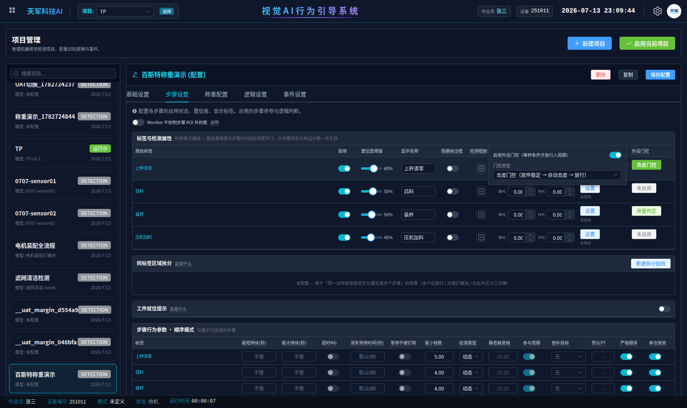

### 第 3 步 · 配置步骤 3 的称重判定门控

点第 3 行"外设门控"列的按钮：

| 字段 | 填什么 | 说明 |
|---|---|---|
| 启用外设门控 | **开** | 同上 |
| 门控类型 | **称重判定（净重稳定 → 对比标准量 → 判定）** | 对应"装杯到目标重量"动作 |
| 判定料别 | **留空** | 留空 = 按称重配置里的料别顺序自动取（第一杯判钢帽、第二杯判钢脚）；只判固定一种料才指定 |
| 不合格拦截等纠正 | **开** | 开 = 缺料/超量时步骤不放行、报警等工人补料或舀出，重量回到公差带内**自动重新判定**放行；关 = 记 NG 也放行 |

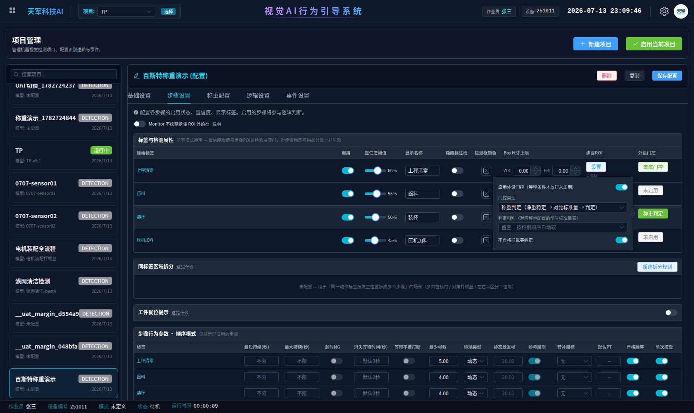

### 检查点

四行步骤中第 1 行门控徽标显示"去皮门控"、第 3 行显示"称重判定"，其余两行为"无"。配完点**保存配置**。

## 3.4 称重配置页签（逐卡片详细步骤）

步骤里配了外设门控后，"称重配置"页签自动出现，顶部蓝条提示当前是**"视觉 SOP + 秤门控"融合模式**。本页从上到下 8 张卡片，逐张过：

### 3.4.1 前置要求

| 开关 | 设置 | 说明 |
|---|---|---|
| 必须先选操作人员 | 开 | 未选人员就开工 → 触发"前置未满足"报警拦截 |
| 必须先选产品型号 | 开 | 型号决定标准量，不选没法判定 |
| 本件完成后自动置零 | 开 | 一件全部料别完成后软件自动发置零指令，防残料累积 |

### 3.4.2 前置选择有效期（防"忘换型号"）

| 字段 | 填什么 | 说明 |
|---|---|---|
| 失效策略 | **每天定时失效** | 可选：永不失效（默认）/ 每天定时 / 按班次 / N 小时 |
| 每天失效时刻 | **08:00** | 每天早班开工前选择作废，必须重选 |
| 失效时清哪些选择 | 勾**产品型号** | 人员一般不用清；型号必须清——防"昨天选的型号今天忘了换" |

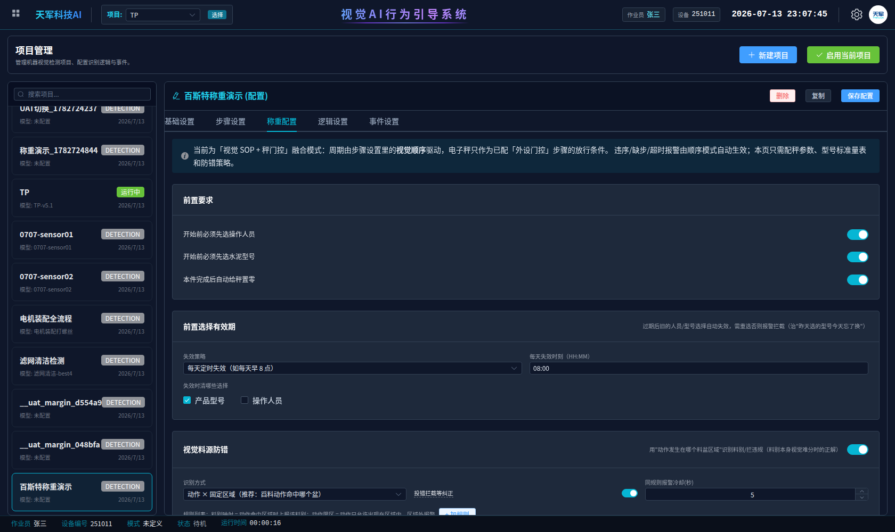

### 3.4.3 视觉料源防错（防"装错盆"的关键）

| 字段 | 填什么 | 说明 |
|---|---|---|
| 启用 | 开 | 关 = 不做料源防错 |
| 识别方式 | **动作 × 固定区域** | 两种水泥外观分不出来 → 用"动作发生在哪个盆区"判料别；料桶可视觉区分的客户才用"标签直接映射" |
| 识别错料拦截 | 开 | 与应投料别不符 → 报警 + 拦截（走 3.4.7 的"料别错"事件） |
| 同规则报警冷却 | 5 秒 | 同一违规连续帧只报一次，防报警刷屏 |

规则表点**添加规则**建两条：

| # | 模式 | 料别 | 判定区域 |
|---|---|---|---|
| 1 | 料别映射 | 钢帽水泥 | 点【画区域】在画面上框住**钢帽料盆**摆放区 |
| 2 | 料别映射 | 钢脚水泥 | 同上框住**钢脚料盆**摆放区 |

`舀料`动作框落在哪个区域 = 取的哪种料，与当前应投料别不符 → 立刻报警拦截，**从取料那一刻就拦住装错盆**：

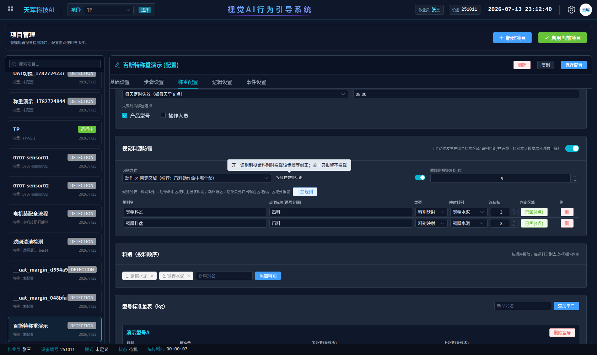

> **前提是现场定置管理**：两种料的料盆位置固定并画地标线；料盆挪位要重画区域。"最少命中帧数"保持默认（连续命中才算，防单帧误检误报）。

### 3.4.4 料别（投料顺序）

按**投料顺序**排：1. 钢帽水泥 → 2. 钢脚水泥。这个顺序就是步骤 3 称重判定"留空自动取料别"的依据。

### 3.4.5 型号标准量表

每行一个产品型号，每种料填三个数（单位 kg）：

| 字段 | 含义 | 例 |
|---|---|---|
| 标准量 | 该型号该料的目标重量 | 0.500 |
| 下公差 | 低于 标准量 − 下公差 = **缺料** | 0.020 |
| 上公差 | 高于 标准量 + 上公差 = **超量** | 0.020 |

合格区间 = `标准量 − 下公差 ~ 标准量 + 上公差`。截图中数值是演练值，**现场按工艺卡实填**：

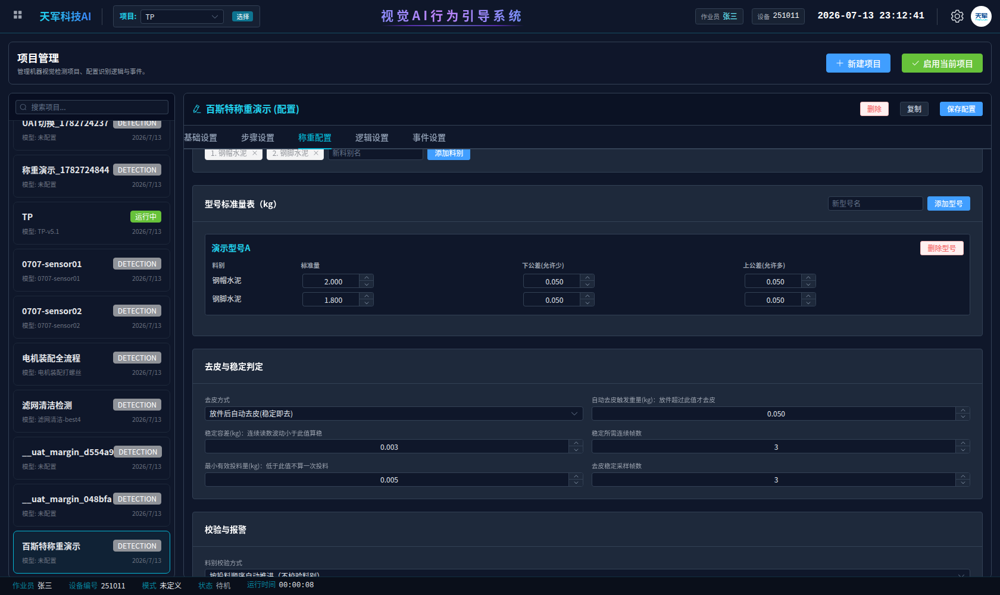

### 3.4.6 去皮与稳定判定（保持默认即可）

| 字段 | 默认 | 什么时候要动 |
|---|---|---|
| 去皮方式 | 放件后自动去皮（稳定即去） | 现场想手按去皮按钮才去皮 → 改"仅手动去皮" |
| 自动去皮触发重量 | 0.050 kg | 容器比这轻（放上去秤没反应）→ 调小 |
| 稳定容差 | 0.003 kg | 秤精度差、读数总在跳 → 适当调大 |
| 稳定所需连续帧数 | 3 | 想更保守（等更久才认"稳定"）→ 调大 |
| 最小有效投料量 | 0.005 kg | 低于此值不算一次投料，防空杯误判 |
| 去皮稳定采样帧数 | 3 | 一般不动 |

### 3.4.7 校验与报警

- 料别校验方式选**视觉识别料别**（配合 3.4.3 的区域规则）。
- 五种异常（缺料 / 超量 / 料别错 / 前置未满足 / 动作限区违规）全部映射到**"称重异常-需人工确认"**事件：

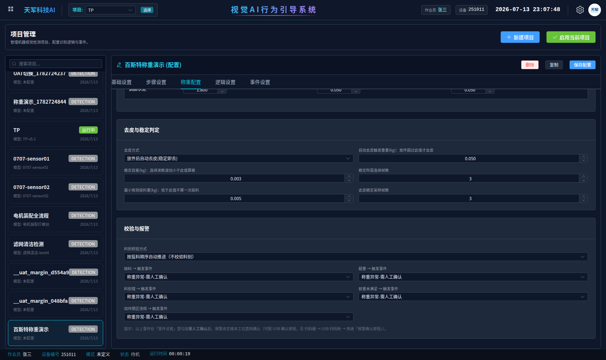

### 3.4.8 监控页显示（v1.1 新增，客户反馈"检测中心看不到数值"的解法）

| 开关 | 设置 | 说明 |
|---|---|---|
| 检测中心显示实时称重数值条 | **开**（默认开） | 检测中心视频下方显示：**当前读数**、**皮重**（去皮那一刻的工件/容器自重）、**净重**（去皮归零后的读数 = 已投料量）、各步骤门控状态、最近一次判定。不想看数值的客户在这里一键关掉 |


数值条长什么样、每个数怎么读，见 3.9 节。

## 3.5 事件设置：需人工确认（详细步骤）

1. 进入"事件设置"页签，找到（或新建）**"称重异常-需人工确认"**事件。
2. 逐字段设置：

| 字段 | 填什么 | 说明 |
|---|---|---|
| 事件名称 | 称重异常-需人工确认 | 3.4.7 五个映射都指向它 |
| 事件颜色 | 红色 | 定格弹框和 Toast 用色 |
| 计数动作 | 不良总数 +1（按需） | 异常是否计入不良由客户定 |
| **需人工确认** | **勾选** | 核心：触发时检测线**定格**、画面弹红色确认框 |
| 超时自动确认 | **0** | 0 = 永不超时，必须人来处理（异常绝不自动放过） |

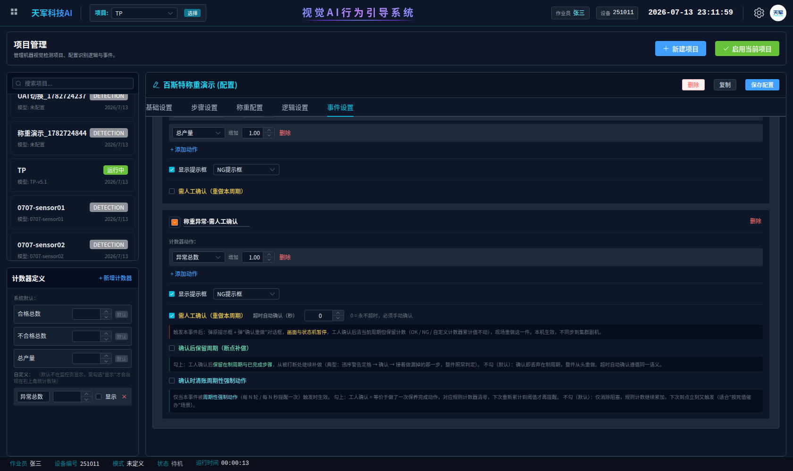

3. 触发后的恢复方式：界面点确认，或按 USB 确认按钮（3.7 节）。
4. 配完以上所有页签，**点右上角"保存配置"**，再点**"启用当前项目"**——不启用，外部设备的重量数据不会路由到本项目。

## 3.6 外部设备：接电子秤（详细步骤）

### 第 0 步 · 秤侧和 Windows 侧准备（进软件之前）

1. **秤面板切到"指令应答模式"**。秤厂确认过：连续输出和指令应答**二选一**，面板可调。本项目必须用**指令应答**——"上秤清零"步骤靠软件发去皮/置零指令，连续输出模式发不了指令，步骤门控的自动去皮就废了。切完记下秤的三条指令（本项目秤按协议书默认：读重量 `R`、去皮 `T`、置零 `Z`）。
2. **通讯参数**：波特率 9600、数据位 8、无校验、停止位 1（秤面板与软件两侧必须一致）。
3. **USB 转串口线**接工控机，装好驱动（FTDI/CH340），Windows 设备管理器 → 端口 里看到 `COM?` 号并记下来。

### 第 1 步 · 用预设模板添加设备

MES 管理 → 外部设备 → **预设模板** 下拉 → 选**「称重器 - 安衡指令应答」**（三条指令、结尾符、轮询间隔全部预填好）：

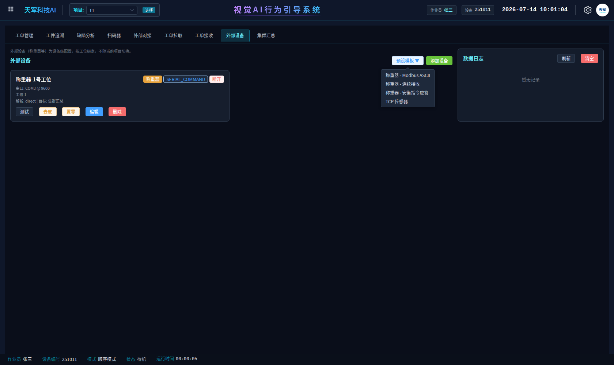

### 第 2 步 · 逐字段核对弹窗配置

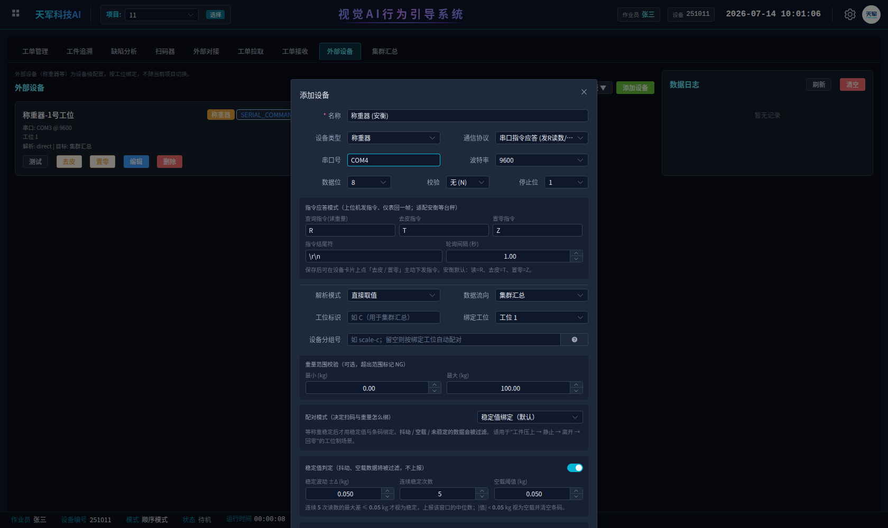

| 字段 | 填什么 | 说明 |
|---|---|---|
| 名称 | 如"称重器-1号工位" | 随意，好认即可 |
| 设备类型 | 称重器 | 预设已选 |
| 通信协议 | **串口指令应答（发R读数/T去皮）** | 本项目必须这个；"串口连续接收"只能读不能发指令 |
| 串口号 | 设备管理器里看到的 COM 号 | 截图 COM4 是演示值 |
| 波特率 / 数据位 / 校验 / 停止位 | 9600 / 8 / 无 / 1 | 与秤面板一致 |
| 查询指令 / 去皮指令 / 置零指令 | `R` / `T` / `Z` | 与秤协议书一致，预设已填 |
| 指令结尾符 | `\r\n` | 秤要求回车换行结尾就保持默认 |
| 轮询间隔 | 1.00 秒 | 软件每秒发一次读数指令；步骤门控期间够用 |
| 解析模式 | 直接取值 | 秤回的帧软件自动取重量数字 |
| 数据流向 | **集群汇总（保持默认）** | ⚠️ 不需要也没有"称重引擎"选项——重量喂给称重联动是按下面的"绑定工位"**自动**路由的：该工位项目启用了称重门控，读数就自动进称重判定 |
| 绑定工位 | 工位 1 | **这才是称重联动的关键字段**，必须绑对 |
| 重量范围守门 | 0 – 100 kg | 超范围读数标 NG，按秤量程填 |
| 配对模式 / 稳定值判定 | 保持默认（稳定值绑定；波动 ±0.05kg、连续 5 次） | 去皮和重量判定都等"稳定"才动作，这里就是稳定的定义 |

填完保存。**先不要打开启用**，进第 3 步。

### 第 3 步 · 测试连通（注意顺序，有坑）

**串口是独占的：同一时刻只能有一个程序开着它。**"测试"按钮的原理是新开一次串口试连——所以：

- **正确顺序**：设备**停用状态**下点"测试" → 应返回读数 → 再打开启用；
- **设备已启用时点"测试"必报错**：`could not open port 'COMx': PermissionError(13, '拒绝访问')`——这**不是故障**，是设备后台线程正占着串口在正常收数。此时看右侧**数据日志**有实时读数，就是连通的最好证明，不用管测试按钮；
- 真想再测：编辑里先关启用，测完再开回来。

启用后，设备卡片上有**「去皮」「置零」**两个手动按钮，各按一次、看秤显示屏归零，验证指令链路通：

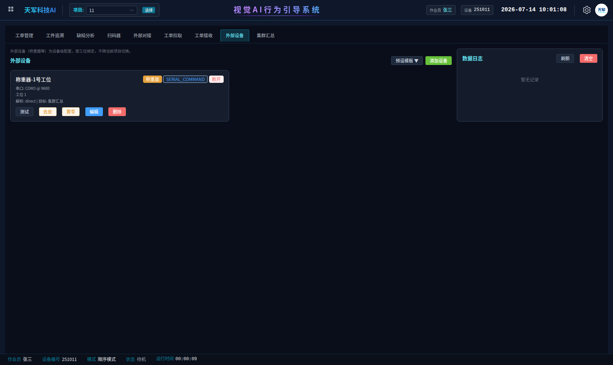

### 常见报错速查

| 现象 | 原因 | 处置 |
|---|---|---|
| `PermissionError(13, '拒绝访问')` | 串口被占：本软件里该设备**已启用**在收数（最常见）；或串口调试助手/另一软件没关 | 已启用→看数据日志即可，别点测试；排查其他占用程序 |
| `FileNotFoundError` / 找不到端口 | COM 号填错，或 USB 转串口驱动没装 | 设备管理器核对 COM 号、装驱动 |
| 有连接无数据 / 乱码 | 波特率或结尾符不一致；秤还在连续输出模式而软件配了指令应答 | 两侧参数对齐；秤面板切应答模式 |
| 数据日志刷 `ST,TR,...` 连续帧 | 秤在**连续输出模式**（能读数但发不了指令） | 演示/纯读数可用；上门控前必须切应答模式并把协议改成"串口指令应答" |
| 点"去皮"秤没反应 | 指令或结尾符与秤协议不符 | 对秤协议书核对 T/Z 指令与结尾符 |

## 3.7 扫码器：USB 报警确认按钮（可选，详细步骤）

1. 把 USB 确认按钮（选型见 4.1；本质是只发固定码的 HID 键盘）插上工控机，先在记事本里按一下，确认输出一串固定字符 + 回车（如 `TJACK01`）。
2. MES 管理 → 扫码器 → **添加 USB 扫码枪**，弹窗里逐字段填：

| 字段 | 填什么 | 说明 |
|---|---|---|
| 名称 | 如"1号工位确认按钮" | 好认即可 |
| 扫到的码用来 | **报警确认按钮** | 关键字段：按下 = 解除本工位"需人工确认"定格 |
| 确认工位 | 工位 1 | 多工位时每颗按钮绑各自工位 |

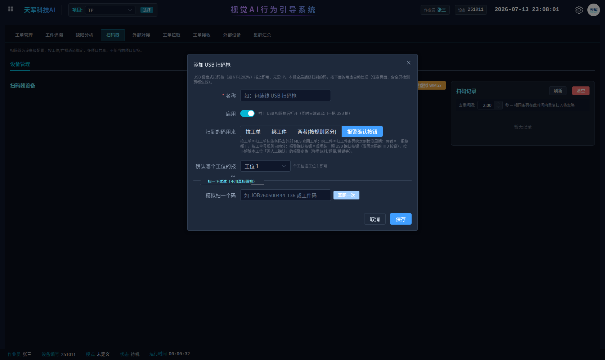

3. 保存后用弹窗底部的**测试框**验证：光标点进测试框 → 按一下按钮 → 显示路由结果为"报警确认"即通。
4. 实测闭环：故意触发一次称重异常（如少装料）→ 画面定格弹红框 → 按按钮 → 定格解除。没有待确认报警时按按钮只温和提示"当前无待确认报警"，不影响任何流程。

## 3.8 推送网关：写入客户达梦数据库（详细步骤）

### 第 1 步 · 找客户 IT 要五样东西

数据库 IP、端口（达梦默认 5236）、账号密码、库名/schema、**目标表建表语句**（或至少列名清单）。

### 第 2 步 · 新建连接

MES 管理 → 外部对接 → 新建连接，适配器类型选**数据库直写**：

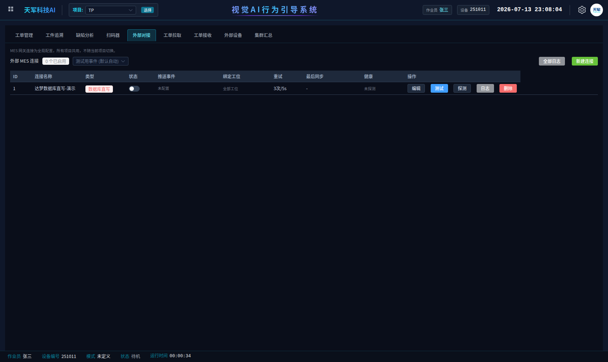

### 第 3 步 · 逐字段填连接与映射

| 字段 | 填什么 | 说明 |
|---|---|---|
| 数据库类型 | **达梦 DM** | 也支持 MySQL / PostgreSQL / SQL Server / SQLite，客户换库不用换软件 |
| 主机 / 端口 | 客户 IT 提供 | 达梦默认端口 5236 |
| 用户名 / 密码 | 客户 IT 提供 | 达梦默认管理账号是 SYSDBA |
| 数据库名 | 客户 IT 提供 | 达梦可留空 = 用户默认 schema |
| 目标表名 | 如 `T_WEIGH_RECORD` | 可带 schema 前缀（`PROD.T_WEIGH_RECORD`） |
| 绑定工位 | 工位 1 | 多工位不选 = 收所有工位 |
| 推送时机 | **周期结束（cycle_end）** | 每完成一件推一条 |
| 按结果过滤 | OK、NG 都勾 | 客户只要不良记录就只勾 NG |

下方**字段映射模板**：顶层键名 = 目标表的**列名**，值用 `{字段路径}` 引用检测数据（工件号、型号、操作员、料别、净重、判定结果、时间）：

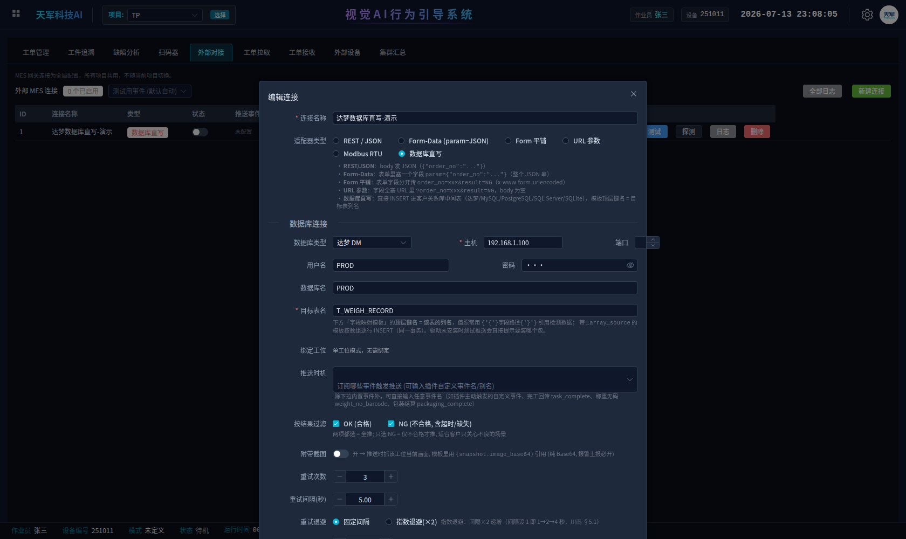

> 截图中的 IP / 表名 / 字段映射是演示值。现场拿到真实表结构后对着填。

### 第 4 步 · 测试再启用

1. 点**测试**：通 → 目标表里出现一条测试记录；提示"达梦驱动未安装" → 按 4.3 节装驱动后重测。
2. 测试通过后打开**启用**开关，保存。
3. 上线后在连接卡片的**通讯日志**里能看到每次推送的成败与返回信息，排查以它为准。

## 3.9 运行监控：检测中心看什么（v1.1 新增）

项目启用、电子秤设备启用后，进检测中心点**开始**。视频下方 SOP 流程卡片旁多出一条**称重实时数值条**（由 3.4.8 开关控制，默认开）：

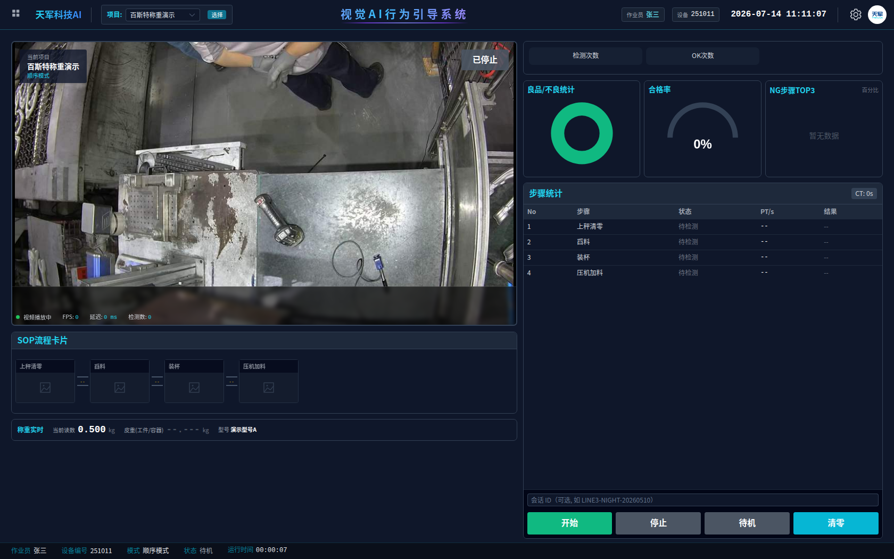

数值条放大看，从左到右逐段读：


| 字段 | 什么时候有值 | 怎么读 |
|---|---|---|
| **当前读数 / 净重(已投料)** | 秤设备启用即有 | 去皮**前**标题是"当前读数"（显示毛重）；去皮**后**标题变"净重(已投料)"——因为去皮后秤已归零，读数就是已装进容器的料量，工人看着它装到目标 |
| **皮重(工件/容器)** | 步骤 1 去皮门控放行那一刻记下 | 就是客户要的"工件重量"：去皮指令发出前的稳定毛重 = 空容器/工件自重。新一件重新上秤时自动清空重记 |
| **型号** | 选完产品型号后 | 当班型号，对应标准量表 |
| **步骤门控状态** | 视觉步骤确认后出现 | 黄色闪烁"等秤…" = 视觉已确认、在等秤条件；绿色"✓" = 秤条件已满足放行 |
| **最近判定** | 每次称重判定后 | 料别 + 实投 + 标准 + 合格/缺料/超量，红绿着色 |

> 本项目是融合模式，重量数值以上述数值条展示。若客户用的是原生"称重投料"模式（秤驱动流程），检测中心显示的是专属称重看板，其顶栏同样有"皮重(工件)"和"净重(已投料)"两个读数，口径一致。

**无真秤联调技巧**：外部设备里把通信协议选"模拟称重"，软件自动按脚本播放"空盘 → 放盆(皮重) → 投料爬升 → 到量稳定"的循环数据流，还响应去皮/置零指令——整条数值条、门控、判定链路都能在办公室先过一遍，到现场只换成真串口配置。

---

# 第四部分 · 硬件与配件选型

## 4.1 USB 报警确认按钮（首选方案）

本质是"只发一串固定字符 + 回车"的 USB HID 键盘，软件已把它做成扫码器设备的一种用途。**免驱、免串口、免额外开发**。

| 指标 | 要求 | 为什么 |
|---|---|---|
| 接口类型 | USB HID 键盘（免驱） | 复用软件全局键盘捕获链路 |
| 可编程 | 支持自定义输出内容，能以**回车结尾** | 软件靠回车判定一次输入结束 |
| 输出内容 | 建议烧录 `TJACK01`（工位1）、`TJACK02`（工位2）… | 每工位独立码，好排查 |
| 按键形态 | 工业大按钮（直径 ≥ 40mm）优先 | 戴手套可拍 |
| 线长 | ≥ 1.5m 或带延长线款 | 工控机到工位有距离 |

参考搜索词：`USB 自定义快捷键按钮`、`USB 一键按钮 可编程`。价位约 **20-80 元/个**，每工位 1 个。

备选：**确认二维码卡片**（≈0 元，已有扫码枪时打印固定码贴工位）；**界面确认按钮**（0 元，软件自带，过渡期用）。

## 4.2 连带配件清单（一次配齐）

| 物品 | 数量 | 要求 |
|---|---|---|
| USB 确认按钮 | 每工位 1 | 见 4.1 |
| 电子秤 | 每工位 1 | 支持 RS232 **指令应答模式**（含远程去皮 T / 置零 Z 指令），协议见已确认的 CHS-D+R / ETC-D+R 说明书；参数 9600/8/N/1 |
| RS232-USB 转接线 | 每秤 1 | FTDI / CH340 芯片均可，线长按现场量 |
| 相机 | 每工位 1 | ≥1080p，固定机位支架（**机位不能动**，动了防错区域要重画） |
| USB HUB（带外供电） | 视工位数 | 按钮 + 秤转接 + 相机可能占满工控机 USB 口 |

## 4.3 达梦驱动（实施注意）

数据库直写用的达梦官方 Python 驱动不在标准安装包里，实施时任选其一：客户机装达梦客户端（自带驱动），或现场按既有热补丁模板走国内源安装。未装驱动时软件不会崩——测试推送会明确提示"达梦驱动未安装"，装完即通。

---

# 第五部分 · 上线验收标准

真实模型训练好后：模型管理页上传（标签集必须还是这 4 个）→ 项目"基础设置"换绑模型 → 保存 → 监控页跑真实作业，逐项验收：

| # | 验收项 | 通过标准 |
|---|---|---|
| 1 | 四步顺序识别 | 正常作业一轮，四步依次点亮，周期正常结算 OK |
| 2 | 去皮门控 | 容器上秤稳定后秤自动去皮，步骤 1 放行 |
| 3 | 称重判定 | 装杯到标准量±公差内步骤 3 放行；故意少装 → 报警拦截，补到位自动放行 |
| 4 | 装错盆拦截 | 故意到错误料盆做舀料动作 → 立刻报警定格 |
| 5 | 人工确认 | 异常定格后界面/USB 按钮确认才恢复 |
| 6 | 型号有效期 | 次日 08:00 后不重选型号直接开工 → 拦截提示 |
| 7 | 数据入库 | 每件完成后达梦表里多一条记录，字段值正确 |
| 8 | 静置零误报 | 无人操作 30 分钟，无任何步骤误触发（验模型负样本质量，对应 2.9 专项验收线） |
| 9 | 数值显示 | 检测中心数值条：容器上秤去皮后"皮重"显示容器自重；装料过程"净重"跟着秤实时爬升；判定结果实时出现（3.4.8 开关开启时） |

模型侧验收（mAP、误报率、跨工人泛化）见 2.9 节，两套验收都过才算交付。

---

**文档版本**：v1.1 合订本（2026-07-14）——第三部分全节展开为逐步操作 + 字段表；新增监控页称重数值条（皮重/净重实时显示，可选开关）及其运行说明（3.4.8 / 3.9）
**随文档包交付**：占位模型 `百斯特萍乡_占位模型_v2标签.pt` · 旧数据集逐帧复检清单 `百斯特萍乡_旧数据集审计/可疑标注清单.csv`
